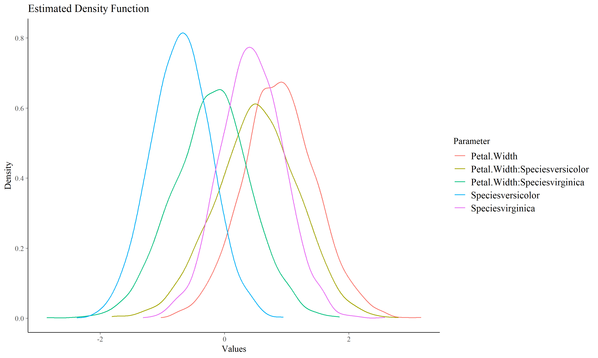
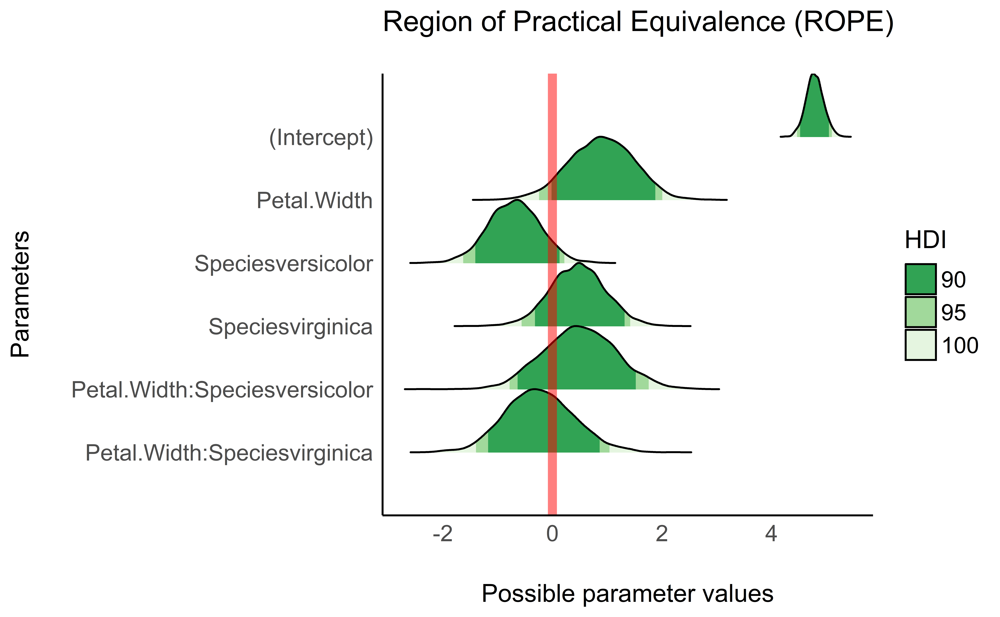
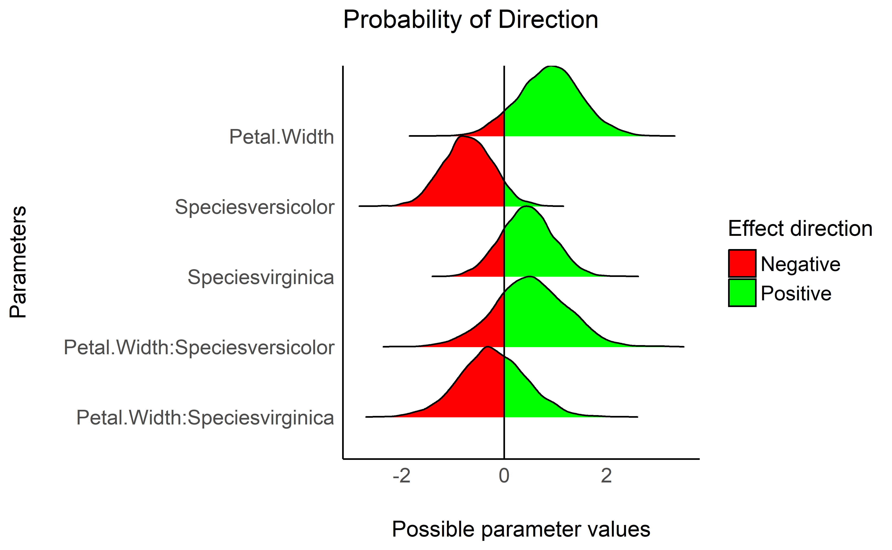
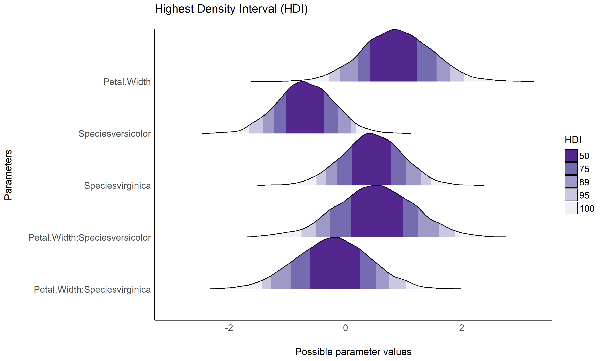
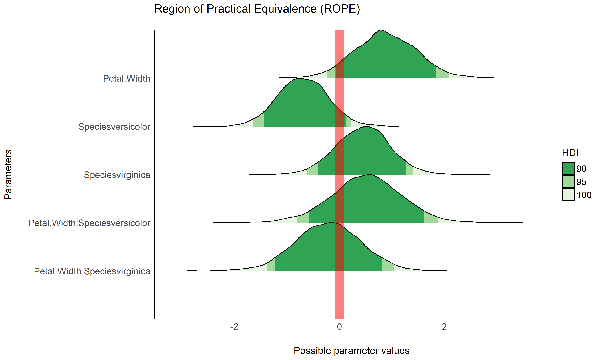
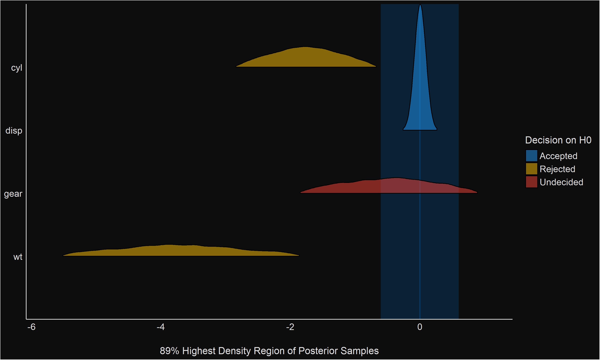
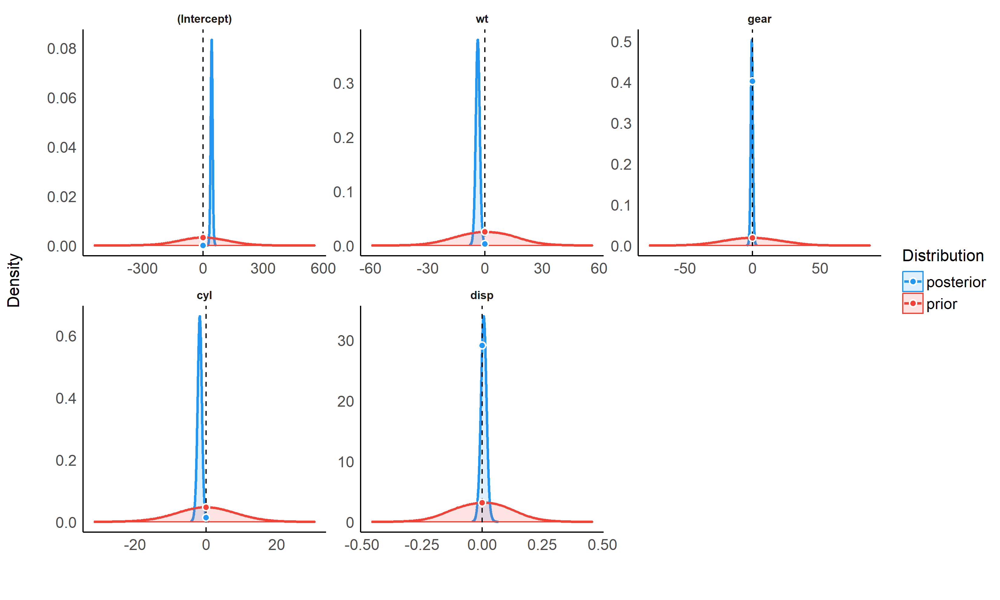
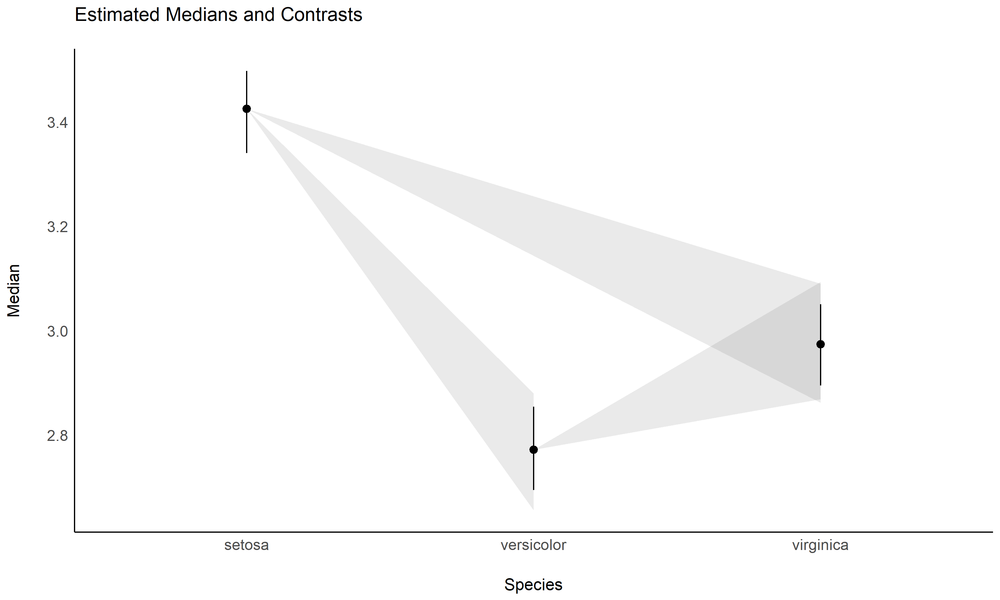
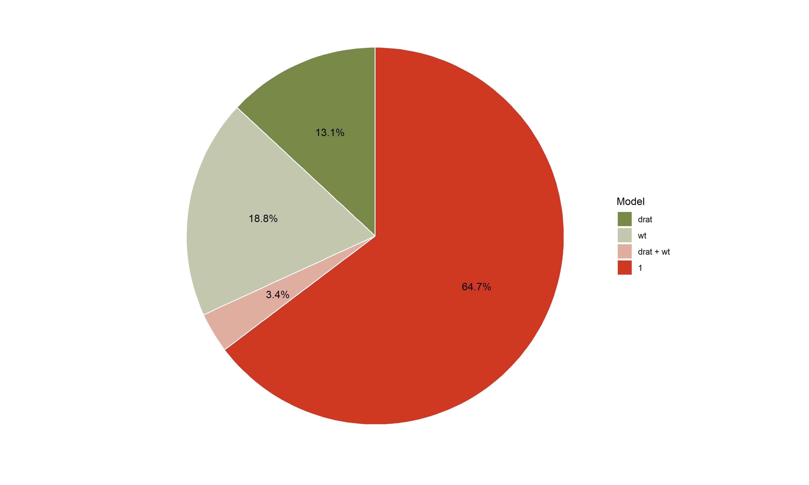
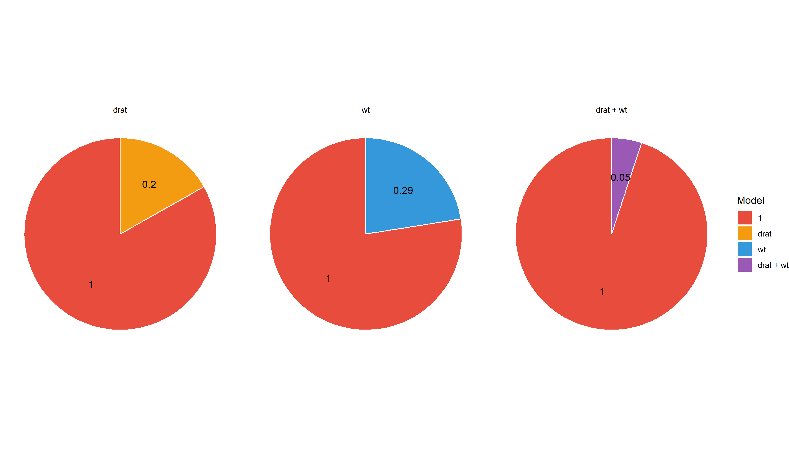

# see 

[](https://cran.r-project.org/package=see)
[](https://cran.r-project.org/package=see)
[](https://travis-ci.org/easystats/see)
[](https://codecov.io/gh/easystats/see)
[](https://easystats.github.io/see/)

***“Damned are those who believe without seeing”***

## Installation

Run the following:

``` r
install.packages("devtools")
devtools::install_github("easystats/see")
```

``` r
library("see")
```

## Features

### Themes

  - **Modern**

<!-- end list -->

``` r
library(ggplot2)

ggplot(iris, aes(x = Sepal.Width, y = Sepal.Length, color = Species)) +
  geom_point2() +
  theme_modern()
```

<!-- -->

  - **Lucid**

<!-- end list -->

``` r
library(ggplot2)

ggplot(iris, aes(x = Sepal.Width, y = Sepal.Length, color = Species)) +
  geom_point2() +
  theme_lucid()
```

<!-- -->

  - **Blackboard**

<!-- end list -->

``` r
library(rstanarm)
library(estimate)

dat <- rstanarm::stan_glm(Sepal.Width ~ poly(Petal.Length, 2), data = iris) %>% 
  estimate::estimate_fit(keep_draws = TRUE, length = 100, draws = 250) %>% 
  estimate::reshape_draws()

p <- ggplot(dat, aes(x = Petal.Length, y = Draw, group = Draw_Index)) +
  geom_line(color = "white", alpha = 0.05) +
  scale_x_continuous(expand = c(0, 0)) +
  scale_y_continuous(expand = c(0, 0))

p + theme_blackboard() 
```

<!-- -->

  - **Abyss**

<!-- -->

### Palettes

  - **Material design**

<!-- end list -->

``` r
p1 <- ggplot(iris, aes(x = Species, y = Sepal.Length, fill = Species)) +
  geom_boxplot() +
  theme_modern(axis.text.angle = 45) +
  scale_fill_material_d()

p2 <- ggplot(iris, aes(x = Species, y = Sepal.Length, fill = Species)) +
  geom_violin() +
  theme_modern(axis.text.angle = 45) +
  scale_fill_material_d(palette = "ice")

p3 <- ggplot(iris, aes(x = Petal.Length, y = Petal.Width, color = Sepal.Length)) +
  geom_point2() +
  theme_modern() +
  scale_color_material_c(palette = "rainbow")
```

The `plots()` function allows us to plot the figures side by side.

``` r
plots(p1, p2, p3, ncol = 2)
```

<!-- -->

### Multiple plots

The `plots()` function can also be used to add **tags** (*i.e.*, labels
for subfigures).

``` r
plots(p1, p2, p3, ncol = 2, 
      tags = paste("Fig. ", 1:3))
```

<!-- -->

### Better looking points

`geom_points2()` and `geom_jitter2()` allow points without borders and
contour.

``` r
normal <- ggplot(iris, aes(x = Petal.Width, y = Sepal.Length)) +
  geom_point(size = 8, alpha = 0.3) +
  theme_modern()

new <- ggplot(iris, aes(x = Petal.Width, y = Sepal.Length)) +
  geom_point2(size = 8, alpha = 0.3) +
  theme_modern()

plots(normal, new, ncol = 2)
```

<!-- -->

### Half-violin Half-dot plot

Create a half-violin half-dot plot, useful for visualising the
distribution and the sample size at the same time.

``` r
ggplot(iris, aes(x = Species, y = Sepal.Length, fill = Species)) +
  geom_violindot(fill_dots = "black") +
  theme_modern() +
  scale_fill_material_d()
```

<!-- -->

### Pool ball points

``` r
ggplot(iris, aes(x = Sepal.Width, y = Sepal.Length, color = Species)) +
  geom_pooljitter(label = row.names(iris)) +
  scale_color_flat_d() +
  theme_modern()
```

<!-- -->

### [BayestestR](https://github.com/easystats/bayestestR)

#### Density Estimation

``` r
library(bayestestR)
library(rstanarm)

model <- rstanarm::stan_glm(Sepal.Length ~ Petal.Width * Species, data = iris)

result <- estimate_density(model)

plot(result)
```

<!-- -->

``` r
plot(result, stack=FALSE)
```

<!-- -->

#### Probability of Direction (pd)

``` r
result <- p_direction(model)

plot(result) +
  theme_modern() +
  scale_fill_manual(values = c("red", "green"))
```

<!-- -->

Most of our plots can be easily *opened* via the `how_to_plot` function.
This gives us the actual code used for plotting, that can then be easily
extracted and tweaked to your needs.

``` r
how_to_plot(result)
## # Assuming that the input object is `x`:
## 
## data_plot(x) %>%
##   as.data.frame() %>%
##   ggplot(aes(x = x, y = y, height = height, group = y, fill = fill)) +
##   ggridges::geom_ridgeline_gradient() +
##   add_plot_attributes(x) +
##   geom_vline(aes(xintercept = 0))
```

#### Highest Density Interval (HDI)

``` r
library(rstanarm)

model <- rstanarm::stan_glm(Sepal.Length ~ Petal.Width * Species, data = iris)
result <- hdi(model, ci = c(0.5, 0.75, 0.89, 0.95))

plot(result) +
  theme_modern() +
  scale_fill_brewer(palette = "Purples", direction = -1)
```

<!-- -->

#### Region of Practical Equivalence (ROPE)

``` r
result <- rope(model, ci = c(0.9, 0.95))

plot(result, data = model, rope_color = "red") +
  theme_modern() +
  scale_fill_brewer(palette = "Greens", direction = -1)
```

<!-- -->

#### Test for Practical Equivalence

``` r
model <- rstanarm::stan_glm(
  mpg ~ wt + gear + cyl + disp, data = mtcars
)
result <- equivalence_test(model)

plot(result) +
  theme_blackboard() +
  scale_fill_material()
```

<!-- -->

``` r
result <- equivalence_test(model, ci = c(.89, .95))
plot(result) +
    theme_abyss() +
    scale_fill_flat()
```

<!-- -->

#### Bayes Factors (BFs)

``` r
result <- bayesfactor_savagedickey(model)

plot(result) +
  theme_modern() +
  scale_color_material() +
  scale_fill_material()
```

<!-- -->

``` r
lm0 <- lm(qsec ~ 1, data = mtcars)
lm1 <- lm(qsec ~ drat, data = mtcars)
lm2 <- lm(qsec ~ wt, data = mtcars)
lm3 <- lm(qsec ~ drat + wt, data = mtcars)

result <- bayesfactor_models(lm1, lm2, lm3, denominator = lm0)

plot(result, n_pies = "one", value = "probability") +
  scale_fill_pizza(reverse = TRUE) 
```

<!-- -->

``` r

plot(result, n_pies = "many", value = "BF") +
  scale_fill_flat(palette = "rainbow", reverse = TRUE)
```

<!-- -->

### [estimate](https://github.com/easystats/estimate)

#### Pairwise Contrasts

``` r
library(rstanarm)
library(estimate)

model <- stan_glm(Sepal.Width ~ Species, data = iris) +
  theme_modern()

contrasts <- estimate_contrasts(model)
means <- estimate_means(model)

plot(contrasts, means)
```

<!-- -->
