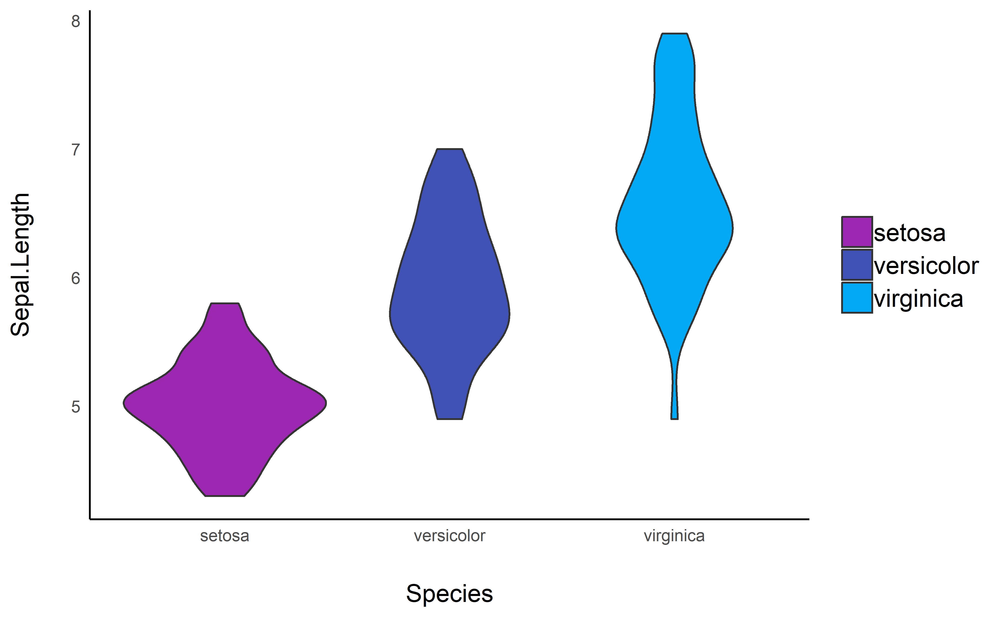

# see 

<!-- [](https://travis-ci.org/easystats/see) -->

<!-- [](https://codecov.io/gh/easystats/see) -->

[](https://easystats.github.io/see/)

***“Damned are those who believe without seeing”***

## Installation

Run the following:

``` r
install.packages("devtools")
devtools::install_github("easystats/see")
```

``` r
library("see")
```

## Features

### Themes

  - **Modern**

<!-- end list -->

``` r
library(ggplot2)

ggplot(iris, aes(x = Sepal.Width, y = Sepal.Length, color = Species)) + 
    geom_point() + theme_modern()
```

<!-- -->

### Palettes

  - **Material design**

<!-- end list -->

``` r
ggplot(iris, aes(x = Species, y = Sepal.Length, fill = Species)) + 
    geom_boxplot() + theme_modern() + scale_fill_material_d()
```

<!-- -->

``` r

ggplot(iris, aes(x = Species, y = Sepal.Length, fill = Species)) + 
    geom_violin() + theme_modern() + scale_fill_material_d(palette = "ice")
```

<!-- -->

``` r

ggplot(iris, aes(x = Petal.Length, y = Petal.Width, color = Sepal.Length)) + 
    geom_point() + theme_modern() + scale_color_material_c(palette = "rainbow")
```

<!-- -->
