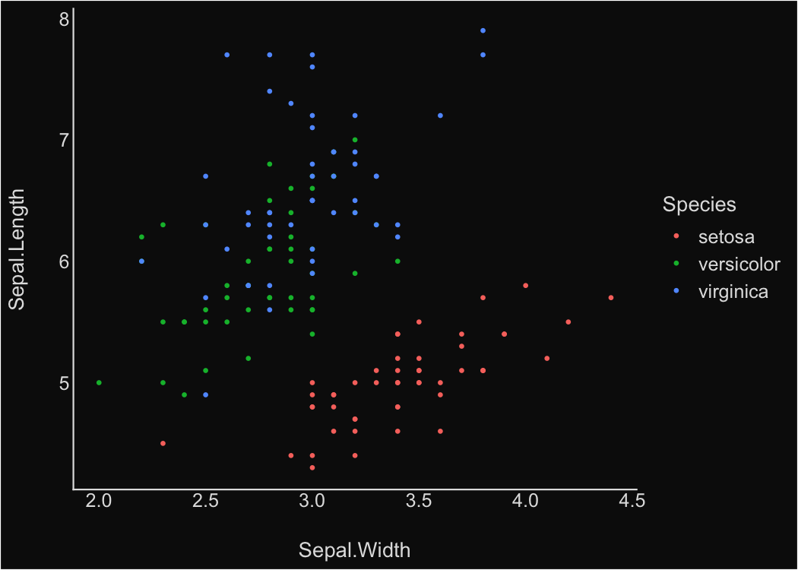

# see 

<!-- [](https://travis-ci.org/easystats/see) -->

<!-- [](https://codecov.io/gh/easystats/see) -->

[](https://easystats.github.io/see/)

***“Damned are those who believe without seeing”***

## Installation

Run the following:

``` r
install.packages("devtools")
devtools::install_github("easystats/see")
```

``` r
library("see")
```

## Features

### Themes

  - **Modern**

<!-- end list -->

``` r
library(ggplot2)

ggplot(iris, aes(x = Sepal.Width, y = Sepal.Length, color = Species)) + 
    geom_point2() + theme_modern()
```

<!-- -->

### Palettes

  - **Material design**

<!-- end list -->

``` r
p1 <- ggplot(iris, aes(x = Species, y = Sepal.Length, fill = Species)) + 
    geom_boxplot() + theme_modern() + scale_fill_material_d()

p2 <- ggplot(iris, aes(x = Species, y = Sepal.Length, fill = Species)) + 
    geom_violin() + theme_modern() + scale_fill_material_d(palette = "ice")

p3 <- ggplot(iris, aes(x = Petal.Length, y = Petal.Width, color = Sepal.Length)) + 
    geom_point2() + theme_modern() + scale_color_material_c(palette = "rainbow")
```

The `plots` function allows us to plot the figures side by side.

``` r
plots(p1, p2, p3, ncol = 2)
```

<!-- -->

### Multiple plots

The `plots` function can also be used to add **tags** (*i.e.*, labels
for subfigures).

``` r
plots(p1, p2, p3, ncol = 2, tags = TRUE, tags_labels = paste("Fig. ", 
    1:3))
```

<!-- -->

### Better looking points

`geom_points2` and `geom_jitter2` allow points without borders and
contour.

``` r
normal <- ggplot(iris, aes(x = Petal.Width, y = Sepal.Length)) + 
    geom_point(size = 8, alpha = 0.3) + theme_modern()

new <- ggplot(iris, aes(x = Petal.Width, y = Sepal.Length)) + 
    geom_point2(size = 8, alpha = 0.3) + theme_modern()

plots(normal, new, ncol = 2)
```

<!-- -->

### Half-violin Half-dot plot

Create a half-violin half-dot plot, useful for visualising the
distribution and the sample size at the same time.

``` r
ggplot(iris, aes(x = Species, y = Sepal.Length, fill = Species)) + 
    geom_violindot(fill_dots = "black") + theme_modern() + scale_fill_material_d()
```

<!-- -->
