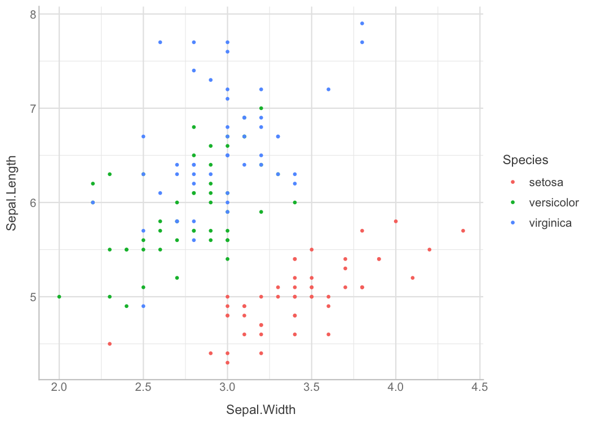
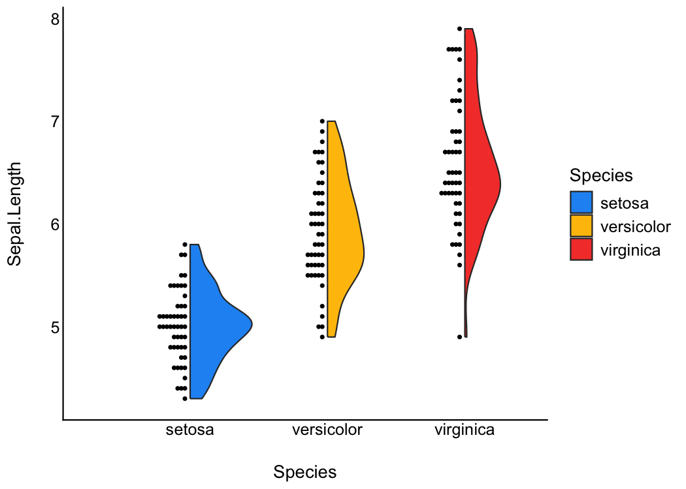

# see 

[](https://cran.r-project.org/package=see)
[](https://cran.r-project.org/package=see)
[](https://easystats.github.io/see/)

***“Damned are those who believe without seeing”***

## Installation

Run the following:

``` r
install.packages("devtools")
devtools::install_github("easystats/see")
```

``` r
library("see")
```

# Features

## Themes

### Modern

``` r
library(ggplot2)

ggplot(iris, aes(x = Sepal.Width, y = Sepal.Length, color = Species)) + 
    geom_point2() + theme_modern()
```

<!-- -->

### Lucid

``` r
library(ggplot2)

ggplot(iris, aes(x = Sepal.Width, y = Sepal.Length, color = Species)) + 
    geom_point2() + theme_lucid()
```

<!-- -->

### Blackboard

``` r
library(rstanarm)
library(modelbased)

dat <- rstanarm::stan_glm(Sepal.Width ~ poly(Petal.Length, 2), 
    data = iris) %>% estimate::estimate_link(keep_draws = TRUE, 
    length = 100, draws = 250) %>% estimate::reshape_draws()

p <- ggplot(dat, aes(x = Petal.Length, y = Draw, group = Draw_Group)) + 
    geom_line(color = "white", alpha = 0.05) + scale_x_continuous(expand = c(0, 
    0)) + scale_y_continuous(expand = c(0, 0))

p + theme_blackboard()
```

<!-- -->

### Abyss

<!-- -->

## Palettes

This is just one example of the available palettes. See [this
vignette](https://easystats.github.io/see/articles/seecolorscales.html)
for a detailed overview of palettes and color scales.

### Material design

``` r
p1 <- ggplot(iris, aes(x = Species, y = Sepal.Length, fill = Species)) + 
    geom_boxplot() + theme_modern(axis.text.angle = 45) + scale_fill_material_d()

p2 <- ggplot(iris, aes(x = Species, y = Sepal.Length, fill = Species)) + 
    geom_violin() + theme_modern(axis.text.angle = 45) + scale_fill_material_d(palette = "ice")

p3 <- ggplot(iris, aes(x = Petal.Length, y = Petal.Width, color = Sepal.Length)) + 
    geom_point2() + theme_modern() + scale_color_material_c(palette = "rainbow")
```

## Multiple plots

The `plots()` function allows us to plot the figures side by side.

``` r
plots(p1, p2, p3, n_columns = 2)
```

<!-- -->

The `plots()` function can also be used to add **tags** (*i.e.*, labels
for subfigures).

``` r
plots(p1, p2, p3, n_columns = 2, tags = paste("Fig. ", 1:3))
```

<!-- -->

## Better looking points

`geom_points2()` and `geom_jitter2()` allow points without borders and
contour.

``` r
normal <- ggplot(iris, aes(x = Petal.Width, y = Sepal.Length)) + 
    geom_point(size = 8, alpha = 0.3) + theme_modern()

new <- ggplot(iris, aes(x = Petal.Width, y = Sepal.Length)) + 
    geom_point2(size = 8, alpha = 0.3) + theme_modern()

plots(normal, new, n_columns = 2)
```

<!-- -->

## Half-violin Half-dot plot

Create a half-violin half-dot plot, useful for visualising the
distribution and the sample size at the same time.

``` r
ggplot(iris, aes(x = Species, y = Sepal.Length, fill = Species)) + 
    geom_violindot(fill_dots = "black") + theme_modern() + scale_fill_material_d()
```

<!-- -->

## Radar chart (Spider plot)

``` r
library(dplyr)
library(tidyr)

data <- iris %>% group_by(Species) %>% summarise_all(mean) %>% 
    pivot_longer(-Species)

data %>% ggplot(aes(x = name, y = value, color = Species, group = Species)) + 
    geom_polygon(fill = NA, size = 2, show.legend = FALSE) + 
    coord_radar(start = -pi/4) + theme_minimal()
```

<!-- -->

## Plot functions for easystats packages

### [bayestestR](https://github.com/easystats/bayestestR)

Plotting functions for the **bayestestR** package are demonstrated [in
this
vignette](https://easystats.github.io/see/articles/bayestestR.html).

### [parameters](https://github.com/easystats/parameters)

Plotting functions for the **parameters** package are demonstrated [in
this
vignette](https://easystats.github.io/see/articles/parameters.html).

### [performance](https://github.com/easystats/performance)

Plotting functions for the **performance** package are demonstrated [in
this
vignette](https://easystats.github.io/see/articles/performance.html).

### [modelbased](https://github.com/easystats/modelbased)

Plotting functions for the **modelbased** package are demonstrated [in
this
vignette](https://easystats.github.io/see/articles/modelbased.html).

### [correlation](https://github.com/easystats/correlation)

Plotting functions for the **correlation** package are demonstrated [in
this
vignette](https://easystats.github.io/see/articles/correlation.html).
