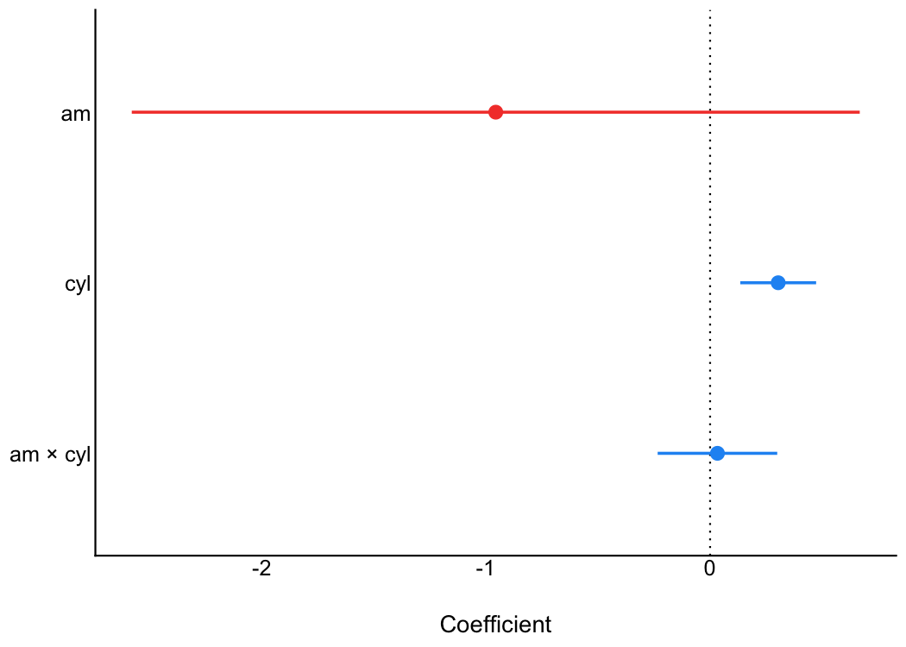

# see 

[](https://doi.org/10.21105/joss.03393)
[](https://cran.r-project.org/package=see)
[](https://cranlogs.r-pkg.org/)

***“Damned are those who believe without seeing”***

*easystats* is a collection of packages that operate in synergy to
provide a consistent and intuitive syntax when working with statistical
models in the R programming language (R Core Team, 2021). Most
*easystats* packages return comprehensive numeric summaries of model
parameters and performance. The *see* package complements these numeric
summaries with a host of functions and tools to produce a range of
publication-ready visualizations for model parameters, predictions, and
performance diagnostics. As a core pillar of *easystats*, the *see*
package helps users to utilize visualization for more informative,
communicable, and well-rounded scientific reporting.

# Statement of Need

The grammar of graphics (Wilkinson, 2012), largely due to its
implementation in the *ggplot2* package (Wickham, 2016), has become the
dominant approach to visualization in R. Building a model visualization
with *ggplot2* is somewhat disconnected from the model fitting and
evaluation process. Generally, this process entails:

1.  Fitting a model.
2.  Extracting desired results from the model (e.g., model parameters
    and intervals, model predictions, diagnostic statistics) and
    arranging them into a dataframe.
3.  Passing the results dataframe to `ggplot()` and specifying the
    graphical parameters. For example:

``` r
library(ggplot2)

# step-1
model <- lm(mpg ~ factor(cyl) * wt, data = mtcars)

# step-2
results <- fortify(model)

# step-3
ggplot(results) +
  geom_point(aes(x = wt, y = mpg, color = factor(cyl))) +
  geom_line(aes(x = wt, y = .fitted, color = `factor(cyl)`))
```

A number of packages have been developed to extend *ggplot2* and assist
with model visualization (for a sampling of these packages, visit
[ggplot2-gallery](https://exts.ggplot2.tidyverse.org/gallery/)). Some of
these packages provide functions for additional geoms, annotations, or
common visualization types without linking them to a specific
statistical analysis or fundamentally changing the *ggplot2* workflow
(e.g., *ggrepel*, *ggalluvial*, *ggridges*, *ggdist*, *ggpubr*, etc.).
Other *ggplot2* extensions provide functions to generate
publication-ready visualizations for specific types of models (e.g.,
*metaviz*, *tidymv*, *sjPlot*, *survminer*). For example, the
*ggstatsplot* package (Patil, 2021) offers visualizations for
statistical analysis of one-way factorial designs, and the *plotmm*
package (Waggoner, 2020) supports specific types of mixture model
objects.

The aim of the *see* package is to produce visualizations for a wide
variety of models and statistical analyses in a way that is tightly
linked with the model fitting process and requires minimal interruption
of users’ workflow. *see* accomplishes this aim by providing a single
`plot()` method for objects created by the other *easystats* packages,
such as *parameters* tables, *modelbased* predictions, *performance*
diagnostic tests, *correlation* matrices, and so on. The *easystats*
packages compute numeric results for a wide range of statistical models,
and the *see* package acts as a visual support to the entire *easystats*
ecosystem. As such, visualizations corresponding to all stages of
statistical analysis, from model fitting to diagnostics to reporting,
can be easily created using *see*. *see* plots are compatible with other
*ggplot2* functions for further customization (e.g., `labs()` for a plot
title). In addition, *see* provides several aesthetic utilities to
embellish both *easystats* plots and other *ggplot2* plots. The result
is a package that minimizes the barrier to producing high-quality
statistical visualizations in R.

The central goal of *easystats* is to make the task of doing statistics
in R as easy as possible. This goal is realized through intuitive and
consistent syntax, consistent and transparent argument names,
comprehensive documentation, informative warnings and error messages,
and smart functions with sensible default parameter values. The *see*
package follows this philosophy by using a single access point—the
generic `plot()` method—for visualization of all manner of statistical
results supported by *easystats*.

# Installation

[](https://cran.r-project.org/package=see)


The *see* package is available on CRAN, while its latest development
version is available on R-universe (from *rOpenSci*).

| Type        | Source     | Command                                                               |
|-------------|------------|-----------------------------------------------------------------------|
| Release     | CRAN       | `install.packages("see")`                                             |
| Development | R-universe | `install.packages("see", repos = "https://easystats.r-universe.dev")` |

Once you have downloaded the package, you can then load it using:

``` r
library("see")
```

This package provides visualisation toolbox for R packages in the
*easystats* [ecosystem](https://easystats.github.io/easystats/). But
note that it will not download any of the *easystats* packages for you.
Rather, it will be loaded when a respective plotting method is requested
by an *easystats* package.

# Documentation

Following resources are a good way to get to know more about the
functionality offered by this package:

[](https://easystats.github.io/see/)
[](https://easystats.github.io/see/reference/index.html)
[](https://easystats.github.io/blog/posts/)

# Plotting functions for ‘easystats’ packages

Below we present one or two plotting methods for each *easystats*
package, but many other methods are available. Interested readers are
encouraged to explore the range of examples on the package
[website](https://easystats.github.io/see/articles/).

## [parameters](https://github.com/easystats/parameters)

The *parameters* package converts summaries of regression model objects
into dataframes (Lüdecke et al., 2020). The *see* package can take this
transformed object and, for example, create a dot-and-whisker plot for
the extracted regression estimates simply by passing the `parameters`
class object to `plot()`.

``` r
library(parameters)
library(see)

model <- lm(wt ~ am * cyl, data = mtcars)

plot(parameters(model))
```

<!-- -->

As *see* outputs objects of class `ggplot`, *ggplot2* functions can be
added as layers to the plot the same as with all other *ggplot2*
visualizations. For example, we might add a title using `labs()` from
*ggplot2*.

``` r
library(parameters)
library(see)

model <- lm(wt ~ am * cyl, data = mtcars)

plot(parameters(model)) +
  ggplot2::labs(title = "A Dot-and-Whisker Plot")
```

<!-- -->

Plotting functions for the **parameters** package are demonstrated [in
this
vignette](https://easystats.github.io/see/articles/parameters.html).

## [bayestestR](https://github.com/easystats/bayestestR)

Similarly, for Bayesian regression model objects, which are handled by
the *bayestestR* package (Makowski et al., 2019), the *see* package
provides special plotting methods relevant for Bayesian models (e.g.,
Highest Density Interval, or *HDI*). Users can fit the model and pass
the model results, extracted via *bayestestR*, to `plot()`.

``` r
library(bayestestR)
library(rstanarm)
library(see)

set.seed(123)
model <- stan_glm(wt ~ mpg, data = mtcars, refresh = 0)
result <- hdi(model, ci = c(0.5, 0.75, 0.89, 0.95))

plot(result)
```

<!-- -->

Plotting functions for the **bayestestR** package are demonstrated [in
this
vignette](https://easystats.github.io/see/articles/bayestestR.html).

## [performance](https://github.com/easystats/performance)

The *performance* package is primarily concerned with checking
regression model assumptions (Lüdecke et al., 2021). The *see* package
offers tools to visualize these assumption checks, such as the normality
of residuals. Users simply pass the fit model object to the relevant
*performance* function (`check_normality()` in the example below). Then,
this result can be passed to `plot()` to produce a *ggplot2*
visualization of the check on normality of the residuals.

``` r
library(performance)
library(see)

model <- lm(wt ~ mpg, data = mtcars)
check <- check_normality(model)

plot(check, type = "qq")
```

<!-- -->

Plotting functions for the **performance** package are demonstrated [in
this
vignette](https://easystats.github.io/see/articles/performance.html).

## [effectsize](https://github.com/easystats/effectsize)

The *effectsize* package computes a variety of effect size metrics for
fitted models to assesses the practical importance of observed effects
(Ben-Shachar et al., 2020). In conjunction with *see*, users are able to
visualize the magnitude and uncertainty of effect sizes by passing the
model object to the relevant *effectsize* function (`omega_squared()` in
the following example), and then to `plot()`.

``` r
library(effectsize)
library(see)

model <- aov(wt ~ am * cyl, data = mtcars)

plot(omega_squared(model))
```

<!-- -->

Plotting functions for the **effectsize** package are demonstrated [in
this
vignette](https://easystats.github.io/see/articles/effectsize.html).

## [modelbased](https://github.com/easystats/modelbased)

The *modelbased* package computes model-based estimates and predictions
from fitted models (Makowski et al., 2020a). *see* provides methods to
quickly visualize these model predictions. For the following example to
work, you need to have installed the *emmeans* package first.

``` r
library(modelbased)
library(see)

data(mtcars)
mtcars$gear <- as.factor(mtcars$gear)
model <- lm(mpg ~ wt * gear, data = mtcars)

predicted <- estimate_expectation(model, data = "grid")
plot(predicted)
```

<!-- -->

One can also visualize *marginal means* (i.e., the mean at each factor
level averaged over other predictors) using `estimate_means()`, that is
then passed to `plot()`.

``` r
means <- estimate_means(model)

plot(means)
```

<!-- -->

Plotting functions for the **modelbased** package are demonstrated [in
this
vignette](https://easystats.github.io/see/articles/modelbased.html).

## [correlation](https://github.com/easystats/correlation)

The *correlation* package provides a unified syntax and human-readable
code to carry out many types of correlation analysis (Makowski et al.,
2020b). A user can run `summary(correlation(data))` to create a
construct a correlation matrix for the variables in a dataframe. With
*see*, this matrix can be passed to `plot()` to visualize these
correlations in a correlation matrix.

``` r
library(correlation)
library(see)

results <- summary(correlation(iris))

plot(results, show_data = "points")
```

<!-- -->

Plotting functions for the **correlation** package are demonstrated [in
this
vignette](https://easystats.github.io/see/articles/correlation.html).

# Themes

### Modern

``` r
library(ggplot2)

ggplot(iris, aes(x = Sepal.Width, y = Sepal.Length, color = Species)) +
  geom_point2() +
  theme_modern()
```

<!-- -->

### Lucid

``` r
library(ggplot2)

p <- ggplot(iris, aes(x = Sepal.Width, y = Sepal.Length, color = Species)) +
  geom_point2()

p + theme_lucid()
```

<!-- -->

### Blackboard

``` r
p + theme_blackboard()
```

<!-- -->

### Abyss

``` r
p + theme_abyss()
```

<!-- -->

# Palettes

This is just one example of the available palettes. See [this
vignette](https://easystats.github.io/see/articles/seecolorscales.html)
for a detailed overview of palettes and color scales.

### Material design

``` r
p1 <- ggplot(iris, aes(x = Species, y = Sepal.Length, fill = Species)) +
  geom_boxplot() +
  theme_modern(axis.text.angle = 45) +
  scale_fill_material_d()

p2 <- ggplot(iris, aes(x = Species, y = Sepal.Length, fill = Species)) +
  geom_violin() +
  theme_modern(axis.text.angle = 45) +
  scale_fill_material_d(palette = "ice")

p3 <- ggplot(iris, aes(x = Petal.Length, y = Petal.Width, color = Sepal.Length)) +
  geom_point2() +
  theme_modern() +
  scale_color_material_c(palette = "rainbow")
```

## Multiple plots

The `plots()` function allows us to plot the figures side by side.

``` r
plots(p1, p2, p3, n_columns = 2)
```

<!-- -->

The `plots()` function can also be used to add **tags** (*i.e.*, labels
for subfigures).

``` r
plots(p1, p2, p3,
  n_columns = 2,
  tags = paste("Fig. ", 1:3)
)
```

<!-- -->

# Geoms

## Better looking points

`geom_points2()` and `geom_jitter2()` allow points without borders and
contour.

``` r
normal <- ggplot(iris, aes(x = Petal.Width, y = Sepal.Length)) +
  geom_point(size = 8, alpha = 0.3) +
  theme_modern()

new <- ggplot(iris, aes(x = Petal.Width, y = Sepal.Length)) +
  geom_point2(size = 8, alpha = 0.3) +
  theme_modern()

plots(normal, new, n_columns = 2)
```

<!-- -->

## Half-violin Half-dot plot

Create a half-violin half-dot plot, useful for visualising the
distribution and the sample size at the same time.

``` r
ggplot(iris, aes(x = Species, y = Sepal.Length, fill = Species)) +
  geom_violindot(fill_dots = "black") +
  theme_modern() +
  scale_fill_material_d()
```

<!-- -->

## Radar chart (Spider plot)

``` r
library(poorman)
library(datawizard)

# prepare the data in tidy format
data <- iris %>%
      group_by(Species) %>%
      summarise(across(everything(), mean)) %>%
      reshape_longer(c("Sepal.Length", "Sepal.Width", "Petal.Length", "Petal.Width"))

data %>%
  ggplot(aes(
    x = Name,
    y = Value,
    color = Species,
    group = Species,
    fill = Species
  )) +
  geom_polygon(size = 1, alpha = .1) +
  coord_radar() +
  theme_radar()
```

<!-- -->

# Contributing and Support

In case you want to file an issue or contribute in another way to the
package, please follow [this
guide](https://github.com/easystats/see/blob/master/.github/CONTRIBUTING.md).
For questions about the functionality, you may either contact us via
email or also file an issue.

# Code of Conduct

Please note that this project is released with a [Contributor Code of
Conduct](https://easystats.github.io/see/CODE_OF_CONDUCT.html). By
participating in this project you agree to abide by its terms.

# References

<div id="refs" class="references csl-bib-body hanging-indent"
line-spacing="2">

<div id="ref-Ben-Shachar2020" class="csl-entry">

Ben-Shachar, M. S., Lüdecke, D., & Makowski, D. (2020). <span
class="nocase">e</span>ffectsize: Estimation of effect size indices and
standardized parameters. *Journal of Open Source Software*, *5*(56),
2815. <https://doi.org/10.21105/joss.02815>

</div>

<div id="ref-Lüdecke2020parameters" class="csl-entry">

Lüdecke, D., Ben-Shachar, M. S., Patil, I., & Makowski, D. (2020).
Extracting, computing and exploring the parameters of statistical models
using R. *Journal of Open Source Software*, *5*(53), 2445.
<https://doi.org/10.21105/joss.02445>

</div>

<div id="ref-Lüdecke2020performance" class="csl-entry">

Lüdecke, D., Ben-Shachar, M. S., Patil, I., Waggoner, P., & Makowski, D.
(2021). <span class="nocase">performance</span>: An R package for
assessment, comparison and testing of statistical models. *Journal of
Open Source Software*, *6*(60), 3139.
<https://doi.org/10.21105/joss.03139>

</div>

<div id="ref-Makowski2019" class="csl-entry">

Makowski, D., Ben-Shachar, M. S., & Lüdecke, D. (2019). <span
class="nocase">bayestestR</span>: Describing effects and their
uncertainty, existence and significance within the Bayesian framework.
*Journal of Open Source Software*, *4*(40), 1541.
<https://doi.org/10.21105/joss.01541>

</div>

<div id="ref-Makowski2020modelbased" class="csl-entry">

Makowski, D., Ben-Shachar, M. S., Patil, I., & Lüdecke, D. (2020a).
Estimation of model-based predictions, contrasts and means. *CRAN*.
<https://github.com/easystats/modelbased>

</div>

<div id="ref-Makowski2020" class="csl-entry">

Makowski, D., Ben-Shachar, M. S., Patil, I., & Lüdecke, D. (2020b).
Methods and algorithms for correlation analysis in R. *Journal of Open
Source Software*, *5*(51), 2306. <https://doi.org/10.21105/joss.02306>

</div>

<div id="ref-Patil2021" class="csl-entry">

Patil, I. (2021). <span class="nocase">Visualizations with statistical
details: The <span class="nocase">’ggstatsplot’</span> approach</span>.
*Journal of Open Source Software*, *6*(61), 3167.
<https://doi.org/10.21105/joss.03167>

</div>

<div id="ref-base2021" class="csl-entry">

R Core Team. (2021). *R: A language and environment for statistical
computing*. R Foundation for Statistical Computing.
<https://www.R-project.org/>

</div>

<div id="ref-Waggoner2020" class="csl-entry">

Waggoner, P. D. (2020). *<span class="nocase">plotmm</span>: Tidy tools
for visualizing mixture models*.
<https://CRAN.R-project.org/package=plotmm>

</div>

<div id="ref-Wickham2016" class="csl-entry">

Wickham, H. (2016). *<span class="nocase">ggplot2</span>: Elegant
graphics for data analysis*. Springer-Verlag New York.

</div>

<div id="ref-wilkinson2012grammar" class="csl-entry">

Wilkinson, L. (2012). <span class="nocase">The Grammar of
Graphics</span>. In *Handbook of computational statistics* (pp.
375–414). Springer.

</div>

</div>
