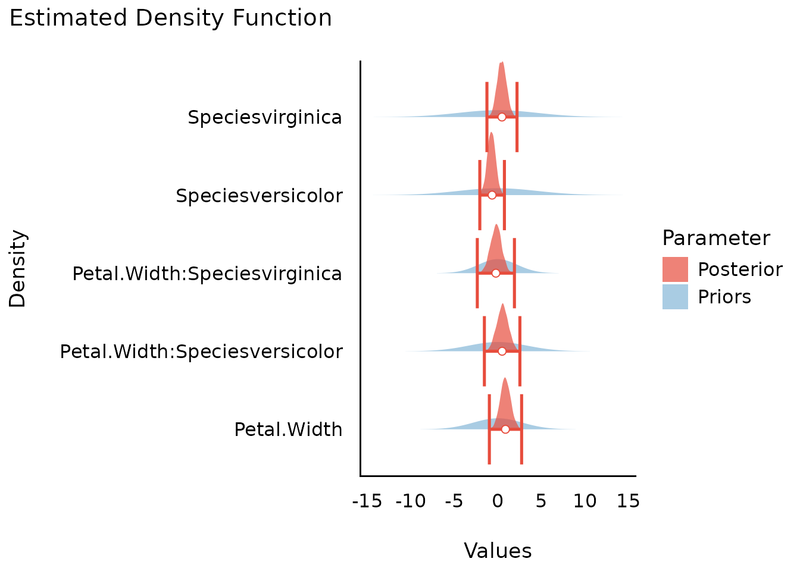
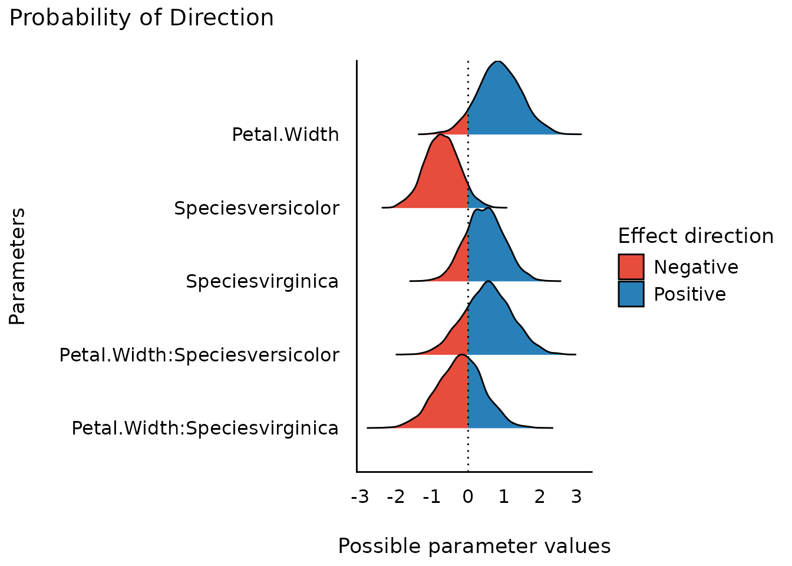
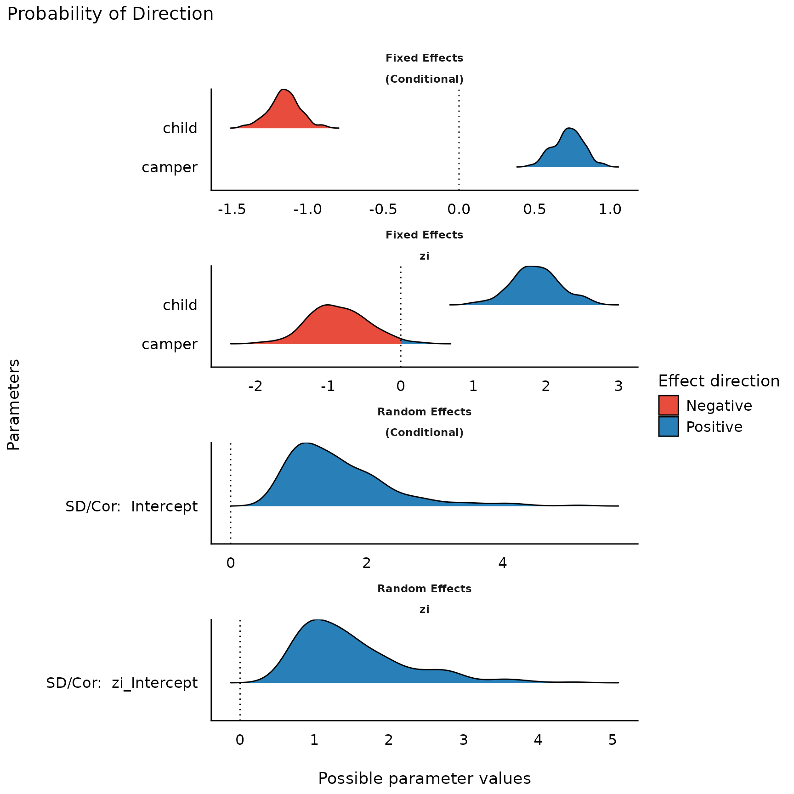
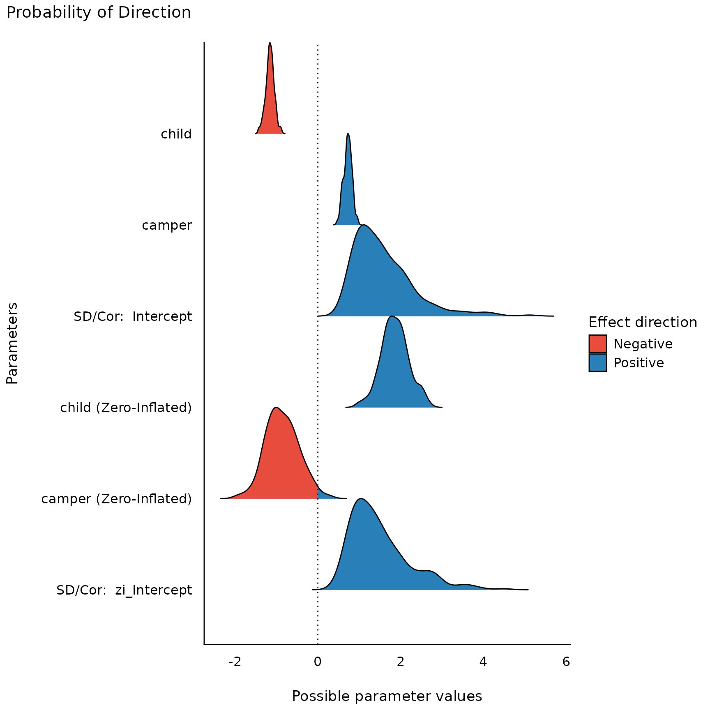
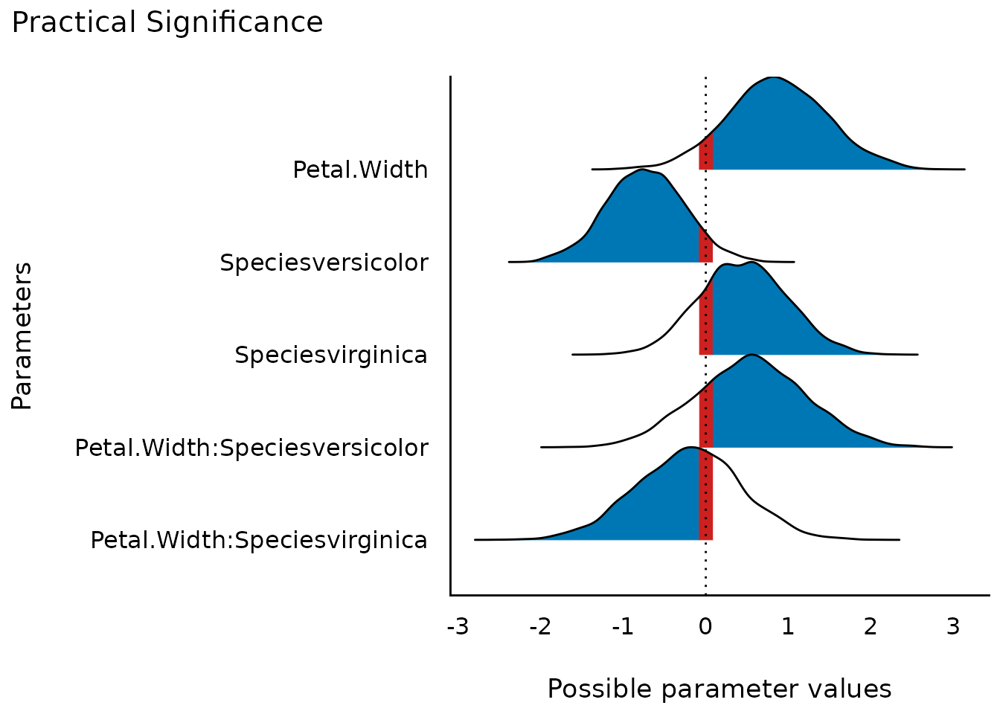
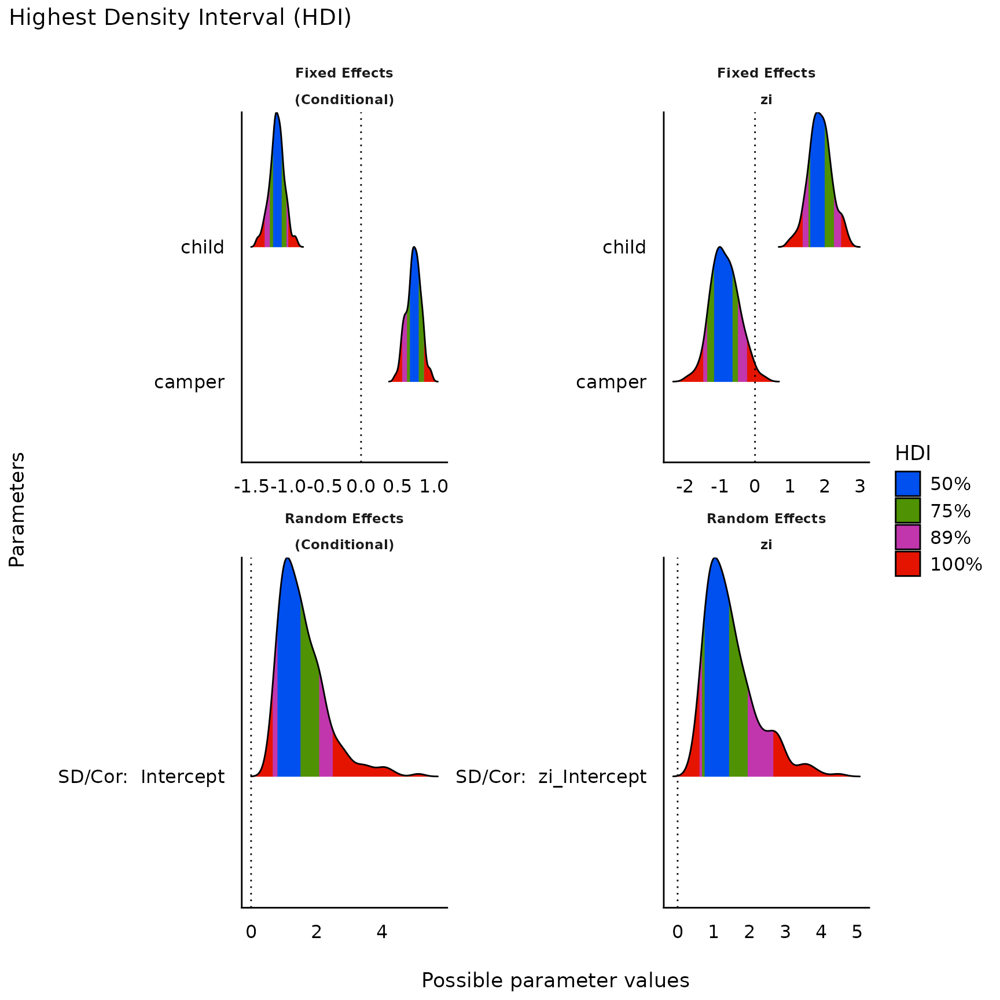
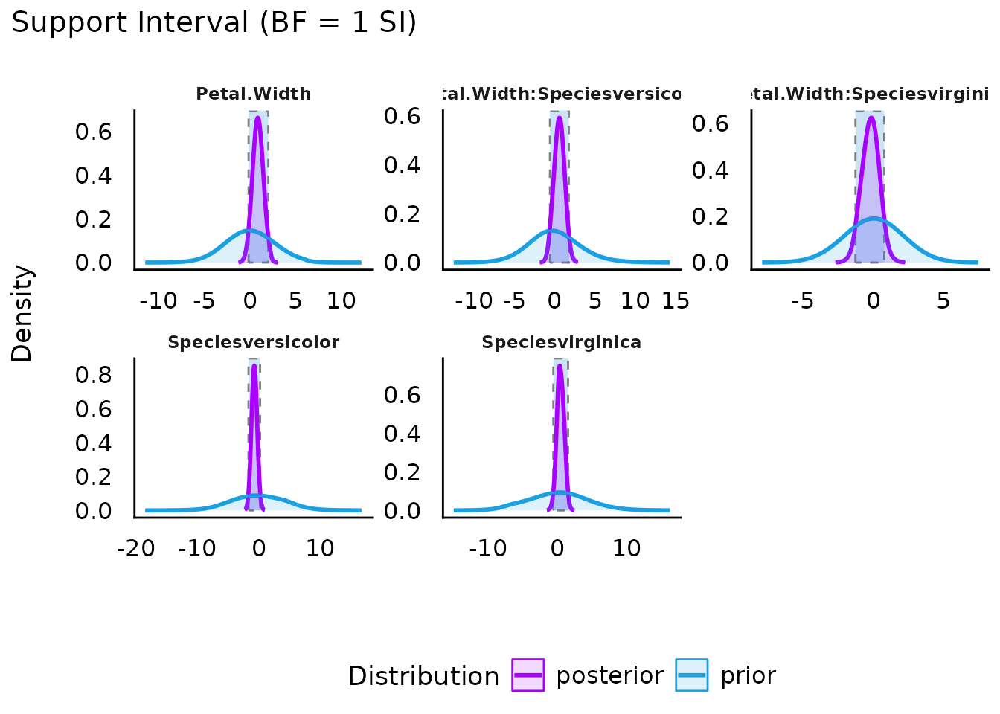
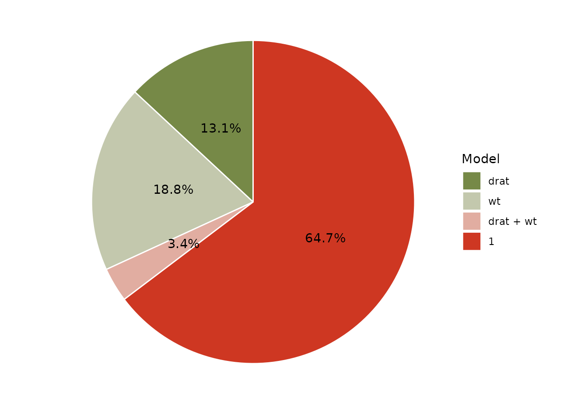

# Plotting Functions for the 'bayestestR' Package

This vignette can be referred to by citing the package:

``` r

citation("see")
#> To cite package 'see' in publications use:
#> 
#>   Lüdecke et al., (2021). see: An R Package for Visualizing Statistical
#>   Models. Journal of Open Source Software, 6(64), 3393.
#>   https://doi.org/10.21105/joss.03393
#> 
#> A BibTeX entry for LaTeX users is
#> 
#>   @Article{,
#>     title = {{see}: An {R} Package for Visualizing Statistical Models},
#>     author = {Daniel Lüdecke and Indrajeet Patil and Mattan S. Ben-Shachar and Brenton M. Wiernik and Philip Waggoner and Dominique Makowski},
#>     journal = {Journal of Open Source Software},
#>     year = {2021},
#>     volume = {6},
#>     number = {64},
#>     pages = {3393},
#>     doi = {10.21105/joss.03393},
#>   }
```

------------------------------------------------------------------------

## Introduction

Existing R packages allow users to easily fit a large variety of models
and extract and visualize the posterior draws. However, most of these
packages only return a limited set of indices (e.g., point-estimates and
CIs). *bayestestR* package in *easystats* provides a comprehensive and
consistent set of functions to analyze and describe posterior
distributions generated by a variety of models objects, including
popular modeling packages such as **rstanarm**, **brms** or
**BayesFactor**.

For more, see: <https://easystats.github.io/bayestestR/>

## Setup and Model Fitting

``` r

library(bayestestR)
library(insight)
library(see)
library(rstanarm)
library(ggplot2)

theme_set(theme_modern())
```

``` r

set.seed(123)
# model with fixed effects only
model <<- rstanarm::stan_glm(Sepal.Length ~ Petal.Width * Species, data = iris, refresh = 0)

# model with fixed and random effects as well as zero-inflation component
model2 <<- insight::download_model("brms_zi_3")
```

## Density Estimation

*([related function
documentation](https://easystats.github.io/bayestestR/reference/estimate_density.html))*

Plotting density estimations of Bayesian regression models will produce
plots of the posterior distributions from model parameters,
i.e. posterior interval estimates from MCMC draws.

By default, all distributions are “stacked”, i.e. overlaying each other.

``` r

result <- estimate_density(model)

plot(result)
```


To get ridge lines separated by parameters, use `stack = FALSE`.

``` r

plot(result, stack = FALSE)
```


### Adding Prior Samples

For many plots, when the model has defined priors, you can add a layer
from the prior distribution for the parameters with `priors = TRUE`.

``` r

plot(result, stack = FALSE, priors = TRUE)
```



## Density Estimation of Posterior Samples from `describe_posterior()`

*([related function
documentation](https://easystats.github.io/bayestestR/reference/describe_posterior.html))*

There is a convenient short cut to plot posterior samples directly from
[`bayestestR::describe_posterior()`](https://easystats.github.io/bayestestR/reference/describe_posterior.html),
which internally calls
[`estimate_density()`](https://easystats.github.io/bayestestR/reference/estimate_density.html)
and [`plot()`](https://rdrr.io/r/graphics/plot.default.html):

``` r

result <- describe_posterior(model)
plot(result)
```


## Probability of Direction (pd)

*([related function
documentation](https://easystats.github.io/bayestestR/reference/p_direction.html))*

The probability of direction (also known as the maximum probability of
effect - MPE) varies between 50% and 100% (i.e., 0.5 and 1) and can be
interpreted as the probability (expressed in percentage) that a
parameter (described by its posterior distribution) is strictly positive
or negative (whichever is the most probable).

It is mathematically defined as the proportion of the posterior
distribution that is of the median’s sign. Although differently
expressed, this index is fairly similar (i.e., is strongly correlated)
to the frequentist p-value

``` r

result <- p_direction(model)

result
#> Probability of Direction
#> 
#> Parameter                     |     pd
#> --------------------------------------
#> (Intercept)                   |   100%
#> Petal.Width                   | 92.97%
#> Speciesversicolor             | 94.08%
#> Speciesvirginica              | 80.53%
#> Petal.Width:Speciesversicolor | 79.20%
#> Petal.Width:Speciesvirginica  | 62.60%

plot(result)
```



For more complex models with different components, each component is
displayed in a separate facet. Use `n_columns` to define the layout,
i.e. how many columns are used to display the facets.

``` r

result <- p_direction(model2, effects = "all", component = "all")

result
#> Probability of Direction
#> 
#> Parameter   |     pd
#> --------------------
#> (Intercept) | 90.00%
#> child       |   100%
#> camper      |   100%
#> 
#> # Fixed effects (zero-inflated)
#> 
#> Parameter   |     pd
#> --------------------
#> (Intercept) | 78.00%
#> child       |   100%
#> camper      | 98.40%
#> 
#> # Random effects (conditional) (SD/Cor: persons)
#> 
#> Parameter   |   pd
#> ------------------
#> (Intercept) | 100%
#> 
#> # Random effects (zero-inflated) (SD/Cor: persons)
#> 
#> Parameter   |   pd
#> ------------------
#> (Intercept) | 100%

plot(result)
```



``` r

plot(result, n_columns = NULL)
```



### Adding Prior Samples

``` r

result <- p_direction(model)
plot(result, priors = TRUE)
```


## Practical Significance

*([related function
documentation](https://easystats.github.io/bayestestR/reference/p_significance.html))*

The probability of practical significance is conceptualized as a
unidirectional equivalence test. It returns the probability that an
effect is above a given threshold corresponding to a negligible effect
in the median’s direction.

Mathematically, it is defined as the proportion of the posterior
distribution of the median sign above the threshold.

``` r

result <- p_significance(model)

result
#> Practical Significance (threshold: 0.08)
#> 
#> Parameter                     |   ps
#> ------------------------------------
#> (Intercept)                   | 1.00
#> Petal.Width                   | 0.91
#> Speciesversicolor             | 0.92
#> Speciesvirginica              | 0.76
#> Petal.Width:Speciesversicolor | 0.76
#> Petal.Width:Speciesvirginica  | 0.57

plot(result)
```



``` r

result <- p_significance(model2, effects = "all", component = "all", verbose = FALSE)

result
#> Practical Significance (threshold: 0.10)
#> 
#> Parameter   |   ps
#> ------------------
#> (Intercept) | 0.88
#> child       | 1.00
#> camper      | 1.00
#> 
#> # Fixed effects (zero-inflated)
#> 
#> Parameter   |   ps
#> ------------------
#> (Intercept) | 0.73
#> child       | 1.00
#> camper      | 0.96
#> 
#> # Random effects (conditional) (SD/Cor: persons)
#> 
#> Parameter   |   ps
#> ------------------
#> (Intercept) | 1.00
#> 
#> # Random effects (zero-inflated) (SD/Cor: persons)
#> 
#> Parameter   |   ps
#> ------------------
#> (Intercept) | 1.00

plot(result)
```


``` r

plot(result, n_columns = NULL)
```


### Adding Prior Samples

``` r

result <- p_significance(model)
plot(result, priors = TRUE)
```


## Point Estimates

*([related function
documentation](https://easystats.github.io/bayestestR/reference/point_estimate.html))*

[`point_estimate()`](https://easystats.github.io/bayestestR/reference/point_estimate.html)
computes various point-estimates, such as the mean, the median or the
MAP, to describe posterior distributions. The
[`plot()`](https://rdrr.io/r/graphics/plot.default.html)-method shows
the posterior distribution of related parameters and emphasizes the
point estimate within the plot.

``` r

result <- point_estimate(model)

result
#> Point Estimate
#> 
#> Parameter                     | Median |  Mean |   MAP
#> ------------------------------------------------------
#> (Intercept)                   |   4.79 |  4.79 |  4.79
#> Petal.Width                   |   0.86 |  0.87 |  0.82
#> Speciesversicolor             |  -0.74 | -0.73 | -0.76
#> Speciesvirginica              |   0.46 |  0.46 |  0.55
#> Petal.Width:Speciesversicolor |   0.55 |  0.54 |  0.56
#> Petal.Width:Speciesvirginica  |  -0.20 | -0.21 | -0.17

plot(result)
```


``` r

result <- point_estimate(model, centrality = c("map", "mean"))

result
#> Point Estimate
#> 
#> Parameter                     |  Mean |   MAP
#> ---------------------------------------------
#> (Intercept)                   |  4.79 |  4.79
#> Petal.Width                   |  0.87 |  0.82
#> Speciesversicolor             | -0.73 | -0.76
#> Speciesvirginica              |  0.46 |  0.55
#> Petal.Width:Speciesversicolor |  0.54 |  0.56
#> Petal.Width:Speciesvirginica  | -0.21 | -0.17

plot(result, panel = FALSE)[[2]]
```


### Adding Prior Samples

``` r

result <- point_estimate(model)
plot(result, priors = TRUE)
```


## Highest Density Interval (HDI)

*([related function
documentation](https://easystats.github.io/bayestestR/reference/hdi.html))*

[`hdi()`](https://easystats.github.io/bayestestR/reference/hdi.html)
computes the Highest Density Interval (HDI) of posterior distributions.
All points within this interval have a higher probability density than
points outside the interval.

The HDI can be used in the context of uncertainty characterisation of
posterior distributions as Credible Interval (CI).

``` r

result <- hdi(model, ci = c(0.5, 0.75, 0.89, 0.95))

result
#> Highest Density Interval
#> 
#> Parameter                     |        50% HDI |        75% HDI |       89% HDI |       95% HDI
#> -----------------------------------------------------------------------------------------------
#> (Intercept)                   | [ 4.69,  4.91] | [ 4.62,  4.98] | [ 4.53, 5.05] | [ 4.48, 5.11]
#> Petal.Width                   | [ 0.53,  1.33] | [ 0.22,  1.58] | [-0.09, 1.82] | [-0.25, 2.10]
#> Speciesversicolor             | [-1.03, -0.40] | [-1.32, -0.25] | [-1.44, 0.04] | [-1.66, 0.20]
#> Speciesvirginica              | [ 0.08,  0.80] | [-0.19,  1.04] | [-0.37, 1.31] | [-0.58, 1.47]
#> Petal.Width:Speciesversicolor | [ 0.04,  0.93] | [-0.25,  1.30] | [-0.53, 1.59] | [-0.78, 1.81]
#> Petal.Width:Speciesvirginica  | [-0.53,  0.31] | [-0.91,  0.54] | [-1.18, 0.85] | [-1.41, 1.08]

plot(result) + scale_fill_flat()
```


``` r

result <- hdi(model2, ci = c(0.5, 0.75, 0.89), effects = "all", component = "all")

plot(result, n_columns = 2) + scale_fill_metro()
```



``` r

plot(result, n_columns = NULL) + scale_fill_material()
```


## Support Interval

*([related function
documentation](https://easystats.github.io/bayestestR/reference/si.html))*

Plotting the result of a call to
[`si()`](https://easystats.github.io/bayestestR/reference/si.html)
results in a plot presenting the prior and posterior distributions for
each parameter (note that by default `show_intercept = FALSE`). The
support interval will be denoted by a shaded border.

``` r

library(logspline) # needed for `si()`

result <- si(model, verbose = FALSE)
result
#> Support Interval
#> 
#> Parameter                     |     BF = 1 SI | Effects |   Component
#> ---------------------------------------------------------------------
#> (Intercept)                   | [ 4.39, 5.18] |   fixed | conditional
#> Petal.Width                   | [-0.16, 2.00] |   fixed | conditional
#> Speciesversicolor             | [-1.68, 0.21] |   fixed | conditional
#> Speciesvirginica              | [-0.59, 1.54] |   fixed | conditional
#> Petal.Width:Speciesversicolor | [-0.61, 1.73] |   fixed | conditional
#> Petal.Width:Speciesvirginica  | [-1.27, 0.77] |   fixed | conditional

plot(result) +
  scale_color_metro(palette = "ice") +
  scale_fill_metro(palette = "ice")
```



``` r


plot(result, support_only = TRUE) +
  scale_color_metro(palette = "ice") +
  scale_fill_metro(palette = "ice")
```


## Region of Practical Equivalence (ROPE)

*([related function
documentation](https://easystats.github.io/bayestestR/reference/rope.html))*

[`rope()`](https://easystats.github.io/bayestestR/reference/rope.html)
computes the proportion (in percentage) of the HDI of a posterior
distribution that lies within a region of practical equivalence
(*ROPE*).

The related
[`plot()`](https://rdrr.io/r/graphics/plot.default.html)-method plots
posterior distributions, coloring different HDI levels, and adds a
“rope” region to the plot that indicates which portion of the posterior
distributions lies inside (and outside) the ROPE.

``` r

result <- rope(model, ci = c(0.9, 0.95))

result
#> # Proportions of samples inside the ROPE [-0.08, 0.08]:
#> 
#> ROPE for the 90% HDI:
#> 
#> Parameter                     | Inside ROPE
#> -------------------------------------------
#> (Intercept)                   |      0.00 %
#> Petal.Width                   |      4.11 %
#> Speciesversicolor             |      3.86 %
#> Speciesvirginica              |      8.97 %
#> Petal.Width:Speciesversicolor |      7.17 %
#> Petal.Width:Speciesvirginica  |     11.33 %
#> 
#> 
#> ROPE for the 95% HDI:
#> 
#> Parameter                     | Inside ROPE
#> -------------------------------------------
#> (Intercept)                   |      0.00 %
#> Petal.Width                   |      3.89 %
#> Speciesversicolor             |      4.63 %
#> Speciesvirginica              |      8.50 %
#> Petal.Width:Speciesversicolor |      6.79 %
#> Petal.Width:Speciesvirginica  |     10.74 %

plot(result, rope_color = "red") +
  scale_fill_brewer(palette = "Greens", direction = -1)
```


``` r

result <- rope(model2, ci = c(0.9, 0.95), effects = "all", component = "all", verbose = FALSE)

result
#> # Proportions of samples inside the ROPE [-0.10, 0.10]:
#> 
#> ROPE for the 90% HDI:
#> 
#> # Fixed Effects (Conditional Model)
#> 
#> Parameter | Inside ROPE
#> -----------------------
#> Intercept |      2.68 %
#> child     |      0.00 %
#> camper    |      0.00 %
#> 
#> # Fixed Effects (Zero-Inflated Model)
#> 
#> Parameter | Inside ROPE
#> -----------------------
#> Intercept |     11.16 %
#> child     |      0.00 %
#> camper    |      0.00 %
#> 
#> # Random Effects (Conditional Model)
#> 
#> Parameter              | Inside ROPE
#> ------------------------------------
#> SD persons (Intercept) |      0.00 %
#> 
#> # Random Effects (Zero-Inflated Model)
#> 
#> Parameter              | Inside ROPE
#> ------------------------------------
#> SD persons (Intercept) |      0.00 %
#> 
#> 
#> ROPE for the 95% HDI:
#> 
#> # Fixed Effects (Conditional Model)
#> 
#> Parameter | Inside ROPE
#> -----------------------
#> Intercept |      2.54 %
#> child     |      0.00 %
#> camper    |      0.00 %
#> 
#> # Fixed Effects (Zero-Inflated Model)
#> 
#> Parameter | Inside ROPE
#> -----------------------
#> Intercept |     10.59 %
#> child     |      0.00 %
#> camper    |      0.85 %
#> 
#> # Random Effects (Conditional Model)
#> 
#> Parameter              | Inside ROPE
#> ------------------------------------
#> SD persons (Intercept) |      0.00 %
#> 
#> # Random Effects (Zero-Inflated Model)
#> 
#> Parameter              | Inside ROPE
#> ------------------------------------
#> SD persons (Intercept) |      0.00 %

plot(result, rope_color = "grey70") +
  scale_fill_social()
```


## Test for Practical Equivalence

*([related function
documentation](https://easystats.github.io/bayestestR/reference/equivalence_test.html))*

The test for practical equivalence is based on the “HDI+ROPE decision
rule” to check whether parameter values should be accepted or rejected
against an explicitly formulated “null hypothesis” (i.e., a ROPE). In
other words, it checks the percentage of the 89% HDI that is the null
region (the ROPE). If this percentage is sufficiently low, the null
hypothesis is rejected. If this percentage is sufficiently high, the
null hypothesis is accepted.

``` r

result <- equivalence_test(model, verbose = FALSE)

result
#> # Test for Practical Equivalence
#> 
#>   ROPE: [-0.08 0.08]
#> 
#> Parameter                     |        H0 | inside ROPE |       95% HDI
#> -----------------------------------------------------------------------
#> (Intercept)                   |  Rejected |      0.00 % |  [4.48, 5.11]
#> Petal.Width                   | Undecided |      3.89 % | [-0.30, 2.06]
#> Speciesversicolor             | Undecided |      4.63 % | [-1.66, 0.20]
#> Speciesvirginica              | Undecided |      8.50 % | [-0.56, 1.52]
#> Petal.Width:Speciesversicolor | Undecided |      6.79 % | [-0.75, 1.86]
#> Petal.Width:Speciesvirginica  | Undecided |     10.74 % | [-1.49, 1.01]

plot(result) +
  theme_blackboard() +
  scale_fill_material()
```


``` r

result <- equivalence_test(model, ci = c(0.89, 0.95))

result
#> # Test for Practical Equivalence
#> 
#>   ROPE: [-0.08 0.08]
#> 
#> Parameter                     |        H0 | inside ROPE |       89% HDI
#> -----------------------------------------------------------------------
#> (Intercept)                   |  Rejected |      0.00 % |  [4.53, 5.06]
#> Petal.Width                   | Undecided |      4.16 % | [-0.09, 1.83]
#> Speciesversicolor             | Undecided |      3.34 % | [-1.48, 0.01]
#> Speciesvirginica              | Undecided |      9.07 % | [-0.37, 1.30]
#> Petal.Width:Speciesversicolor | Undecided |      7.25 % | [-0.52, 1.61]
#> Petal.Width:Speciesvirginica  | Undecided |     11.46 % | [-1.22, 0.81]
#> 
#> 
#> Parameter                     |        H0 | inside ROPE |       95% HDI
#> -----------------------------------------------------------------------
#> (Intercept)                   |  Rejected |      0.00 % |  [4.48, 5.11]
#> Petal.Width                   | Undecided |      3.89 % | [-0.30, 2.06]
#> Speciesversicolor             | Undecided |      4.63 % | [-1.66, 0.20]
#> Speciesvirginica              | Undecided |      8.50 % | [-0.56, 1.52]
#> Petal.Width:Speciesversicolor | Undecided |      6.79 % | [-0.75, 1.86]
#> Petal.Width:Speciesvirginica  | Undecided |     10.74 % | [-1.49, 1.01]

plot(result) +
  theme_abyss() +
  scale_fill_flat()
```


``` r

result <- equivalence_test(
  model2,
  ci = c(0.89, 0.95),
  effects = "all",
  component = "all",
  verbose = FALSE
)

result
#> # Test for Practical Equivalence
#> 
#>   ROPE: [-0.10 0.10]
#> 
#> # Fixed Effects (Conditional Model)
#> 
#> Parameter |        H0 | inside ROPE |        89% HDI
#> ----------------------------------------------------
#> Intercept | Undecided |      2.70 % |  [-0.32, 2.29]
#> child     |  Rejected |      0.00 % | [-1.32, -1.00]
#> camper    |  Rejected |      0.00 % |   [0.56, 0.87]
#> 
#> # Fixed Effects (Zero-Inflated Model)
#> 
#> Parameter |        H0 | inside ROPE |        89% HDI
#> ----------------------------------------------------
#> Intercept | Undecided |     11.26 % |  [-1.60, 0.48]
#> child     |  Rejected |      0.00 % |   [1.37, 2.46]
#> camper    |  Rejected |      0.00 % | [-1.45, -0.21]
#> 
#> # Random Effects (Conditional Model)
#> 
#> Parameter           |       H0 | inside ROPE |      89% HDI
#> -----------------------------------------------------------
#> SD/Cor: (Intercept) | Rejected |      0.00 % | [0.79, 2.91]
#> 
#> # Random Effects (Zero-Inflated Model)
#> 
#> Parameter           |       H0 | inside ROPE |      89% HDI
#> -----------------------------------------------------------
#> SD/Cor: (Intercept) | Rejected |      0.00 % | [0.70, 2.82]
#> 
#> 
#> # Fixed Effects (Conditional Model)
#> 
#> Parameter |        H0 | inside ROPE |        95% HDI
#> ----------------------------------------------------
#> Intercept | Undecided |      2.54 % |  [-0.81, 2.51]
#> child     |  Rejected |      0.00 % | [-1.36, -0.94]
#> camper    |  Rejected |      0.00 % |   [0.54, 0.91]
#> 
#> # Fixed Effects (Zero-Inflated Model)
#> 
#> Parameter |        H0 | inside ROPE |        95% HDI
#> ----------------------------------------------------
#> Intercept | Undecided |     10.59 % |  [-2.03, 0.89]
#> child     |  Rejected |      0.00 % |   [1.19, 2.54]
#> camper    | Undecided |      0.85 % | [-1.61, -0.07]
#> 
#> # Random Effects (Conditional Model)
#> 
#> Parameter              |       H0 | inside ROPE |      95% HDI
#> --------------------------------------------------------------
#> SD persons (Intercept) | Rejected |      0.00 % | [0.71, 3.58]
#> 
#> # Random Effects (Zero-Inflated Model)
#> 
#> Parameter              |       H0 | inside ROPE |      95% HDI
#> --------------------------------------------------------------
#> SD persons (Intercept) | Rejected |      0.00 % | [0.63, 3.41]

plot(result, n_columns = 3) + theme_modern()
```


## Bayes Factors (BFs)

### Bayes Factors for Model Parameters

*([related function
documentation](https://easystats.github.io/bayestestR/reference/bayesfactor_parameters.html))*

Plotting the result of a call to
[`bayesfactor_parameters()`](https://easystats.github.io/bayestestR/reference/bayesfactor_parameters.html)
results in a plot presenting the prior and posterior distributions for
each parameter (note that by default `show_intercept = FALSE`). When a
point null was tested, two dots represent the density of the null at the
value - the ratio of their heights is the value of the Savage-Dickey
Bayes factor:

``` r

result <- bayesfactor_parameters(model, verbose = FALSE)

result
#> Bayes Factor (Savage-Dickey density ratio)
#> 
#> Parameter                     |       BF
#> ----------------------------------------
#> (Intercept)                   | 1.05e+52
#> Petal.Width                   |    0.598
#> Speciesversicolor             |    0.353
#> Speciesvirginica              |    0.166
#> Petal.Width:Speciesversicolor |    0.296
#> Petal.Width:Speciesvirginica  |    0.311
#> 
#> * Evidence Against The Null: 0

plot(result) +
  scale_color_material() +
  scale_fill_material()
```


When an interval null was tested, two dashed lines mark the edges of the
null interval at the value - the Bayes factor represents the degree by
which the distribution mass of the posterior has shifted outside or
inside the null interval relative to the prior distribution:

``` r

result <- bayesfactor_parameters(model, null = rope_range(model))

result
#> Bayes Factor (Null-Interval)
#> 
#> Parameter                     |       BF
#> ----------------------------------------
#> (Intercept)                   | 4.93e+51
#> Petal.Width                   |    0.605
#> Speciesversicolor             |    0.332
#> Speciesvirginica              |    0.159
#> Petal.Width:Speciesversicolor |    0.275
#> Petal.Width:Speciesvirginica  |    0.293
#> 
#> * Evidence Against The Null: [-0.083, 0.083]

plot(result) +
  scale_color_material() +
  scale_fill_material()
```


### Bayes Factors for Model Comparison

*([related function
documentation](https://easystats.github.io/bayestestR/reference/bayesfactor_models.html))*

``` r

lm0 <- lm(qsec ~ 1, data = mtcars)
lm1 <- lm(qsec ~ drat, data = mtcars)
lm2 <- lm(qsec ~ wt, data = mtcars)
lm3 <- lm(qsec ~ drat + wt, data = mtcars)

result <- bayesfactor_models(lm1, lm2, lm3, denominator = lm0)

result
#> Bayes Factors for Model Comparison
#> 
#>       Model        BF
#> [lm1] drat      0.202
#> [lm2] wt        0.290
#> [lm3] drat + wt 0.053
#> 
#> * Against Denominator: [lm0] (Intercept only)
#> *   Bayes Factor Type: BIC approximation
```

*Pizza plots* are a visual way of representing the posterior
probabilities of several models, with ratio of the areas of any two
models corresponding to their posterior odds.[^1] It is possible to plot
all compared models on one (pizza) pie:

``` r

plot(result, n_pies = "one", value = "probability") +
  scale_fill_pizza(reverse = TRUE)
```



But it is also possible to plot one pizza for each model and the
denominator model (and who doesn’t like ***more*** pizza?):

``` r

plot(result, n_pies = "many", value = "BF") +
  scale_fill_flat(palette = "rainbow", reverse = TRUE)
```


[^1]: When all models are given equal prior probabilities, then all
    prior odds are 1, and the posterior odds are equal to the Bayes
    factor.
