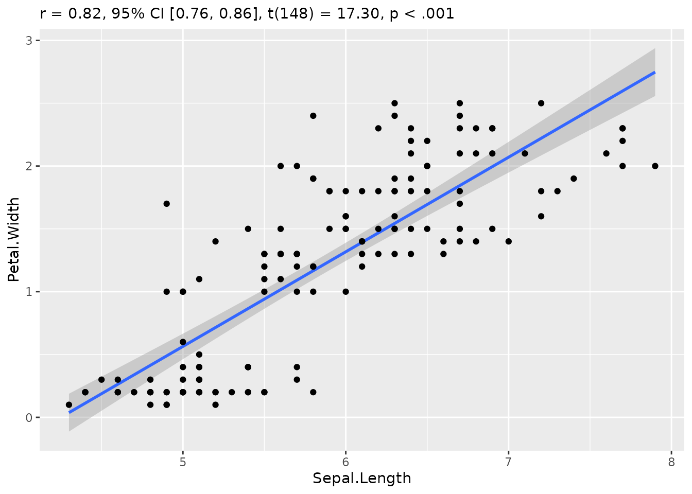
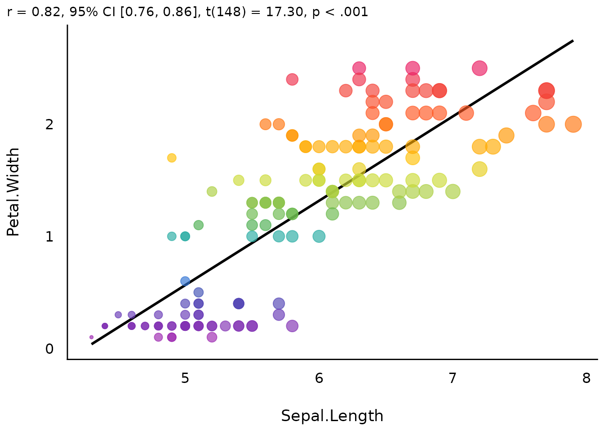
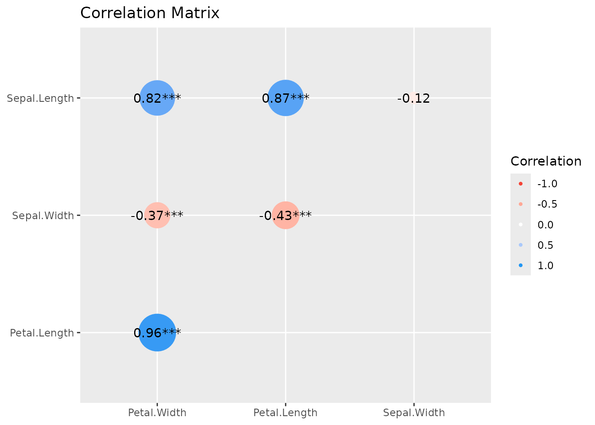

# Plotting Functions for the 'correlation' Package

This vignette can be referred to by citing the package:

``` r

citation("see")
#> To cite package 'see' in publications use:
#> 
#>   Lüdecke et al., (2021). see: An R Package for Visualizing Statistical
#>   Models. Journal of Open Source Software, 6(64), 3393.
#>   https://doi.org/10.21105/joss.03393
#> 
#> A BibTeX entry for LaTeX users is
#> 
#>   @Article{,
#>     title = {{see}: An {R} Package for Visualizing Statistical Models},
#>     author = {Daniel Lüdecke and Indrajeet Patil and Mattan S. Ben-Shachar and Brenton M. Wiernik and Philip Waggoner and Dominique Makowski},
#>     journal = {Journal of Open Source Software},
#>     year = {2021},
#>     volume = {6},
#>     number = {64},
#>     pages = {3393},
#>     doi = {10.21105/joss.03393},
#>   }
```

## Introduction

`correlation` is an
[**easystats**](https://github.com/easystats/easystats) package focused
on correlation analysis. It’s lightweight, easy to use, and allows for
the computation of many different types of correlation, including:

✅ **Pearson’s correlation**  
✅ **Spearman’s rank correlation**  
✅ **Kendall’s rank correlation**  
✅ **Biweight midcorrelation**  
✅ **Distance correlation**  
✅ **Percentage bend correlation**  
✅ **Shepherd’s Pi correlation**  
✅ **Blomqvist’s coefficient**  
✅ **Hoeffding’s D**  
✅ **Gamma correlation**  
✅ **Gaussian rank correlation**  
✅ **Point-Biserial and biserial correlation**  
✅ **Winsorized correlation**  
✅ **Polychoric correlation**  
✅ **Tetrachoric correlation**  
✅ **Multilevel correlation**  

An overview and description of these correlations types is [**available
here**](https://easystats.github.io/correlation/articles/types.html).
Moreover, many of these correlation types are available as **partial**
or within a **Bayesian** framework.

## Setup

``` r

library(correlation)
library(see)
library(ggplot2)
```

## Correlation Scatterplot

*([related function
documentation](https://easystats.github.io/correlation/reference/cor_test.html))*

It is easy to visualize correlation tests with `correlation` and `see`.

``` r

result <- cor_test(iris, "Sepal.Length", "Petal.Width")

plot(result)
```



We can even customize that to make it more beautiful:

``` r

plot(result,
  point = list(
    aes = list(color = "Petal.Width", size = "Sepal.Length"),
    alpha = 0.66
  ),
  smooth = list(color = "black", se = FALSE)
) +
  see::theme_modern() +
  see::scale_color_material_c(palette = "rainbow", guide = "none") +
  scale_size_continuous(guide = "none")
```



## Correlation Matrix

*([related function
documentation](https://easystats.github.io/correlation/reference/correlation.html))*

The default output for
[`correlation()`](https://easystats.github.io/correlation/reference/correlation.html)
is a detailed overview including test statistic, p-values and confidence
intervals. A shorter summary in matrix-layout can be obtained by using
[`summary()`](https://rdrr.io/r/base/summary.html).

``` r

result <- correlation(iris)

result
#> # Correlation Matrix (pearson-method)
#> 
#> Parameter1   |   Parameter2 |     r |         95% CI | t(148) |         p
#> -------------------------------------------------------------------------
#> Sepal.Length |  Sepal.Width | -0.12 | [-0.27,  0.04] |  -1.44 | 0.152    
#> Sepal.Length | Petal.Length |  0.87 | [ 0.83,  0.91] |  21.65 | < .001***
#> Sepal.Length |  Petal.Width |  0.82 | [ 0.76,  0.86] |  17.30 | < .001***
#> Sepal.Width  | Petal.Length | -0.43 | [-0.55, -0.29] |  -5.77 | < .001***
#> Sepal.Width  |  Petal.Width | -0.37 | [-0.50, -0.22] |  -4.79 | < .001***
#> Petal.Length |  Petal.Width |  0.96 | [ 0.95,  0.97] |  43.39 | < .001***
#> 
#> p-value adjustment method: Holm (1979)
#> Observations: 150

summary(result)
#> # Correlation Matrix (pearson-method)
#> 
#> Parameter    | Petal.Width | Petal.Length | Sepal.Width
#> -------------------------------------------------------
#> Sepal.Length |     0.82*** |      0.87*** |       -0.12
#> Sepal.Width  |    -0.37*** |     -0.43*** |            
#> Petal.Length |     0.96*** |              |            
#> 
#> p-value adjustment method: Holm (1979)
```

The result from [`summary()`](https://rdrr.io/r/base/summary.html) can
be used to create a plot.

``` r

s <- summary(result)
plot(s)
```


To change the style of geoms, use the `show_data`-argument.

``` r

plot(s, show_data = "points")
```



And a “redundant” summary can be plotted as well:

``` r

s <- summary(result, redundant = TRUE)

s
#> # Correlation Matrix (pearson-method)
#> 
#> Parameter    | Sepal.Length | Sepal.Width | Petal.Length | Petal.Width
#> ----------------------------------------------------------------------
#> Sepal.Length |              |       -0.12 |      0.87*** |     0.82***
#> Sepal.Width  |        -0.12 |             |     -0.43*** |    -0.37***
#> Petal.Length |      0.87*** |    -0.43*** |              |     0.96***
#> Petal.Width  |      0.82*** |    -0.37*** |      0.96*** |            
#> 
#> p-value adjustment method: Holm (1979)

plot(s)
```


The `corrlation` function also provides a convenient way to change names
for selected variables:

``` r

plot(summary(correlation(
  data = mtcars[c("wt", "mpg", "drat")],
  rename = c("weight", "miles per gallon", "rear axle ratio")
)))
```


## Gaussian Graphical Models (GGMs)

To create a Gaussian Graphical Models plot, the library *ggraph* needs
to be loaded first.

``` r

library(ggraph)
result <- correlation(mtcars, partial = TRUE)

result
#> # Correlation Matrix (pearson-method)
#> 
#> Parameter1 | Parameter2 |     r |         95% CI | t(30) |         p
#> --------------------------------------------------------------------
#> mpg        |        cyl | -0.02 | [-0.37,  0.33] | -0.13 | > .999   
#> mpg        |       disp |  0.16 | [-0.20,  0.48] |  0.89 | > .999   
#> mpg        |         hp | -0.21 | [-0.52,  0.15] | -1.18 | > .999   
#> mpg        |       drat |  0.10 | [-0.25,  0.44] |  0.58 | > .999   
#> mpg        |         wt | -0.39 | [-0.65, -0.05] | -2.34 | > .999   
#> mpg        |       qsec |  0.24 | [-0.12,  0.54] |  1.34 | > .999   
#> mpg        |         vs |  0.03 | [-0.32,  0.38] |  0.18 | > .999   
#> mpg        |         am |  0.26 | [-0.10,  0.56] |  1.46 | > .999   
#> mpg        |       gear |  0.10 | [-0.26,  0.43] |  0.52 | > .999   
#> mpg        |       carb | -0.05 | [-0.39,  0.30] | -0.29 | > .999   
#> cyl        |       disp |  0.27 | [-0.09,  0.56] |  1.51 | > .999   
#> cyl        |         hp |  0.17 | [-0.19,  0.49] |  0.97 | > .999   
#> cyl        |       drat | -0.27 | [-0.57,  0.09] | -1.55 | > .999   
#> cyl        |         wt | -0.11 | [-0.44,  0.25] | -0.62 | > .999   
#> cyl        |       qsec | -0.26 | [-0.56,  0.10] | -1.48 | > .999   
#> cyl        |         vs | -0.32 | [-0.60,  0.03] | -1.85 | > .999   
#> cyl        |         am | -0.25 | [-0.55,  0.11] | -1.39 | > .999   
#> cyl        |       gear | -0.35 | [-0.62,  0.00] | -2.04 | > .999   
#> cyl        |       carb |  0.23 | [-0.13,  0.53] |  1.27 | > .999   
#> disp       |         hp |  0.54 | [ 0.24,  0.75] |  3.52 | 0.072    
#> disp       |       drat |  0.10 | [-0.26,  0.43] |  0.53 | > .999   
#> disp       |         wt |  0.76 | [ 0.56,  0.88] |  6.43 | < .001***
#> disp       |       qsec | -0.31 | [-0.60,  0.04] | -1.80 | > .999   
#> disp       |         vs | -0.10 | [-0.44,  0.25] | -0.57 | > .999   
#> disp       |         am | -0.07 | [-0.41,  0.29] | -0.37 | > .999   
#> disp       |       gear |  0.06 | [-0.29,  0.40] |  0.34 | > .999   
#> disp       |       carb | -0.66 | [-0.82, -0.40] | -4.77 | 0.002**  
#> hp         |       drat | -0.06 | [-0.40,  0.29] | -0.34 | > .999   
#> hp         |         wt | -0.30 | [-0.59,  0.06] | -1.72 | > .999   
#> hp         |       qsec | -0.05 | [-0.39,  0.30] | -0.29 | > .999   
#> hp         |         vs |  0.27 | [-0.08,  0.57] |  1.55 | > .999   
#> hp         |         am |  0.10 | [-0.26,  0.43] |  0.55 | > .999   
#> hp         |       gear |  0.11 | [-0.25,  0.44] |  0.59 | > .999   
#> hp         |       carb |  0.50 | [ 0.19,  0.72] |  3.19 | 0.167    
#> drat       |         wt | -0.11 | [-0.44,  0.25] | -0.62 | > .999   
#> drat       |       qsec | -0.06 | [-0.40,  0.29] | -0.33 | > .999   
#> drat       |         vs |  0.03 | [-0.33,  0.37] |  0.14 | > .999   
#> drat       |         am |  0.12 | [-0.24,  0.45] |  0.68 | > .999   
#> drat       |       gear |  0.06 | [-0.29,  0.40] |  0.35 | > .999   
#> drat       |       carb |  0.21 | [-0.15,  0.52] |  1.18 | > .999   
#> wt         |       qsec |  0.55 | [ 0.24,  0.75] |  3.57 | 0.063    
#> wt         |         vs | -0.06 | [-0.40,  0.29] | -0.36 | > .999   
#> wt         |         am |  0.02 | [-0.33,  0.36] |  0.10 | > .999   
#> wt         |       gear | -0.13 | [-0.46,  0.23] | -0.71 | > .999   
#> wt         |       carb |  0.62 | [ 0.34,  0.80] |  4.30 | 0.009**  
#> qsec       |         vs |  0.35 | [ 0.00,  0.62] |  2.02 | > .999   
#> qsec       |         am | -0.32 | [-0.60,  0.03] | -1.84 | > .999   
#> qsec       |       gear | -0.10 | [-0.43,  0.26] | -0.56 | > .999   
#> qsec       |       carb | -0.25 | [-0.55,  0.11] | -1.40 | > .999   
#> vs         |         am | -0.21 | [-0.52,  0.15] | -1.18 | > .999   
#> vs         |       gear |  0.04 | [-0.31,  0.38] |  0.22 | > .999   
#> vs         |       carb | -0.09 | [-0.43,  0.27] | -0.50 | > .999   
#> am         |       gear |  0.28 | [-0.08,  0.57] |  1.58 | > .999   
#> am         |       carb | -0.05 | [-0.39,  0.31] | -0.25 | > .999   
#> gear       |       carb |  0.43 | [ 0.09,  0.68] |  2.59 | 0.727    
#> 
#> p-value adjustment method: Holm (1979)
#> Observations: 32

plot(result)
```


