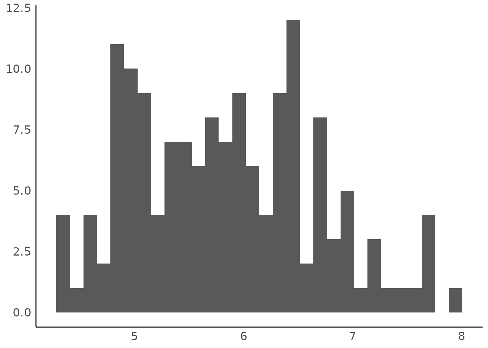
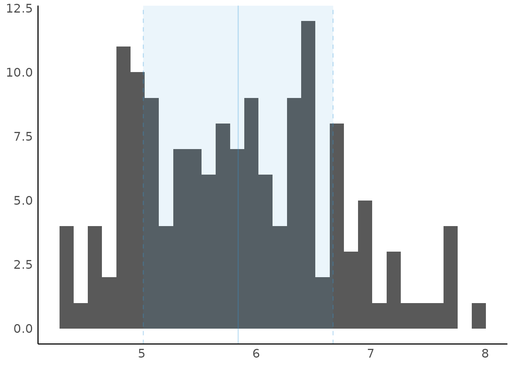
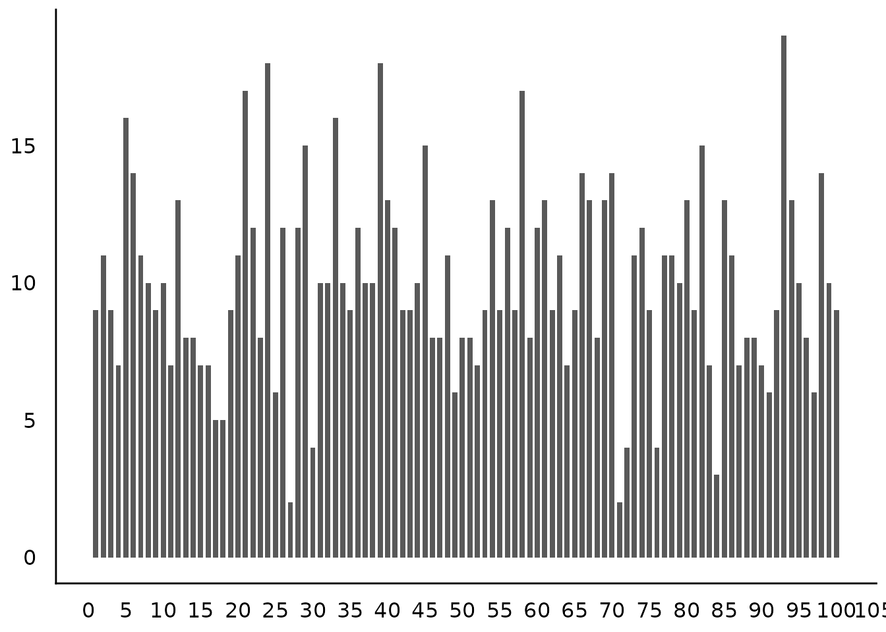
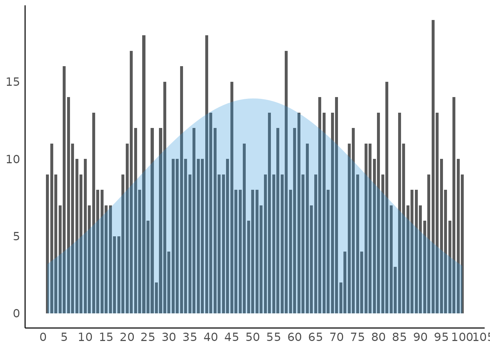
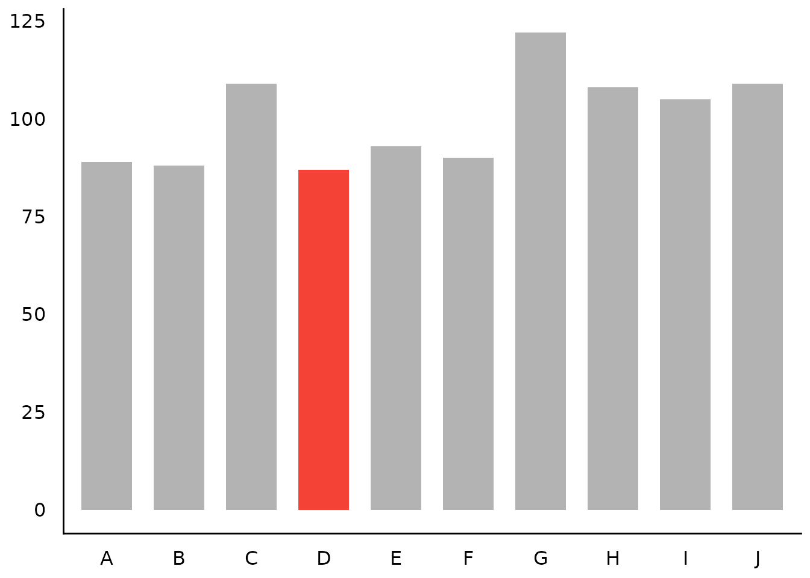
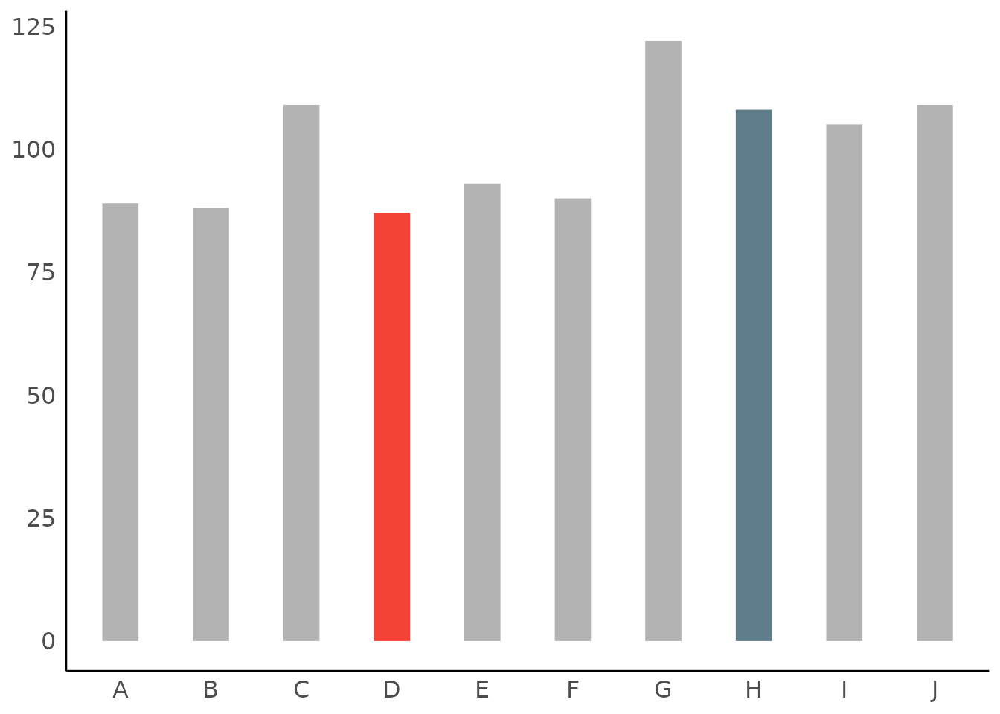
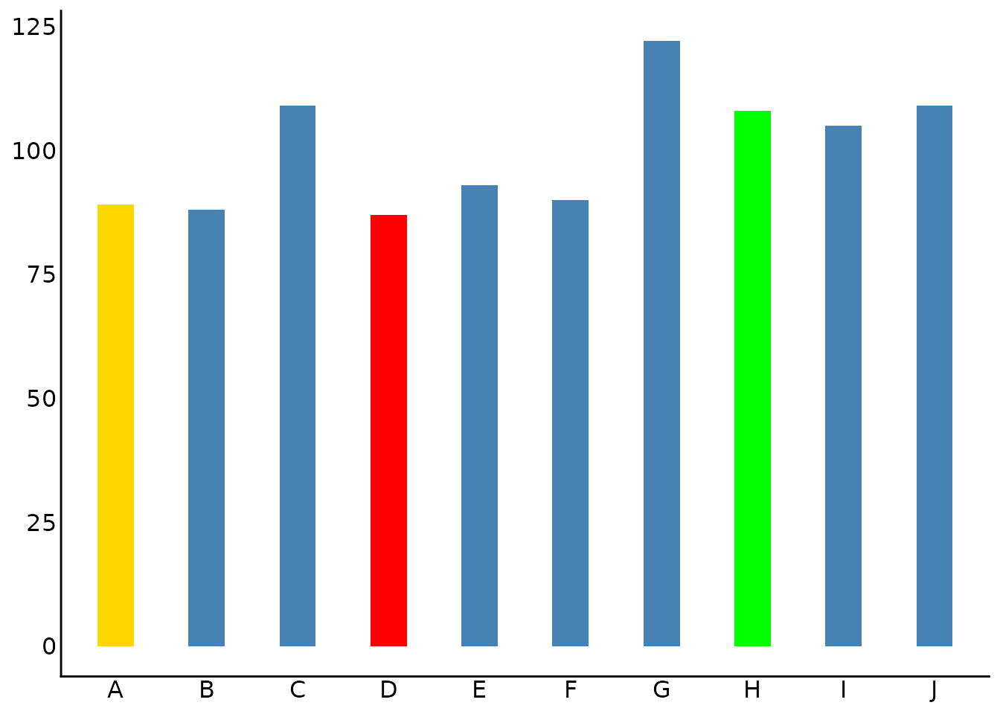

# Plotting Functions for the 'datawizard' Package

This vignette can be referred to by citing the package:

\
[`citation`](https://rdrr.io/r/utils/citation.html)`(``"see"``)`\
`#> To cite package 'see' in publications use:`\
`#> `\
`#>   Lüdecke et al., (2021). see: An R Package for Visualizing Statistical`\
`#>   Models. Journal of Open Source Software, 6(64), 3393.`\
`#>   https://doi.org/10.21105/joss.03393`\
`#> `\
`#> A BibTeX entry for LaTeX users is`\
`#> `\
`#>   @Article{,`\
`#>     title = {{see}: An {R} Package for Visualizing Statistical Models},`\
`#>     author = {Daniel Lüdecke and Indrajeet Patil and Mattan S. Ben-Shachar and Brenton M. Wiernik and Philip Waggoner and Dominique Makowski},`\
`#>     journal = {Journal of Open Source Software},`\
`#>     year = {2021},`\
`#>     volume = {6},`\
`#>     number = {64},`\
`#>     pages = {3393},`\
`#>     doi = {10.21105/joss.03393},`\
`#>   }`

## Introduction

*datawizard* is a lightweight package to easily manipulate, clean,
transform, and prepare your data for analysis. Most courses and
tutorials about statistical modeling assume that you are working with a
clean and tidy dataset. In practice, however, a major part of doing
statistical modeling is preparing your data-cleaning up values, creating
new columns, reshaping the dataset, or transforming some variables.
*datawizard* provides easy to use tools to perform these common,
critical, and sometimes tedious data preparation tasks.

For more, see: <https://easystats.github.io/datawizard/>

## Setup and Model Fitting

\
[`library`](https://rdrr.io/r/base/library.html)`(`[`datawizard`](https://easystats.github.io/datawizard/)`)`\
[`library`](https://rdrr.io/r/base/library.html)`(`[`see`](https://easystats.github.io/see/)`)`\
[`library`](https://rdrr.io/r/base/library.html)`(`[`ggplot2`](https://ggplot2.tidyverse.org)`)`\
[`theme_set`](https://ggplot2.tidyverse.org/reference/get_theme.html)`(`[`theme_modern`](https://easystats.github.io/see/reference/theme_modern.md)`(``)``)`

## Description of Variable Distributions

*([related function
documentation](https://easystats.github.io/datawizard/reference/describe_distribution.html))*

### Histogram for Numbers with Fractional Part

\
[`data`](https://rdrr.io/r/utils/data.html)`(``iris``)`\
`result`` ``<-`` `[`describe_distribution`](https://easystats.github.io/datawizard/reference/describe_distribution.html)`(``iris``$``Sepal.Length``)`\
`result`\
`#> Mean |   SD |  IQR |        Range | Skewness | Kurtosis |   n | n_Missing`\
`#> -------------------------------------------------------------------------`\
`#> 5.84 | 0.83 | 1.30 | [4.30, 7.90] |     0.31 |    -0.55 | 150 |         0`\
\
[`plot`](https://rdrr.io/r/graphics/plot.default.html)`(``result``)`

### Add Range of Dispersion (SD or MAD)

\
[`plot`](https://rdrr.io/r/graphics/plot.default.html)`(``result``, dispersion ``=`` ``TRUE``)`

### Thin Bars for Integer Values

\
[`set.seed`](https://rdrr.io/r/base/Random.html)`(``333``)`\
`x`` ``<-`` `[`sample`](https://rdrr.io/r/base/sample.html)`(``1``:``100``, ``1000``, replace ``=`` ``TRUE``)`\
`result`` ``<-`` `[`describe_distribution`](https://easystats.github.io/datawizard/reference/describe_distribution.html)`(``x``)`\
`result`\
`#>  Mean |    SD |   IQR |          Range | Skewness | Kurtosis |    n | n_Missing`\
`#> -------------------------------------------------------------------------------`\
`#> 50.18 | 28.66 | 48.75 | [1.00, 100.00] |     0.02 |    -1.16 | 1000 |         0`\
\
[`plot`](https://rdrr.io/r/graphics/plot.default.html)`(``result``)`

### Use a Normal Curve instead of Ribbon

\
[`plot`](https://rdrr.io/r/graphics/plot.default.html)`(``result``, dispersion ``=`` ``TRUE``, dispersion_style ``=`` ``"curve"``)`

### Highlighting Categories

\
[`set.seed`](https://rdrr.io/r/base/Random.html)`(``123``)`\
`result`` ``<-`` `[`describe_distribution`](https://easystats.github.io/datawizard/reference/describe_distribution.html)`(`[`sample`](https://rdrr.io/r/base/sample.html)`(``LETTERS``[``1``:``10``]``, ``1000``, ``TRUE``)``)`\
\
`# highlight one category`\
[`plot`](https://rdrr.io/r/graphics/plot.default.html)`(``result``, highlight ``=`` ``"D"``)`

\
\
`# highlight multiple categories`\
[`plot`](https://rdrr.io/r/graphics/plot.default.html)`(``result``, highlight ``=`` `[`c`](https://rdrr.io/r/base/c.html)`(``"D"``, ``"H"``)``, size_bar ``=`` ``0.4``)`

\
\
`# own color scales - pass a named vector to 'scale_fill_manual()'`\
`# the name of the non-highlighted color is "no_highlight".`\
[`plot`](https://rdrr.io/r/graphics/plot.default.html)`(``result``, highlight ``=`` `[`c`](https://rdrr.io/r/base/c.html)`(``"D"``, ``"H"``, ``"A"``)``, size_bar ``=`` ``0.4``)`` ``+`\
`  `[`scale_fill_manual`](https://ggplot2.tidyverse.org/reference/scale_manual.html)`(``values ``=`` `[`c`](https://rdrr.io/r/base/c.html)`(``D ``=`` ``"red"``, H ``=`` ``"green"``, A ``=`` ``"gold"``, no_highlight ``=`` ``"steelblue"``)``)`

