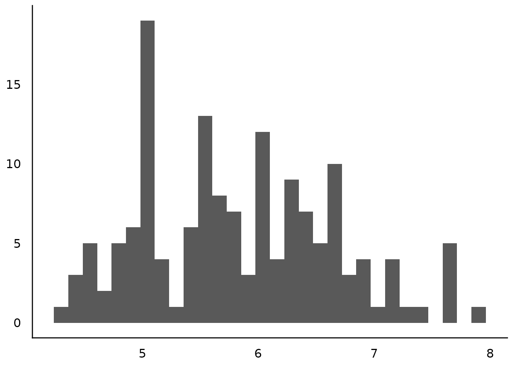
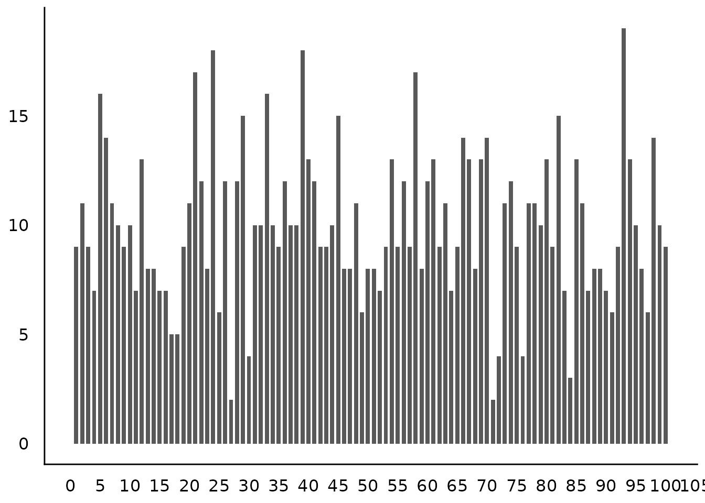
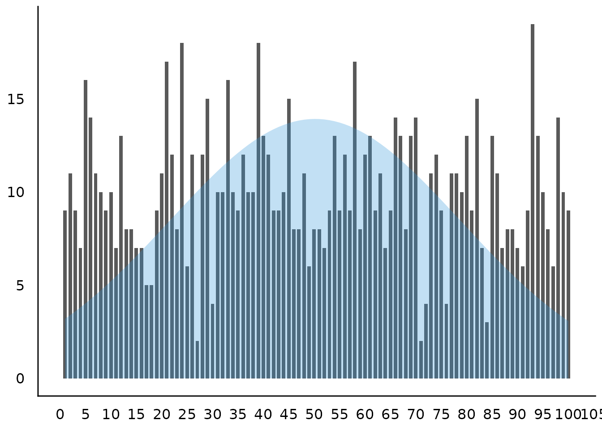
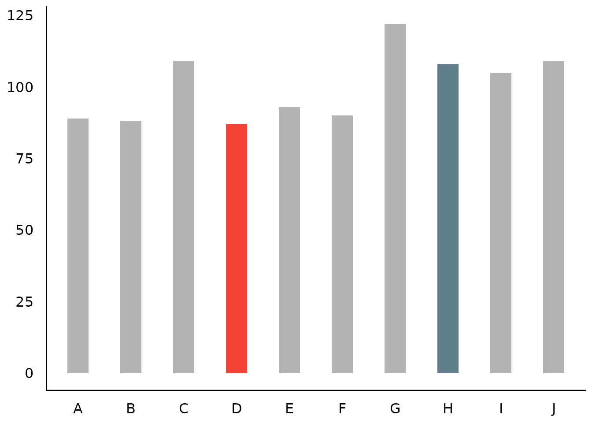

# Plotting Functions for the 'datawizard' Package

This vignette can be referred to by citing the package:

``` r

citation("see")
#> To cite package 'see' in publications use:
#> 
#>   Lüdecke et al., (2021). see: An R Package for Visualizing Statistical
#>   Models. Journal of Open Source Software, 6(64), 3393.
#>   https://doi.org/10.21105/joss.03393
#> 
#> A BibTeX entry for LaTeX users is
#> 
#>   @Article{,
#>     title = {{see}: An {R} Package for Visualizing Statistical Models},
#>     author = {Daniel Lüdecke and Indrajeet Patil and Mattan S. Ben-Shachar and Brenton M. Wiernik and Philip Waggoner and Dominique Makowski},
#>     journal = {Journal of Open Source Software},
#>     year = {2021},
#>     volume = {6},
#>     number = {64},
#>     pages = {3393},
#>     doi = {10.21105/joss.03393},
#>   }
```

## Introduction

*datawizard* is a lightweight package to easily manipulate, clean,
transform, and prepare your data for analysis. Most courses and
tutorials about statistical modeling assume that you are working with a
clean and tidy dataset. In practice, however, a major part of doing
statistical modeling is preparing your data-cleaning up values, creating
new columns, reshaping the dataset, or transforming some variables.
*datawizard* provides easy to use tools to perform these common,
critical, and sometimes tedious data preparation tasks.

For more, see: <https://easystats.github.io/datawizard/>

## Setup and Model Fitting

``` r

library(datawizard)
library(see)
library(ggplot2)
theme_set(theme_modern())
```

## Description of Variable Distributions

*([related function
documentation](https://easystats.github.io/datawizard/reference/describe_distribution.html))*

### Histogram for Numbers with Fractional Part

``` r

data(iris)
result <- describe_distribution(iris$Sepal.Length)
result
#> Mean |   SD |  IQR |        Range | Skewness | Kurtosis |   n | n_Missing
#> -------------------------------------------------------------------------
#> 5.84 | 0.83 | 1.30 | [4.30, 7.90] |     0.31 |    -0.55 | 150 |         0

plot(result)
```



### Add Range of Dispersion (SD or MAD)

``` r

plot(result, dispersion = TRUE)
```


### Thin Bars for Integer Values

``` r

set.seed(333)
x <- sample(1:100, 1000, replace = TRUE)
result <- describe_distribution(x)
result
#>  Mean |    SD |   IQR |          Range | Skewness | Kurtosis |    n | n_Missing
#> -------------------------------------------------------------------------------
#> 50.18 | 28.66 | 48.75 | [1.00, 100.00] |     0.02 |    -1.16 | 1000 |         0

plot(result)
```



### Use a Normal Curve instead of Ribbon

``` r

plot(result, dispersion = TRUE, dispersion_style = "curve")
```



### Highlighting Categories

``` r

set.seed(123)
result <- describe_distribution(sample(LETTERS[1:10], 1000, TRUE))

# highlight one category
plot(result, highlight = "D")
```


``` r


# highlight multiple categories
plot(result, highlight = c("D", "H"), size_bar = 0.4)
```



``` r


# own color scales - pass a named vector to 'scale_fill_manual()'
# the name of the non-highlighted color is "no_highlight".
plot(result, highlight = c("D", "H", "A"), size_bar = 0.4) +
  scale_fill_manual(values = c(D = "red", H = "green", A = "gold", no_highlight = "steelblue"))
```


