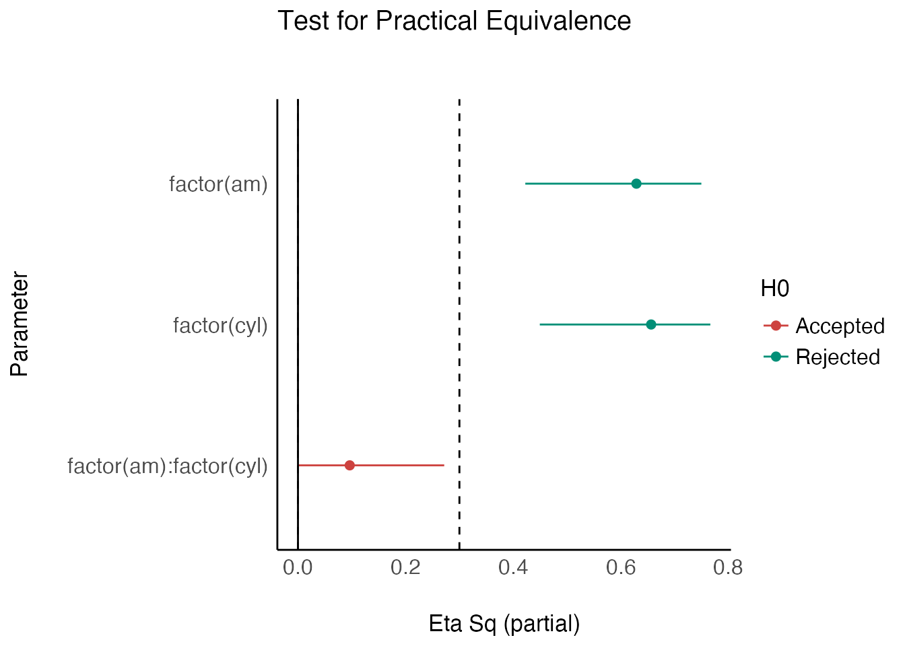
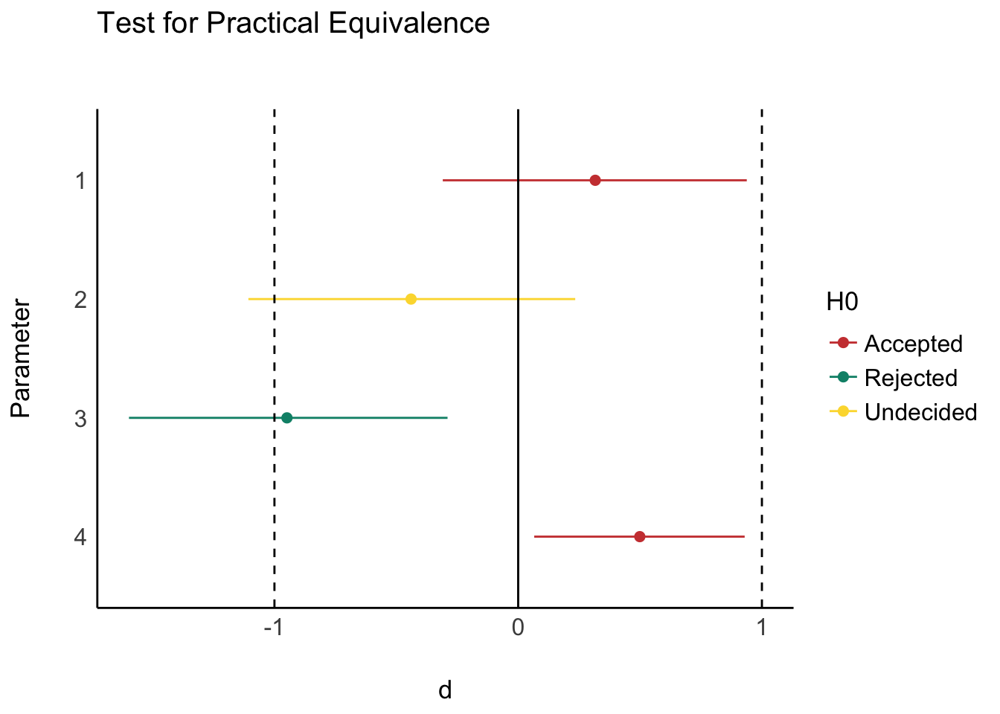
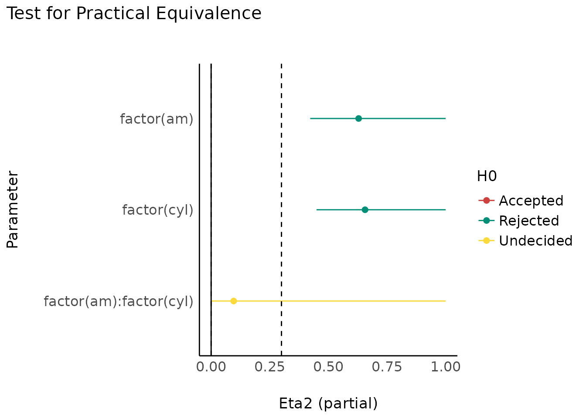
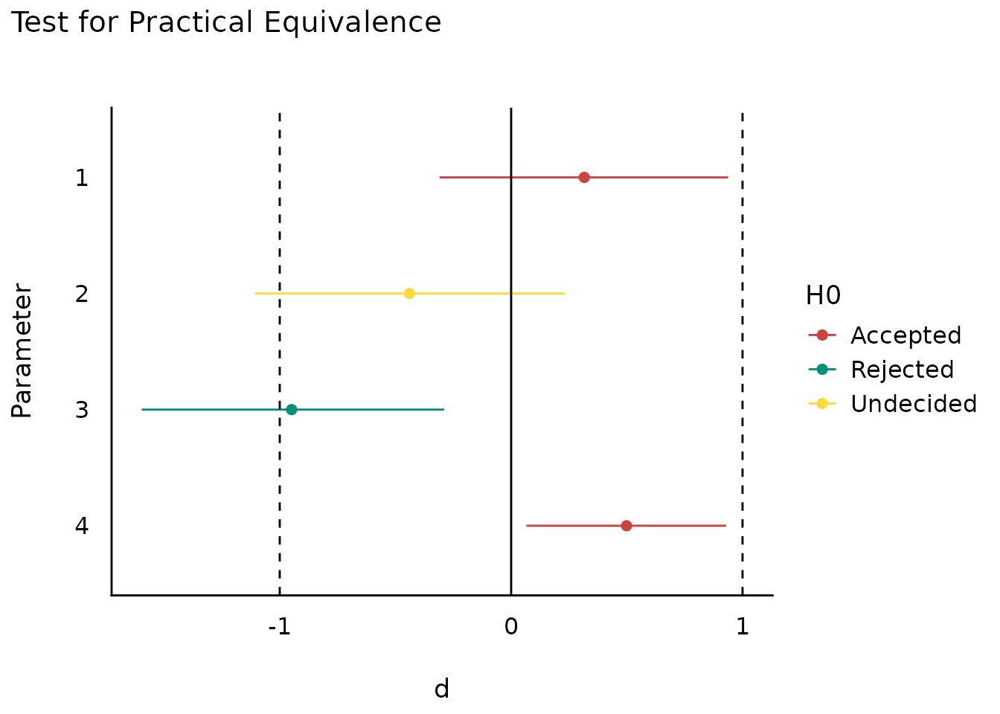

# Plotting Functions for the 'effectsize' Package

This vignette can be referred to by citing the package:

\
[`citation`](https://rdrr.io/r/utils/citation.html)`(``"see"``)`\
`#> To cite package 'see' in publications use:`\
`#> `\
`#>   Lüdecke et al., (2021). see: An R Package for Visualizing Statistical`\
`#>   Models. Journal of Open Source Software, 6(64), 3393.`\
`#>   https://doi.org/10.21105/joss.03393`\
`#> `\
`#> A BibTeX entry for LaTeX users is`\
`#> `\
`#>   @Article{,`\
`#>     title = {{see}: An {R} Package for Visualizing Statistical Models},`\
`#>     author = {Daniel Lüdecke and Indrajeet Patil and Mattan S. Ben-Shachar and Brenton M. Wiernik and Philip Waggoner and Dominique Makowski},`\
`#>     journal = {Journal of Open Source Software},`\
`#>     year = {2021},`\
`#>     volume = {6},`\
`#>     number = {64},`\
`#>     pages = {3393},`\
`#>     doi = {10.21105/joss.03393},`\
`#>   }`

## Introduction

The *effectsize* package in *easystats* provides utilities to work with
indices of effect size and standardized parameters, allowing computation
and conversion of indices such as Cohen’s *d*, *r*, odds-ratios, etc.

For more, see: <https://easystats.github.io/effectsize/>

## Setup

\
[`library`](https://rdrr.io/r/base/library.html)`(`[`effectsize`](https://easystats.github.io/effectsize/)`)`\
[`library`](https://rdrr.io/r/base/library.html)`(`[`see`](https://easystats.github.io/see/)`)`\
[`data`](https://rdrr.io/r/utils/data.html)`(``mtcars``)`\
[`data`](https://rdrr.io/r/utils/data.html)`(``iris``)`

## Effect size tables

*([related function
documentation](https://easystats.github.io/effectsize/reference/eta_squared.html))*

\
[`aov`](https://rdrr.io/r/stats/aov.html)`(``mpg`` ``~`` `[`factor`](https://rdrr.io/r/base/factor.html)`(``am``)`` ``*`` `[`factor`](https://rdrr.io/r/base/factor.html)`(``cyl``)``, data ``=`` ``mtcars``)`` ``|>`\
`  `[`eta_squared`](https://easystats.github.io/effectsize/reference/eta_squared.html)`(``)`` ``|>`\
`  `[`plot`](https://rdrr.io/r/graphics/plot.default.html)`(``)`

\
\
\
[`t_to_d`](https://easystats.github.io/effectsize/reference/t_to_r.html)`(``t ``=`` `[`c`](https://rdrr.io/r/base/c.html)`(``1``, ``-``1.3``, ``-``3``, ``2.3``)``, df_error ``=`` `[`c`](https://rdrr.io/r/base/c.html)`(``40``, ``35``, ``40``, ``85``)``)`` ``|>`\
`  `[`plot`](https://rdrr.io/r/graphics/plot.default.html)`(``)`

## Equivalence tests

*([related function
documentation](https://easystats.github.io/effectsize/reference/equivalence_test.effectsize_table.html))*

\
[`aov`](https://rdrr.io/r/stats/aov.html)`(``mpg`` ``~`` `[`factor`](https://rdrr.io/r/base/factor.html)`(``am``)`` ``*`` `[`factor`](https://rdrr.io/r/base/factor.html)`(``cyl``)``, data ``=`` ``mtcars``)`` ``|>`\
`  `[`eta_squared`](https://easystats.github.io/effectsize/reference/eta_squared.html)`(``)`` ``|>`\
`  `[`equivalence_test`](https://easystats.github.io/bayestestR/reference/equivalence_test.html)`(``range ``=`` ``0.3``)`` ``|>`\
`  `[`plot`](https://rdrr.io/r/graphics/plot.default.html)`(``)`

\
\
\
[`t_to_d`](https://easystats.github.io/effectsize/reference/t_to_r.html)`(``t ``=`` `[`c`](https://rdrr.io/r/base/c.html)`(``1``, ``-``1.3``, ``-``3``, ``2.3``)``, df_error ``=`` `[`c`](https://rdrr.io/r/base/c.html)`(``40``, ``35``, ``40``, ``85``)``)`` ``|>`\
`  `[`equivalence_test`](https://easystats.github.io/bayestestR/reference/equivalence_test.html)`(``range ``=`` ``1``)`` ``|>`\
`  `[`plot`](https://rdrr.io/r/graphics/plot.default.html)`(``)`

