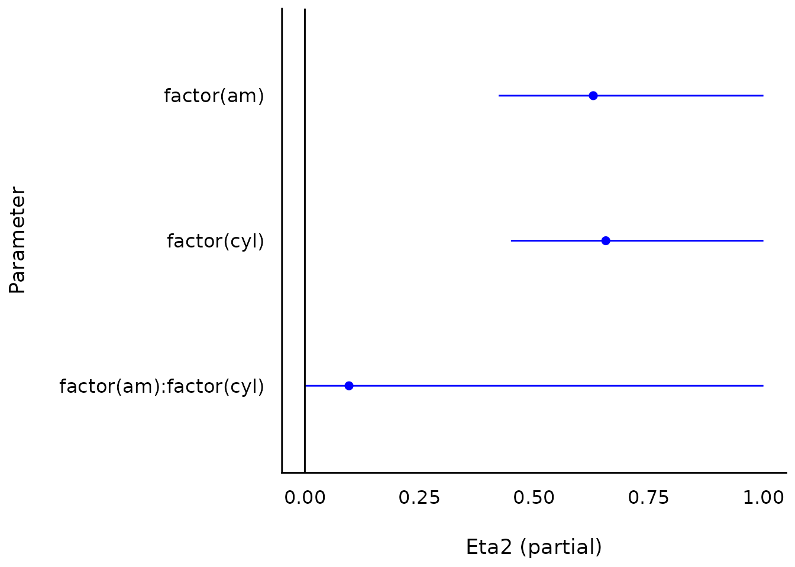
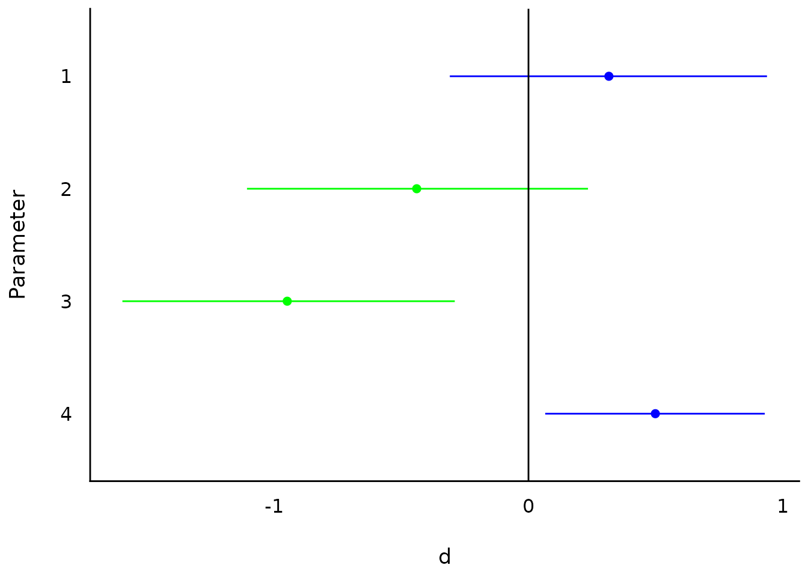

# Plotting Functions for the 'effectsize' Package

This vignette can be referred to by citing the package:

``` r

citation("see")
#> To cite package 'see' in publications use:
#> 
#>   Lüdecke et al., (2021). see: An R Package for Visualizing Statistical
#>   Models. Journal of Open Source Software, 6(64), 3393.
#>   https://doi.org/10.21105/joss.03393
#> 
#> A BibTeX entry for LaTeX users is
#> 
#>   @Article{,
#>     title = {{see}: An {R} Package for Visualizing Statistical Models},
#>     author = {Daniel Lüdecke and Indrajeet Patil and Mattan S. Ben-Shachar and Brenton M. Wiernik and Philip Waggoner and Dominique Makowski},
#>     journal = {Journal of Open Source Software},
#>     year = {2021},
#>     volume = {6},
#>     number = {64},
#>     pages = {3393},
#>     doi = {10.21105/joss.03393},
#>   }
```

## Introduction

The *effectsize* package in *easystats* provides utilities to work with
indices of effect size and standardized parameters, allowing computation
and conversion of indices such as Cohen’s *d*, *r*, odds-ratios, etc.

For more, see: <https://easystats.github.io/effectsize/>

## Setup

``` r

library(effectsize)
library(see)
data(mtcars)
data(iris)
```

## Effect size tables

*([related function
documentation](https://easystats.github.io/effectsize/reference/eta_squared.html))*

``` r

aov(mpg ~ factor(am) * factor(cyl), data = mtcars) |>
  eta_squared() |>
  plot()
```



``` r


t_to_d(t = c(1, -1.3, -3, 2.3), df_error = c(40, 35, 40, 85)) |>
  plot()
```



## Equivalence tests

*([related function
documentation](https://easystats.github.io/effectsize/reference/equivalence_test.effectsize_table.html))*

``` r

aov(mpg ~ factor(am) * factor(cyl), data = mtcars) |>
  eta_squared() |>
  equivalence_test(range = 0.3) |>
  plot()
```


``` r


t_to_d(t = c(1, -1.3, -3, 2.3), df_error = c(40, 35, 40, 85)) |>
  equivalence_test(range = 1) |>
  plot()
```


