# Plotting Functions for the 'modelbased' Package

## Introduction

*modelbased* is a package in *easystats* ecosystem to help with
model-based estimations, to easily compute of marginal means, contrast
analysis and model predictions.

For more, see: <https://easystats.github.io/modelbased/>

This vignette can be referred to by citing the package:

[`citation`](https://rdrr.io/r/utils/citation.html)`(``"see"``)`` ``#> To cite package 'see' in publications use:`` ``#> `` ``#> Lüdecke et al., (2021). see: An R Package for Visualizing Statistical`` ``#> Models. Journal of Open Source Software, 6(64), 3393.`` ``#> https://doi.org/10.21105/joss.03393`` ``#> `` ``#> A BibTeX entry for LaTeX users is`` ``#> `` ``#> @Article{,`` ``#> title = {{see}: An {R} Package for Visualizing Statistical Models},`` ``#> author = {Daniel Lüdecke and Indrajeet Patil and Mattan S. Ben-Shachar and Brenton M. Wiernik and Philip Waggoner and Dominique Makowski},`` ``#> journal = {Journal of Open Source Software},`` ``#> year = {2021},`` ``#> volume = {6},`` ``#> number = {64},`` ``#> pages = {3393},`` ``#> doi = {10.21105/joss.03393},`` ``#> }`

Let’s first load all the needed libraries and set a common ggplot theme
for all plots:

[`library`](https://rdrr.io/r/base/library.html)`(`[`modelbased`](https://easystats.github.io/modelbased/)`)`` `[`library`](https://rdrr.io/r/base/library.html)`(`[`rstanarm`](https://mc-stan.org/rstanarm/)`)`` `[`library`](https://rdrr.io/r/base/library.html)`(`[`ggplot2`](https://ggplot2.tidyverse.org)`)`` `[`library`](https://rdrr.io/r/base/library.html)`(`[`see`](https://easystats.github.io/see/)`)`` `[`library`](https://rdrr.io/r/base/library.html)`(`[`lme4`](https://github.com/lme4/lme4/)`)`` `[`library`](https://rdrr.io/r/base/library.html)`(``mgcv``)`` `` `[`theme_set`](https://ggplot2.tidyverse.org/reference/get_theme.html)`(`[`theme_modern`](https://easystats.github.io/see/reference/theme_modern.md)`(``)``)`

## Pairwise Contrasts

`model`` ``<-`` `[`stan_glm`](https://mc-stan.org/rstanarm/reference/stan_glm.html)`(``Sepal.Width`` ``~`` ``Species``, data ``=`` ``iris``, refresh ``=`` ``0``)`` `` ``contrasts`` ``<-`` `[`estimate_contrasts`](https://easystats.github.io/modelbased/reference/estimate_contrasts.html)`(``model``)`` ``means`` ``<-`` `[`estimate_means`](https://easystats.github.io/modelbased/reference/estimate_means.html)`(``model``)`` `` `[`plot`](https://rdrr.io/r/graphics/plot.default.html)`(``contrasts``, ``means``)`

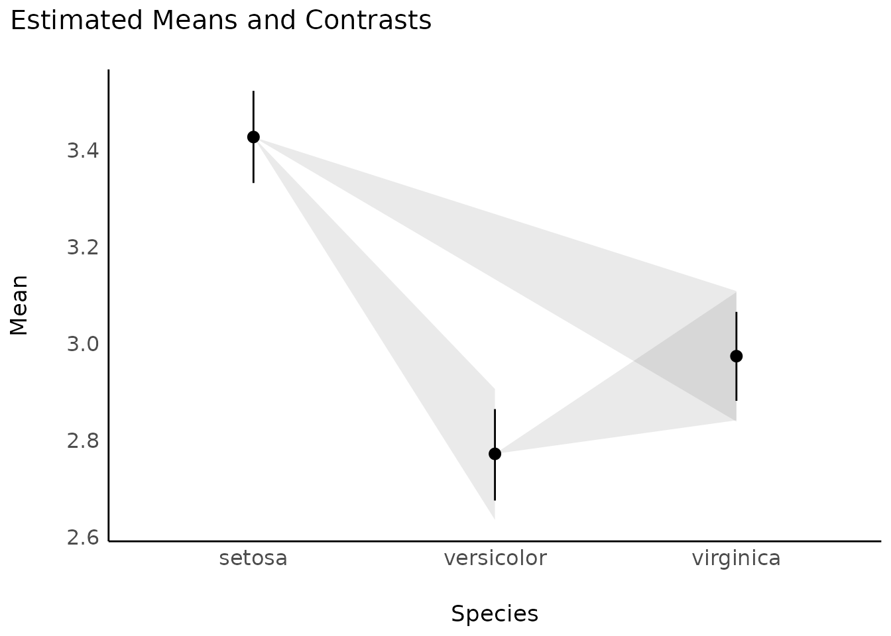

## Estimate model-based predictions for the response

### Interactions, with continuous interaction terms

`model`` ``<-`` `[`lm`](https://rdrr.io/r/stats/lm.html)`(``mpg`` ``~`` ``wt`` ``*`` ``gear``, data ``=`` ``mtcars``)`` `` ``result`` ``<-`` `[`estimate_expectation`](https://easystats.github.io/modelbased/reference/estimate_expectation.html)`(``model``, data ``=`` ``"grid"``)`` `[`plot`](https://rdrr.io/r/graphics/plot.default.html)`(``result``)`

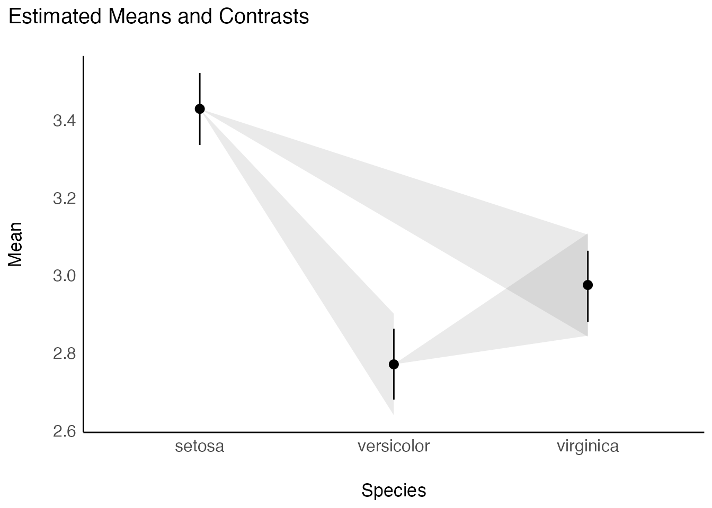

### Interactions, with continuous interaction terms

`mtcars``$``gear`` ``<-`` `[`as.factor`](https://rdrr.io/r/base/factor.html)`(``mtcars``$``gear``)`` ``model`` ``<-`` `[`lm`](https://rdrr.io/r/stats/lm.html)`(``mpg`` ``~`` ``wt`` ``*`` ``gear``, data ``=`` ``mtcars``)`` `` ``result`` ``<-`` `[`estimate_expectation`](https://easystats.github.io/modelbased/reference/estimate_expectation.html)`(``model``, data ``=`` ``"grid"``)`` `[`plot`](https://rdrr.io/r/graphics/plot.default.html)`(``result``)`

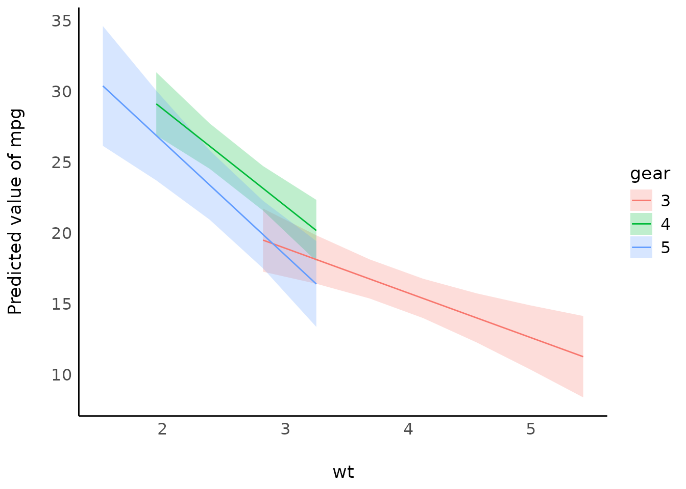

`# full range`` ``result`` ``<-`` `[`estimate_relation`](https://easystats.github.io/modelbased/reference/estimate_expectation.html)`(``model``, by ``=`` `[`c`](https://rdrr.io/r/base/c.html)`(``"wt"``, ``"gear"``)``, preserve_range ``=`` ``FALSE``)`` `[`plot`](https://rdrr.io/r/graphics/plot.default.html)`(``result``)`

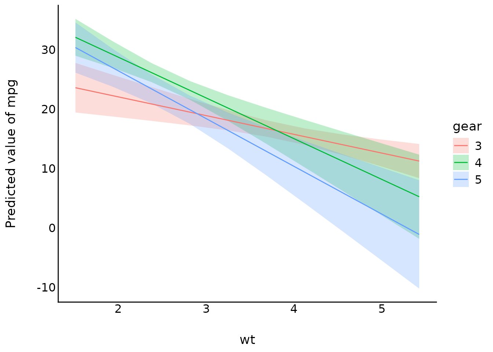

### Interactions between two continuous variables

`model`` ``<-`` `[`lm`](https://rdrr.io/r/stats/lm.html)`(``mpg`` ``~`` ``hp`` ``*`` ``wt``, data ``=`` ``mtcars``)`` `` ``slopes`` ``<-`` `[`estimate_slopes`](https://easystats.github.io/modelbased/reference/estimate_slopes.html)`(``model``, trend ``=`` ``"hp"``, by ``=`` ``"wt"``)`` `` `[`plot`](https://rdrr.io/r/graphics/plot.default.html)`(``slopes``)`

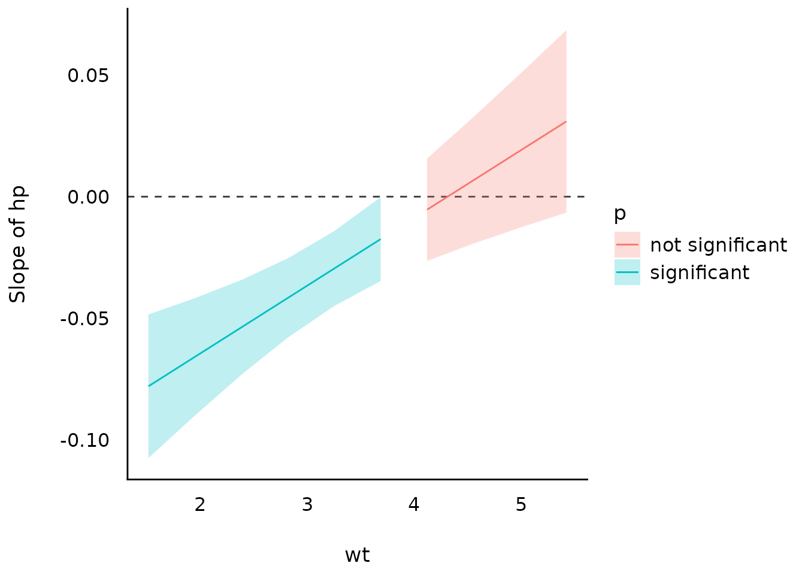

## Group-level scores of mixed models

`model`` ``<-`` `[`lmer`](https://rdrr.io/pkg/lme4/man/lmer.html)`(``Reaction`` ``~`` ``Days`` ``+`` ``(``1`` ``|`` ``Subject``)``, data ``=`` ``sleepstudy``)`` `` ``result`` ``<-`` `[`estimate_grouplevel`](https://easystats.github.io/modelbased/reference/estimate_grouplevel.html)`(``model``)`` `[`plot`](https://rdrr.io/r/graphics/plot.default.html)`(``result``)`

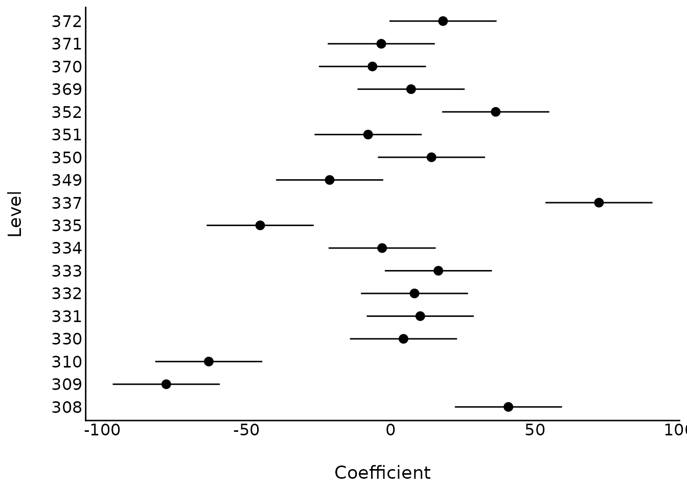

`model`` ``<-`` `[`lmer`](https://rdrr.io/pkg/lme4/man/lmer.html)`(``Reaction`` ``~`` ``Days`` ``+`` ``(``1`` ``+`` ``Days`` ``|`` ``Subject``)``, data ``=`` ``sleepstudy``)`` `` ``result`` ``<-`` `[`estimate_grouplevel`](https://easystats.github.io/modelbased/reference/estimate_grouplevel.html)`(``model``)`` `[`plot`](https://rdrr.io/r/graphics/plot.default.html)`(``result``)`

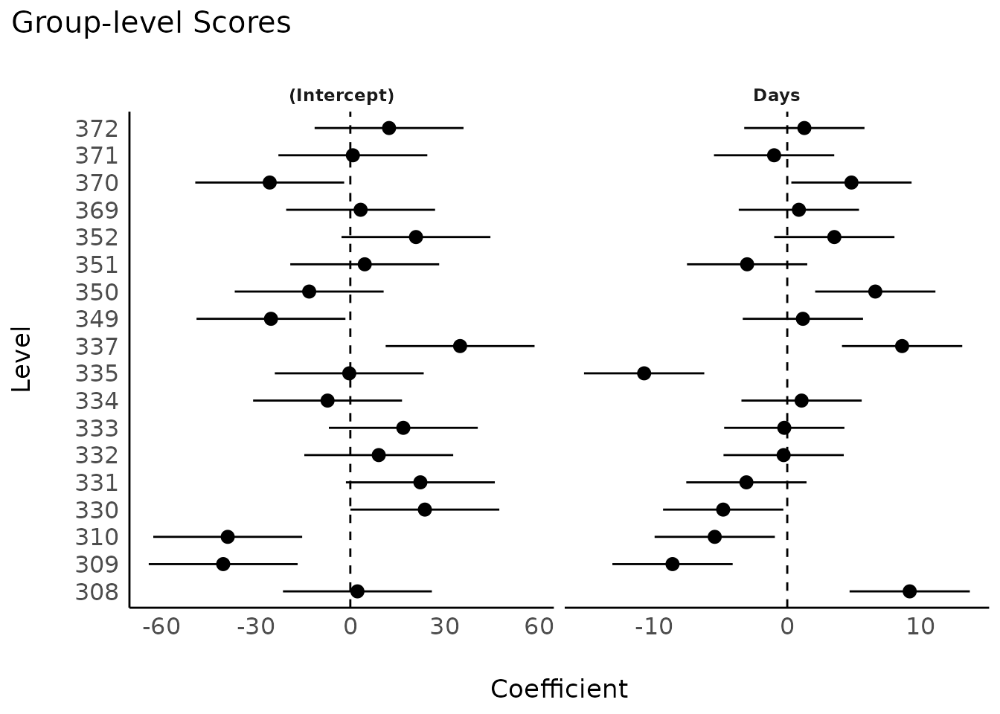

## Estimate slopes

`model`` ``<-`` `[`lm`](https://rdrr.io/r/stats/lm.html)`(``Sepal.Width`` ``~`` ``Species`` ``*`` ``Petal.Length``, data ``=`` ``iris``)`` `` ``result`` ``<-`` `[`estimate_slopes`](https://easystats.github.io/modelbased/reference/estimate_slopes.html)`(``model``, trend ``=`` ``"Petal.Length"``, by ``=`` ``"Species"``)`` `[`plot`](https://rdrr.io/r/graphics/plot.default.html)`(``result``)`

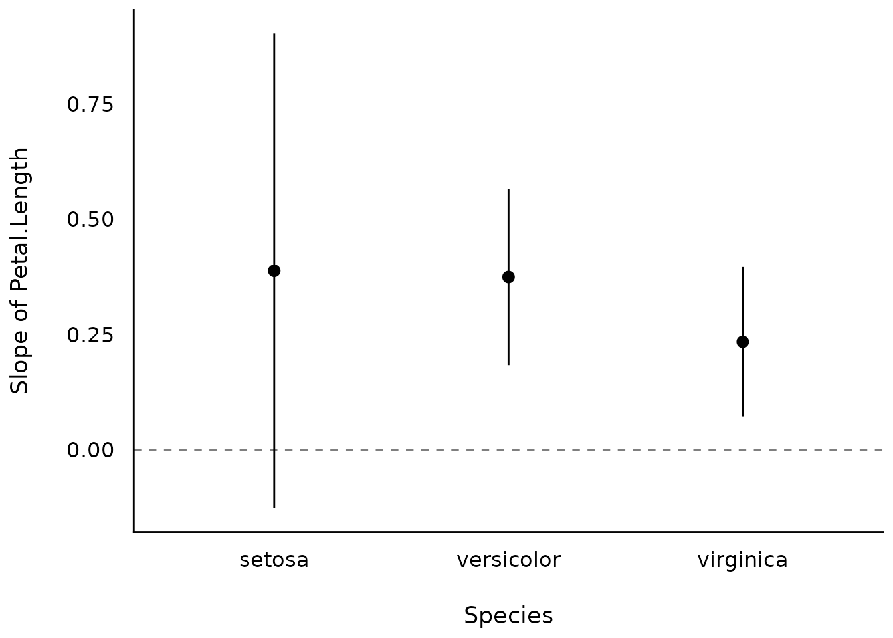

`model`` ``<-`` `[`lm`](https://rdrr.io/r/stats/lm.html)`(``Petal.Length`` ``~`` ``Species`` ``*`` `[`poly`](https://rdrr.io/r/stats/poly.html)`(``Sepal.Width``, ``3``)``, data ``=`` ``iris``)`` `` ``result`` ``<-`` `[`estimate_slopes`](https://easystats.github.io/modelbased/reference/estimate_slopes.html)`(``model``, by ``=`` `[`c`](https://rdrr.io/r/base/c.html)`(``"Sepal.Width"``, ``"Species"``)``)`` `[`plot`](https://rdrr.io/r/graphics/plot.default.html)`(``result``)`

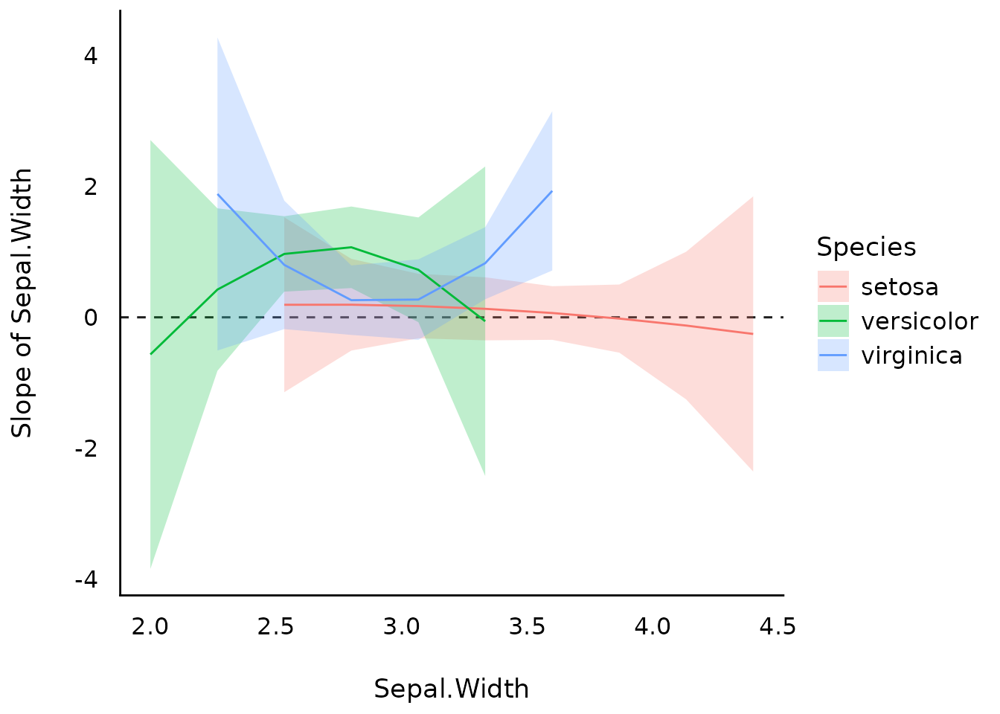

## Estimate derivatives

Linear-model

`model_lm`` ``<-`` `[`lm`](https://rdrr.io/r/stats/lm.html)`(``mpg`` ``~`` ``wt``, data ``=`` ``mtcars``)`` `` `[`plot`](https://rdrr.io/r/graphics/plot.default.html)`(`[`estimate_relation`](https://easystats.github.io/modelbased/reference/estimate_expectation.html)`(``model_lm``)``)`

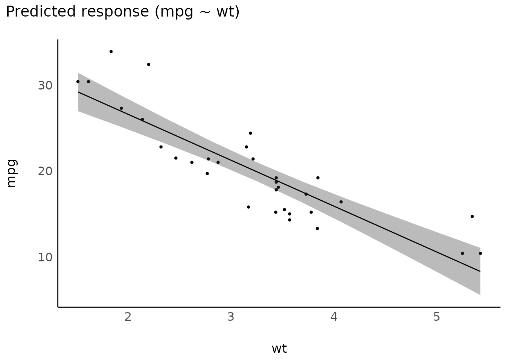

Non-linear model

`# Fit a non-linear General Additive Model (GAM)`` ``model`` ``<-`` ``mgcv``::`[`gam`](https://rdrr.io/pkg/mgcv/man/gam.html)`(``Sepal.Width`` ``~`` `[`s`](https://rdrr.io/pkg/mgcv/man/s.html)`(``Petal.Length``)``, data ``=`` ``iris``)`` `` ``# 1. Compute derivatives`` ``deriv`` ``<-`` `[`estimate_slopes`](https://easystats.github.io/modelbased/reference/estimate_slopes.html)`(``model``,`` `` trend ``=`` ``"Petal.Length"``,`` `` by ``=`` ``"Petal.Length"``,`` `` length ``=`` ``100`` ``)`` `` ``# 2. Visualize predictions and derivative`` `[`plots`](https://easystats.github.io/see/reference/plots.md)`(`` `` `[`plot`](https://rdrr.io/r/graphics/plot.default.html)`(`[`estimate_relation`](https://easystats.github.io/modelbased/reference/estimate_expectation.html)`(``model``)``)``,`` `` `[`plot`](https://rdrr.io/r/graphics/plot.default.html)`(``deriv``)``,`` `` n_rows ``=`` ``2`` ``)`

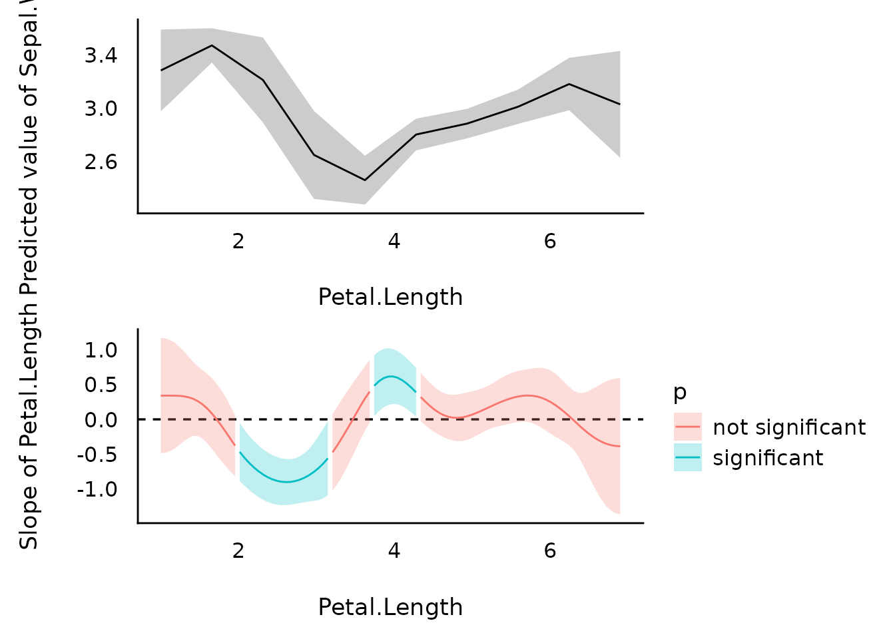
