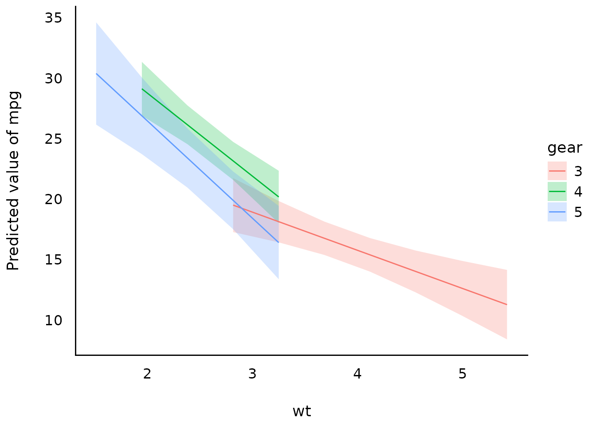
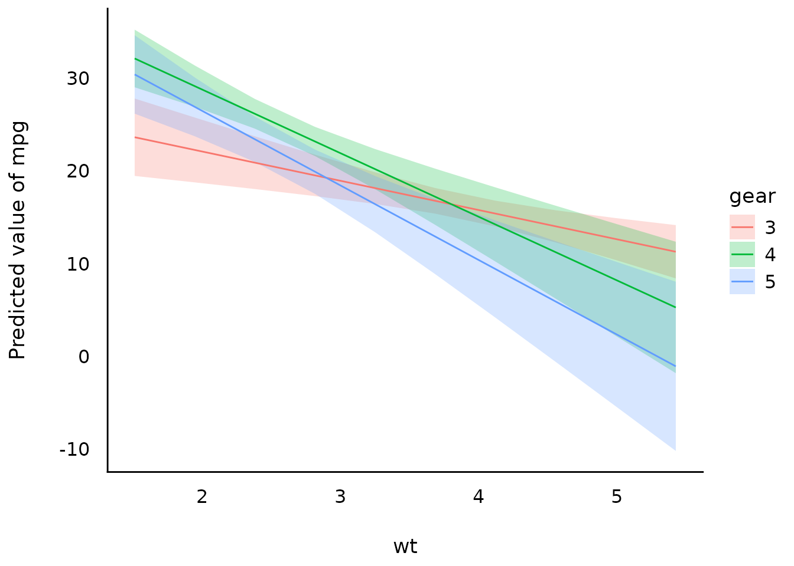
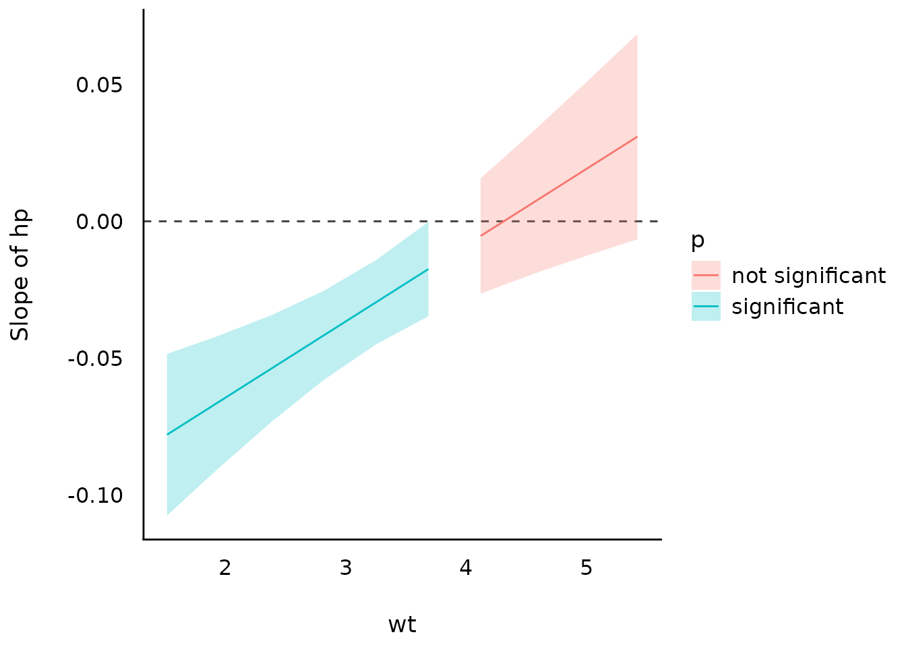
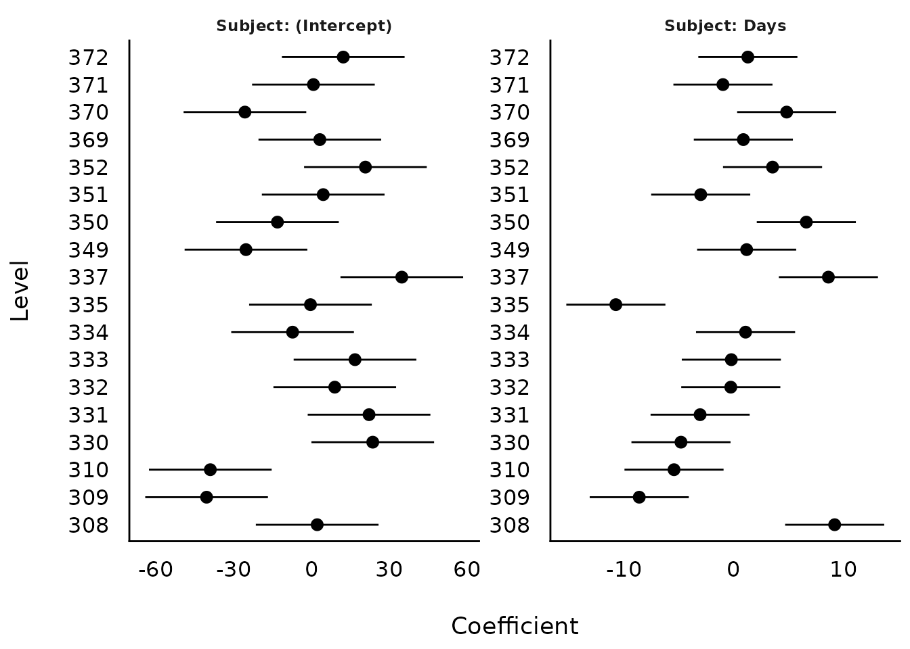
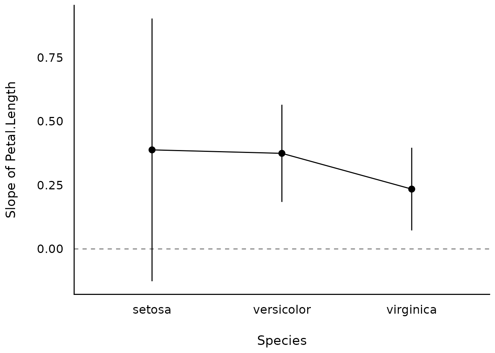

# Plotting Functions for the 'modelbased' Package

## Introduction

*modelbased* is a package in *easystats* ecosystem to help with
model-based estimations, to easily compute of marginal means, contrast
analysis and model predictions.

For more, see: <https://easystats.github.io/modelbased/>

This vignette can be referred to by citing the package:

``` r

citation("see")
#> To cite package 'see' in publications use:
#> 
#>   Lüdecke et al., (2021). see: An R Package for Visualizing Statistical
#>   Models. Journal of Open Source Software, 6(64), 3393.
#>   https://doi.org/10.21105/joss.03393
#> 
#> A BibTeX entry for LaTeX users is
#> 
#>   @Article{,
#>     title = {{see}: An {R} Package for Visualizing Statistical Models},
#>     author = {Daniel Lüdecke and Indrajeet Patil and Mattan S. Ben-Shachar and Brenton M. Wiernik and Philip Waggoner and Dominique Makowski},
#>     journal = {Journal of Open Source Software},
#>     year = {2021},
#>     volume = {6},
#>     number = {64},
#>     pages = {3393},
#>     doi = {10.21105/joss.03393},
#>   }
```

Let’s first load all the needed libraries and set a common ggplot theme
for all plots:

``` r

library(modelbased)
library(rstanarm)
library(ggplot2)
library(see)
library(lme4)
library(mgcv)

theme_set(theme_modern())
```

## Pairwise Contrasts

``` r

model <- stan_glm(Sepal.Width ~ Species, data = iris, refresh = 0)

contrasts <- estimate_contrasts(model)
means <- estimate_means(model)

plot(contrasts, means)
```


## Estimate model-based predictions for the response

### Interactions, with continuous interaction terms

``` r

model <- lm(mpg ~ wt * gear, data = mtcars)

result <- estimate_expectation(model, data = "grid")
plot(result)
```


### Interactions, with continuous interaction terms

``` r

mtcars$gear <- as.factor(mtcars$gear)
model <- lm(mpg ~ wt * gear, data = mtcars)

result <- estimate_expectation(model, data = "grid")
plot(result)
```



``` r

# full range
result <- estimate_relation(model, by = c("wt", "gear"), preserve_range = FALSE)
plot(result)
```



### Interactions between two continuous variables

``` r

model <- lm(mpg ~ hp * wt, data = mtcars)

slopes <- estimate_slopes(model, trend = "hp", by = "wt")

plot(slopes)
```



## Group-level scores of mixed models

``` r

model <- lmer(Reaction ~ Days + (1 | Subject), data = sleepstudy)

result <- estimate_grouplevel(model)
plot(result)
```


``` r

model <- lmer(Reaction ~ Days + (1 + Days | Subject), data = sleepstudy)

result <- estimate_grouplevel(model)
plot(result)
```



## Estimate slopes

``` r

model <- lm(Sepal.Width ~ Species * Petal.Length, data = iris)

result <- estimate_slopes(model, trend = "Petal.Length", by = "Species")
plot(result)
```



``` r

model <- lm(Petal.Length ~ Species * poly(Sepal.Width, 3), data = iris)

result <- estimate_slopes(model, by = c("Sepal.Width", "Species"))
plot(result)
```


## Estimate derivatives

Linear-model

``` r

model_lm <- lm(mpg ~ wt, data = mtcars)

plot(estimate_relation(model_lm))
```


Non-linear model

``` r

# Fit a non-linear General Additive Model (GAM)
model <- mgcv::gam(Sepal.Width ~ s(Petal.Length), data = iris)

# 1. Compute derivatives
deriv <- estimate_slopes(model,
  trend = "Petal.Length",
  by = "Petal.Length",
  length = 100
)

# 2. Visualize predictions and derivative
plots(
  plot(estimate_relation(model)),
  plot(deriv),
  n_rows = 2
)
```


