# Plotting Functions for the 'parameters' Package

This vignette can be referred to by citing the package:

\
[`citation`](https://rdrr.io/r/utils/citation.html)`(``"see"``)`\
`#> To cite package 'see' in publications use:`\
`#> `\
`#>   Lüdecke et al., (2021). see: An R Package for Visualizing Statistical`\
`#>   Models. Journal of Open Source Software, 6(64), 3393.`\
`#>   https://doi.org/10.21105/joss.03393`\
`#> `\
`#> A BibTeX entry for LaTeX users is`\
`#> `\
`#>   @Article{,`\
`#>     title = {{see}: An {R} Package for Visualizing Statistical Models},`\
`#>     author = {Daniel Lüdecke and Indrajeet Patil and Mattan S. Ben-Shachar and Brenton M. Wiernik and Philip Waggoner and Dominique Makowski},`\
`#>     journal = {Journal of Open Source Software},`\
`#>     year = {2021},`\
`#>     volume = {6},`\
`#>     number = {64},`\
`#>     pages = {3393},`\
`#>     doi = {10.21105/joss.03393},`\
`#>   }`

## Introduction

*parameters*’ primary goal is to provide utilities for processing the
parameters of various statistical models (see
[here](https://easystats.github.io/insight/) for a list of supported
models). Beyond computing *p-values*, *CIs*, *Bayesian indices* and
other measures for a wide variety of models, this package implements
features like *bootstrapping* of parameters and models, *feature
reduction* (feature extraction and variable selection), or tools for
data reduction like functions to perform cluster, factor or principal
component analysis.

Another important goal of the **parameters** package is to facilitate
and streamline the process of reporting results of statistical models,
which includes the easy and intuitive calculation of standardized
estimates or robust standard errors and *p*-values. **parameters**
therefor offers a simple and unified syntax to process a large variety
of (model) objects from many different packages.

For more, see: <https://easystats.github.io/parameters/>

## Setup and Model Fitting

\
[`library`](https://rdrr.io/r/base/library.html)`(`[`parameters`](https://easystats.github.io/parameters/)`)`\
[`library`](https://rdrr.io/r/base/library.html)`(`[`effectsize`](https://easystats.github.io/effectsize/)`)`\
[`library`](https://rdrr.io/r/base/library.html)`(`[`insight`](https://easystats.github.io/insight/)`)`\
[`library`](https://rdrr.io/r/base/library.html)`(`[`see`](https://easystats.github.io/see/)`)`\
[`library`](https://rdrr.io/r/base/library.html)`(`[`glmmTMB`](https://github.com/glmmTMB/glmmTMB)`)`\
[`library`](https://rdrr.io/r/base/library.html)`(`[`lme4`](https://github.com/lme4/lme4/)`)`\
[`library`](https://rdrr.io/r/base/library.html)`(`[`lavaan`](https://lavaan.ugent.be)`)`\
[`library`](https://rdrr.io/r/base/library.html)`(`[`metafor`](https://www.metafor-project.org)`)`\
[`library`](https://rdrr.io/r/base/library.html)`(`[`ggplot2`](https://ggplot2.tidyverse.org)`)`\
[`data`](https://rdrr.io/r/utils/data.html)`(``"Salamanders"``)`\
[`data`](https://rdrr.io/r/utils/data.html)`(``"iris"``)`\
[`data`](https://rdrr.io/r/utils/data.html)`(``"sleepstudy"``)`\
[`data`](https://rdrr.io/r/utils/data.html)`(``"qol_cancer"``)`\
\
[`set.seed`](https://rdrr.io/r/base/Random.html)`(``12345``)`\
`sleepstudy``$``grp`` ``<-`` `[`sample.int`](https://rdrr.io/r/base/sample.html)`(``5``, size ``=`` ``180``, replace ``=`` ``TRUE``)`\
\
[`theme_set`](https://ggplot2.tidyverse.org/reference/get_theme.html)`(`[`theme_modern`](https://easystats.github.io/see/reference/theme_modern.md)`(``)``)`

\
`# fit three example model`\
`model1`` ``<-`` `[`glmmTMB`](https://rdrr.io/pkg/glmmTMB/man/glmmTMB.html)`(`\
`  ``count`` ``~`` ``spp`` ``+`` ``mined`` ``+`` ``(``1`` ``|`` ``site``)``,`\
`  ziformula ``=`` ``~``mined``,`\
`  family ``=`` `[`poisson`](https://rdrr.io/r/stats/family.html)`(``)``,`\
`  data ``=`` ``Salamanders`\
`)`\
[`model_parameters`](https://easystats.github.io/parameters/reference/model_parameters.html)`(``model1``, effects ``=`` ``"fixed"``)`\
`#> # Fixed Effects`\
`#> `\
`#> Parameter   | Log-Mean |   SE |         95% CI |     z |      p`\
`#> ---------------------------------------------------------------`\
`#> (Intercept) |    -0.36 | 0.28 | [-0.90,  0.18] | -1.30 | 0.194 `\
`#> spp [PR]    |    -1.27 | 0.24 | [-1.74, -0.80] | -5.27 | < .001`\
`#> spp [DM]    |     0.27 | 0.14 | [ 0.00,  0.54] |  1.95 | 0.051 `\
`#> spp [EC-A]  |    -0.57 | 0.21 | [-0.97, -0.16] | -2.75 | 0.006 `\
`#> spp [EC-L]  |     0.67 | 0.13 | [ 0.41,  0.92] |  5.20 | < .001`\
`#> spp [DES-L] |     0.63 | 0.13 | [ 0.38,  0.87] |  4.96 | < .001`\
`#> spp [DF]    |     0.12 | 0.15 | [-0.17,  0.40] |  0.78 | 0.435 `\
`#> mined [no]  |     1.27 | 0.27 | [ 0.74,  1.80] |  4.72 | < .001`\
`#> `\
`#> # Zero-Inflation`\
`#> `\
`#> Parameter   | Log-Odds |   SE |         95% CI |     z |      p`\
`#> ---------------------------------------------------------------`\
`#> (Intercept) |     0.79 | 0.27 | [ 0.26,  1.32] |  2.90 | 0.004 `\
`#> mined [no]  |    -1.84 | 0.31 | [-2.46, -1.23] | -5.87 | < .001`\
\
\
`model2`` ``<-`` `[`lm`](https://rdrr.io/r/stats/lm.html)`(``Sepal.Length`` ``~`` ``Species`` ``*`` ``splines``::`[`bs`](https://rdrr.io/r/splines/bs.html)`(``Petal.Width``, degree ``=`` ``2``)``, data ``=`` ``iris``)`\
[`model_parameters`](https://easystats.github.io/parameters/reference/model_parameters.html)`(``model2``, effects ``=`` ``"fixed"``)`\
`#> Parameter                | Coefficient |    SE |          95% CI | t(141) |      p`\
`#> ----------------------------------------------------------------------------------`\
`#> (Intercept)              |        4.79 |  0.17 | [  4.45,  5.13] |  27.66 | < .001`\
`#> Species [versicolor]     |       -3.73 |  2.14 | [ -7.96,  0.50] |  -1.74 | 0.083 `\
`#> Species [virginica]      |       -2.67 |  2.88 | [ -8.36,  3.03] |  -0.93 | 0.356 `\
`#> Petal Width [1st degree] |        2.53 |  2.36 | [ -2.13,  7.20] |   1.07 | 0.285 `\
`#> Petal Width [2nd degree] |      -11.18 | 21.14 | [-52.98, 30.62] |  -0.53 | 0.598 `\
`#> Petal Width [1st degree] |        5.48 |  4.84 | [ -4.09, 15.05] |   1.13 | 0.260 `\
`#> Petal Width [1st degree] |        2.37 |  4.35 | [ -6.22, 10.96] |   0.54 | 0.587 `\
`#> Petal Width [2nd degree] |       14.84 | 21.16 | [-26.99, 56.68] |   0.70 | 0.484 `\
`#> Petal Width [2nd degree] |       15.81 | 21.32 | [-26.35, 57.96] |   0.74 | 0.460`\
\
\
`model3`` ``<-`` `[`lmer`](https://rdrr.io/pkg/lme4/man/lmer.html)`(`\
`  ``Reaction`` ``~`` ``Days`` ``+`` ``(``1`` ``|`` ``grp``)`` ``+`` ``(``1`` ``|`` ``Subject``)``,`\
`  data ``=`` ``sleepstudy`\
`)`\
\
`model4`` ``<-`` `[`lm`](https://rdrr.io/r/stats/lm.html)`(``QoL`` ``~`` ``time`` ``+`` ``age`` ``+`` ``education``, data ``=`` ``qol_cancer``)`

## Model Parameters

*([related function
documentation](https://easystats.github.io/parameters/reference/model_parameters.html))*

The [`plot()`](https://rdrr.io/r/graphics/plot.default.html)-method for
[`model_parameters()`](https://easystats.github.io/parameters/reference/model_parameters.html)
creates a so called “forest plot”. In case of models with multiple
components, parameters are separated into facets by model component.

\
`result`` ``<-`` `[`model_parameters`](https://easystats.github.io/parameters/reference/model_parameters.html)`(``model1``, effects ``=`` ``"fixed"``)`\
\
[`plot`](https://rdrr.io/r/graphics/plot.default.html)`(``result``)`

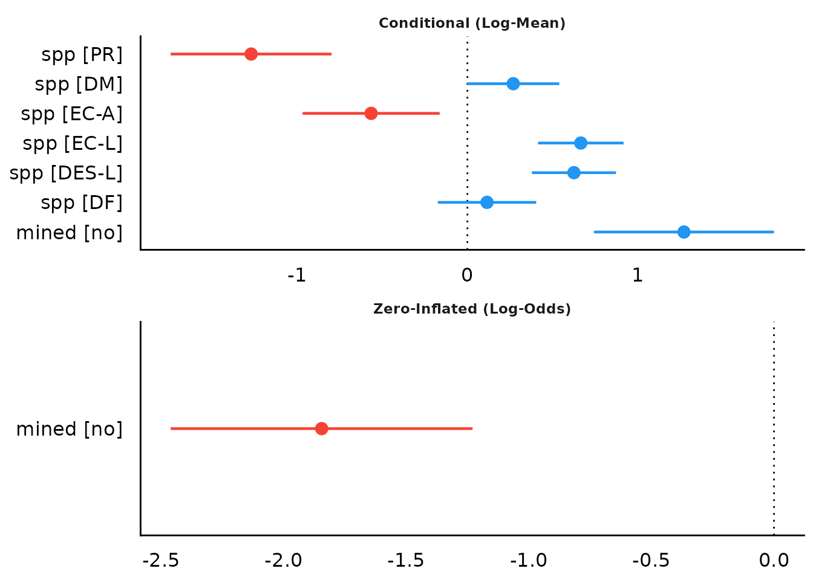

When `show_labels` is `TRUE`, coefficients and confidence intervals are
added to the plot. Adjust the text size with `size_text`.

\
[`plot`](https://rdrr.io/r/graphics/plot.default.html)`(``result``, show_labels ``=`` ``TRUE``, size_text ``=`` ``4``)`

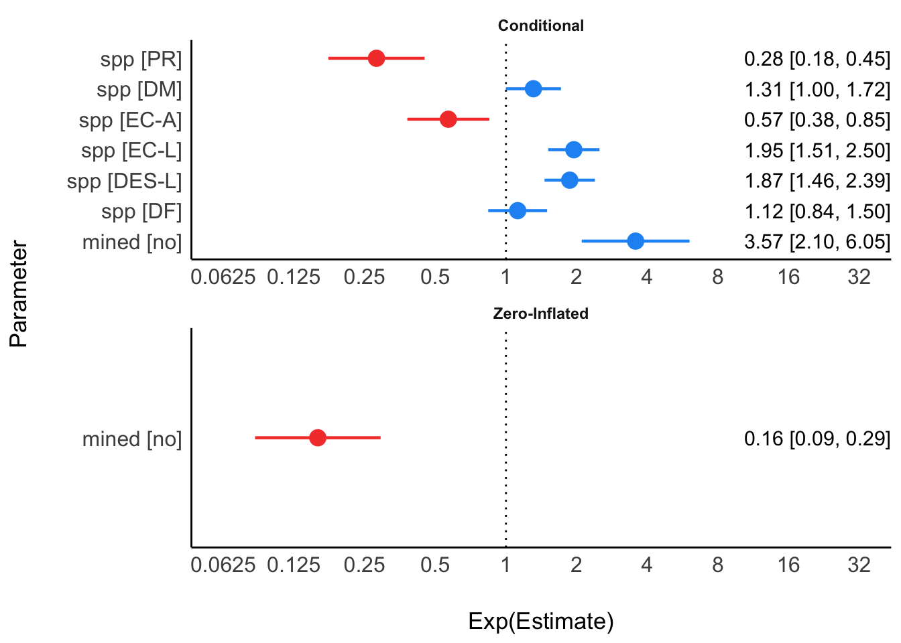

This also works for exponentiated coefficients.

\
`result`` ``<-`` `[`model_parameters`](https://easystats.github.io/parameters/reference/model_parameters.html)`(``model1``, exponentiate ``=`` ``TRUE``, effects ``=`` ``"fixed"``)`\
[`plot`](https://rdrr.io/r/graphics/plot.default.html)`(``result``, show_labels ``=`` ``TRUE``, size_text ``=`` ``4``)`

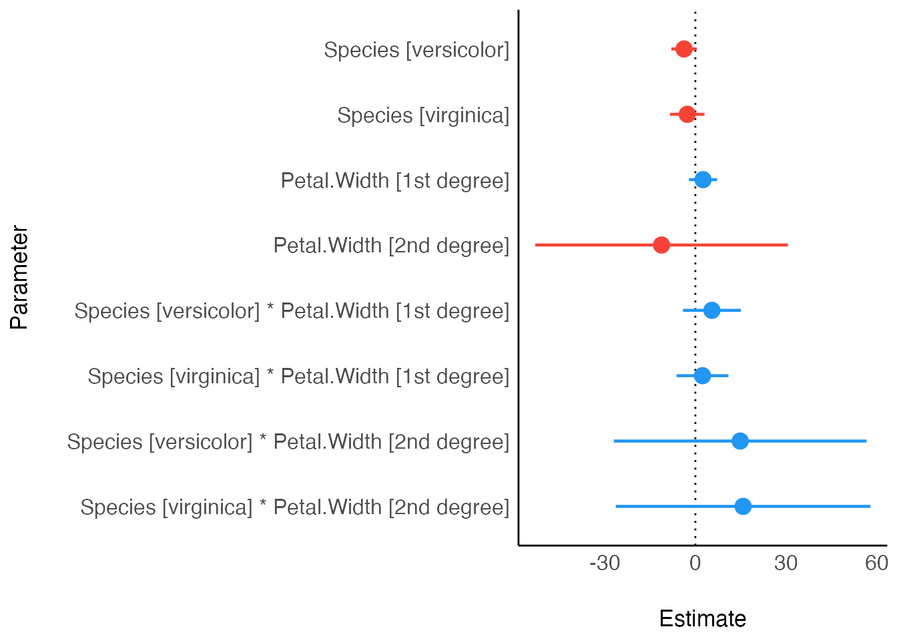

It is also possible to plot only the count-model component. This is done
in
[`model_parameters()`](https://easystats.github.io/parameters/reference/model_parameters.html)
via the `component` argument. In easystats-functions, the
count-component has the more generic name `"conditional"`.

\
`result`` ``<-`` `[`model_parameters`](https://easystats.github.io/parameters/reference/model_parameters.html)`(``model1``, exponentiate ``=`` ``TRUE``, component ``=`` ``"conditional"``)`\
[`plot`](https://rdrr.io/r/graphics/plot.default.html)`(``result``)`

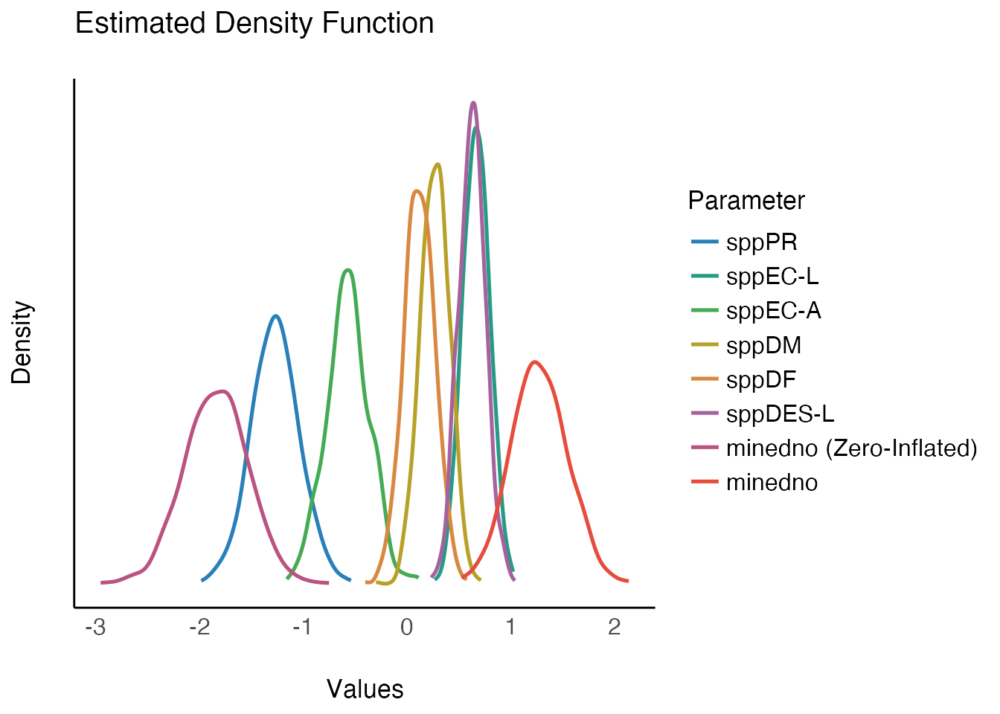

As compared to the classical
[`summary()`](https://rdrr.io/r/base/summary.html)-output,
[`model_parameters()`](https://easystats.github.io/parameters/reference/model_parameters.html),
and hence the
[`plot()`](https://rdrr.io/r/graphics/plot.default.html)-method, tries
to create human readable, prettier parameters names.

\
`result`` ``<-`` `[`model_parameters`](https://easystats.github.io/parameters/reference/model_parameters.html)`(``model2``)`\
\
[`plot`](https://rdrr.io/r/graphics/plot.default.html)`(``result``)`

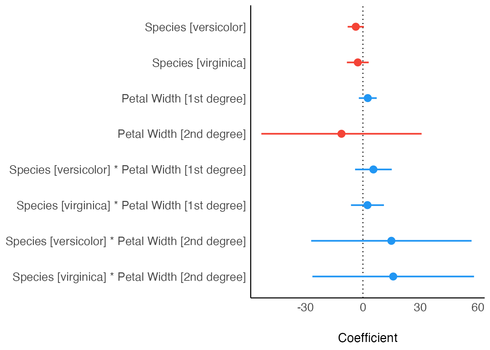

### Including group levels of random effects

\
`result`` ``<-`` `[`model_parameters`](https://easystats.github.io/parameters/reference/model_parameters.html)`(``model3``, group_level ``=`` ``TRUE``)`\
[`plot`](https://rdrr.io/r/graphics/plot.default.html)`(``result``)`

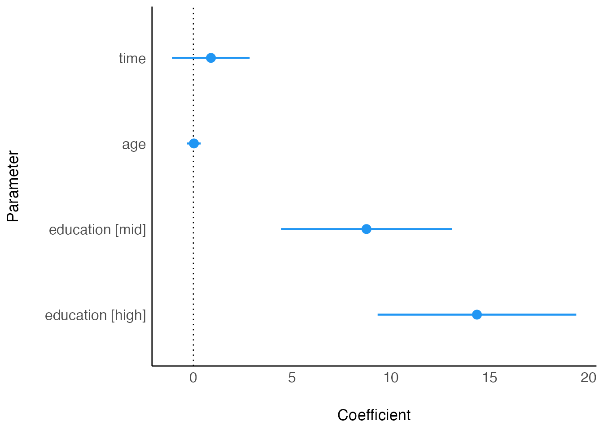

### Changing parameter names in the plot

By default,
[`model_parameters()`](https://easystats.github.io/parameters/reference/model_parameters.html)
returns a data frame, where the parameter names are found in the column
`Parameter`. These names are used by default in the generated plot:

\
[`plot`](https://rdrr.io/r/graphics/plot.default.html)`(`[`model_parameters`](https://easystats.github.io/parameters/reference/model_parameters.html)`(``model4``)``)`

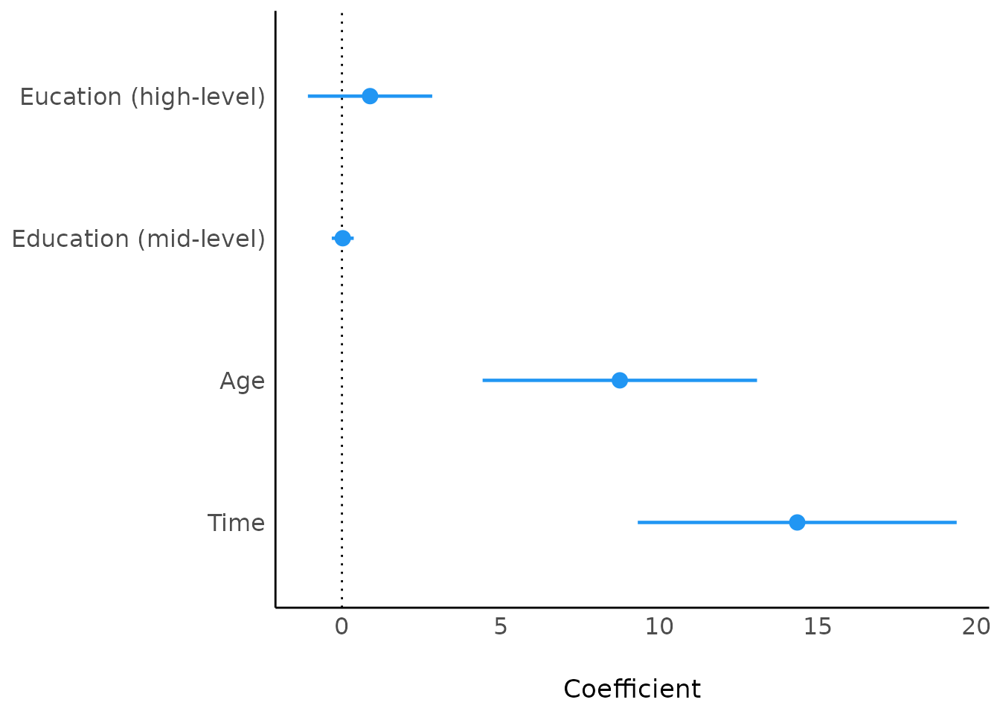

However, there are several ways to change the the names of the
parameters. Since
[`plot()`](https://rdrr.io/r/graphics/plot.default.html) returns
*ggplot* objects, these can be easily modified, e.g. by adding a
[`scale_y_discrete()`](https://ggplot2.tidyverse.org/reference/scale_discrete.html)
layer. *Note the correct order of the labels!*

\
[`library`](https://rdrr.io/r/base/library.html)`(`[`ggplot2`](https://ggplot2.tidyverse.org)`)`\
[`plot`](https://rdrr.io/r/graphics/plot.default.html)`(`[`model_parameters`](https://easystats.github.io/parameters/reference/model_parameters.html)`(``model4``)``)`` ``+`\
`  `[`scale_y_discrete`](https://ggplot2.tidyverse.org/reference/scale_discrete.html)`(`\
`    labels ``=`` `[`c`](https://rdrr.io/r/base/c.html)`(``"Eucation (high-level)"``, ``"Education (mid-level)"``, ``"Age"``, ``"Time"``)`\
`  ``)`

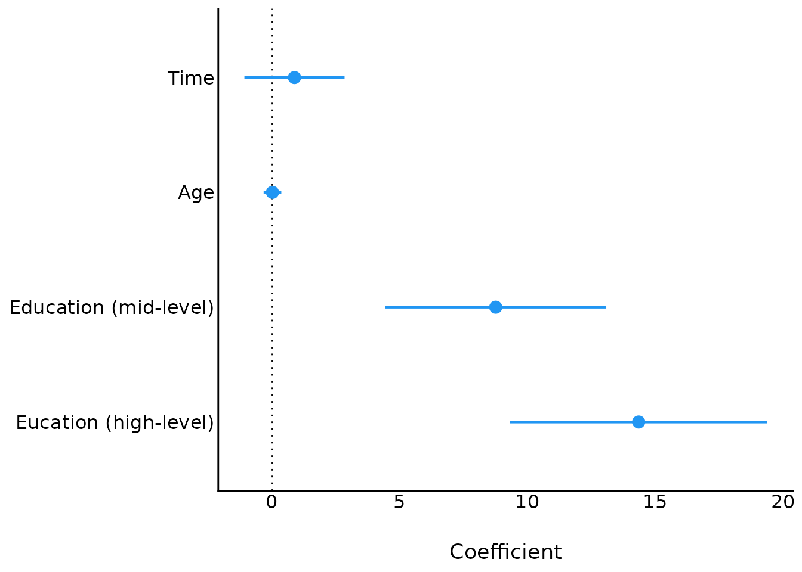

Another way would be changing the values of the `Parameter` column
before calling [`plot()`](https://rdrr.io/r/graphics/plot.default.html):

\
`mp`` ``<-`` `[`model_parameters`](https://easystats.github.io/parameters/reference/model_parameters.html)`(``model4``)`\
`mp``$``Parameter`` ``<-`` `[`c`](https://rdrr.io/r/base/c.html)`(`\
`  ``"(Intercept)"``, ``"Time"``, ``"Age"``, ``"Education (mid-level)"``,`\
`  ``"Eucation (high-level)"`\
`)`\
[`plot`](https://rdrr.io/r/graphics/plot.default.html)`(``mp``)`

## Simulated Model Parameters

[`simulate_parameters()`](https://easystats.github.io/parameters/reference/simulate_parameters.html)
computes simulated draws of parameters and their related indices such as
Confidence Intervals (CI) and p-values. Simulating parameter draws can
be seen as a (computationally faster) alternative to bootstrapping.

As
[`simulate_parameters()`](https://easystats.github.io/parameters/reference/simulate_parameters.html)
is based on
[`simulate_model()`](https://easystats.github.io/parameters/reference/simulate_model.html)
and thus simulates many draws for each parameter,
[`plot()`](https://rdrr.io/r/graphics/plot.default.html) will produce
similar plots as the density estimation plots [from Bayesian
models](https://easystats.github.io/see/articles/bayestestR.html).

\
`result`` ``<<-`` `[`simulate_parameters`](https://easystats.github.io/parameters/reference/simulate_parameters.html)`(``model1``)`\
\
[`plot`](https://rdrr.io/r/graphics/plot.default.html)`(``result``)`

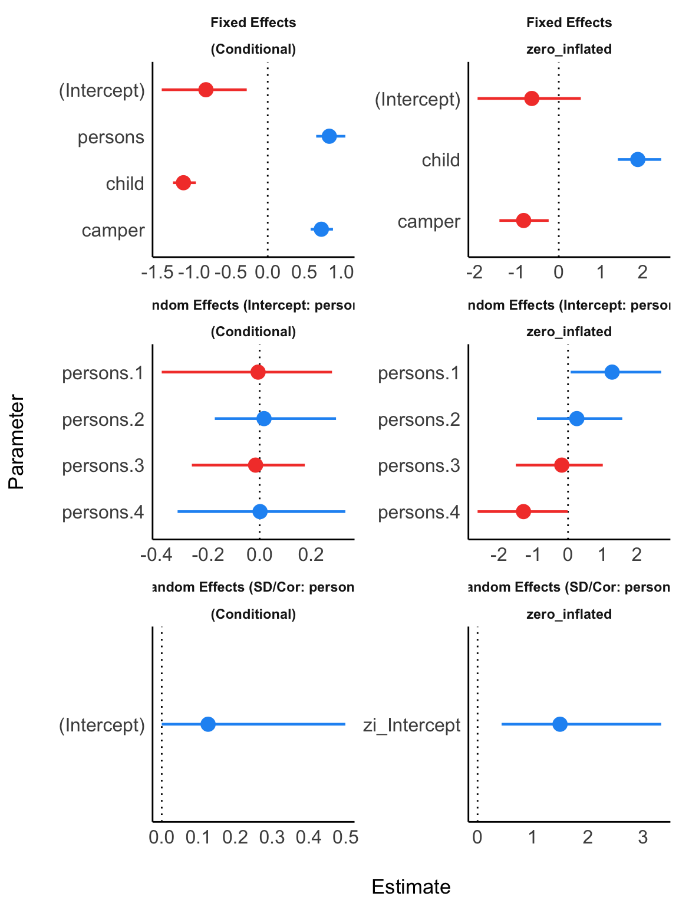

\
[`plot`](https://rdrr.io/r/graphics/plot.default.html)`(``result``, stack ``=`` ``FALSE``)`

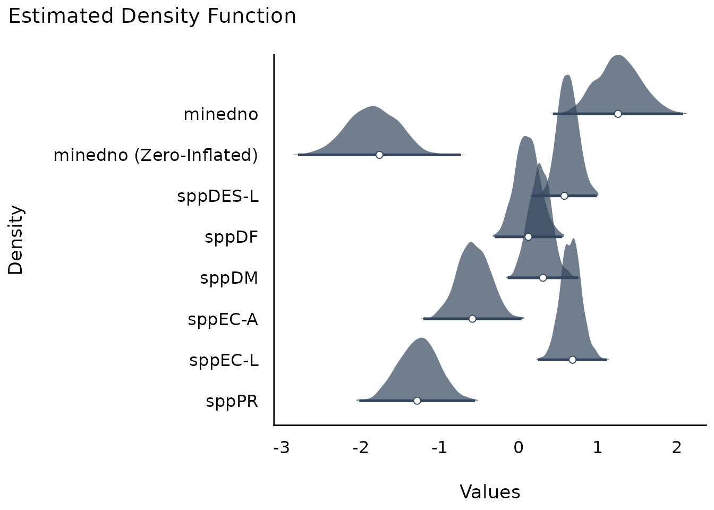

To avoid vertical overlapping, use `normalize_height`.

\
[`plot`](https://rdrr.io/r/graphics/plot.default.html)`(``result``, stack ``=`` ``FALSE``, normalize_height ``=`` ``TRUE``)`

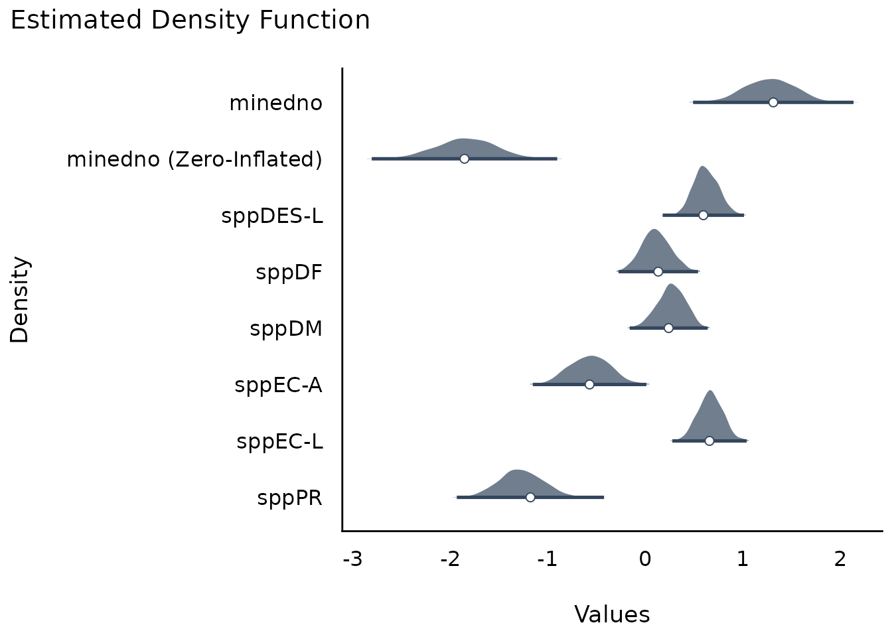

\
[`plot`](https://rdrr.io/r/graphics/plot.default.html)`(``result``, n_columns ``=`` ``2``)`

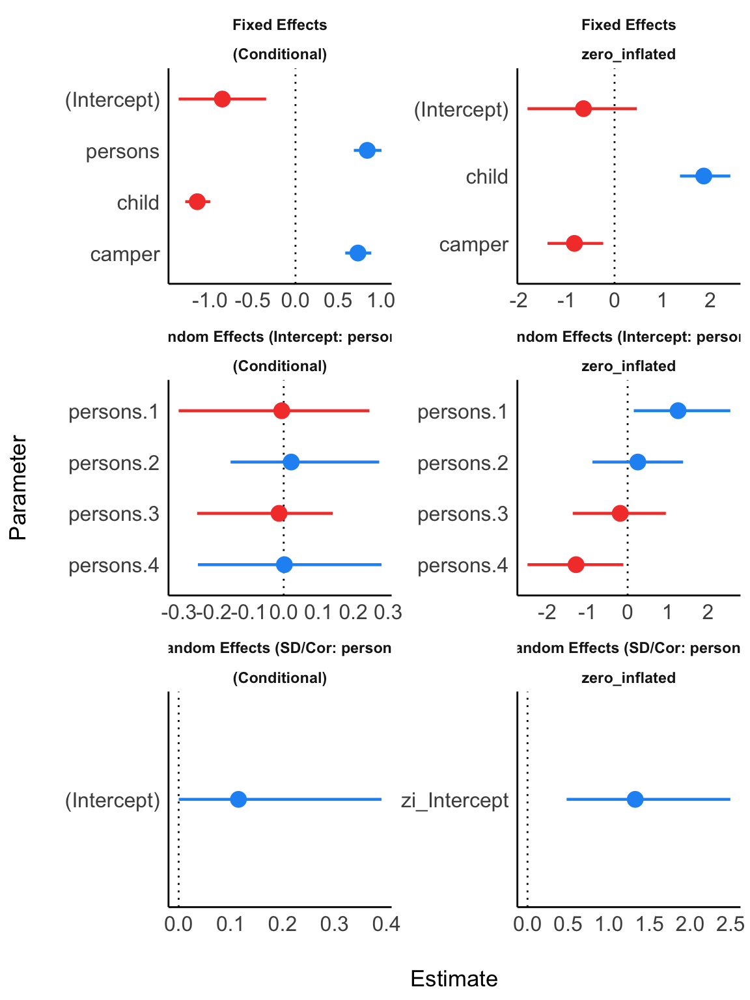

\
[`plot`](https://rdrr.io/r/graphics/plot.default.html)`(``result``, n_columns ``=`` ``2``, stack ``=`` ``FALSE``)`

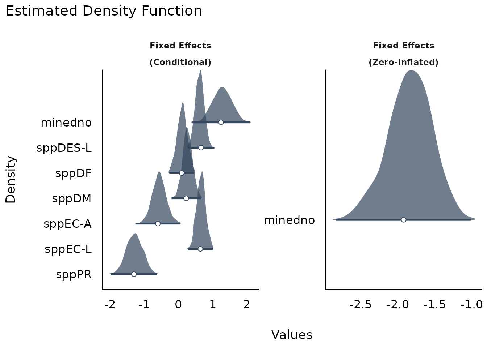

## Model Parameters of SEM models

\
`structure`` ``<-`` ``" visual  =~ x1 + x2 + x3`\
`               textual =~ x4 + x5 + x6`\
`               speed   =~ x7 + x8 + x9 "`\
\
`model`` ``<-`` ``lavaan``::`[`cfa`](https://rdrr.io/pkg/lavaan/man/cfa.html)`(``structure``, data ``=`` ``HolzingerSwineford1939``)`\
`result`` ``<-`` `[`model_parameters`](https://easystats.github.io/parameters/reference/model_parameters.html)`(``model``)`\
[`plot`](https://rdrr.io/r/graphics/plot.default.html)`(``result``)`

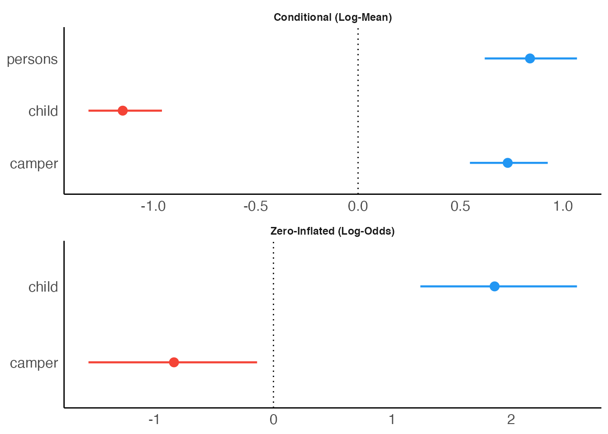

## Model Parameters of Bayesian models

[`model_parameters()`](https://easystats.github.io/parameters/reference/model_parameters.html)
for Bayesian models will produce “forest plots” (instead of [density
estimations](https://easystats.github.io/see/articles/bayestestR.html)).

\
`# We download the model to save computation time. Here is the code`\
`# to refit the exact model used below...`\
\
`# zinb <- read.csv("http://stats.idre.ucla.edu/stat/data/fish.csv")`\
`# set.seed(123)`\
`# model <- brm(bf(`\
`#     count ~ persons + child + camper + (1 | persons),`\
`#     zi ~ child + camper + (1 | persons)`\
`#   ),`\
`#   data = zinb,`\
`#   family = zero_inflated_poisson()`\
`# )`\
`brms_model`` ``<-`` ``insight``::`[`download_model`](https://easystats.github.io/insight/reference/download_model.html)`(``"brms_zi_2"``)`\
`result`` ``<-`` `[`model_parameters`](https://easystats.github.io/parameters/reference/model_parameters.html)`(`\
`  ``brms_model``,`\
`  effects ``=`` ``"all"``,`\
`  component ``=`` ``"all"``,`\
`  verbose ``=`` ``FALSE`\
`)`\
\
[`plot`](https://rdrr.io/r/graphics/plot.default.html)`(``result``)`

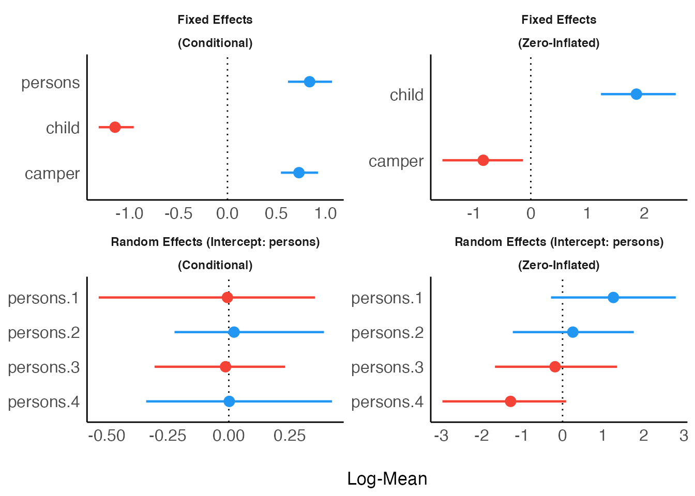

### Including group levels of random effects

\
`result`` ``<-`` `[`model_parameters`](https://easystats.github.io/parameters/reference/model_parameters.html)`(``brms_model``,`\
`  effects ``=`` ``"all"``,`\
`  component ``=`` ``"all"``,`\
`  group_level ``=`` ``TRUE``,`\
`  verbose ``=`` ``FALSE`\
`)`\
[`plot`](https://rdrr.io/r/graphics/plot.default.html)`(``result``)`

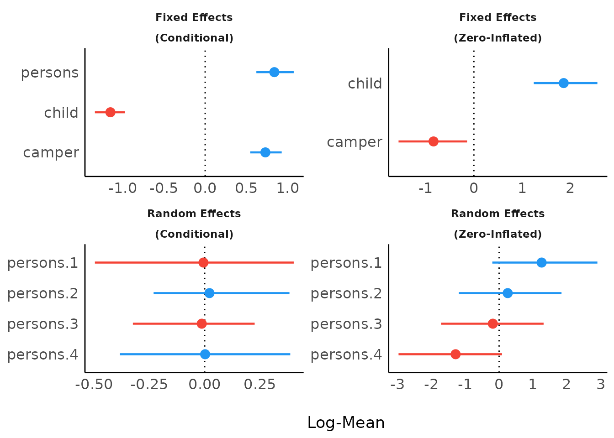

### One-column Layout

\
[`plot`](https://rdrr.io/r/graphics/plot.default.html)`(``result``, n_column ``=`` ``1``)`

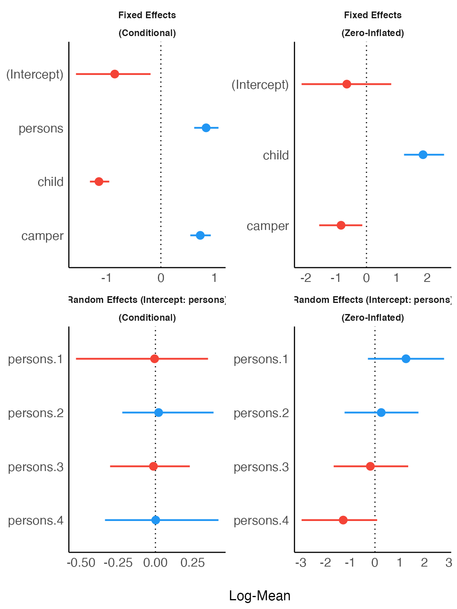

### Including Intercepts and Variance Estimates for Random Intercepts

\
[`plot`](https://rdrr.io/r/graphics/plot.default.html)`(``result``, show_intercept ``=`` ``TRUE``)`

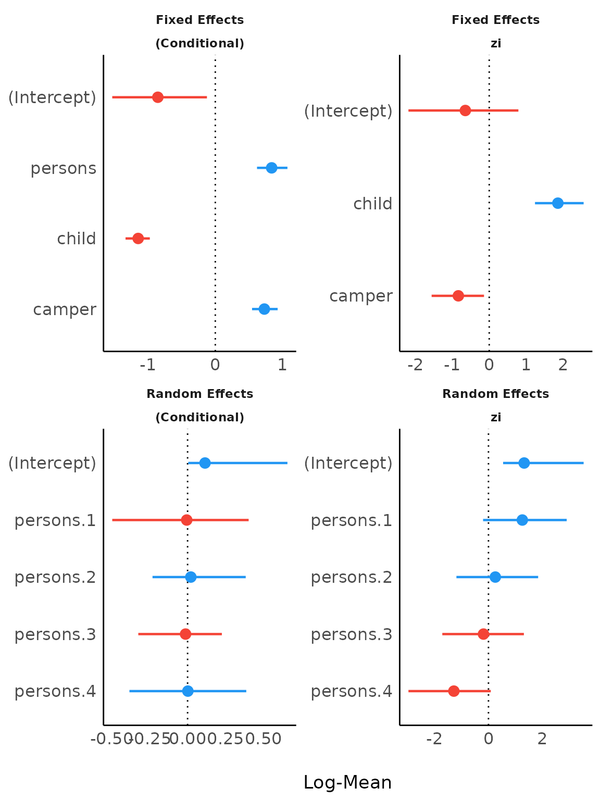

## Model Parameters of Meta-Analysis models

\
`mydat`` ``<<-`` `[`data.frame`](https://rdrr.io/r/base/data.frame.html)`(`\
`  effectsize ``=`` `[`c`](https://rdrr.io/r/base/c.html)`(``-``0.393``, ``0.675``, ``0.282``, ``-``1.398``)``,`\
`  standarderror ``=`` `[`c`](https://rdrr.io/r/base/c.html)`(``0.317``, ``0.317``, ``0.13``, ``0.36``)`\
`)`\
\
`ma`` ``<-`` `[`rma`](https://wviechtb.github.io/metafor/reference/rma.uni.html)`(``yi ``=`` ``effectsize``, sei ``=`` ``standarderror``, method ``=`` ``"REML"``, data ``=`` ``mydat``)`\
`result`` ``<-`` `[`model_parameters`](https://easystats.github.io/parameters/reference/model_parameters.html)`(``ma``)`\
\
`result`\
`#> Meta-analysis using 'metafor'`\
`#> `\
`#> Parameter | Coefficient |   SE |         95% CI |     z |      p | Weight`\
`#> -------------------------------------------------------------------------`\
`#> Study 1   |       -0.39 | 0.32 | [-1.01,  0.23] | -1.24 | 0.215  |   9.95`\
`#> Study 2   |        0.68 | 0.32 | [ 0.05,  1.30] |  2.13 | 0.033  |   9.95`\
`#> Study 3   |        0.28 | 0.13 | [ 0.03,  0.54] |  2.17 | 0.030  |  59.17`\
`#> Study 4   |       -1.40 | 0.36 | [-2.10, -0.69] | -3.88 | < .001 |   7.72`\
`#> Overall   |       -0.18 | 0.44 | [-1.05,  0.68] | -0.42 | 0.676  |`\
[`plot`](https://rdrr.io/r/graphics/plot.default.html)`(``result``)`

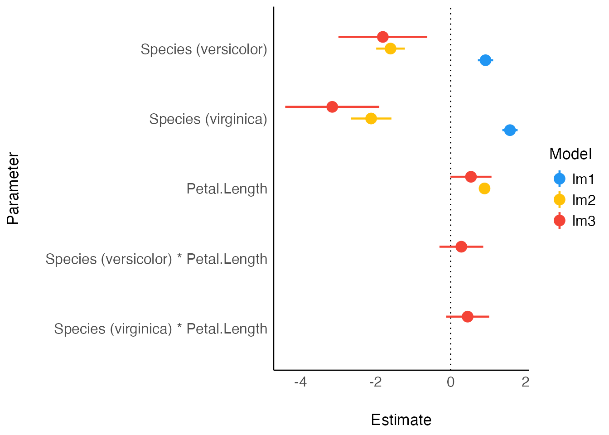

If `show_labels` is `TRUE`, estimates and confidence intervals are
included in the plot. Adjust the text size with `size_text`.

\
[`plot`](https://rdrr.io/r/graphics/plot.default.html)`(``result``, show_labels ``=`` ``TRUE``, size_text ``=`` ``4``)`

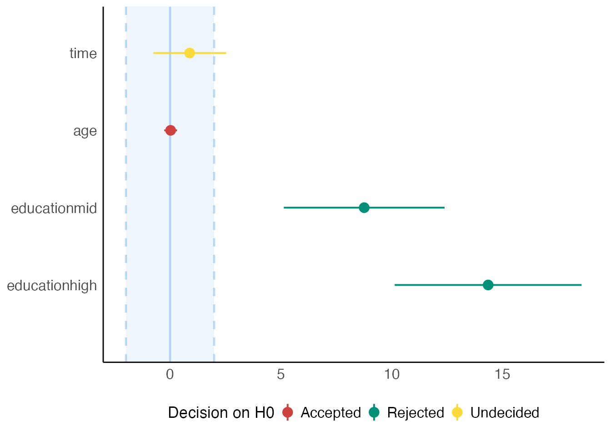

### Funnel plots

If `type = "funnel"`, a funnel plot is created.

\
[`plot`](https://rdrr.io/r/graphics/plot.default.html)`(``result``, type ``=`` ``"funnel"``)`

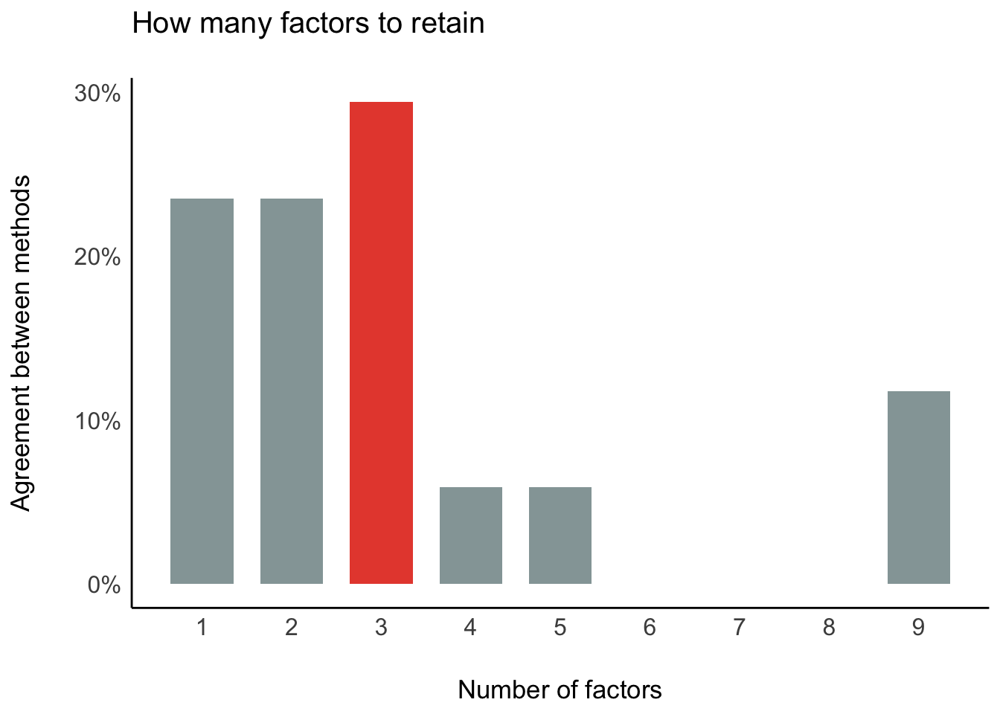

### Model Parameters of Meta-Analysis Models with Subgroups

\
[`set.seed`](https://rdrr.io/r/base/Random.html)`(``123``)`\
[`data`](https://rdrr.io/r/utils/data.html)`(``dat.bcg``)`\
`dat`` ``<-`` `[`escalc`](https://wviechtb.github.io/metafor/reference/escalc.html)`(`\
`  measure ``=`` ``"RR"``,`\
`  ai ``=`` ``tpos``,`\
`  bi ``=`` ``tneg``,`\
`  ci ``=`` ``cpos``,`\
`  di ``=`` ``cneg``,`\
`  data ``=`` ``dat.bcg`\
`)`\
`dat``$``author`` ``<-`` `[`make.unique`](https://rdrr.io/r/base/make.unique.html)`(``dat``$``author``)`\
`dat``$``disease`` ``<-`` `[`sample`](https://rdrr.io/r/base/sample.html)`(`[`c`](https://rdrr.io/r/base/c.html)`(``"Cancer"``, ``"CVD"``, ``"Depression"``)``, size ``=`` `[`nrow`](https://rdrr.io/r/base/nrow.html)`(``dat``)``, replace ``=`` ``TRUE``)`\
`mydat`` ``<<-`` ``dat`\
`model`` ``<-`` `[`rma`](https://wviechtb.github.io/metafor/reference/rma.uni.html)`(``yi``, ``vi``, mods ``=`` ``~``disease``, data ``=`` ``mydat``, digits ``=`` ``3``, slab ``=`` ``author``)`\
`result`` ``<-`` `[`model_parameters`](https://easystats.github.io/parameters/reference/model_parameters.html)`(``model``)`\
\
`result`\
`#> # Depression`\
`#> `\
`#> Parameter            | Coefficient |   SE |         95% CI |     z |      p | Weight`\
`#> ------------------------------------------------------------------------------------`\
`#> Aronson              |       -0.89 | 0.57 | [-2.01,  0.23] | -1.56 | 0.119  |   3.07`\
`#> Ferguson & Simes     |       -1.59 | 0.44 | [-2.45, -0.72] | -3.59 | < .001 |   5.14`\
`#> Rosenthal et al      |       -1.35 | 0.64 | [-2.61, -0.08] | -2.09 | 0.036  |   2.41`\
`#> Frimodt-Moller et al |       -0.22 | 0.23 | [-0.66,  0.23] | -0.96 | 0.336  |  19.53`\
`#> Coetzee & Berjak     |       -0.47 | 0.24 | [-0.94,  0.00] | -1.98 | 0.048  |  17.72`\
`#> Overall              |       -0.12 | 0.59 | [-1.28,  1.04] | -0.20 | 0.841  |       `\
`#> `\
`#> # CVD`\
`#> `\
`#> Parameter          | Coefficient |   SE |         95% CI |      z |      p | Weight`\
`#> -----------------------------------------------------------------------------------`\
`#> Hart & Sutherland  |       -1.44 | 0.14 | [-1.72, -1.16] | -10.19 | < .001 |  49.97`\
`#> Stein & Aronson    |       -0.79 | 0.08 | [-0.95, -0.62] |  -9.46 | < .001 | 144.81`\
`#> Vandiviere et al   |       -1.62 | 0.47 | [-2.55, -0.70] |  -3.43 | < .001 |   4.48`\
`#> TPT Madras         |        0.01 | 0.06 | [-0.11,  0.14] |   0.19 | 0.849  | 252.42`\
`#> Comstock et al     |       -0.34 | 0.11 | [-0.56, -0.12] |  -3.05 | 0.002  |  80.57`\
`#> Comstock & Webster |        0.45 | 0.73 | [-0.98,  1.88] |   0.61 | 0.541  |   1.88`\
`#> Overall            |        0.03 | 0.56 | [-1.08,  1.13] |   0.05 | 0.963  |       `\
`#> `\
`#> # Cancer`\
`#> `\
`#> Parameter         | Coefficient |   SE |         95% CI |     z |      p | Weight`\
`#> ---------------------------------------------------------------------------------`\
`#> Rosenthal et al.1 |       -1.37 | 0.27 | [-1.90, -0.84] | -5.07 | < .001 |  13.69`\
`#> Comstock et al.1  |       -0.02 | 0.27 | [-0.54,  0.51] | -0.06 | 0.948  |  14.00`\
`#> Overall           |       -0.69 | 0.49 | [-1.65,  0.26] | -1.42 | 0.155  |`\
[`plot`](https://rdrr.io/r/graphics/plot.default.html)`(``result``)`

## Bayesian Meta-Analysis using brms

We download the model to save computation time, but here is the code to
refit the exact model used below:

\
`# Data from`\
`# https://github.com/MathiasHarrer/Doing-Meta-Analysis-in-R/blob/master/_data/Meta_Analysis_Data.RData`\
[`set.seed`](https://rdrr.io/r/base/Random.html)`(``123``)`\
`priors`` ``<-`` `[`c`](https://rdrr.io/r/base/c.html)`(`\
`  `[`prior`](https://paulbuerkner.com/brms/reference/set_prior.html)`(`[`normal`](https://mc-stan.org/rstanarm/reference/priors.html)`(``0``, ``1``)``, class ``=`` ``Intercept``)``,`\
`  `[`prior`](https://paulbuerkner.com/brms/reference/set_prior.html)`(`[`cauchy`](https://mc-stan.org/rstanarm/reference/priors.html)`(``0``, ``0.5``)``, class ``=`` ``sd``)`\
`)`\
\
`model`` ``<-`` `[`brm`](https://paulbuerkner.com/brms/reference/brm.html)`(`\
`  ``TE`` ``|`` `[`se`](https://wviechtb.github.io/metafor/reference/se.html)`(``seTE``)`` ``~`` ``1`` ``+`` ``(``1`` ``|`` ``Author``)``,`\
`  data ``=`` ``Meta_Analysis_Data``,`\
`  prior ``=`` ``priors``,`\
`  iter ``=`` ``4000`\
`)`

\
[`library`](https://rdrr.io/r/base/library.html)`(`[`brms`](https://github.com/paul-buerkner/brms)`)`\
`model`` ``<-`` ``insight``::`[`download_model`](https://easystats.github.io/insight/reference/download_model.html)`(``"brms_meta_1"``)`\
`result`` ``<-`` `[`model_parameters`](https://easystats.github.io/parameters/reference/model_parameters.html)`(``model``)`\
\
`result`\
`#> # Studies`\
`#> `\
`#> Parameter              | Median |        95% CI | Weight |     pd |  Rhat | ESS (tail)`\
`#> --------------------------------------------------------------------------------------`\
`#> Overall                |   0.57 | [ 0.40, 0.76] |        |   100% | 1.000 |       4648`\
`#> Call et al             |   0.63 | [ 0.28, 1.03] |   3.83 | 99.95% |       |           `\
`#> Cavanagh et al         |   0.43 | [ 0.10, 0.75] |   5.09 | 99.45% |       |           `\
`#> DanitzOrsillo          |   1.05 | [ 0.54, 1.67] |   2.89 |   100% |       |           `\
`#> de Vibe et al          |   0.25 | [ 0.02, 0.47] |   8.49 | 98.39% |       |           `\
`#> Frazier et al          |   0.45 | [ 0.20, 0.71] |   6.91 | 99.91% |       |           `\
`#> Frogeli et al          |   0.60 | [ 0.30, 0.93] |   5.10 | 99.99% |       |           `\
`#> Gallego et al          |   0.65 | [ 0.31, 1.03] |   4.45 |   100% |       |           `\
`#> Hazlett-Stevens & Oren |   0.54 | [ 0.20, 0.88] |   4.75 | 99.85% |       |           `\
`#> Hintz et al            |   0.36 | [ 0.08, 0.64] |   5.95 | 99.36% |       |           `\
`#> Kang et al             |   0.84 | [ 0.41, 1.40] |   2.97 |   100% |       |           `\
`#> Kuhlmann et al         |   0.27 | [-0.09, 0.57] |   5.14 | 93.21% |       |           `\
`#> Lever Taylor et al     |   0.46 | [ 0.10, 0.81] |   4.33 | 99.34% |       |           `\
`#> Phang et al            |   0.55 | [ 0.19, 0.92] |   4.09 | 99.83% |       |           `\
`#> Rasanen et al          |   0.49 | [ 0.10, 0.87] |   3.88 | 99.26% |       |           `\
`#> Ratanasiripong         |   0.54 | [ 0.09, 0.99] |   2.85 | 99.01% |       |           `\
`#> Shapiro et al          |   0.96 | [ 0.50, 1.53] |   3.17 |   100% |       |           `\
`#> SongLindquist          |   0.59 | [ 0.25, 0.95] |   4.41 | 99.95% |       |           `\
`#> Warnecke et al         |   0.58 | [ 0.21, 0.96] |   4.02 | 99.81% |       |           `\
`#> `\
`#> # Tau`\
`#> `\
`#> Parameter | Median |       95% CI |   pd`\
`#> ----------------------------------------`\
`#> tau       |   0.29 | [0.12, 0.51] | 100%`\
[`plot`](https://rdrr.io/r/graphics/plot.default.html)`(``result``)`

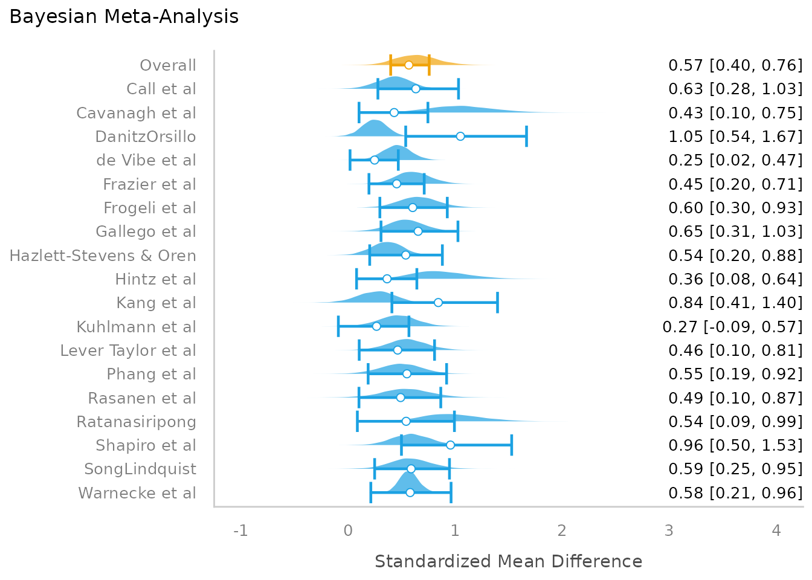

## Comparison of Models

*([related function
documentation](https://easystats.github.io/parameters/reference/compare_parameters.html))*

\
[`data`](https://rdrr.io/r/utils/data.html)`(``iris``)`\
`# shorter variable name`\
`iris``$``Length`` ``<-`` ``iris``$``Petal.Length`\
`lm1`` ``<-`` `[`lm`](https://rdrr.io/r/stats/lm.html)`(``Sepal.Length`` ``~`` ``Species``, data ``=`` ``iris``)`\
`lm2`` ``<-`` `[`lm`](https://rdrr.io/r/stats/lm.html)`(``Sepal.Length`` ``~`` ``Species`` ``+`` ``Length``, data ``=`` ``iris``)`\
`lm3`` ``<-`` `[`lm`](https://rdrr.io/r/stats/lm.html)`(``Sepal.Length`` ``~`` ``Species`` ``*`` ``Length``, data ``=`` ``iris``)`\
\
`result`` ``<-`` `[`compare_parameters`](https://easystats.github.io/parameters/reference/compare_parameters.html)`(``lm1``, ``lm2``, ``lm3``)`\
[`plot`](https://rdrr.io/r/graphics/plot.default.html)`(``result``)`

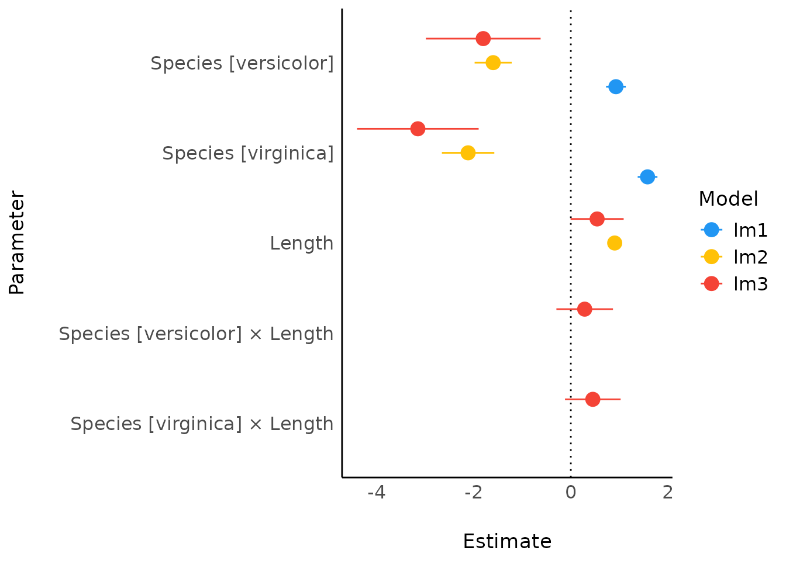

\
[`plot`](https://rdrr.io/r/graphics/plot.default.html)`(``result``, size_text ``=`` ``3.8``)`` ``+`\
`  `[`labs`](https://ggplot2.tidyverse.org/reference/labs.html)`(``y ``=`` ``NULL``)`` ``+`\
`  `[`theme`](https://ggplot2.tidyverse.org/reference/theme.html)`(``legend.position ``=`` ``"bottom"``)`

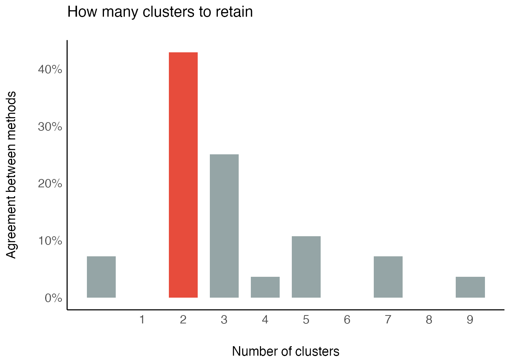

## Equivalence Testing

*([related function
documentation](https://easystats.github.io/parameters/reference/equivalence_test.lm.html))*

### For fixed effects

\
`# default rules, like in bayestestR::equivalence_test()`\
`result`` ``<-`` `[`equivalence_test`](https://easystats.github.io/bayestestR/reference/equivalence_test.html)`(``model4``)`\
`result`\
`#> # TOST-test for Practical Equivalence`\
`#> `\
`#>   ROPE: [-1.99 1.99]`\
`#> `\
`#> Parameter        |         90% CI |   SGPV | Equivalence |      p`\
`#> -----------------------------------------------------------------`\
`#> (Intercept)      | [59.33, 68.41] | < .001 |    Rejected | > .999`\
`#> time             | [-0.76,  2.53] | 0.905  |   Undecided | 0.137 `\
`#> age              | [-0.26,  0.32] | > .999 |    Accepted | < .001`\
`#> education [mid]  | [ 5.13, 12.39] | < .001 |    Rejected | 0.999 `\
`#> education [high] | [10.14, 18.57] | < .001 |    Rejected | > .999`\
\
[`plot`](https://rdrr.io/r/graphics/plot.default.html)`(``result``)`

\
`result`` ``<-`` `[`equivalence_test`](https://easystats.github.io/bayestestR/reference/equivalence_test.html)`(``model4``, rule ``=`` ``"cet"``)`\
`result`\
`#> # Conditional Equivalence Testing`\
`#> `\
`#>   ROPE: [-1.99 1.99]`\
`#> `\
`#> Parameter        |         90% CI |   SGPV | Equivalence |      p`\
`#> -----------------------------------------------------------------`\
`#> (Intercept)      | [59.33, 68.41] | < .001 |    Rejected | > .999`\
`#> time             | [-0.76,  2.53] | 0.905  |   Undecided | 0.137 `\
`#> age              | [-0.26,  0.32] | > .999 |    Accepted | < .001`\
`#> education [mid]  | [ 5.13, 12.39] | < .001 |    Rejected | 0.999 `\
`#> education [high] | [10.14, 18.57] | < .001 |    Rejected | > .999`\
\
[`plot`](https://rdrr.io/r/graphics/plot.default.html)`(``result``)`

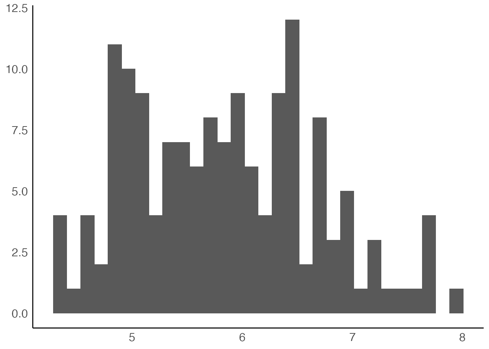

### For random effects

\
`result`` ``<-`` `[`equivalence_test`](https://easystats.github.io/bayestestR/reference/equivalence_test.html)`(``model3``, effects ``=`` ``"random"``)`\
`result`\
`#> # TOST-test for Practical Equivalence`\
`#> `\
`#>   ROPE: [-5.63 5.63]`\
`#> `\
`#> Group: grp`\
`#> `\
`#> Parameter | Estimate | Group |           90% CI |   SGPV | Equivalence`\
`#> ----------------------------------------------------------------------`\
`#> 1         |     1.18 |   grp | [ -1.91,   4.28] | 0.998  |    Accepted`\
`#> 2         |    -0.21 |   grp | [ -3.27,   2.84] | > .999 |    Accepted`\
`#> 3         |    -0.25 |   grp | [ -3.33,   2.83] | > .999 |    Accepted`\
`#> 4         |    -0.48 |   grp | [ -3.56,   2.60] | > .999 |    Accepted`\
`#> 5         |    -0.24 |   grp | [ -3.33,   2.85] | > .999 |    Accepted`\
`#> Group: Subject`\
`#> `\
`#> Parameter | Estimate |   Group |           90% CI |   SGPV | Equivalence`\
`#> ------------------------------------------------------------------------`\
`#> 308       |    40.86 | Subject | [ 25.22,  56.50] | < .001 |    Rejected`\
`#> 309       |   -77.88 | Subject | [-93.51, -62.24] | < .001 |    Rejected`\
`#> 310       |   -63.28 | Subject | [-78.91, -47.65] | < .001 |    Rejected`\
`#> 330       |     4.32 | Subject | [-11.32,  19.96] | 0.459  |   Undecided`\
`#> 331       |    10.18 | Subject | [ -5.45,  25.80] | 0.261  |   Undecided`\
`#> 332       |     8.47 | Subject | [ -7.17,  24.10] | 0.323  |   Undecided`\
`#> 333       |    16.44 | Subject | [  0.81,  32.07] | 0.085  |    Rejected`\
`#> 334       |    -3.00 | Subject | [-18.65,  12.65] | 0.489  |   Undecided`\
`#> 335       |   -45.48 | Subject | [-61.11, -29.85] | < .001 |    Rejected`\
`#> 337       |    72.16 | Subject | [ 56.54,  87.79] | < .001 |    Rejected`\
`#> 349       |   -20.91 | Subject | [-36.57,  -5.25] | 0.028  |    Rejected`\
`#> 350       |    14.23 | Subject | [ -1.41,  29.88] | 0.134  |   Undecided`\
`#> 351       |    -8.07 | Subject | [-23.74,   7.59] | 0.337  |   Undecided`\
`#> 352       |    36.44 | Subject | [ 20.76,  52.12] | < .001 |    Rejected`\
`#> 369       |     6.97 | Subject | [ -8.66,  22.60] | 0.376  |   Undecided`\
`#> 370       |    -6.31 | Subject | [-21.96,   9.34] | 0.399  |   Undecided`\
`#> 371       |    -3.34 | Subject | [-18.96,  12.29] | 0.483  |   Undecided`\
`#> 372       |    18.21 | Subject | [  2.57,  33.84] | 0.056  |    Rejected`\
\
[`plot`](https://rdrr.io/r/graphics/plot.default.html)`(``result``)`

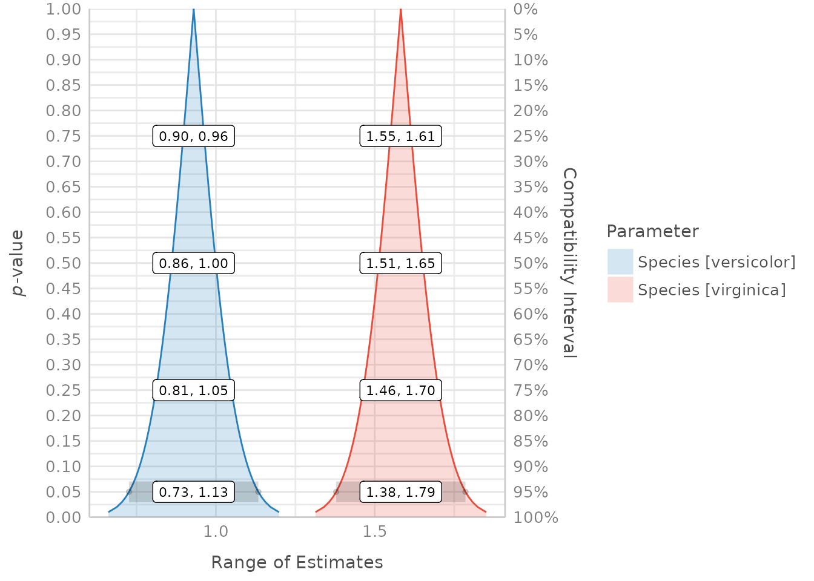

## p-value function and consonance/compatibility plot

*([related function
documentation](https://easystats.github.io/parameters/reference/p_function.html))*

\
[`data`](https://rdrr.io/r/utils/data.html)`(``iris``)`\
`model`` ``<-`` `[`lm`](https://rdrr.io/r/stats/lm.html)`(``Sepal.Length`` ``~`` ``Species``, data ``=`` ``iris``)`\
\
`result`` ``<-`` `[`p_function`](https://easystats.github.io/parameters/reference/p_function.html)`(``model``)`\
[`plot`](https://rdrr.io/r/graphics/plot.default.html)`(``result``)`

\
\
`result`` ``<-`` `[`p_function`](https://easystats.github.io/parameters/reference/p_function.html)`(``model``, ci_levels ``=`` `[`c`](https://rdrr.io/r/base/c.html)`(``0.5``, ``0.7``, emph ``=`` ``0.9``)``)`\
[`plot`](https://rdrr.io/r/graphics/plot.default.html)`(``result``, size_line ``=`` `[`c`](https://rdrr.io/r/base/c.html)`(``0.6``, ``1.2``)``)`

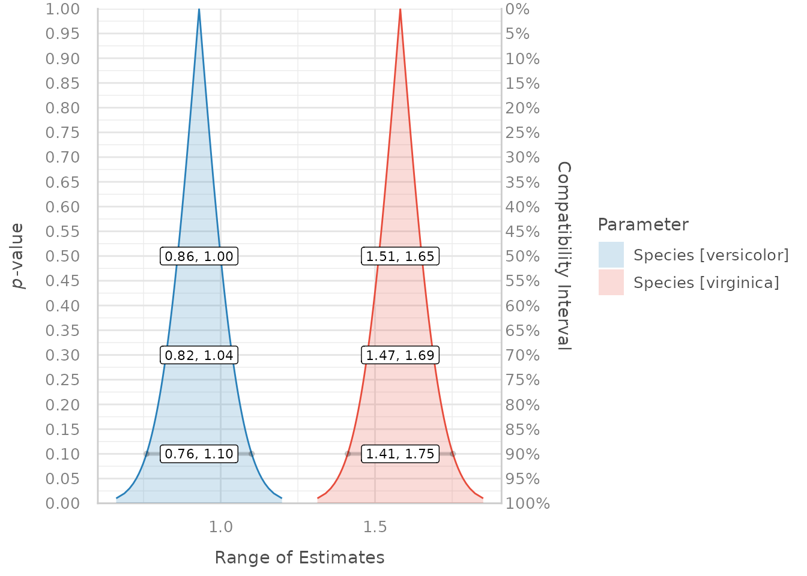

## Probability of Direction

*([related function
documentation](https://easystats.github.io/parameters/reference/p_direction.lm.html))*

\
[`data`](https://rdrr.io/r/utils/data.html)`(``qol_cancer``)`\
`model`` ``<-`` `[`lm`](https://rdrr.io/r/stats/lm.html)`(``QoL`` ``~`` ``time`` ``+`` ``age`` ``+`` ``education``, data ``=`` ``qol_cancer``)`\
`result`` ``<-`` `[`p_direction`](https://easystats.github.io/bayestestR/reference/p_direction.html)`(``model``)`\
\
[`plot`](https://rdrr.io/r/graphics/plot.default.html)`(``result``)`

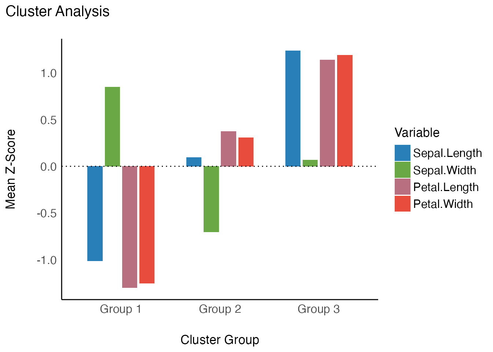

## Practical Significance

*([related function
documentation](https://easystats.github.io/parameters/reference/p_significance.lm.html))*

\
[`data`](https://rdrr.io/r/utils/data.html)`(``qol_cancer``)`\
`model`` ``<-`` `[`lm`](https://rdrr.io/r/stats/lm.html)`(``QoL`` ``~`` ``time`` ``+`` ``age`` ``+`` ``education``, data ``=`` ``qol_cancer``)`\
`result`` ``<-`` `[`p_significance`](https://easystats.github.io/bayestestR/reference/p_significance.html)`(``model``)`\
\
[`plot`](https://rdrr.io/r/graphics/plot.default.html)`(``result``)`

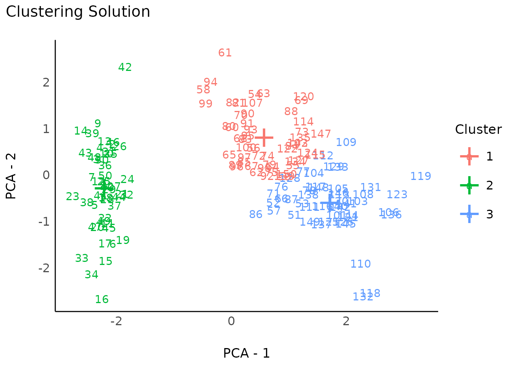

## Principal Component Analysis

*([related function
documentation](https://easystats.github.io/parameters/reference/principal_components.html))*

\
`# Bars`\
[`data`](https://rdrr.io/r/utils/data.html)`(``mtcars``)`\
`result`` ``<-`` `[`principal_components`](https://easystats.github.io/parameters/reference/principal_components.html)`(``mtcars``[``, ``1``:``7``]``, n ``=`` ``"all"``, threshold ``=`` ``0.2``)`\
`result`\
`#> # Loadings from Principal Component Analysis (no rotation)`\
`#> `\
`#> Variable |   PC1 |   PC2 |  PC3 |   PC4 |  PC5 |   PC6 | Complexity`\
`#> -------------------------------------------------------------------`\
`#> mpg      | -0.93 |       |      | -0.30 |      |       |       1.30`\
`#> cyl      |  0.96 |       |      |       |      | -0.21 |       1.18`\
`#> disp     |  0.95 |       |      | -0.23 |      |       |       1.16`\
`#> hp       |  0.87 |  0.36 |      |       | 0.30 |       |       1.64`\
`#> drat     | -0.75 |  0.48 | 0.44 |       |      |       |       2.47`\
`#> wt       |  0.88 | -0.35 | 0.26 |       |      |       |       1.54`\
`#> qsec     | -0.54 | -0.81 |      |       |      |       |       1.96`\
`#> `\
`#> The 6 principal components accounted for 99.30% of the total variance of the original data (PC1 = 72.66%, PC2 = 16.52%, PC3 = 4.93%, PC4 = 2.26%, PC5 = 1.85%, PC6 = 1.08%).`\
\
[`plot`](https://rdrr.io/r/graphics/plot.default.html)`(``result``)`

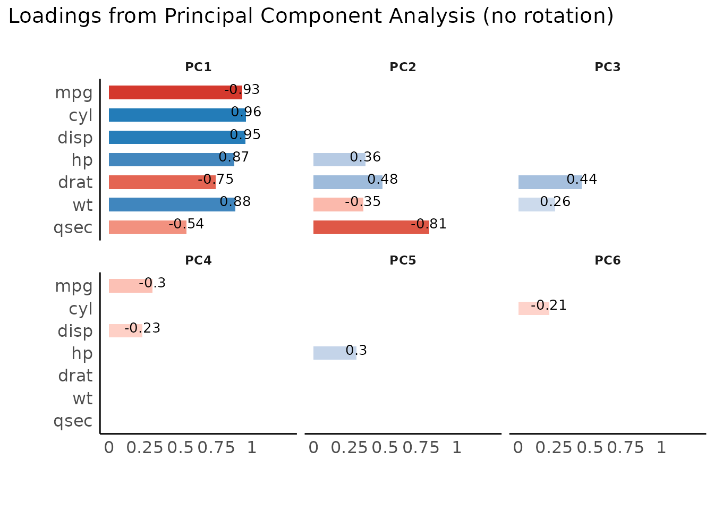

\
`# Graph`\
`result`` ``<-`` `[`principal_components`](https://easystats.github.io/parameters/reference/principal_components.html)`(``mtcars``[``, ``1``:``7``]``, n ``=`` ``3``, rotation ``=`` ``"varimax"``)`\
[`plot`](https://rdrr.io/r/graphics/plot.default.html)`(``result``, type ``=`` ``"graph"``, arrow_end_gap ``=`` ``0.15``)`

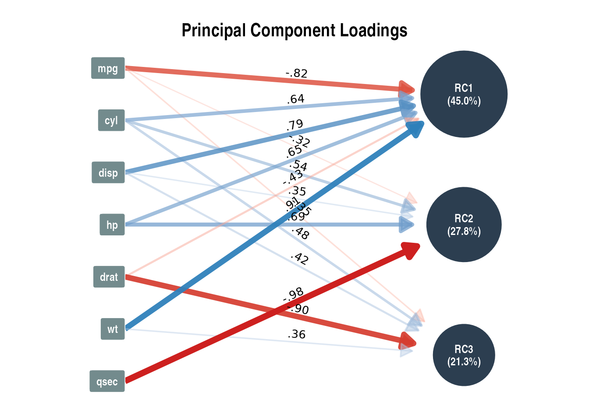

\
`# lines`\
`result`` ``<-`` `[`principal_components`](https://easystats.github.io/parameters/reference/principal_components.html)`(`\
`  ``mtcars``[``, ``1``:``7``]``,`\
`  n ``=`` ``3``,`\
`  rotation ``=`` ``"varimax"``,`\
`  threshold ``=`` ``"max"``,`\
`  sort ``=`` ``TRUE`\
`)`\
\
`result`\
`#> # Rotated loadings from Principal Component Analysis (varimax-rotation)`\
`#> `\
`#> Variable |   RC1 |   RC2 |   RC3 | Complexity | Uniqueness |  MSA`\
`#> -----------------------------------------------------------------`\
`#> wt       |  0.91 |       |       |       1.31 |       0.03 | 0.77`\
`#> mpg      | -0.82 |       |       |       1.70 |       0.11 | 0.87`\
`#> disp     |  0.79 |       |       |       1.95 |       0.08 | 0.85`\
`#> cyl      |  0.64 |       |       |       2.84 |       0.06 | 0.87`\
`#> qsec     |       | -0.98 |       |       1.02 |       0.03 | 0.61`\
`#> hp       |       |  0.69 |       |       2.09 |       0.09 | 0.90`\
`#> drat     |       |       | -0.90 |       1.43 |       0.01 | 0.85`\
`#> `\
`#> The 3 principal components (varimax rotation) accounted for 94.11% of the total variance of the original data (RC1 = 45.02%, RC2 = 27.79%, RC3 = 21.30%).`\
\
[`plot`](https://rdrr.io/r/graphics/plot.default.html)`(``result``, type ``=`` ``"line"``, color_text ``=`` ``"white"``)`` ``+`\
`  `[`theme_abyss`](https://easystats.github.io/see/reference/theme_abyss.md)`(``)`

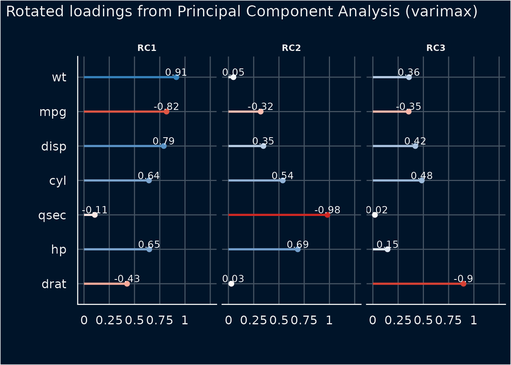

## Cluster Analysis

*([related function
documentation](https://easystats.github.io/parameters/reference/cluster_analysis.html))*

### Clustering solution

\
[`data`](https://rdrr.io/r/utils/data.html)`(``iris``)`\
`result`` ``<-`` `[`cluster_analysis`](https://easystats.github.io/parameters/reference/cluster_analysis.html)`(``iris``[``, ``1``:``4``]``, n ``=`` ``3``)`\
`result`\
`#> # Clustering Solution`\
`#> `\
`#> The 3 clusters accounted for 76.70% of the total variance of the original data.`\
`#> `\
`#> Cluster | n_Obs | Sum_Squares | Sepal.Length | Sepal.Width | Petal.Length | Petal.Width`\
`#> ---------------------------------------------------------------------------------------`\
`#> 1       |    53 |       44.09 |        -0.05 |       -0.88 |         0.35 |        0.28`\
`#> 2       |    50 |       47.35 |        -1.01 |        0.85 |        -1.30 |       -1.25`\
`#> 3       |    47 |       47.45 |         1.13 |        0.09 |         0.99 |        1.01`\
`#> `\
`#> # Indices of model performance`\
`#> `\
`#> Sum_Squares_Total | Sum_Squares_Between | Sum_Squares_Within |    R2`\
`#> --------------------------------------------------------------------`\
`#> 596               |             457.112 |            138.888 | 0.767`\
`#> `\
`` #> # You can access the predicted clusters via `predict()`. ``\
[`plot`](https://rdrr.io/r/graphics/plot.default.html)`(``result``)`

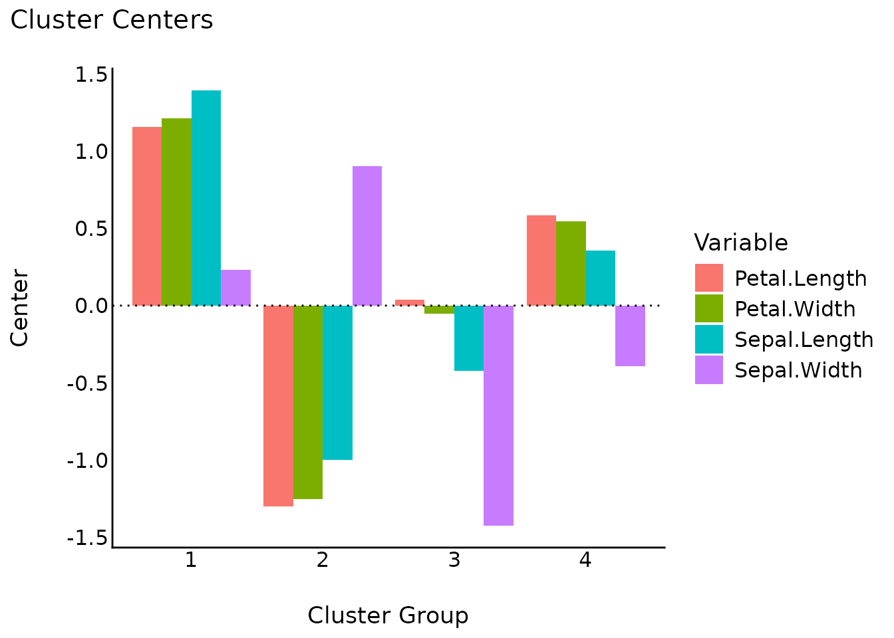

\
\
`result`` ``<-`` `[`cluster_analysis`](https://easystats.github.io/parameters/reference/cluster_analysis.html)`(``iris``[``, ``1``:``4``]``, n ``=`` ``4``)`\
[`plot`](https://rdrr.io/r/graphics/plot.default.html)`(``result``)`

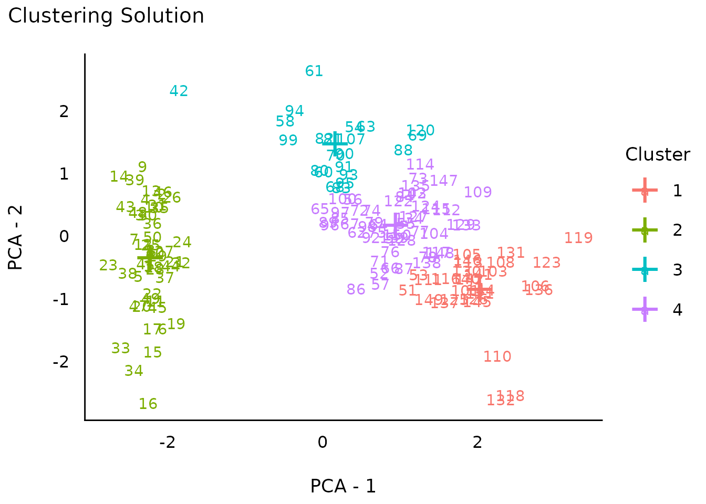

### Cluster centers

\
`s`` ``<-`` `[`summary`](https://rdrr.io/r/base/summary.html)`(``result``)`\
`s`\
`#>   Cluster Sepal.Length Sepal.Width Petal.Length Petal.Width`\
`#> 1       1    1.3926646   0.2323817   1.15674505  1.21327591`\
`#> 2       2   -0.9987207   0.9032290  -1.29875725 -1.25214931`\
`#> 3       3   -0.4201099  -1.4246794   0.03924137 -0.05279511`\
`#> 4       4    0.3558492  -0.3930869   0.58460377  0.54663615`\
\
[`plot`](https://rdrr.io/r/graphics/plot.default.html)`(``s``)`

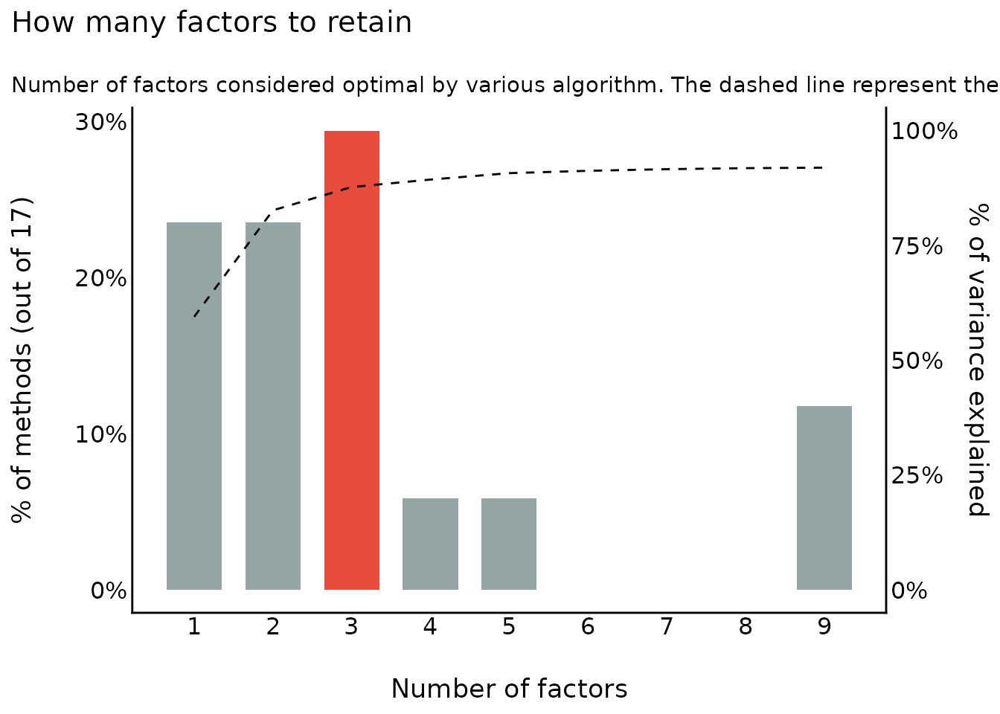

## Number of Components/Factors to Retain

*([related function
documentation](https://easystats.github.io/parameters/reference/n_factors.html))*

\
[`data`](https://rdrr.io/r/utils/data.html)`(``mtcars``)`\
`result`` ``<-`` `[`n_factors`](https://easystats.github.io/parameters/reference/n_factors.html)`(``mtcars``, type ``=`` ``"PCA"``)`\
`result`\
`#> # Method Agreement Procedure:`\
`#> `\
`#> The choice of 3 dimensions is supported by 5 (29.41%) methods out of 17 (Bartlett, CNG, Scree (SE), Scree (R2), Velicer's MAP).`\
\
[`plot`](https://rdrr.io/r/graphics/plot.default.html)`(``result``)`

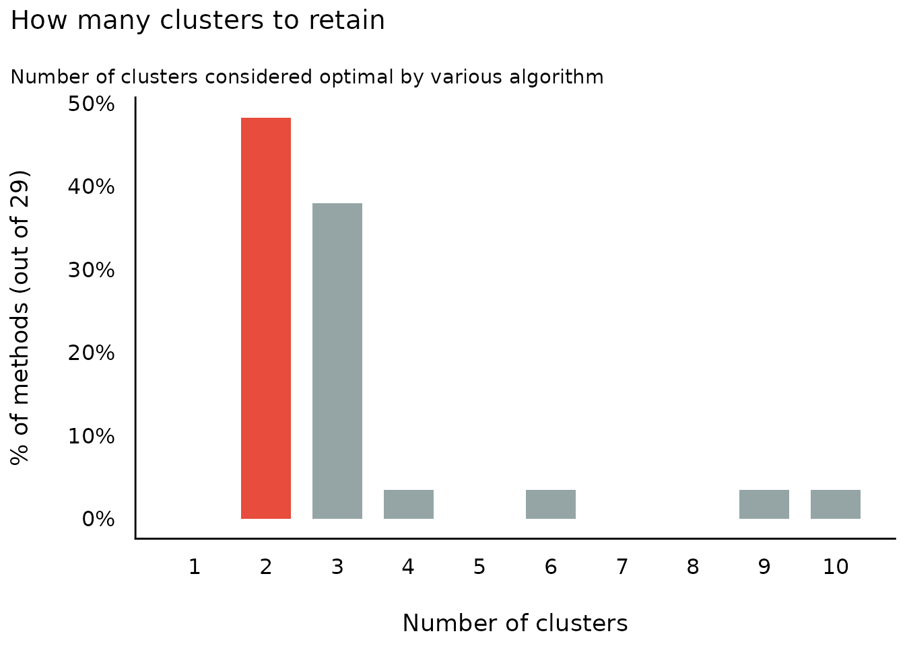

\
[`plot`](https://rdrr.io/r/graphics/plot.default.html)`(``result``, type ``=`` ``"line"``)`

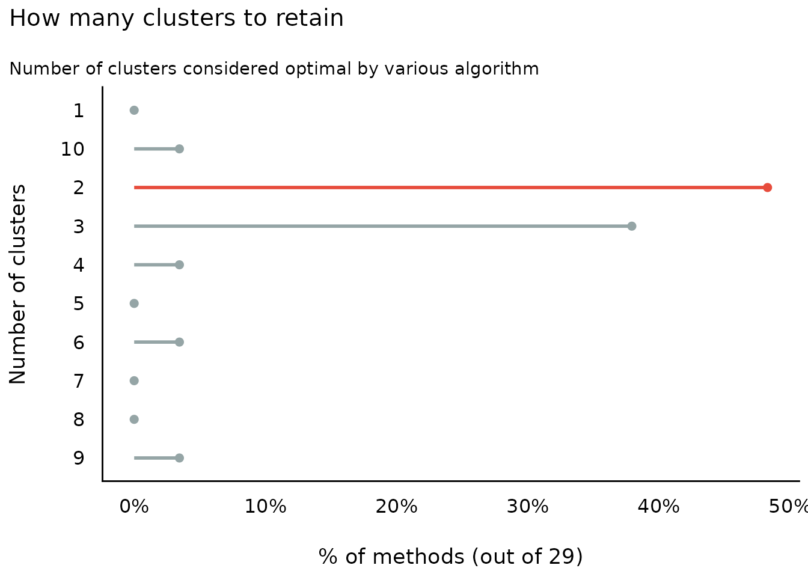

## Number of Clusters to Retain

*([related function
documentation](https://easystats.github.io/parameters/reference/n_clusters.html))*

\
[`data`](https://rdrr.io/r/utils/data.html)`(``iris``)`\
`result`` ``<-`` `[`n_clusters`](https://easystats.github.io/parameters/reference/n_clusters.html)`(`[`standardize`](https://easystats.github.io/datawizard/reference/standardize.html)`(``iris``[``, ``1``:``4``]``)``)`\
`result`\
`#> # Method Agreement Procedure:`\
`#> `\
`#> The choice of 2 clusters is supported by 13 (44.83%) methods out of 29 (Elbow, Gap_Maechler2012, Ch, DB, Duda, Pseudot2, Beale, Ratkowsky, PtBiserial, Mcclain, Dunn, SDindex, Mixture (VVV)).`\
\
[`plot`](https://rdrr.io/r/graphics/plot.default.html)`(``result``)`

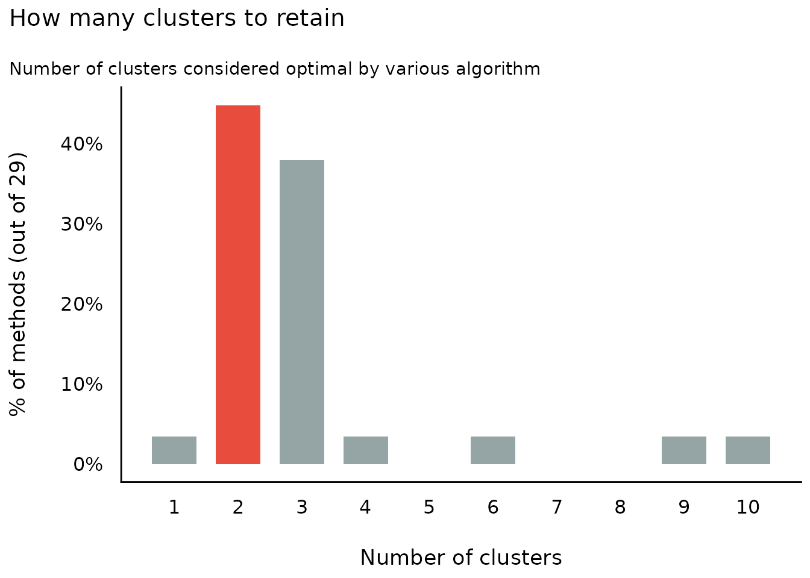

\
[`plot`](https://rdrr.io/r/graphics/plot.default.html)`(``result``, type ``=`` ``"line"``)`

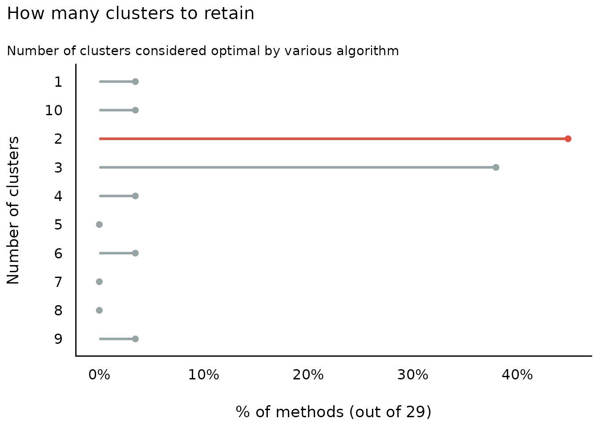
