# Plotting Functions for the 'parameters' Package

This vignette can be referred to by citing the package:

``` r

citation("see")
#> To cite package 'see' in publications use:
#> 
#>   Lüdecke et al., (2021). see: An R Package for Visualizing Statistical
#>   Models. Journal of Open Source Software, 6(64), 3393.
#>   https://doi.org/10.21105/joss.03393
#> 
#> A BibTeX entry for LaTeX users is
#> 
#>   @Article{,
#>     title = {{see}: An {R} Package for Visualizing Statistical Models},
#>     author = {Daniel Lüdecke and Indrajeet Patil and Mattan S. Ben-Shachar and Brenton M. Wiernik and Philip Waggoner and Dominique Makowski},
#>     journal = {Journal of Open Source Software},
#>     year = {2021},
#>     volume = {6},
#>     number = {64},
#>     pages = {3393},
#>     doi = {10.21105/joss.03393},
#>   }
```

## Introduction

*parameters*’ primary goal is to provide utilities for processing the
parameters of various statistical models (see
[here](https://easystats.github.io/insight/) for a list of supported
models). Beyond computing *p-values*, *CIs*, *Bayesian indices* and
other measures for a wide variety of models, this package implements
features like *bootstrapping* of parameters and models, *feature
reduction* (feature extraction and variable selection), or tools for
data reduction like functions to perform cluster, factor or principal
component analysis.

Another important goal of the **parameters** package is to facilitate
and streamline the process of reporting results of statistical models,
which includes the easy and intuitive calculation of standardized
estimates or robust standard errors and *p*-values. **parameters**
therefor offers a simple and unified syntax to process a large variety
of (model) objects from many different packages.

For more, see: <https://easystats.github.io/parameters/>

## Setup and Model Fitting

``` r

library(parameters)
library(effectsize)
library(insight)
library(see)
library(glmmTMB)
library(lme4)
library(lavaan)
library(metafor)
library(ggplot2)
data("Salamanders")
data("iris")
data("sleepstudy")
data("qol_cancer")

set.seed(12345)
sleepstudy$grp <- sample.int(5, size = 180, replace = TRUE)

theme_set(theme_modern())
```

``` r

# fit three example model
model1 <- glmmTMB(
  count ~ spp + mined + (1 | site),
  ziformula = ~mined,
  family = poisson(),
  data = Salamanders
)
model_parameters(model1, effects = "fixed")
#> # Fixed Effects
#> 
#> Parameter   | Log-Mean |   SE |         95% CI |     z |      p
#> ---------------------------------------------------------------
#> (Intercept) |    -0.36 | 0.28 | [-0.90,  0.18] | -1.30 | 0.194 
#> spp [PR]    |    -1.27 | 0.24 | [-1.74, -0.80] | -5.27 | < .001
#> spp [DM]    |     0.27 | 0.14 | [ 0.00,  0.54] |  1.95 | 0.051 
#> spp [EC-A]  |    -0.57 | 0.21 | [-0.97, -0.16] | -2.75 | 0.006 
#> spp [EC-L]  |     0.67 | 0.13 | [ 0.41,  0.92] |  5.20 | < .001
#> spp [DES-L] |     0.63 | 0.13 | [ 0.38,  0.87] |  4.96 | < .001
#> spp [DF]    |     0.12 | 0.15 | [-0.17,  0.40] |  0.78 | 0.435 
#> mined [no]  |     1.27 | 0.27 | [ 0.74,  1.80] |  4.72 | < .001
#> 
#> # Zero-Inflation
#> 
#> Parameter   | Log-Odds |   SE |         95% CI |     z |      p
#> ---------------------------------------------------------------
#> (Intercept) |     0.79 | 0.27 | [ 0.26,  1.32] |  2.90 | 0.004 
#> mined [no]  |    -1.84 | 0.31 | [-2.46, -1.23] | -5.87 | < .001


model2 <- lm(Sepal.Length ~ Species * splines::bs(Petal.Width, degree = 2), data = iris)
model_parameters(model2, effects = "fixed")
#> Parameter                | Coefficient |    SE |          95% CI | t(141) |      p
#> ----------------------------------------------------------------------------------
#> (Intercept)              |        4.79 |  0.17 | [  4.45,  5.13] |  27.66 | < .001
#> Species [versicolor]     |       -3.73 |  2.14 | [ -7.96,  0.50] |  -1.74 | 0.083 
#> Species [virginica]      |       -2.67 |  2.88 | [ -8.36,  3.03] |  -0.93 | 0.356 
#> Petal Width [1st degree] |        2.53 |  2.36 | [ -2.13,  7.20] |   1.07 | 0.285 
#> Petal Width [2nd degree] |      -11.18 | 21.14 | [-52.98, 30.62] |  -0.53 | 0.598 
#> Petal Width [1st degree] |        5.48 |  4.84 | [ -4.09, 15.05] |   1.13 | 0.260 
#> Petal Width [1st degree] |        2.37 |  4.35 | [ -6.22, 10.96] |   0.54 | 0.587 
#> Petal Width [2nd degree] |       14.84 | 21.16 | [-26.99, 56.68] |   0.70 | 0.484 
#> Petal Width [2nd degree] |       15.81 | 21.32 | [-26.35, 57.96] |   0.74 | 0.460


model3 <- lmer(
  Reaction ~ Days + (1 | grp) + (1 | Subject),
  data = sleepstudy
)

model4 <- lm(QoL ~ time + age + education, data = qol_cancer)
```

## Model Parameters

*([related function
documentation](https://easystats.github.io/parameters/reference/model_parameters.html))*

The [`plot()`](https://rdrr.io/r/graphics/plot.default.html)-method for
[`model_parameters()`](https://easystats.github.io/parameters/reference/model_parameters.html)
creates a so called “forest plot”. In case of models with multiple
components, parameters are separated into facets by model component.

``` r

result <- model_parameters(model1, effects = "fixed")

plot(result)
```

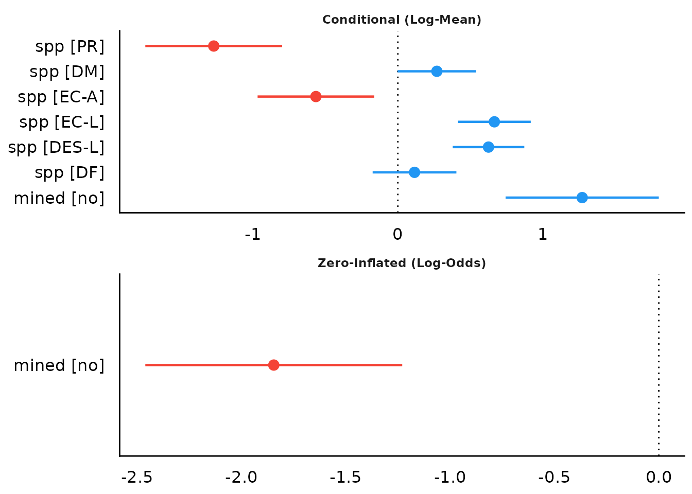

When `show_labels` is `TRUE`, coefficients and confidence intervals are
added to the plot. Adjust the text size with `size_text`.

``` r

plot(result, show_labels = TRUE, size_text = 4)
```

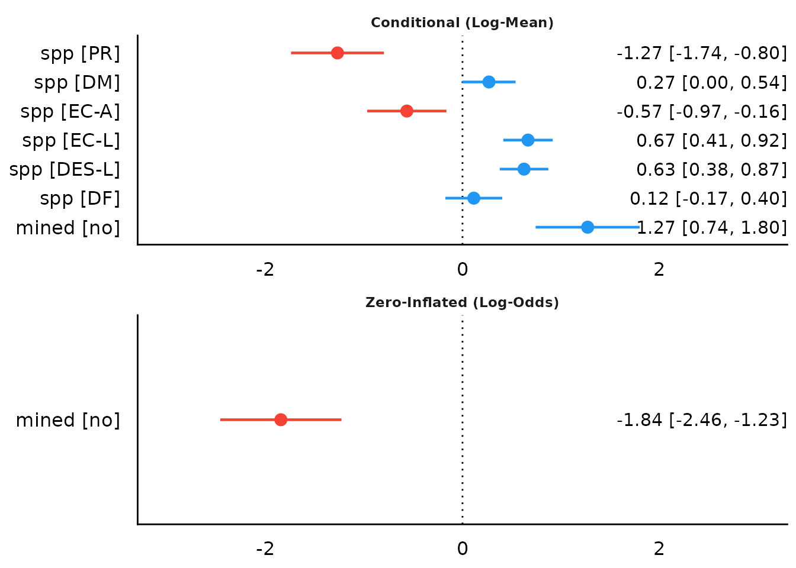

This also works for exponentiated coefficients.

``` r

result <- model_parameters(model1, exponentiate = TRUE, effects = "fixed")
plot(result, show_labels = TRUE, size_text = 4)
```

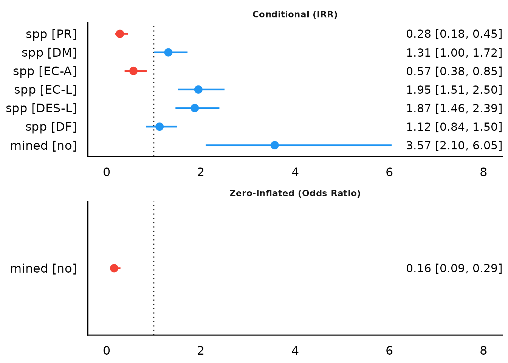

It is also possible to plot only the count-model component. This is done
in
[`model_parameters()`](https://easystats.github.io/parameters/reference/model_parameters.html)
via the `component` argument. In easystats-functions, the
count-component has the more generic name `"conditional"`.

``` r

result <- model_parameters(model1, exponentiate = TRUE, component = "conditional")
plot(result)
```


As compared to the classical
[`summary()`](https://rdrr.io/r/base/summary.html)-output,
[`model_parameters()`](https://easystats.github.io/parameters/reference/model_parameters.html),
and hence the
[`plot()`](https://rdrr.io/r/graphics/plot.default.html)-method, tries
to create human readable, prettier parameters names.

``` r

result <- model_parameters(model2)

plot(result)
```


### Including group levels of random effects

``` r

result <- model_parameters(model3, group_level = TRUE)
plot(result)
```

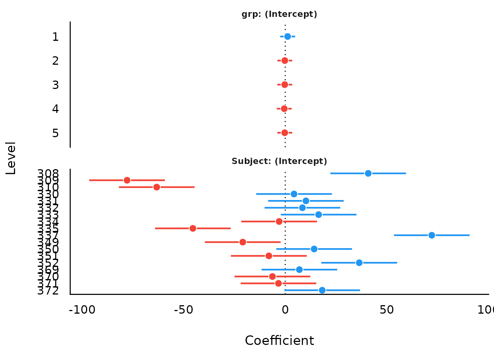

### Changing parameter names in the plot

By default,
[`model_parameters()`](https://easystats.github.io/parameters/reference/model_parameters.html)
returns a data frame, where the parameter names are found in the column
`Parameter`. These names are used by default in the generated plot:

``` r

plot(model_parameters(model4))
```

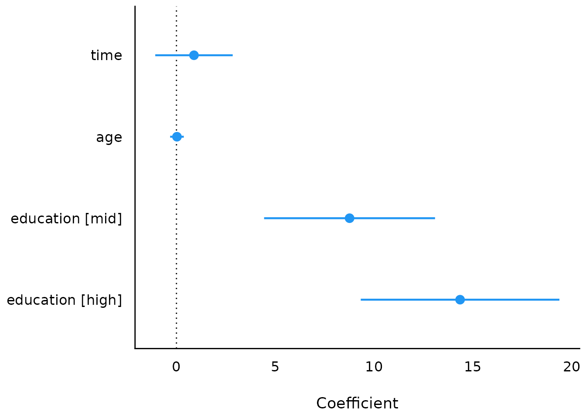

However, there are several ways to change the the names of the
parameters. Since
[`plot()`](https://rdrr.io/r/graphics/plot.default.html) returns
*ggplot* objects, these can be easily modified, e.g. by adding a
[`scale_y_discrete()`](https://ggplot2.tidyverse.org/reference/scale_discrete.html)
layer. *Note the correct order of the labels!*

``` r

library(ggplot2)
plot(model_parameters(model4)) +
  scale_y_discrete(
    labels = c("Eucation (high-level)", "Education (mid-level)", "Age", "Time")
  )
```

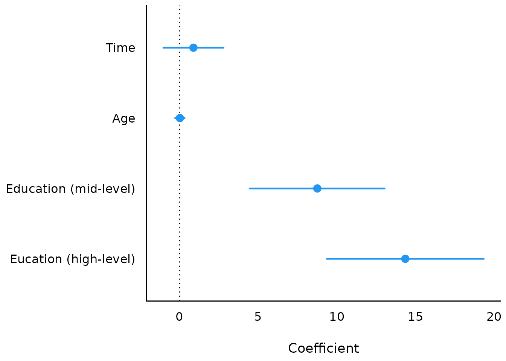

Another way would be changing the values of the `Parameter` column
before calling [`plot()`](https://rdrr.io/r/graphics/plot.default.html):

``` r

mp <- model_parameters(model4)
mp$Parameter <- c(
  "(Intercept)", "Time", "Age", "Education (mid-level)",
  "Eucation (high-level)"
)
plot(mp)
```


## Simulated Model Parameters

[`simulate_parameters()`](https://easystats.github.io/parameters/reference/simulate_parameters.html)
computes simulated draws of parameters and their related indices such as
Confidence Intervals (CI) and p-values. Simulating parameter draws can
be seen as a (computationally faster) alternative to bootstrapping.

As
[`simulate_parameters()`](https://easystats.github.io/parameters/reference/simulate_parameters.html)
is based on
[`simulate_model()`](https://easystats.github.io/parameters/reference/simulate_model.html)
and thus simulates many draws for each parameter,
[`plot()`](https://rdrr.io/r/graphics/plot.default.html) will produce
similar plots as the density estimation plots [from Bayesian
models](https://easystats.github.io/see/articles/bayestestR.html).

``` r

result <<- simulate_parameters(model1)

plot(result)
```

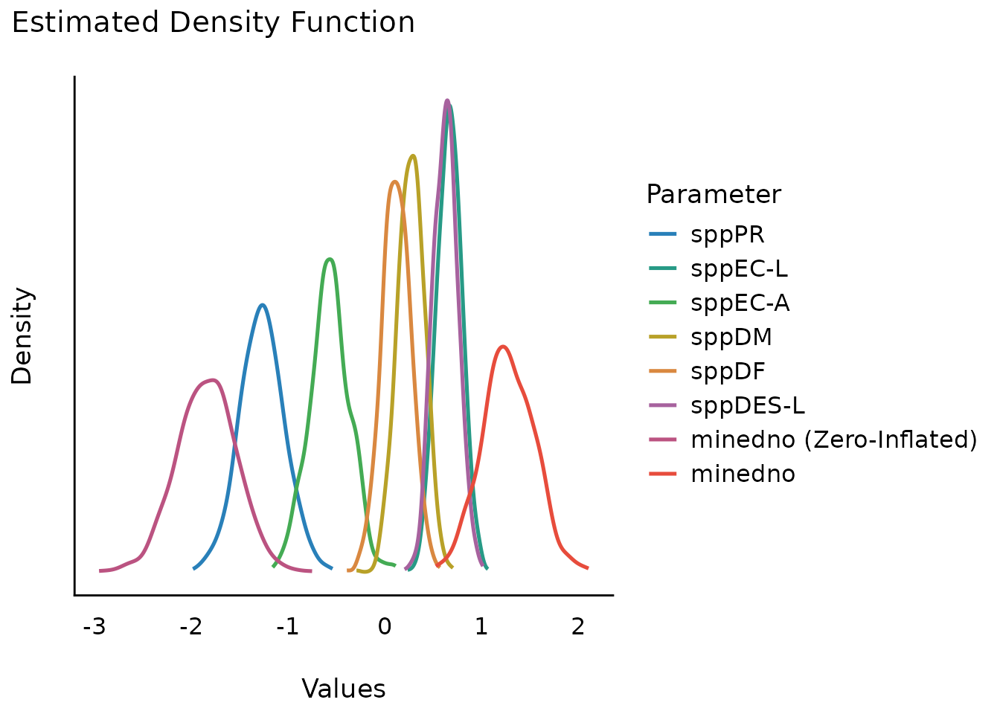

``` r

plot(result, stack = FALSE)
```

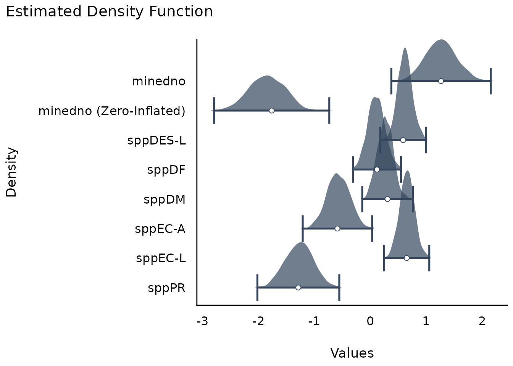

To avoid vertical overlapping, use `normalize_height`.

``` r

plot(result, stack = FALSE, normalize_height = TRUE)
```

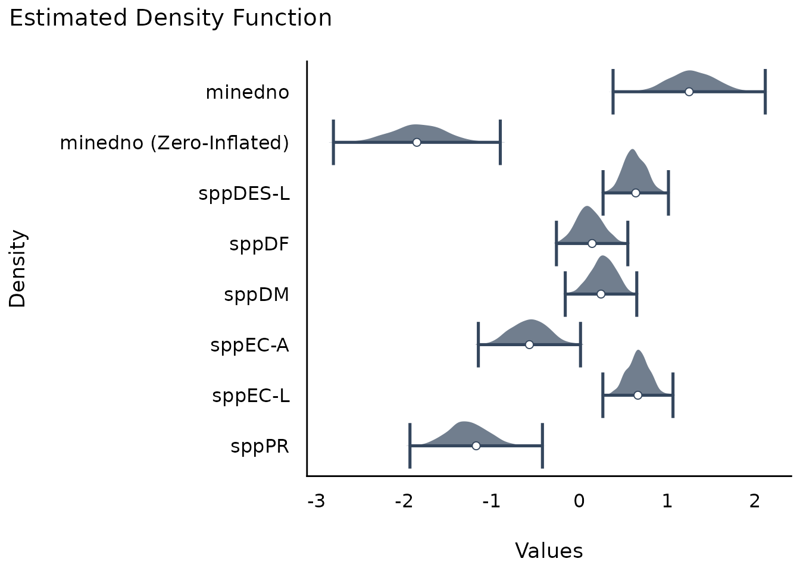

``` r

plot(result, n_columns = 2)
```

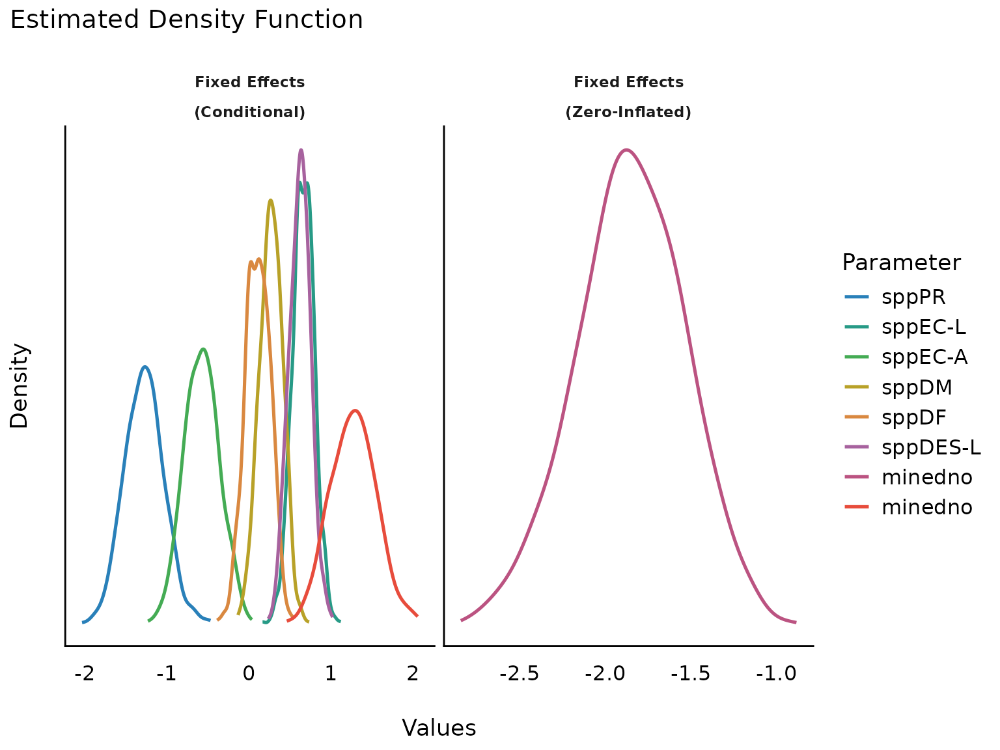

``` r

plot(result, n_columns = 2, stack = FALSE)
```

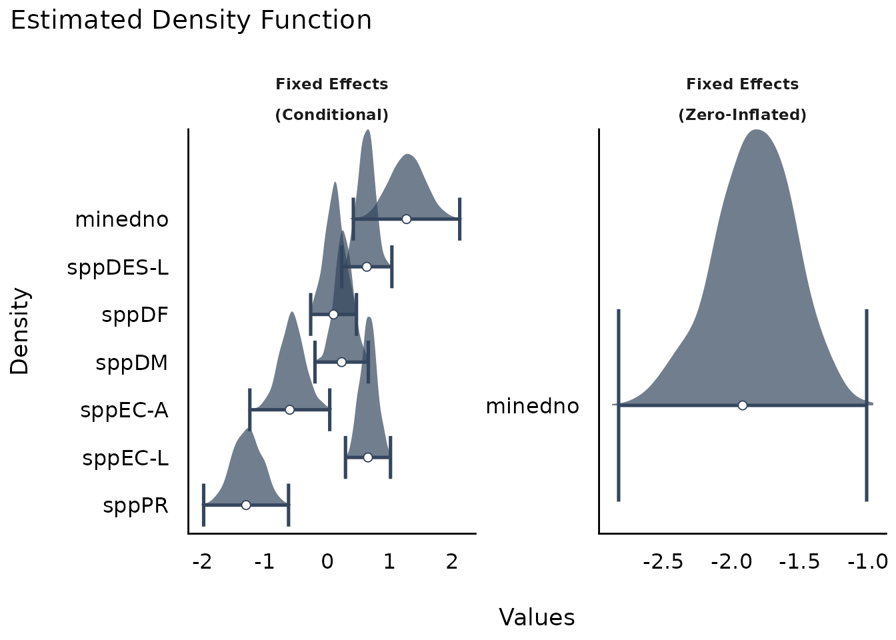

## Model Parameters of SEM models

``` r

structure <- " visual  =~ x1 + x2 + x3
               textual =~ x4 + x5 + x6
               speed   =~ x7 + x8 + x9 "

model <- lavaan::cfa(structure, data = HolzingerSwineford1939)
result <- model_parameters(model)
plot(result)
```


## Model Parameters of Bayesian models

[`model_parameters()`](https://easystats.github.io/parameters/reference/model_parameters.html)
for Bayesian models will produce “forest plots” (instead of [density
estimations](https://easystats.github.io/see/articles/bayestestR.html)).

``` r

# We download the model to save computation time. Here is the code
# to refit the exact model used below...

# zinb <- read.csv("http://stats.idre.ucla.edu/stat/data/fish.csv")
# set.seed(123)
# model <- brm(bf(
#     count ~ persons + child + camper + (1 | persons),
#     zi ~ child + camper + (1 | persons)
#   ),
#   data = zinb,
#   family = zero_inflated_poisson()
# )
brms_model <- insight::download_model("brms_zi_2")
result <- model_parameters(
  brms_model,
  effects = "all",
  component = "all",
  verbose = FALSE
)

plot(result)
```


### Including group levels of random effects

``` r

result <- model_parameters(brms_model,
  effects = "all",
  component = "all",
  group_level = TRUE,
  verbose = FALSE
)
plot(result)
```

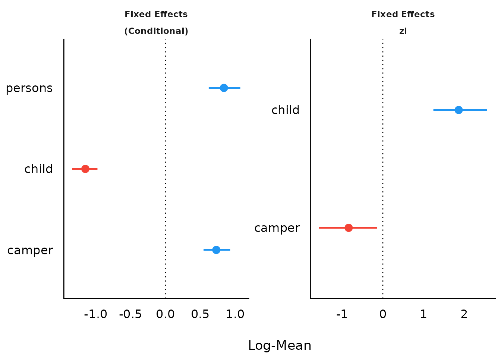

### One-column Layout

``` r

plot(result, n_column = 1)
```


### Including Intercepts and Variance Estimates for Random Intercepts

``` r

plot(result, show_intercept = TRUE)
```

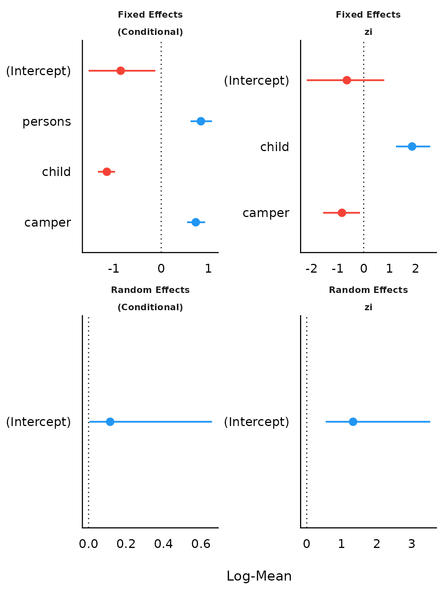

## Model Parameters of Meta-Analysis models

``` r

mydat <<- data.frame(
  effectsize = c(-0.393, 0.675, 0.282, -1.398),
  standarderror = c(0.317, 0.317, 0.13, 0.36)
)

ma <- rma(yi = effectsize, sei = standarderror, method = "REML", data = mydat)
result <- model_parameters(ma)

result
#> Meta-analysis using 'metafor'
#> 
#> Parameter | Coefficient |   SE |         95% CI |     z |      p | Weight
#> -------------------------------------------------------------------------
#> Study 1   |       -0.39 | 0.32 | [-1.01,  0.23] | -1.24 | 0.215  |   9.95
#> Study 2   |        0.68 | 0.32 | [ 0.05,  1.30] |  2.13 | 0.033  |   9.95
#> Study 3   |        0.28 | 0.13 | [ 0.03,  0.54] |  2.17 | 0.030  |  59.17
#> Study 4   |       -1.40 | 0.36 | [-2.10, -0.69] | -3.88 | < .001 |   7.72
#> Overall   |       -0.18 | 0.44 | [-1.05,  0.68] | -0.42 | 0.676  |
plot(result)
```


If `show_labels` is `TRUE`, estimates and confidence intervals are
included in the plot. Adjust the text size with `size_text`.

``` r

plot(result, show_labels = TRUE, size_text = 4)
```

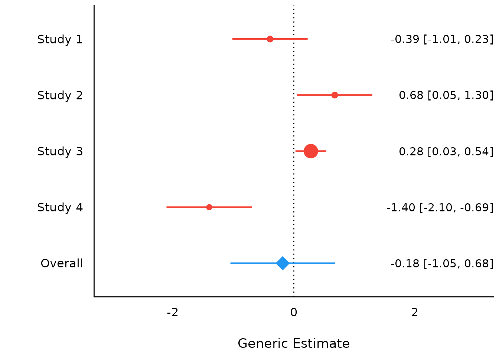

### Funnel plots

If `type = "funnel"`, a funnel plot is created.

``` r

plot(result, type = "funnel")
```


### Model Parameters of Meta-Analysis Models with Subgroups

``` r

set.seed(123)
data(dat.bcg)
dat <- escalc(
  measure = "RR",
  ai = tpos,
  bi = tneg,
  ci = cpos,
  di = cneg,
  data = dat.bcg
)
dat$author <- make.unique(dat$author)
dat$disease <- sample(c("Cancer", "CVD", "Depression"), size = nrow(dat), replace = TRUE)
mydat <<- dat
model <- rma(yi, vi, mods = ~disease, data = mydat, digits = 3, slab = author)
result <- model_parameters(model)

result
#> # Depression
#> 
#> Parameter            | Coefficient |   SE |         95% CI |     z |      p | Weight
#> ------------------------------------------------------------------------------------
#> Aronson              |       -0.89 | 0.57 | [-2.01,  0.23] | -1.56 | 0.119  |   3.07
#> Ferguson & Simes     |       -1.59 | 0.44 | [-2.45, -0.72] | -3.59 | < .001 |   5.14
#> Rosenthal et al      |       -1.35 | 0.64 | [-2.61, -0.08] | -2.09 | 0.036  |   2.41
#> Frimodt-Moller et al |       -0.22 | 0.23 | [-0.66,  0.23] | -0.96 | 0.336  |  19.53
#> Coetzee & Berjak     |       -0.47 | 0.24 | [-0.94,  0.00] | -1.98 | 0.048  |  17.72
#> Overall              |       -0.12 | 0.59 | [-1.28,  1.04] | -0.20 | 0.841  |       
#> 
#> # CVD
#> 
#> Parameter          | Coefficient |   SE |         95% CI |      z |      p | Weight
#> -----------------------------------------------------------------------------------
#> Hart & Sutherland  |       -1.44 | 0.14 | [-1.72, -1.16] | -10.19 | < .001 |  49.97
#> Stein & Aronson    |       -0.79 | 0.08 | [-0.95, -0.62] |  -9.46 | < .001 | 144.81
#> Vandiviere et al   |       -1.62 | 0.47 | [-2.55, -0.70] |  -3.43 | < .001 |   4.48
#> TPT Madras         |        0.01 | 0.06 | [-0.11,  0.14] |   0.19 | 0.849  | 252.42
#> Comstock et al     |       -0.34 | 0.11 | [-0.56, -0.12] |  -3.05 | 0.002  |  80.57
#> Comstock & Webster |        0.45 | 0.73 | [-0.98,  1.88] |   0.61 | 0.541  |   1.88
#> Overall            |        0.03 | 0.56 | [-1.08,  1.13] |   0.05 | 0.963  |       
#> 
#> # Cancer
#> 
#> Parameter         | Coefficient |   SE |         95% CI |     z |      p | Weight
#> ---------------------------------------------------------------------------------
#> Rosenthal et al.1 |       -1.37 | 0.27 | [-1.90, -0.84] | -5.07 | < .001 |  13.69
#> Comstock et al.1  |       -0.02 | 0.27 | [-0.54,  0.51] | -0.06 | 0.948  |  14.00
#> Overall           |       -0.69 | 0.49 | [-1.65,  0.26] | -1.42 | 0.155  |
plot(result)
```

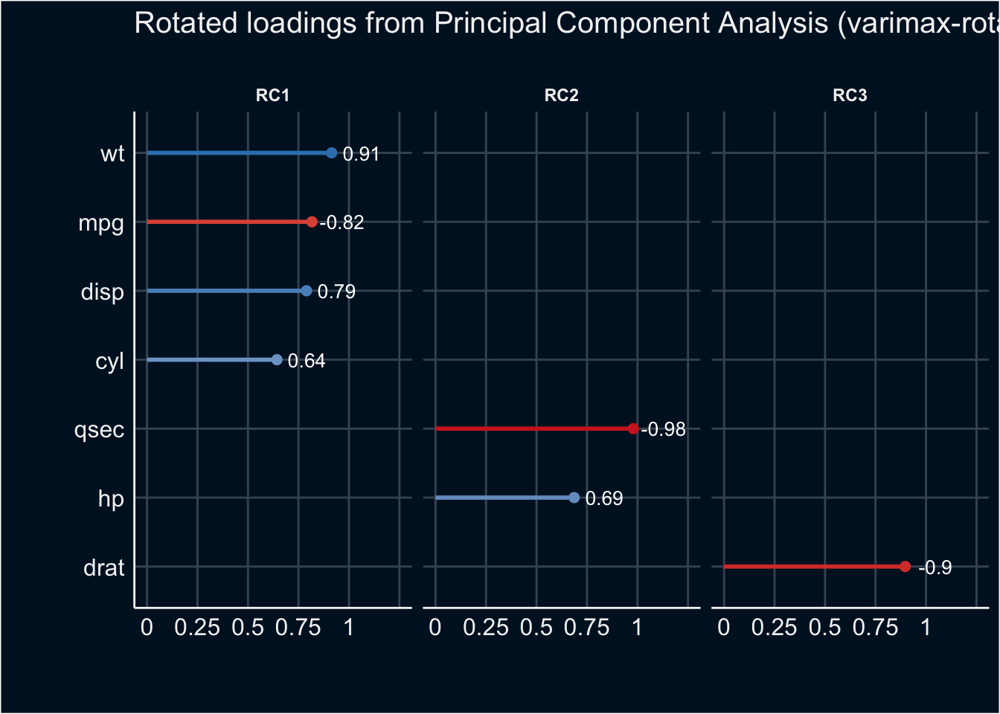

## Bayesian Meta-Analysis using brms

We download the model to save computation time, but here is the code to
refit the exact model used below:

``` r

# Data from
# https://github.com/MathiasHarrer/Doing-Meta-Analysis-in-R/blob/master/_data/Meta_Analysis_Data.RData
set.seed(123)
priors <- c(
  prior(normal(0, 1), class = Intercept),
  prior(cauchy(0, 0.5), class = sd)
)

model <- brm(
  TE | se(seTE) ~ 1 + (1 | Author),
  data = Meta_Analysis_Data,
  prior = priors,
  iter = 4000
)
```

``` r

library(brms)
model <- insight::download_model("brms_meta_1")
result <- model_parameters(model)

result
#> # Studies
#> 
#> Parameter                                  | Median |        95% CI | Weight
#> ----------------------------------------------------------------------------
#> b_Intercept                                |   0.57 | [ 0.40, 0.76] |       
#> r_Author[Call.et.al.,Intercept]            |   0.63 | [ 0.28, 1.03] |   3.83
#> r_Author[Cavanagh.et.al.,Intercept]        |   0.43 | [ 0.10, 0.75] |   5.09
#> r_Author[DanitzOrsillo,Intercept]          |   1.05 | [ 0.54, 1.67] |   2.89
#> r_Author[de.Vibe.et.al.,Intercept]         |   0.25 | [ 0.02, 0.47] |   8.49
#> r_Author[Frazier.et.al.,Intercept]         |   0.45 | [ 0.20, 0.71] |   6.91
#> r_Author[Frogeli.et.al.,Intercept]         |   0.60 | [ 0.30, 0.93] |   5.10
#> r_Author[Gallego.et.al.,Intercept]         |   0.65 | [ 0.31, 1.03] |   4.45
#> r_Author[Hazlett-Stevens.&.Oren,Intercept] |   0.54 | [ 0.20, 0.88] |   4.75
#> r_Author[Hintz.et.al.,Intercept]           |   0.36 | [ 0.08, 0.64] |   5.95
#> r_Author[Kang.et.al.,Intercept]            |   0.84 | [ 0.41, 1.40] |   2.97
#> r_Author[Kuhlmann.et.al.,Intercept]        |   0.27 | [-0.09, 0.57] |   5.14
#> r_Author[Lever.Taylor.et.al.,Intercept]    |   0.46 | [ 0.10, 0.81] |   4.33
#> r_Author[Phang.et.al.,Intercept]           |   0.55 | [ 0.19, 0.92] |   4.09
#> r_Author[Rasanen.et.al.,Intercept]         |   0.49 | [ 0.10, 0.87] |   3.88
#> r_Author[Ratanasiripong,Intercept]         |   0.54 | [ 0.09, 0.99] |   2.85
#> r_Author[Shapiro.et.al.,Intercept]         |   0.96 | [ 0.50, 1.53] |   3.17
#> r_Author[SongLindquist,Intercept]          |   0.59 | [ 0.25, 0.95] |   4.41
#> r_Author[Warnecke.et.al.,Intercept]        |   0.58 | [ 0.21, 0.96] |   4.02
#> 
#> Parameter                                  |     pd |  Rhat |  ESS
#> ------------------------------------------------------------------
#> b_Intercept                                |   100% | 1.000 | 3921
#> r_Author[Call.et.al.,Intercept]            | 99.95% |       |     
#> r_Author[Cavanagh.et.al.,Intercept]        | 99.45% |       |     
#> r_Author[DanitzOrsillo,Intercept]          |   100% |       |     
#> r_Author[de.Vibe.et.al.,Intercept]         | 98.39% |       |     
#> r_Author[Frazier.et.al.,Intercept]         | 99.91% |       |     
#> r_Author[Frogeli.et.al.,Intercept]         | 99.99% |       |     
#> r_Author[Gallego.et.al.,Intercept]         |   100% |       |     
#> r_Author[Hazlett-Stevens.&.Oren,Intercept] | 99.85% |       |     
#> r_Author[Hintz.et.al.,Intercept]           | 99.36% |       |     
#> r_Author[Kang.et.al.,Intercept]            |   100% |       |     
#> r_Author[Kuhlmann.et.al.,Intercept]        | 93.21% |       |     
#> r_Author[Lever.Taylor.et.al.,Intercept]    | 99.34% |       |     
#> r_Author[Phang.et.al.,Intercept]           | 99.83% |       |     
#> r_Author[Rasanen.et.al.,Intercept]         | 99.26% |       |     
#> r_Author[Ratanasiripong,Intercept]         | 99.01% |       |     
#> r_Author[Shapiro.et.al.,Intercept]         |   100% |       |     
#> r_Author[SongLindquist,Intercept]          | 99.95% |       |     
#> r_Author[Warnecke.et.al.,Intercept]        | 99.81% |       |     
#> 
#> # Tau
#> 
#> Parameter            | Median |       95% CI |   pd
#> ---------------------------------------------------
#> sd_Author__Intercept |   0.29 | [0.12, 0.51] | 100%
plot(result)
```


## Comparison of Models

*([related function
documentation](https://easystats.github.io/parameters/reference/compare_parameters.html))*

``` r

data(iris)
# shorter variable name
iris$Length <- iris$Petal.Length
lm1 <- lm(Sepal.Length ~ Species, data = iris)
lm2 <- lm(Sepal.Length ~ Species + Length, data = iris)
lm3 <- lm(Sepal.Length ~ Species * Length, data = iris)

result <- compare_parameters(lm1, lm2, lm3)
plot(result)
```

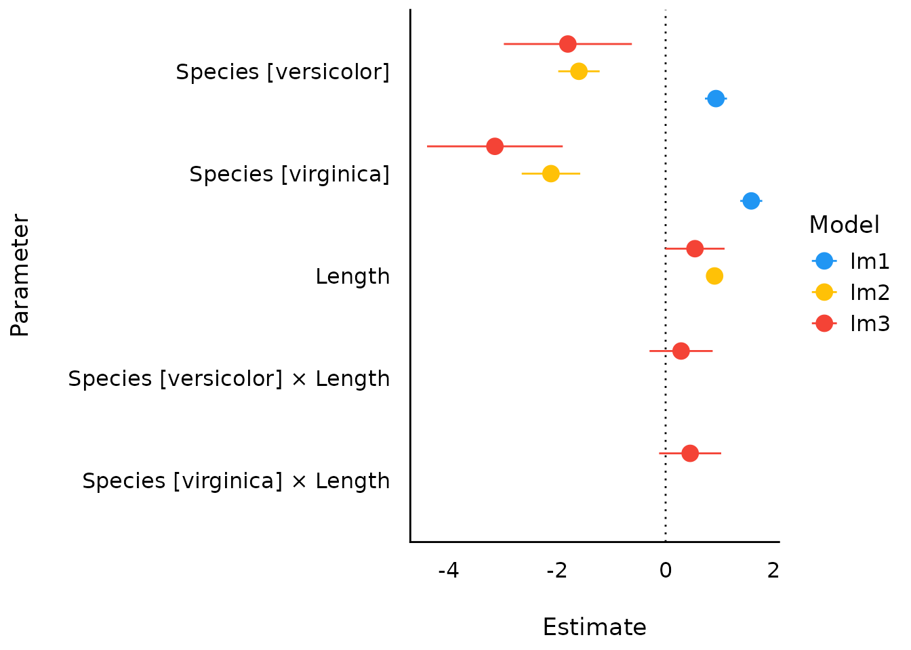

``` r

plot(result, size_text = 3.8) +
  labs(y = NULL) +
  theme(legend.position = "bottom")
```


## Equivalence Testing

*([related function
documentation](https://easystats.github.io/parameters/reference/equivalence_test.lm.html))*

### For fixed effects

``` r

# default rules, like in bayestestR::equivalence_test()
result <- equivalence_test(model4)
result
#> # TOST-test for Practical Equivalence
#> 
#>   ROPE: [-1.99 1.99]
#> 
#> Parameter        |         90% CI |   SGPV | Equivalence |      p
#> -----------------------------------------------------------------
#> (Intercept)      | [59.33, 68.41] | < .001 |    Rejected | > .999
#> time             | [-0.76,  2.53] | 0.905  |   Undecided | 0.137 
#> age              | [-0.26,  0.32] | > .999 |    Accepted | < .001
#> education [mid]  | [ 5.13, 12.39] | < .001 |    Rejected | 0.999 
#> education [high] | [10.14, 18.57] | < .001 |    Rejected | > .999

plot(result)
```


``` r

result <- equivalence_test(model4, rule = "cet")
result
#> # Conditional Equivalence Testing
#> 
#>   ROPE: [-1.99 1.99]
#> 
#> Parameter        |         90% CI |   SGPV | Equivalence |      p
#> -----------------------------------------------------------------
#> (Intercept)      | [59.33, 68.41] | < .001 |    Rejected | > .999
#> time             | [-0.76,  2.53] | 0.905  |   Undecided | 0.137 
#> age              | [-0.26,  0.32] | > .999 |    Accepted | < .001
#> education [mid]  | [ 5.13, 12.39] | < .001 |    Rejected | 0.999 
#> education [high] | [10.14, 18.57] | < .001 |    Rejected | > .999

plot(result)
```


### For random effects

``` r

result <- equivalence_test(model3, effects = "random")
result
#> # TOST-test for Practical Equivalence
#> 
#>   ROPE: [-5.63 5.63]
#> 
#> Group: grp
#> 
#> Parameter | Estimate | Group |           90% CI |   SGPV | Equivalence
#> ----------------------------------------------------------------------
#> 1         |     1.18 |   grp | [ -1.91,   4.28] | 0.998  |    Accepted
#> 2         |    -0.21 |   grp | [ -3.27,   2.84] | > .999 |    Accepted
#> 3         |    -0.25 |   grp | [ -3.33,   2.83] | > .999 |    Accepted
#> 4         |    -0.48 |   grp | [ -3.56,   2.60] | > .999 |    Accepted
#> 5         |    -0.24 |   grp | [ -3.33,   2.85] | > .999 |    Accepted
#> Group: Subject
#> 
#> Parameter | Estimate |   Group |           90% CI |   SGPV | Equivalence
#> ------------------------------------------------------------------------
#> 308       |    40.86 | Subject | [ 25.22,  56.50] | < .001 |    Rejected
#> 309       |   -77.88 | Subject | [-93.51, -62.24] | < .001 |    Rejected
#> 310       |   -63.28 | Subject | [-78.91, -47.65] | < .001 |    Rejected
#> 330       |     4.32 | Subject | [-11.32,  19.96] | 0.459  |   Undecided
#> 331       |    10.18 | Subject | [ -5.45,  25.80] | 0.261  |   Undecided
#> 332       |     8.47 | Subject | [ -7.17,  24.10] | 0.323  |   Undecided
#> 333       |    16.44 | Subject | [  0.81,  32.07] | 0.085  |    Rejected
#> 334       |    -3.00 | Subject | [-18.65,  12.65] | 0.489  |   Undecided
#> 335       |   -45.48 | Subject | [-61.11, -29.85] | < .001 |    Rejected
#> 337       |    72.16 | Subject | [ 56.54,  87.79] | < .001 |    Rejected
#> 349       |   -20.91 | Subject | [-36.57,  -5.25] | 0.028  |    Rejected
#> 350       |    14.23 | Subject | [ -1.41,  29.88] | 0.134  |   Undecided
#> 351       |    -8.07 | Subject | [-23.74,   7.59] | 0.337  |   Undecided
#> 352       |    36.44 | Subject | [ 20.76,  52.12] | < .001 |    Rejected
#> 369       |     6.97 | Subject | [ -8.66,  22.60] | 0.376  |   Undecided
#> 370       |    -6.31 | Subject | [-21.96,   9.34] | 0.399  |   Undecided
#> 371       |    -3.34 | Subject | [-18.96,  12.29] | 0.483  |   Undecided
#> 372       |    18.21 | Subject | [  2.57,  33.84] | 0.056  |    Rejected

plot(result)
```

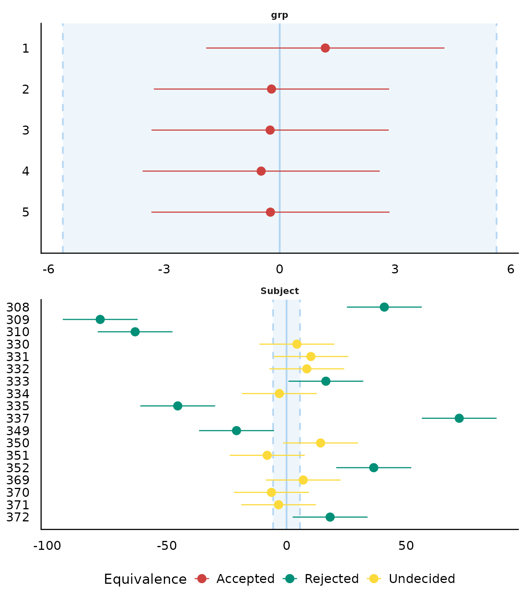

## p-value function and consonance/compatibility plot

*([related function
documentation](https://easystats.github.io/parameters/reference/p_function.html))*

``` r

data(iris)
model <- lm(Sepal.Length ~ Species, data = iris)

result <- p_function(model)
plot(result)
```


``` r


result <- p_function(model, ci_levels = c(0.5, 0.7, emph = 0.9))
plot(result, size_line = c(0.6, 1.2))
```

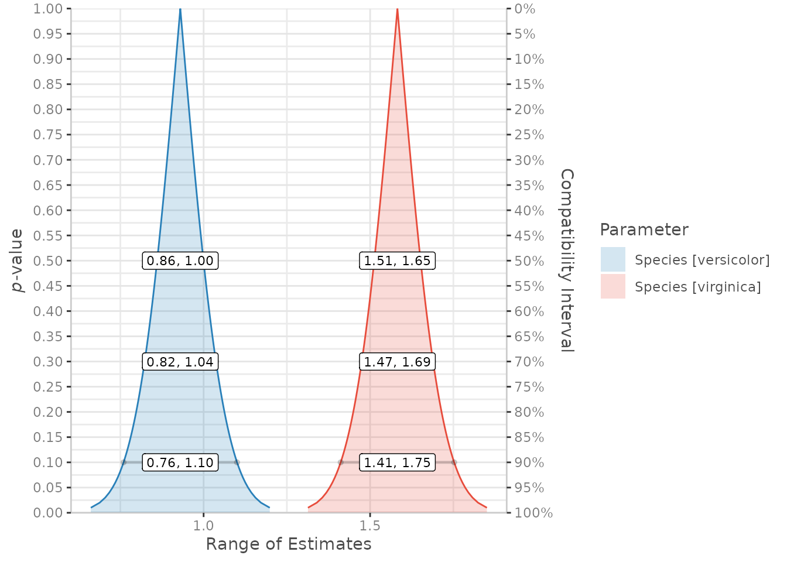

## Probability of Direction

*([related function
documentation](https://easystats.github.io/parameters/reference/p_direction.lm.html))*

``` r

data(qol_cancer)
model <- lm(QoL ~ time + age + education, data = qol_cancer)
result <- p_direction(model)

plot(result)
```

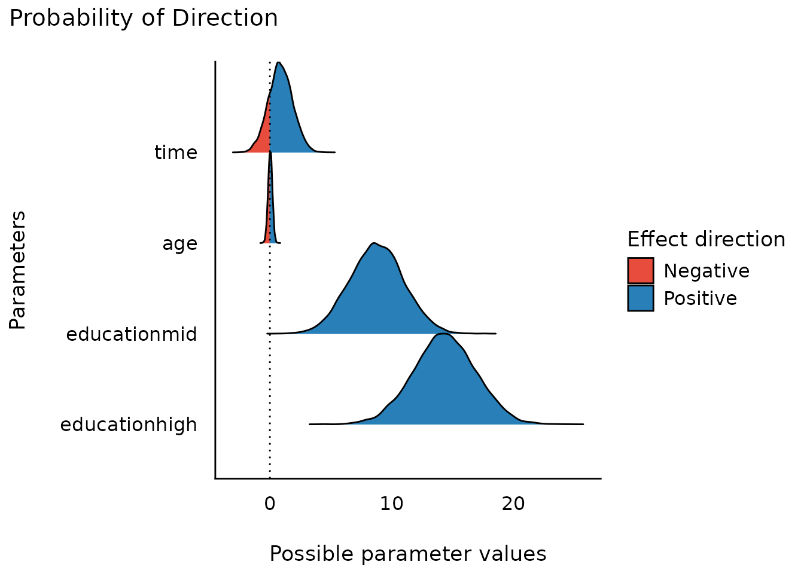

## Practical Significance

*([related function
documentation](https://easystats.github.io/parameters/reference/p_significance.lm.html))*

``` r

data(qol_cancer)
model <- lm(QoL ~ time + age + education, data = qol_cancer)
result <- p_significance(model)

plot(result)
```


## Principal Component Analysis

*([related function
documentation](https://easystats.github.io/parameters/reference/principal_components.html))*

``` r

data(mtcars)
result <- principal_components(mtcars[, 1:7], n = "all", threshold = 0.2)
result
#> # Loadings from Principal Component Analysis (no rotation)
#> 
#> Variable |   PC1 |   PC2 |  PC3 |   PC4 |  PC5 |   PC6 | Complexity
#> -------------------------------------------------------------------
#> mpg      | -0.93 |       |      | -0.30 |      |       |       1.30
#> cyl      |  0.96 |       |      |       |      | -0.21 |       1.18
#> disp     |  0.95 |       |      | -0.23 |      |       |       1.16
#> hp       |  0.87 |  0.36 |      |       | 0.30 |       |       1.64
#> drat     | -0.75 |  0.48 | 0.44 |       |      |       |       2.47
#> wt       |  0.88 | -0.35 | 0.26 |       |      |       |       1.54
#> qsec     | -0.54 | -0.81 |      |       |      |       |       1.96
#> 
#> The 6 principal components accounted for 99.30% of the total variance of the original data (PC1 = 72.66%, PC2 = 16.52%, PC3 = 4.93%, PC4 = 2.26%, PC5 = 1.85%, PC6 = 1.08%).

plot(result)
```


``` r

result <- principal_components(
  mtcars[, 1:7],
  n = 3,
  rotation = "varimax",
  threshold = "max",
  sort = TRUE
)

result
#> # Rotated loadings from Principal Component Analysis (varimax-rotation)
#> 
#> Variable |   RC1 |   RC2 |   RC3 | Complexity | Uniqueness |  MSA
#> -----------------------------------------------------------------
#> wt       |  0.91 |       |       |       1.31 |       0.03 | 0.77
#> mpg      | -0.82 |       |       |       1.70 |       0.11 | 0.87
#> disp     |  0.79 |       |       |       1.95 |       0.08 | 0.85
#> cyl      |  0.64 |       |       |       2.84 |       0.06 | 0.87
#> qsec     |       | -0.98 |       |       1.02 |       0.03 | 0.61
#> hp       |       |  0.69 |       |       2.09 |       0.09 | 0.90
#> drat     |       |       | -0.90 |       1.43 |       0.01 | 0.85
#> 
#> The 3 principal components (varimax rotation) accounted for 94.11% of the total variance of the original data (RC1 = 45.02%, RC2 = 27.79%, RC3 = 21.30%).

plot(result, type = "line", text_color = "white") +
  theme_abyss()
```

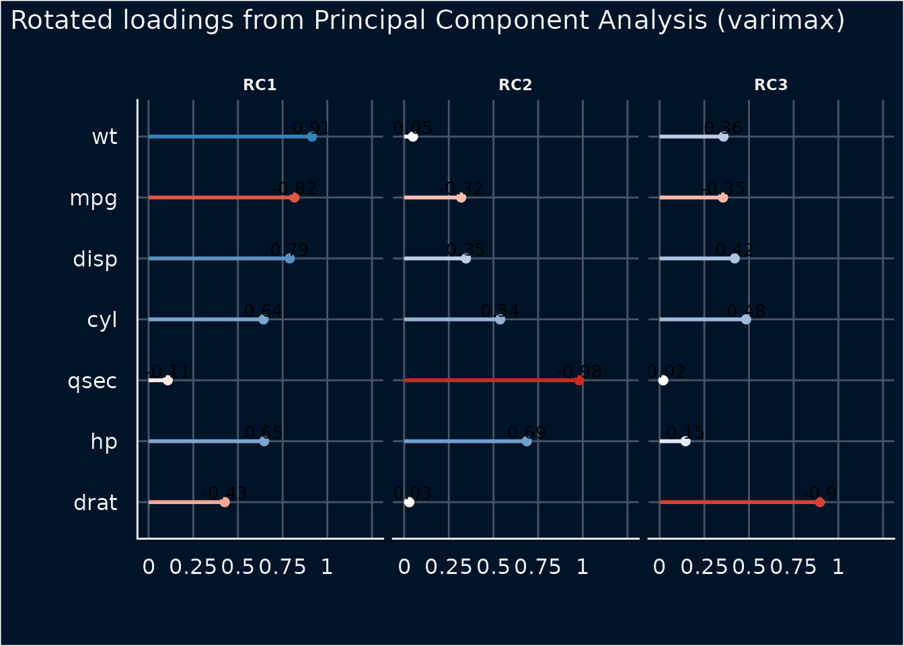

## Cluster Analysis

*([related function
documentation](https://easystats.github.io/parameters/reference/cluster_analysis.html))*

### Clustering solution

``` r

data(iris)
result <- cluster_analysis(iris[, 1:4], n = 3)
result
#> # Clustering Solution
#> 
#> The 3 clusters accounted for 76.70% of the total variance of the original data.
#> 
#> Cluster | n_Obs | Sum_Squares | Sepal.Length | Sepal.Width | Petal.Length | Petal.Width
#> ---------------------------------------------------------------------------------------
#> 1       |    53 |       44.09 |        -0.05 |       -0.88 |         0.35 |        0.28
#> 2       |    50 |       47.35 |        -1.01 |        0.85 |        -1.30 |       -1.25
#> 3       |    47 |       47.45 |         1.13 |        0.09 |         0.99 |        1.01
#> 
#> # Indices of model performance
#> 
#> Sum_Squares_Total | Sum_Squares_Between | Sum_Squares_Within |    R2
#> --------------------------------------------------------------------
#> 596               |             457.112 |            138.888 | 0.767
#> 
#> # You can access the predicted clusters via `predict()`.
plot(result)
```

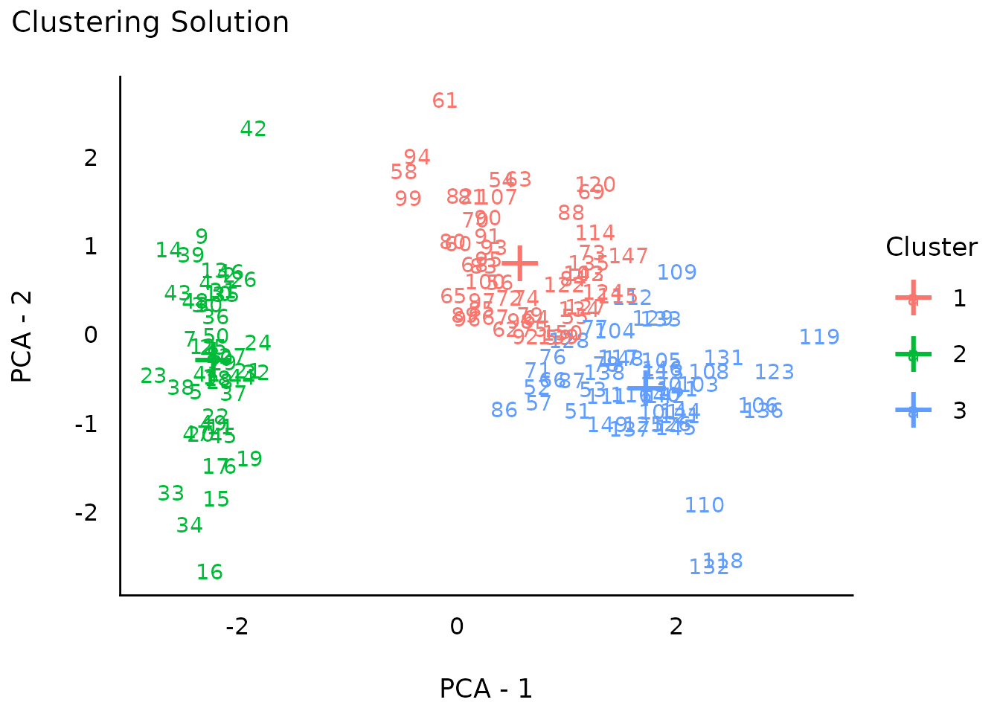

``` r


result <- cluster_analysis(iris[, 1:4], n = 4)
plot(result)
```

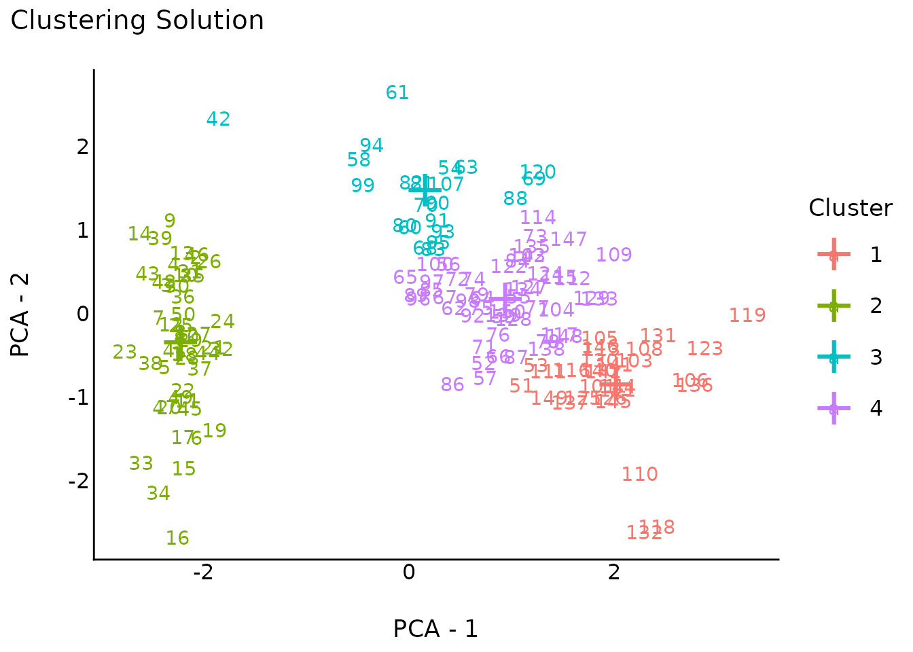

### Cluster centers

``` r

s <- summary(result)
s
#>   Cluster Sepal.Length Sepal.Width Petal.Length Petal.Width
#> 1       1    1.3926646   0.2323817   1.15674505  1.21327591
#> 2       2   -0.9987207   0.9032290  -1.29875725 -1.25214931
#> 3       3   -0.4201099  -1.4246794   0.03924137 -0.05279511
#> 4       4    0.3558492  -0.3930869   0.58460377  0.54663615

plot(s)
```


## Number of Components/Factors to Retain

*([related function
documentation](https://easystats.github.io/parameters/reference/n_factors.html))*

``` r

data(mtcars)
result <- n_factors(mtcars, type = "PCA")
result
#> # Method Agreement Procedure:
#> 
#> The choice of 3 dimensions is supported by 5 (29.41%) methods out of 17 (Bartlett, CNG, Scree (SE), Scree (R2), Velicer's MAP).

plot(result)
```

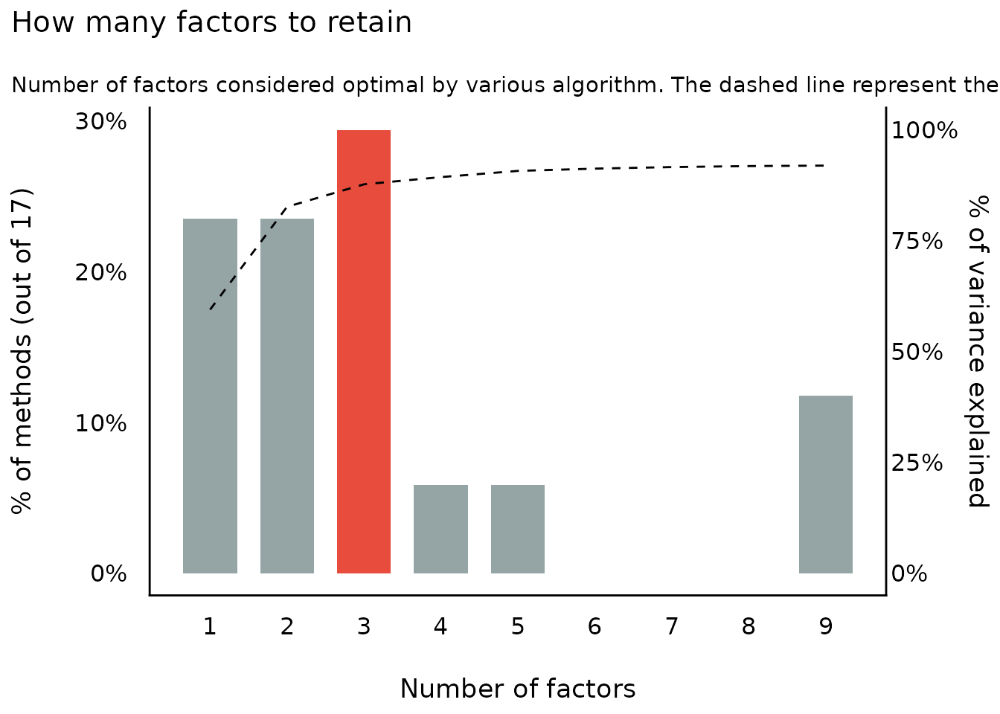

``` r

plot(result, type = "line")
```

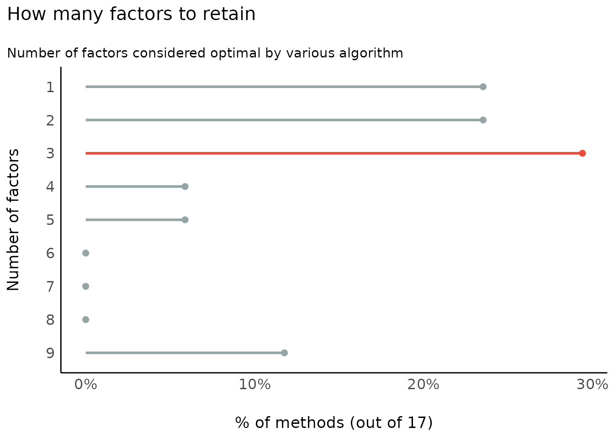

## Number of Clusters to Retain

*([related function
documentation](https://easystats.github.io/parameters/reference/n_clusters.html))*

``` r

data(iris)
result <- n_clusters(standardize(iris[, 1:4]))
result
#> # Method Agreement Procedure:
#> 
#> The choice of 2 clusters is supported by 15 (51.72%) methods out of 29 (Elbow, Silhouette, Gap_Maechler2012, Gap_Dudoit2002, Ch, DB, Duda, Pseudot2, Beale, Ratkowsky, PtBiserial, Mcclain, Dunn, SDindex, Mixture (VVV)).

plot(result)
```

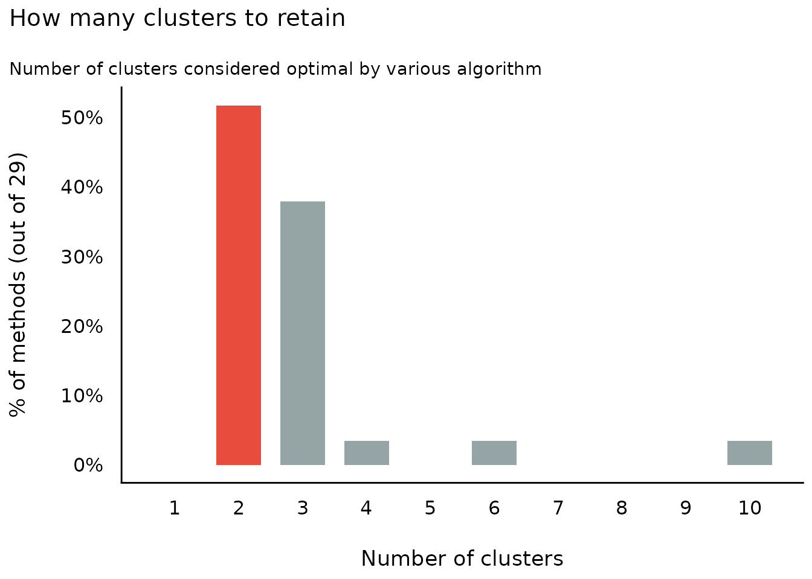

``` r

plot(result, type = "line")
```

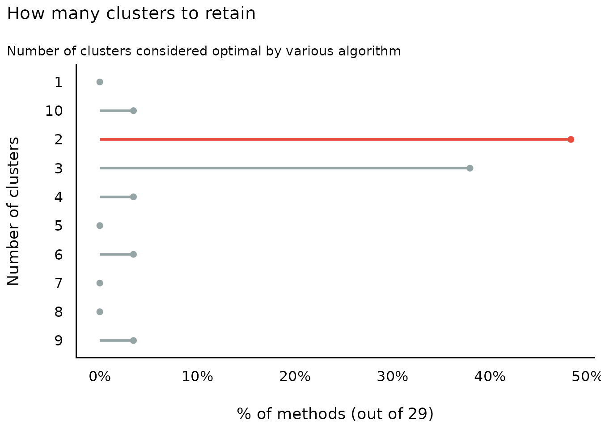
