# Plotting Functions for the 'performance' Package

This vignette can be referred to by citing the package:

[`citation`](https://rdrr.io/r/utils/citation.html)`(``"see"``)`` ``#> To cite package 'see' in publications use:`` ``#> `` ``#> Lüdecke et al., (2021). see: An R Package for Visualizing Statistical`` ``#> Models. Journal of Open Source Software, 6(64), 3393.`` ``#> https://doi.org/10.21105/joss.03393`` ``#> `` ``#> A BibTeX entry for LaTeX users is`` ``#> `` ``#> @Article{,`` ``#> title = {{see}: An {R} Package for Visualizing Statistical Models},`` ``#> author = {Daniel Lüdecke and Indrajeet Patil and Mattan S. Ben-Shachar and Brenton M. Wiernik and Philip Waggoner and Dominique Makowski},`` ``#> journal = {Journal of Open Source Software},`` ``#> year = {2021},`` ``#> volume = {6},`` ``#> number = {64},`` ``#> pages = {3393},`` ``#> doi = {10.21105/joss.03393},`` ``#> }`

## Introduction

A crucial aspect when building regression models is to evaluate the
quality of modelfit. It is important to investigate how well models fit
to the data and which fit indices to report. Functions to create
diagnostic plots or to compute fit measures do exist, however, mostly
spread over different packages. There is no unique and consistent
approach to assess the model quality for different kind of models.

The primary goal of the *performance* package in *easystats* ecosystem
is to fill this gap and to provide utilities for computing **indices of
model quality** and **goodness of fit**. These include measures like
r-squared (R2), root mean squared error (RMSE) or intraclass correlation
coefficient (ICC) , but also functions to check (mixed) models for
overdispersion, zero-inflation, convergence or singularity.

For more, see: <https://easystats.github.io/performance/>

## Checking Model Assumptions

Let’s load the needed libraries first:

[`library`](https://rdrr.io/r/base/library.html)`(`[`performance`](https://easystats.github.io/performance/)`)`` `[`library`](https://rdrr.io/r/base/library.html)`(`[`lme4`](https://github.com/lme4/lme4/)`)`` `[`library`](https://rdrr.io/r/base/library.html)`(`[`see`](https://easystats.github.io/see/)`)`

### Binned Residuals

*([related function
documentation](https://easystats.github.io/performance/reference/binned_residuals.html))*

Example where model is **not** a good fit.

`model`` ``<-`` `[`glm`](https://rdrr.io/r/stats/glm.html)`(``vs`` ``~`` ``wt`` ``+`` ``mpg``, data ``=`` ``mtcars``, family ``=`` ``"binomial"``)`` ``result`` ``<-`` `[`binned_residuals`](https://easystats.github.io/performance/reference/binned_residuals.html)`(``model``)`` ``result`` ``#> Warning: Probably bad model fit. Only about 50% of the residuals are inside the error bounds.`` `` `[`plot`](https://rdrr.io/r/graphics/plot.default.html)`(``result``)`

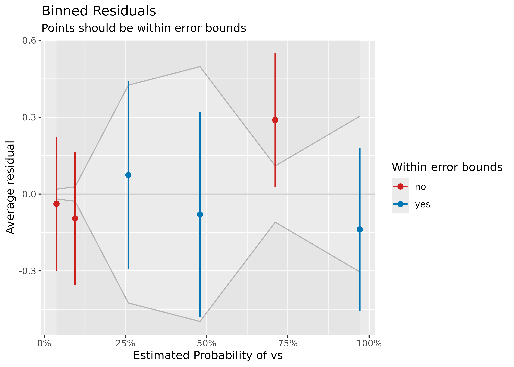

Example where model **is** a good fit.

`model`` ``<-`` `[`suppressWarnings`](https://rdrr.io/r/base/warning.html)`(`[`glm`](https://rdrr.io/r/stats/glm.html)`(``am`` ``~`` ``mpg`` ``+`` ``vs`` ``+`` ``cyl``, data ``=`` ``mtcars``, family ``=`` ``"binomial"``)``)`` ``result`` ``<-`` `[`binned_residuals`](https://easystats.github.io/performance/reference/binned_residuals.html)`(``model``)`` ``result`` ``#> Ok: About 100% of the residuals are inside the error bounds.`` `` `[`plot`](https://rdrr.io/r/graphics/plot.default.html)`(``result``)`

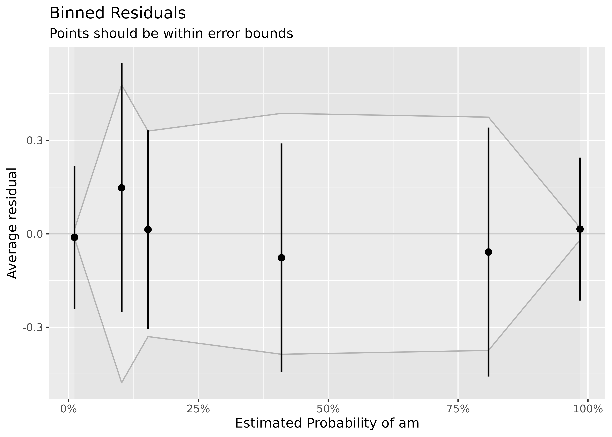

### Check for Multicollinearity - Variance Inflation Factor

*([related function
documentation](https://easystats.github.io/performance/reference/check_collinearity.html))*

`m`` ``<-`` `[`lm`](https://rdrr.io/r/stats/lm.html)`(``mpg`` ``~`` ``wt`` ``+`` ``cyl`` ``+`` ``gear`` ``+`` ``disp``, data ``=`` ``mtcars``)`` ``result`` ``<-`` `[`check_collinearity`](https://easystats.github.io/performance/reference/check_collinearity.html)`(``m``)`` `` ``result`` ``#> # Check for Multicollinearity`` ``#> `` ``#> Low Correlation`` ``#> `` ``#> Term VIF VIF 95% CI adj. VIF Tolerance Tolerance 95% CI`` ``#> gear 1.53 [1.19, 2.51] 1.24 0.65 [0.40, 0.84]`` ``#> `` ``#> Moderate Correlation`` ``#> `` ``#> Term VIF VIF 95% CI adj. VIF Tolerance Tolerance 95% CI`` ``#> wt 5.05 [3.21, 8.41] 2.25 0.20 [0.12, 0.31]`` ``#> cyl 5.41 [3.42, 9.04] 2.33 0.18 [0.11, 0.29]`` ``#> disp 9.97 [6.08, 16.85] 3.16 0.10 [0.06, 0.16]`` `[`plot`](https://rdrr.io/r/graphics/plot.default.html)`(``result``)`

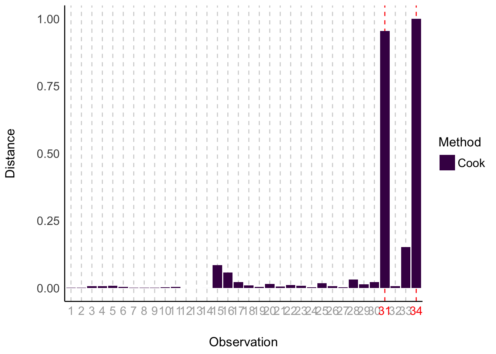

[`library`](https://rdrr.io/r/base/library.html)`(`[`glmmTMB`](https://github.com/glmmTMB/glmmTMB)`)`` `[`data`](https://rdrr.io/r/utils/data.html)`(``Salamanders``)`` `` ``# create highly correlated pseudo-variable`` `[`set.seed`](https://rdrr.io/r/base/Random.html)`(``1``)`` ``Salamanders``$``cover2`` ``<-`` `` ``Salamanders``$``cover`` ``*`` `[`runif`](https://rdrr.io/r/stats/Uniform.html)`(``n ``=`` `[`nrow`](https://rdrr.io/r/base/nrow.html)`(``Salamanders``)``, min ``=`` ``0.7``, max ``=`` ``1.5``)`` `` ``# fit mixed model with zero-inflation`` ``model`` ``<-`` `[`glmmTMB`](https://rdrr.io/pkg/glmmTMB/man/glmmTMB.html)`(`` `` ``count`` ``~`` ``spp`` ``+`` ``mined`` ``+`` ``cover`` ``+`` ``cover2`` ``+`` ``(``1`` ``|`` ``site``)``,`` `` ziformula ``=`` ``~`` ``spp`` ``+`` ``mined``,`` `` family ``=`` ``truncated_poisson``,`` `` data ``=`` ``Salamanders`` ``)`` `` ``result`` ``<-`` `[`check_collinearity`](https://easystats.github.io/performance/reference/check_collinearity.html)`(``model``)`` `` ``result`` ``#> # Check for Multicollinearity`` ``#> `` ``#> * conditional component:`` ``#> `` ``#> Low Correlation`` ``#> `` ``#> Term VIF VIF 95% CI adj. VIF Tolerance Tolerance 95% CI`` ``#> spp 1.07 [ 1.02, 1.24] 1.04 0.93 [0.81, 0.98]`` ``#> mined 1.17 [ 1.10, 1.31] 1.08 0.85 [0.76, 0.91]`` ``#> `` ``#> High Correlation`` ``#> `` ``#> Term VIF VIF 95% CI adj. VIF Tolerance Tolerance 95% CI`` ``#> cover 13.45 [11.66, 15.55] 3.67 0.07 [0.06, 0.09]`` ``#> cover2 13.28 [11.51, 15.35] 3.64 0.08 [0.07, 0.09]`` ``#> `` ``#> * zero inflated component:`` ``#> `` ``#> Low Correlation`` ``#> `` ``#> Term VIF VIF 95% CI adj. VIF Tolerance Tolerance 95% CI`` ``#> spp 1.08 [1.03, 1.24] 1.04 0.93 [0.81, 0.97]`` ``#> mined 1.08 [1.03, 1.24] 1.04 0.93 [0.81, 0.97]`` `[`plot`](https://rdrr.io/r/graphics/plot.default.html)`(``result``)`

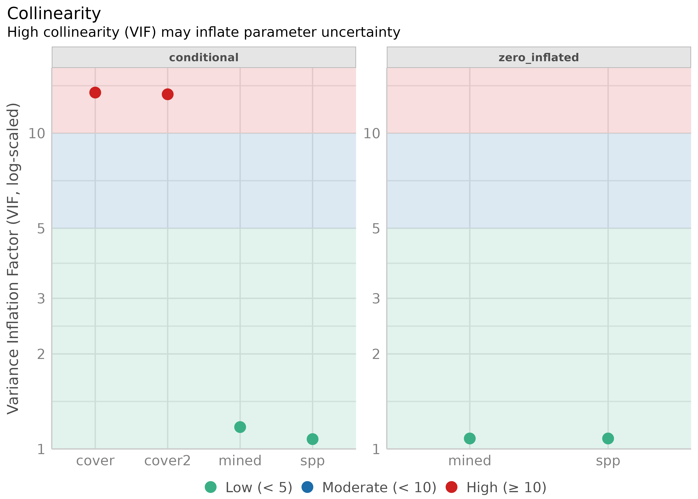

### Check for Outliers

*([related function
documentation](https://easystats.github.io/performance/reference/check_outliers.html))*

`# select only mpg and disp (continuous)`` ``mt1`` ``<-`` ``mtcars``[``, `[`c`](https://rdrr.io/r/base/c.html)`(``1``, ``3``, ``4``)``]`` ``# create some fake outliers and attach outliers to main df`` ``mt2`` ``<-`` `[`rbind`](https://rdrr.io/r/base/cbind.html)`(``mt1``, `[`data.frame`](https://rdrr.io/r/base/data.frame.html)`(``mpg ``=`` `[`c`](https://rdrr.io/r/base/c.html)`(``37``, ``40``)``, disp ``=`` `[`c`](https://rdrr.io/r/base/c.html)`(``300``, ``400``)``, hp ``=`` `[`c`](https://rdrr.io/r/base/c.html)`(``110``, ``120``)``)``)`` ``# fit model with outliers`` ``model`` ``<-`` `[`lm`](https://rdrr.io/r/stats/lm.html)`(``disp`` ``~`` ``mpg`` ``+`` ``hp``, data ``=`` ``mt2``)`` ``result`` ``<-`` `[`check_outliers`](https://easystats.github.io/performance/reference/check_outliers.html)`(``model``)`` `` ``result`` ``#> 2 outliers detected: cases 31, 34.`` ``#> - Based on the following method and threshold: cook (0.806).`` ``#> - For variable: (Whole model).`

There are two visualization options

#### dot-plot with contour lines

[`plot`](https://rdrr.io/r/graphics/plot.default.html)`(``result``, type ``=`` ``"dots"``)`

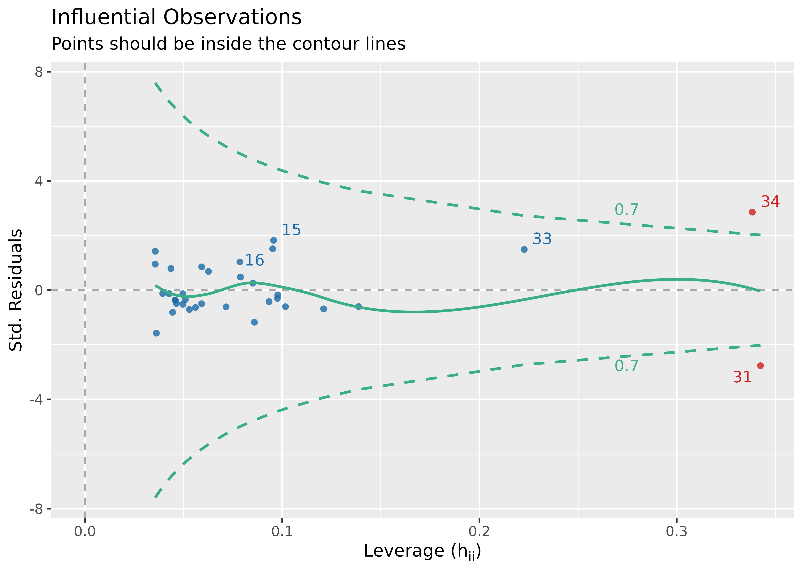

#### bars indicating influential observations

[`plot`](https://rdrr.io/r/graphics/plot.default.html)`(``result``, type ``=`` ``"bars"``)`

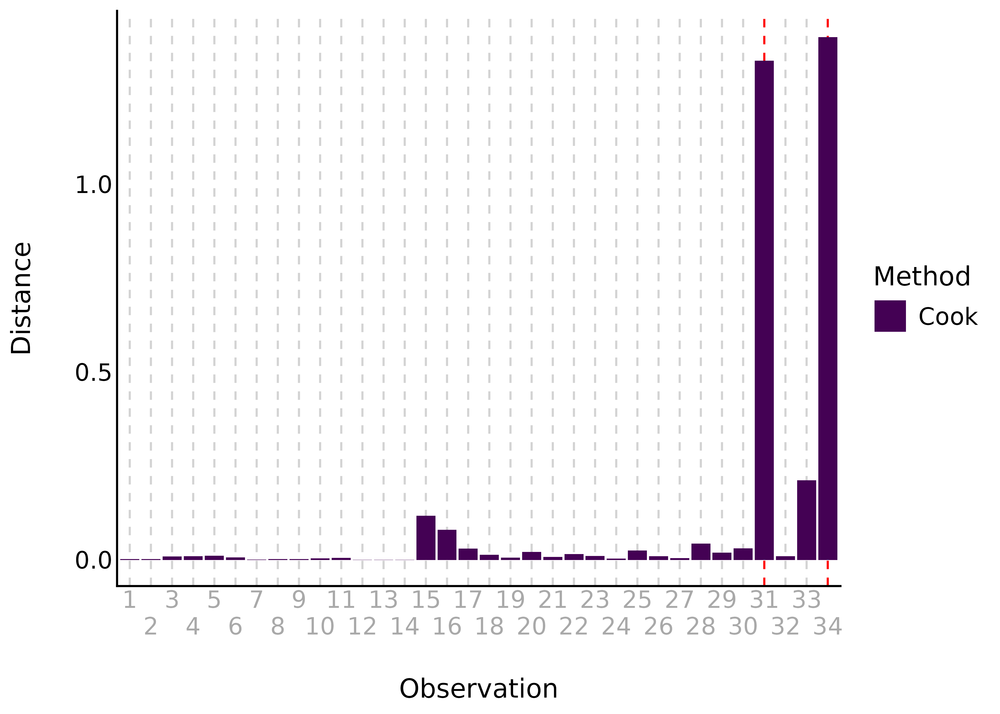

### Check for Normal Distributed Residuals

*([related function
documentation](https://easystats.github.io/performance/reference/check_normality.html))*

`model2`` ``<-`` `[`lm`](https://rdrr.io/r/stats/lm.html)`(``mpg`` ``~`` ``wt`` ``+`` ``cyl`` ``+`` ``gear`` ``+`` ``disp``, data ``=`` ``mtcars``)`` ``result2`` ``<-`` `[`check_normality`](https://easystats.github.io/performance/reference/check_normality.html)`(``model2``)`

#### Density Plot

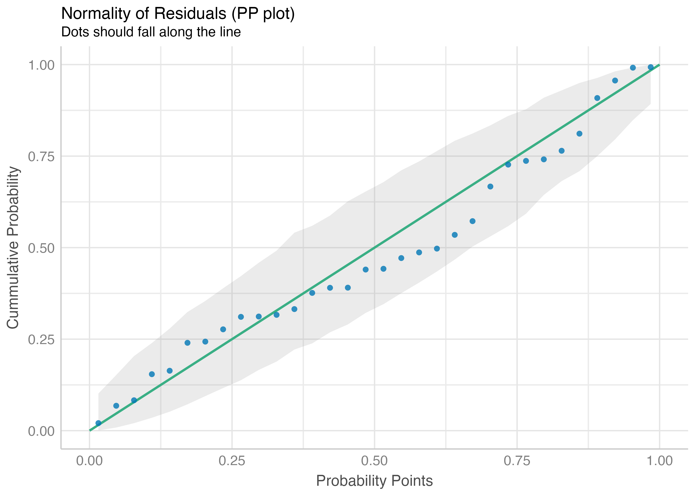

[`plot`](https://rdrr.io/r/graphics/plot.default.html)`(``result2``, type ``=`` ``"density"``)`

#### QQ Plot

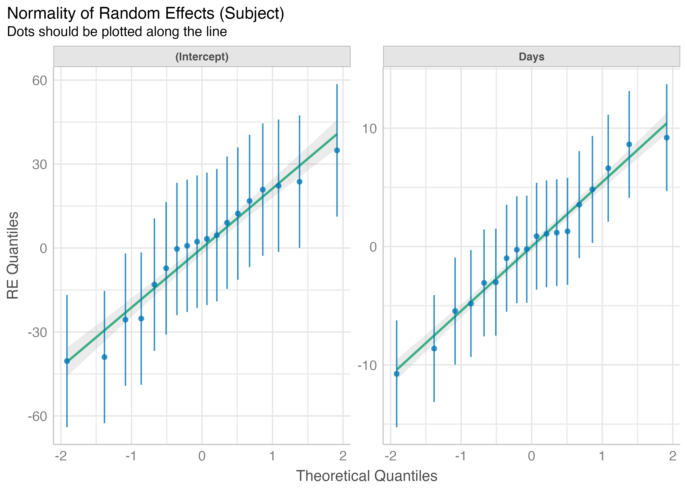

[`plot`](https://rdrr.io/r/graphics/plot.default.html)`(``result2``, type ``=`` ``"qq"``)`

#### PP Plot

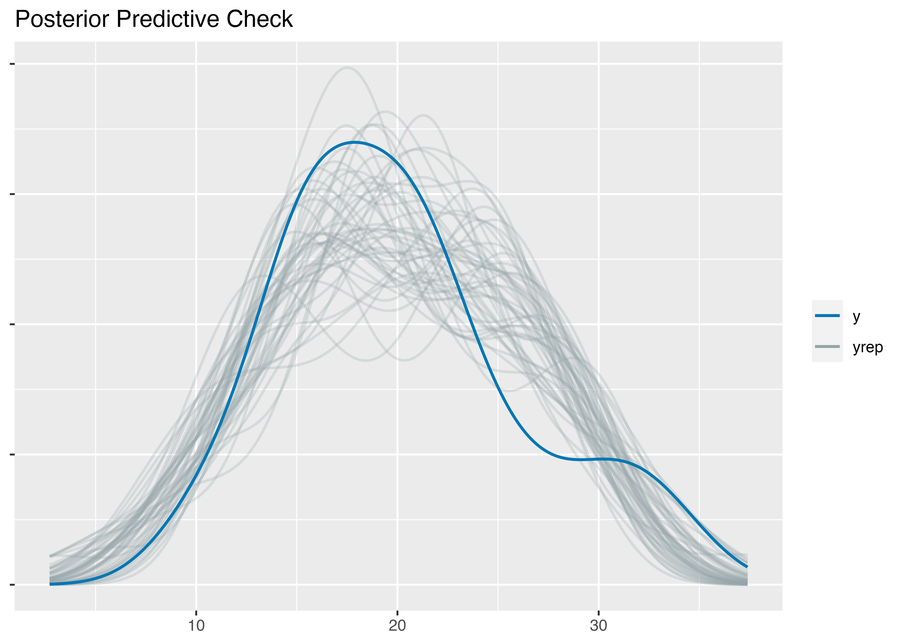

[`plot`](https://rdrr.io/r/graphics/plot.default.html)`(``result2``, type ``=`` ``"pp"``)`

### Check for Normal Distributed Random Effects

*([related function
documentation](https://easystats.github.io/performance/reference/check_normality.html))*

`model`` ``<-`` `[`lmer`](https://rdrr.io/pkg/lme4/man/lmer.html)`(``Reaction`` ``~`` ``Days`` ``+`` ``(``Days`` ``|`` ``Subject``)``, ``sleepstudy``)`` ``result`` ``<-`` `[`check_normality`](https://easystats.github.io/performance/reference/check_normality.html)`(``model``, effects ``=`` ``"random"``)`` `[`plot`](https://rdrr.io/r/graphics/plot.default.html)`(``result``)`` ``#> [[1]]`

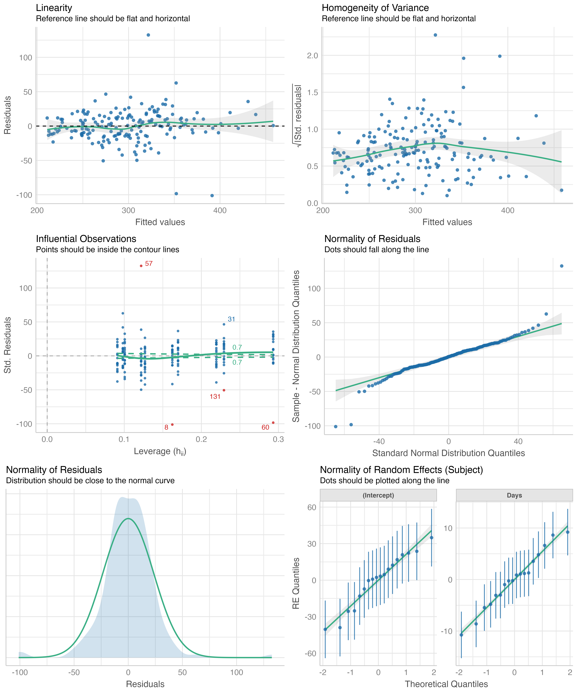

### Check for Heteroscedasticity

*([related function
documentation](https://easystats.github.io/performance/reference/check_heteroscedasticity.html))*

`model`` ``<-`` `[`lm`](https://rdrr.io/r/stats/lm.html)`(``mpg`` ``~`` ``wt`` ``+`` ``cyl`` ``+`` ``gear`` ``+`` ``disp``, data ``=`` ``mtcars``)`` ``result`` ``<-`` `[`check_heteroscedasticity`](https://easystats.github.io/performance/reference/check_heteroscedasticity.html)`(``model``)`` `[`plot`](https://rdrr.io/r/graphics/plot.default.html)`(``result``)`

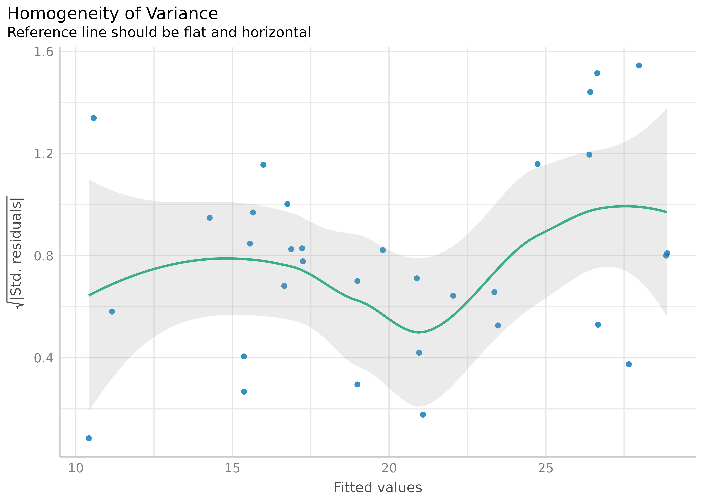

### Check for Homogeneity

*([related function
documentation](https://easystats.github.io/performance/reference/check_homogeneity.html))*

`model`` ``<-`` `[`lm`](https://rdrr.io/r/stats/lm.html)`(``len`` ``~`` ``supp`` ``+`` ``dose``, data ``=`` ``ToothGrowth``)`` ``result`` ``<-`` `[`check_homogeneity`](https://easystats.github.io/performance/reference/check_homogeneity.html)`(``model``)`` `[`plot`](https://rdrr.io/r/graphics/plot.default.html)`(``result``)`

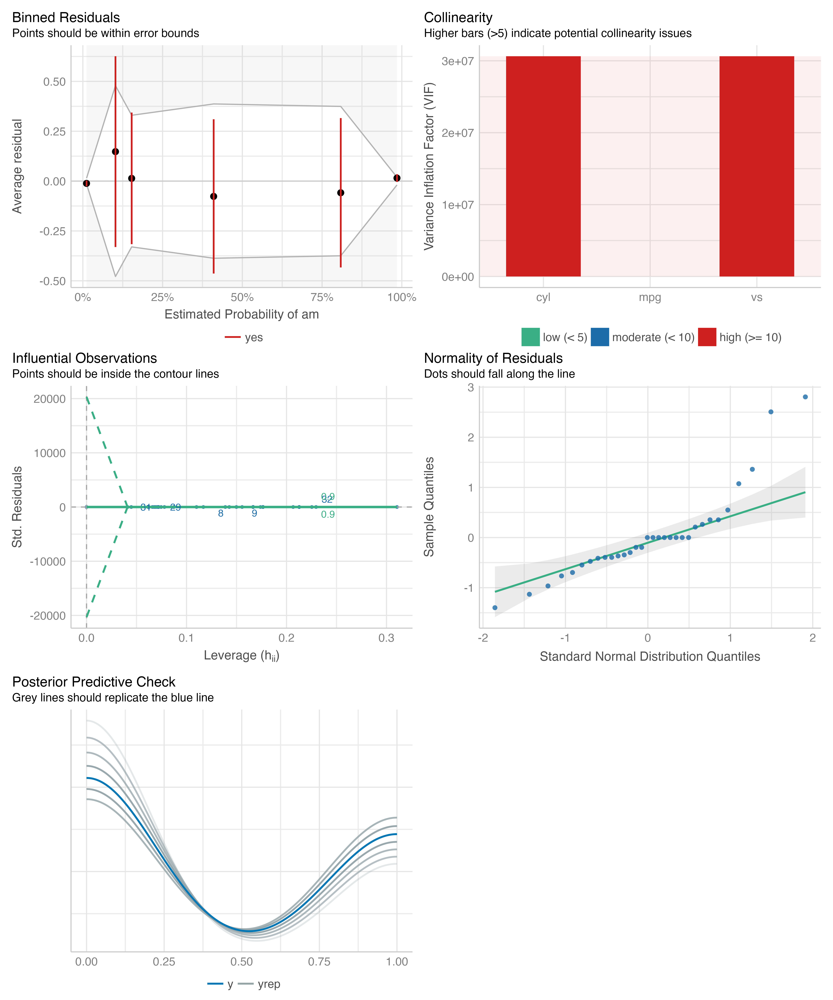

### Posterior Predictive Checks

*([related function
documentation](https://easystats.github.io/performance/reference/check_predictions.html))*

`model`` ``<-`` `[`lm`](https://rdrr.io/r/stats/lm.html)`(``mpg`` ``~`` ``wt`` ``+`` ``cyl`` ``+`` ``gear`` ``+`` ``disp``, data ``=`` ``mtcars``)`` `[`check_predictions`](https://easystats.github.io/performance/reference/check_predictions.html)`(``model``)`

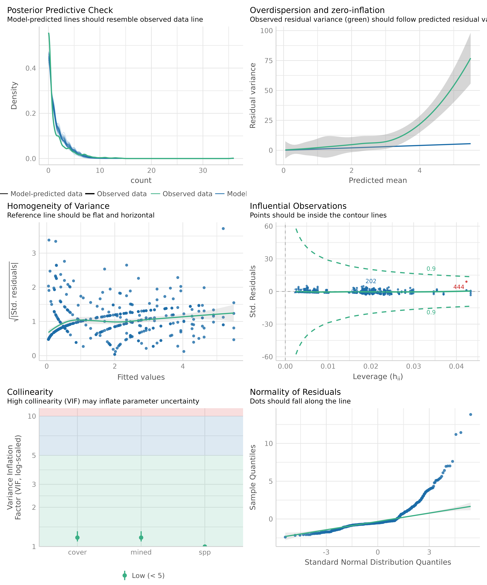

To check if the model properly captures the variation in the data, use
`check_range = TRUE`:

`model`` ``<-`` `[`lm`](https://rdrr.io/r/stats/lm.html)`(``mpg`` ``~`` ``wt`` ``+`` ``cyl`` ``+`` ``gear`` ``+`` ``disp``, data ``=`` ``mtcars``)`` `[`check_predictions`](https://easystats.github.io/performance/reference/check_predictions.html)`(``model``, check_range ``=`` ``TRUE``)`

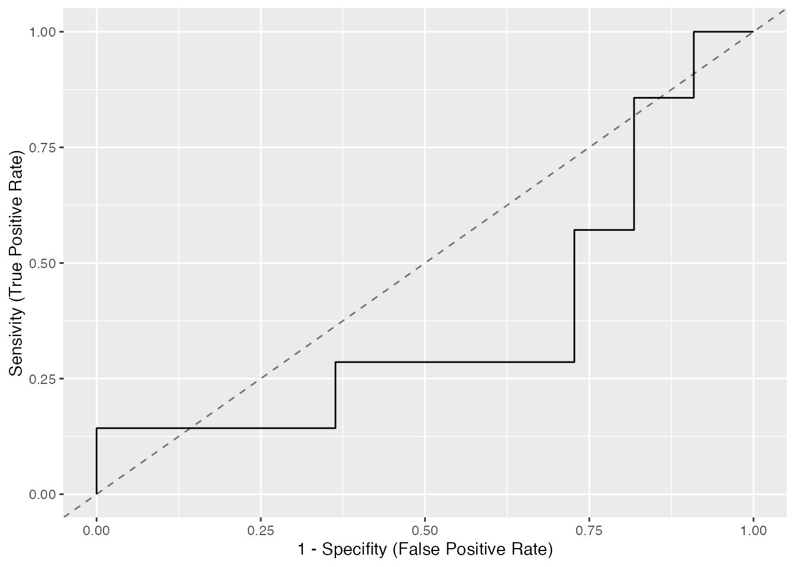

## Overall Model Check

*([related function
documentation](https://easystats.github.io/performance/reference/check_model.html))*

The composition of plots when checking model assumptions depends on the
type of the input model. E.g., for logistic regression models, a [binned
residuals
plot](https://easystats.github.io/performance/reference/binned_residuals.html)
is used, while for linear models a plot of homegeneity of variance is
shown instead. Models from count data include plots to inspect
overdispersion.

### Checks for generalized linear models

#### Logistic regression model

`model`` ``<-`` `[`glm`](https://rdrr.io/r/stats/glm.html)`(``vs`` ``~`` ``wt`` ``+`` ``mpg``, data ``=`` ``mtcars``, family ``=`` ``"binomial"``)`` `[`check_model`](https://easystats.github.io/performance/reference/check_model.html)`(``model``)`

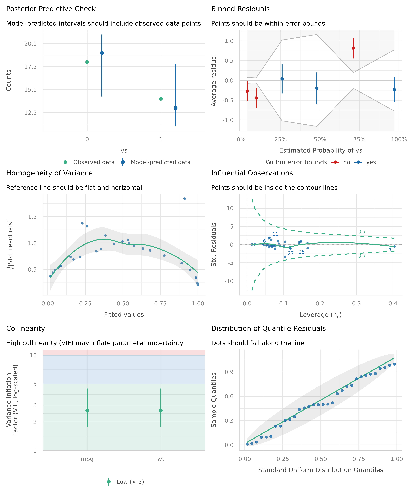

#### Using different discrete plot type for posterior predictive checks

`out`` ``<-`` `[`check_model`](https://easystats.github.io/performance/reference/check_model.html)`(``model``)`` `[`plot`](https://rdrr.io/r/graphics/plot.default.html)`(``out``, type ``=`` ``"discrete_both"``)`

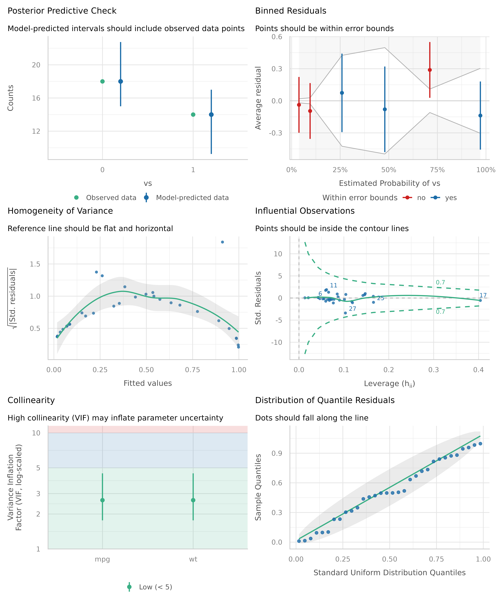

#### Modelling count data

`model`` ``<-`` `[`glm`](https://rdrr.io/r/stats/glm.html)`(`` `` ``count`` ``~`` ``spp`` ``+`` ``mined`` ``+`` ``cover``,`` `` family ``=`` `[`poisson`](https://rdrr.io/r/stats/family.html)`(``)``,`` `` data ``=`` ``Salamanders`` ``)`` `[`check_model`](https://easystats.github.io/performance/reference/check_model.html)`(``model``)`

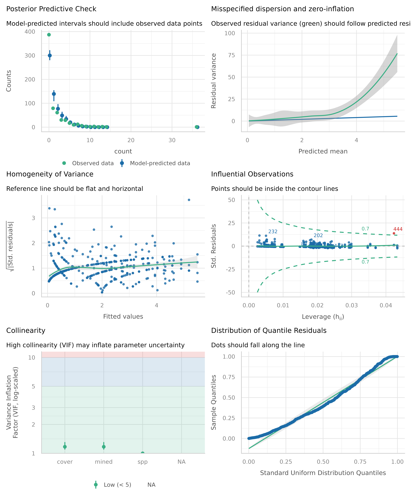

### Checks for linear (mixed) models

`model`` ``<-`` `[`lmer`](https://rdrr.io/pkg/lme4/man/lmer.html)`(``Reaction`` ``~`` ``Days`` ``+`` ``(``Days`` ``|`` ``Subject``)``, ``sleepstudy``)`` `[`check_model`](https://easystats.github.io/performance/reference/check_model.html)`(``model``)`

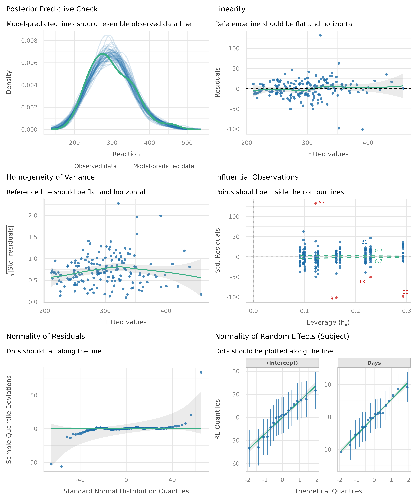

[`check_model`](https://easystats.github.io/performance/reference/check_model.html)`(``model``, panel ``=`` ``FALSE``)`

Note that not all checks supported in `performance` will be reported in
this unified **visual** check. For example, for linear models, one needs
to check the assumption that errors are not autocorrelated, but this
check will not be shown in the visual check.

[`check_autocorrelation`](https://easystats.github.io/performance/reference/check_autocorrelation.html)`(`[`lm`](https://rdrr.io/r/stats/lm.html)`(``formula ``=`` ``wt`` ``~`` ``mpg``, data ``=`` ``mtcars``)``)`` ``#> Warning: Autocorrelated residuals detected (p = 0.006).`

## Compare Model Performances

*([related function
documentation](https://easystats.github.io/performance/reference/model_performance.html))*

[`compare_performance()`](https://easystats.github.io/performance/reference/compare_performance.html)
computes indices of model performance for different models at once and
hence allows comparison of indices across models. The
[`plot()`](https://rdrr.io/r/graphics/plot.default.html)-method creates
a “spiderweb” plot, where the different indices are normalized and
larger values indicate better model performance. Hence, points closer to
the center indicate worse fit indices.

[`data`](https://rdrr.io/r/utils/data.html)`(``iris``)`` ``lm1`` ``<-`` `[`lm`](https://rdrr.io/r/stats/lm.html)`(``Sepal.Length`` ``~`` ``Species``, data ``=`` ``iris``)`` ``lm2`` ``<-`` `[`lm`](https://rdrr.io/r/stats/lm.html)`(``Sepal.Length`` ``~`` ``Species`` ``+`` ``Petal.Length``, data ``=`` ``iris``)`` ``lm3`` ``<-`` `[`lm`](https://rdrr.io/r/stats/lm.html)`(``Sepal.Length`` ``~`` ``Species`` ``*`` ``Sepal.Width``, data ``=`` ``iris``)`` ``lm4`` ``<-`` `[`lm`](https://rdrr.io/r/stats/lm.html)`(``Sepal.Length`` ``~`` ``Species`` ``*`` ``Sepal.Width`` ``+`` ``Petal.Length`` ``+`` ``Petal.Width``, data ``=`` ``iris``)`` ``result`` ``<-`` `[`compare_performance`](https://easystats.github.io/performance/reference/compare_performance.html)`(``lm1``, ``lm2``, ``lm3``, ``lm4``)`` `` ``result`` ``#> # Comparison of Model Performance Indices`` ``#> `` ``#> Name | Model | AIC (weights) | AICc (weights) | BIC (weights) | R2`` ``#> ---------------------------------------------------------------------`` ``#> lm1 | lm | 231.5 (<.001) | 231.7 (<.001) | 243.5 (<.001) | 0.619`` ``#> lm2 | lm | 106.2 (<.001) | 106.6 (<.001) | 121.3 (<.001) | 0.837`` ``#> lm3 | lm | 187.1 (<.001) | 187.9 (<.001) | 208.2 (<.001) | 0.727`` ``#> lm4 | lm | 78.8 (>.999) | 80.1 (>.999) | 105.9 (>.999) | 0.871`` ``#> `` ``#> Name | R2 (adj.) | RMSE | Sigma`` ``#> --------------------------------`` ``#> lm1 | 0.614 | 0.510 | 0.515`` ``#> lm2 | 0.833 | 0.333 | 0.338`` ``#> lm3 | 0.718 | 0.431 | 0.440`` ``#> lm4 | 0.865 | 0.296 | 0.305`` `` `[`plot`](https://rdrr.io/r/graphics/plot.default.html)`(``result``)`

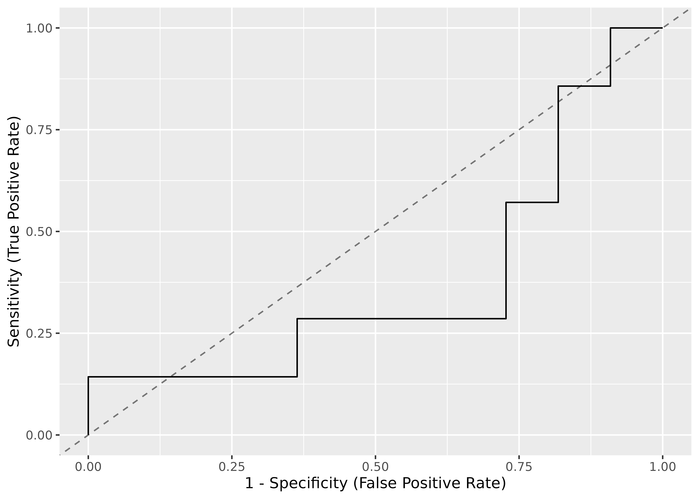

## Model and Vector Properties

*([related function
documentation](https://easystats.github.io/performance/reference/check_distribution.html))*

`model`` ``<-`` `[`lmer`](https://rdrr.io/pkg/lme4/man/lmer.html)`(``Reaction`` ``~`` ``Days`` ``+`` ``(``Days`` ``|`` ``Subject``)``, ``sleepstudy``)`` ``result`` ``<-`` `[`check_distribution`](https://easystats.github.io/performance/reference/check_distribution.html)`(``model``)`` `` ``result`` ``#> # Distribution of Model Family`` ``#> `` ``#> Predicted Distribution of Residuals`` ``#> `` ``#> Distribution Probability`` ``#> cauchy 91%`` ``#> gamma 6%`` ``#> neg. binomial (zero-infl.) 3%`` ``#> `` ``#> Predicted Distribution of Response`` ``#> `` ``#> Distribution Probability`` ``#> lognormal 66%`` ``#> gamma 34%`` `[`plot`](https://rdrr.io/r/graphics/plot.default.html)`(``result``)`

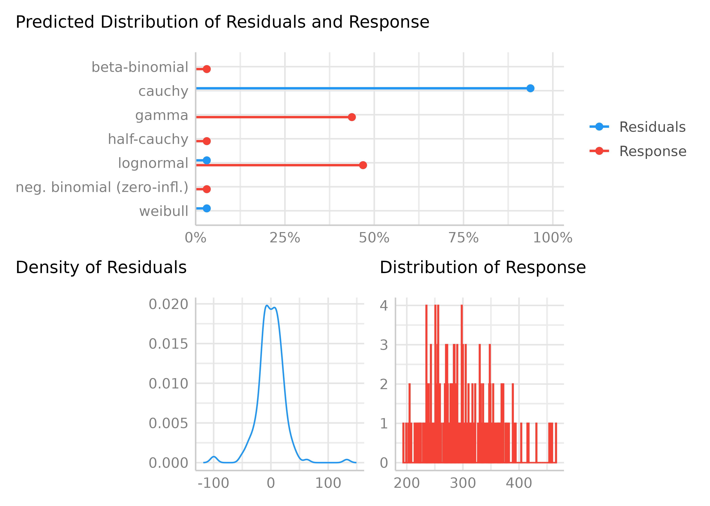

`vec`` ``<-`` ``bayestestR``::`[`distribution_poisson`](https://easystats.github.io/bayestestR/reference/distribution.html)`(``n ``=`` ``500``, lambda ``=`` ``2.5``)`` ``result`` ``<-`` `[`check_distribution`](https://easystats.github.io/performance/reference/check_distribution.html)`(``vec``)`` `` ``result`` ``#> # Predicted Distribution of Vector`` ``#> `` ``#> Distribution Probability`` ``#> poisson 75%`` ``#> negative binomial 22%`` ``#> neg. binomial (zero-infl.) 3%`` `[`plot`](https://rdrr.io/r/graphics/plot.default.html)`(``result``)`

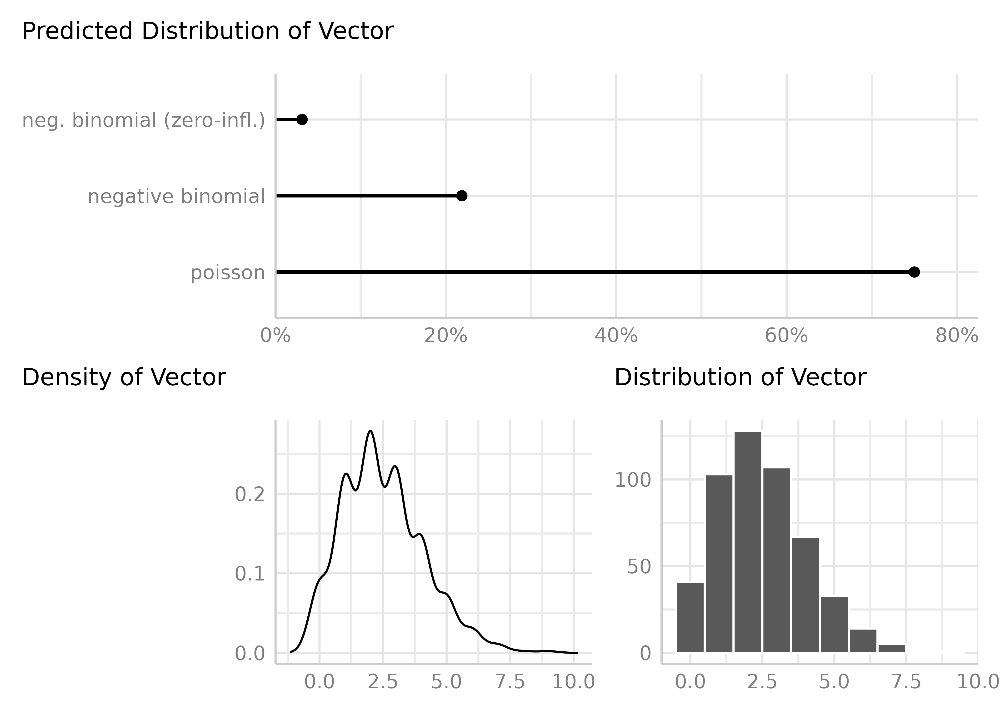

## Directed Acyclic Graphs (DAG)

*([related function
documentation](https://easystats.github.io/performance/reference/check_dag.html))*

`dag`` ``<-`` `[`check_dag`](https://easystats.github.io/performance/reference/check_dag.html)`(`` `` ``y`` ``~`` ``x`` ``+`` ``b`` ``+`` ``c``,`` `` ``x`` ``~`` ``b``,`` `` outcome ``=`` ``"y"``,`` `` exposure ``=`` ``"x"``,`` `` coords ``=`` `[`list`](https://rdrr.io/r/base/list.html)`(`` `` x ``=`` `[`c`](https://rdrr.io/r/base/c.html)`(``y ``=`` ``5``, x ``=`` ``4``, b ``=`` ``3``, c ``=`` ``3``)``,`` `` y ``=`` `[`c`](https://rdrr.io/r/base/c.html)`(``y ``=`` ``3``, x ``=`` ``3``, b ``=`` ``2``, c ``=`` ``4``)`` `` ``)`` ``)`` ``# plot comparison between current and required model`` `[`plot`](https://rdrr.io/r/graphics/plot.default.html)`(``dag``)`

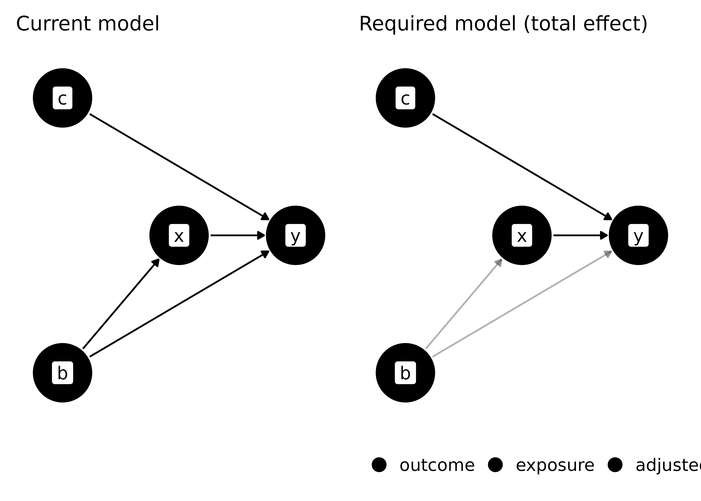

`# plot current model specification`` `[`plot`](https://rdrr.io/r/graphics/plot.default.html)`(``dag``, which ``=`` ``"current"``)`

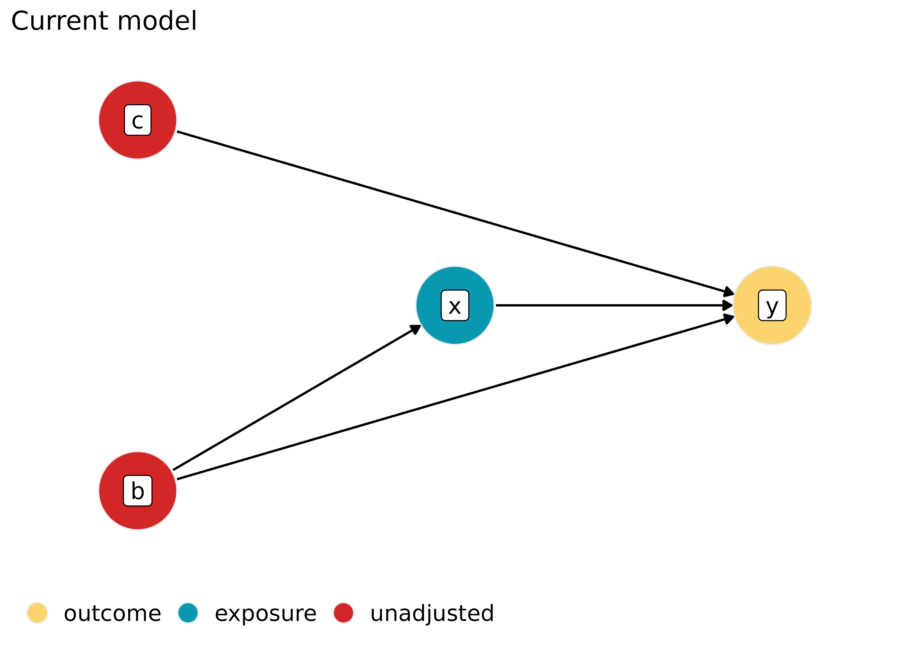

`# plot required model specification`` `[`plot`](https://rdrr.io/r/graphics/plot.default.html)`(``dag``, which ``=`` ``"required"``)`

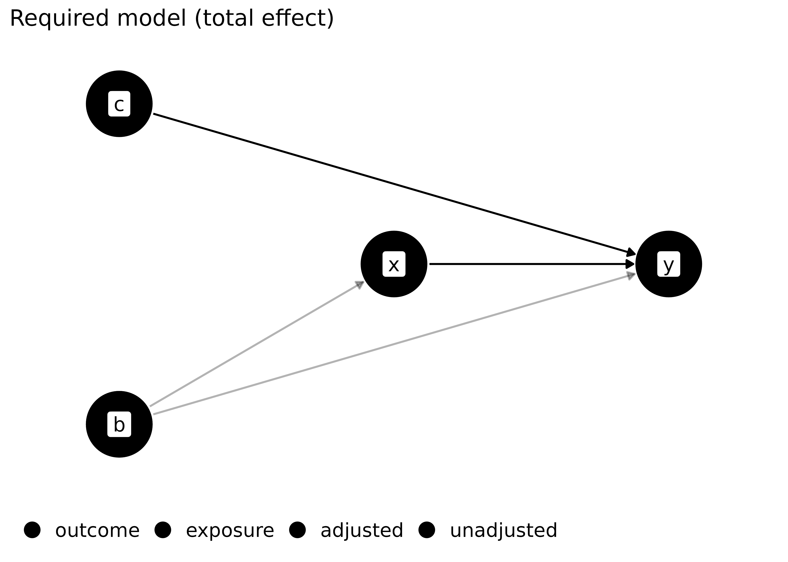

## ROC curves

*([related function
documentation](https://easystats.github.io/performance/reference/performance_roc.html))*

[`data`](https://rdrr.io/r/utils/data.html)`(``iris``)`` `[`set.seed`](https://rdrr.io/r/base/Random.html)`(``123``)`` ``iris``$``y`` ``<-`` `[`rbinom`](https://rdrr.io/r/stats/Binomial.html)`(`[`nrow`](https://rdrr.io/r/base/nrow.html)`(``iris``)``, size ``=`` ``1``, ``0.3``)`` `` ``folds`` ``<-`` `[`sample`](https://rdrr.io/r/base/sample.html)`(`[`nrow`](https://rdrr.io/r/base/nrow.html)`(``iris``)``, size ``=`` `[`nrow`](https://rdrr.io/r/base/nrow.html)`(``iris``)`` ``/`` ``8``, replace ``=`` ``FALSE``)`` ``test_data`` ``<-`` ``iris``[``folds``, ``]`` ``train_data`` ``<-`` ``iris``[``-``folds``, ``]`` `` ``model`` ``<-`` `[`glm`](https://rdrr.io/r/stats/glm.html)`(``y`` ``~`` ``Sepal.Length`` ``+`` ``Sepal.Width``, data ``=`` ``train_data``, family ``=`` ``"binomial"``)`` ``result`` ``<-`` `[`performance_roc`](https://easystats.github.io/performance/reference/performance_roc.html)`(``model``, new_data ``=`` ``test_data``)`` `` ``result`` ``#> AUC: 37.66%`` `[`plot`](https://rdrr.io/r/graphics/plot.default.html)`(``result``)`

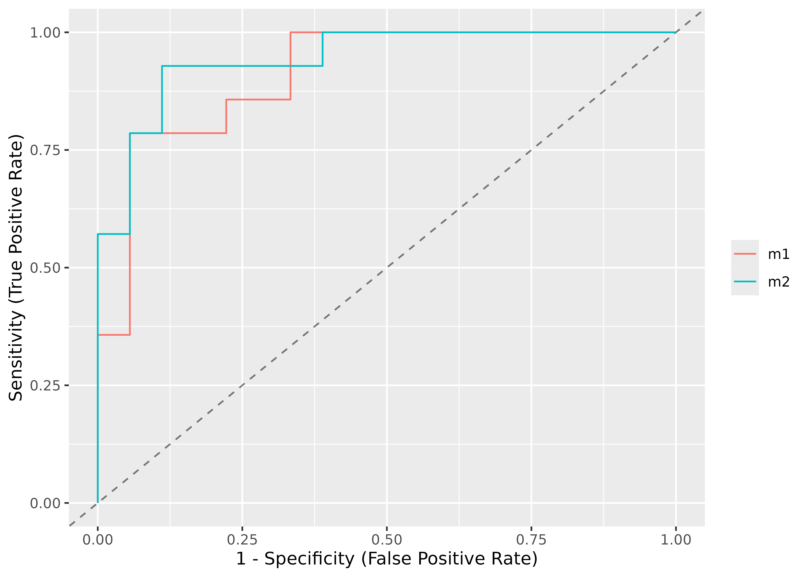

You can also compare ROC curves for different models.

[`set.seed`](https://rdrr.io/r/base/Random.html)`(``123``)`` `[`library`](https://rdrr.io/r/base/library.html)`(`[`bayestestR`](https://easystats.github.io/bayestestR/)`)`` `` ``# creating models`` ``m1`` ``<-`` `[`glm`](https://rdrr.io/r/stats/glm.html)`(``vs`` ``~`` ``wt`` ``+`` ``mpg``, data ``=`` ``mtcars``, family ``=`` ``"binomial"``)`` ``m2`` ``<-`` `[`glm`](https://rdrr.io/r/stats/glm.html)`(``vs`` ``~`` ``wt`` ``+`` ``am`` ``+`` ``mpg``, data ``=`` ``mtcars``, family ``=`` ``"binomial"``)`` `` ``# comparing their performances using the AUC curve`` `[`plot`](https://rdrr.io/r/graphics/plot.default.html)`(`[`performance_roc`](https://easystats.github.io/performance/reference/performance_roc.html)`(``m1``, ``m2``)``)`

