# Color Scales

This vignette can be referred to by citing the package:

\
[`citation`](https://rdrr.io/r/utils/citation.html)`(``"see"``)`\
`#> To cite package 'see' in publications use:`\
`#> `\
`#>   Lüdecke et al., (2021). see: An R Package for Visualizing Statistical`\
`#>   Models. Journal of Open Source Software, 6(64), 3393.`\
`#>   https://doi.org/10.21105/joss.03393`\
`#> `\
`#> A BibTeX entry for LaTeX users is`\
`#> `\
`#>   @Article{,`\
`#>     title = {{see}: An {R} Package for Visualizing Statistical Models},`\
`#>     author = {Daniel Lüdecke and Indrajeet Patil and Mattan S. Ben-Shachar and Brenton M. Wiernik and Philip Waggoner and Dominique Makowski},`\
`#>     journal = {Journal of Open Source Software},`\
`#>     year = {2021},`\
`#>     volume = {6},`\
`#>     number = {64},`\
`#>     pages = {3393},`\
`#>     doi = {10.21105/joss.03393},`\
`#>   }`

Before we start, we create some data sets with three, four and five
groups; one is useful to demonstrate line-geoms, the iris-dataset is
used for point-geoms.

\
[`library`](https://rdrr.io/r/base/library.html)`(`[`ggplot2`](https://ggplot2.tidyverse.org)`)`\
[`library`](https://rdrr.io/r/base/library.html)`(`[`see`](https://easystats.github.io/see/)`)`\
\
[`data`](https://rdrr.io/r/utils/data.html)`(``iris``)`\
`iris``$``group4`` ``<-`` `[`as.factor`](https://rdrr.io/r/base/factor.html)`(`[`sample`](https://rdrr.io/r/base/sample.html)`(``1``:``4``, size ``=`` `[`nrow`](https://rdrr.io/r/base/nrow.html)`(``iris``)``, replace ``=`` ``TRUE``)``)`\
`iris``$``group5`` ``<-`` `[`as.factor`](https://rdrr.io/r/base/factor.html)`(`[`sample`](https://rdrr.io/r/base/sample.html)`(``1``:``5``, size ``=`` `[`nrow`](https://rdrr.io/r/base/nrow.html)`(``iris``)``, replace ``=`` ``TRUE``)``)`\
\
`d1`` ``<-`` `[`data.frame`](https://rdrr.io/r/base/data.frame.html)`(`\
`  x ``=`` `[`rep`](https://rdrr.io/r/base/rep.html)`(``1``:``20``, ``3``)``,`\
`  y ``=`` `[`c`](https://rdrr.io/r/base/c.html)`(`\
`    `[`seq`](https://rdrr.io/r/base/seq.html)`(``2``, ``4``, length.out ``=`` ``20``)``,`\
`    `[`seq`](https://rdrr.io/r/base/seq.html)`(``3``, ``6``, length.out ``=`` ``20``)``,`\
`    `[`seq`](https://rdrr.io/r/base/seq.html)`(``5``, ``3``, length.out ``=`` ``20``)`\
`  ``)``,`\
`  group ``=`` `[`rep`](https://rdrr.io/r/base/rep.html)`(`[`factor`](https://rdrr.io/r/base/factor.html)`(``1``:``3``)``, each ``=`` ``20``)`\
`)`\
\
`d2`` ``<-`` `[`data.frame`](https://rdrr.io/r/base/data.frame.html)`(`\
`  x ``=`` `[`rep`](https://rdrr.io/r/base/rep.html)`(``1``:``20``, ``4``)``,`\
`  y ``=`` `[`c`](https://rdrr.io/r/base/c.html)`(`\
`    `[`seq`](https://rdrr.io/r/base/seq.html)`(``2``, ``4``, length.out ``=`` ``20``)``,`\
`    `[`seq`](https://rdrr.io/r/base/seq.html)`(``3``, ``6``, length.out ``=`` ``20``)``,`\
`    `[`seq`](https://rdrr.io/r/base/seq.html)`(``5``, ``3``, length.out ``=`` ``20``)``,`\
`    `[`seq`](https://rdrr.io/r/base/seq.html)`(``4``, ``2.5``, length.out ``=`` ``20``)`\
`  ``)``,`\
`  group ``=`` `[`rep`](https://rdrr.io/r/base/rep.html)`(`[`factor`](https://rdrr.io/r/base/factor.html)`(``1``:``4``)``, each ``=`` ``20``)`\
`)`\
\
`d3`` ``<-`` `[`data.frame`](https://rdrr.io/r/base/data.frame.html)`(`\
`  x ``=`` `[`rep`](https://rdrr.io/r/base/rep.html)`(``1``:``20``, ``5``)``,`\
`  y ``=`` `[`c`](https://rdrr.io/r/base/c.html)`(`\
`    `[`seq`](https://rdrr.io/r/base/seq.html)`(``2``, ``4``, length.out ``=`` ``20``)``,`\
`    `[`seq`](https://rdrr.io/r/base/seq.html)`(``3``, ``6``, length.out ``=`` ``20``)``,`\
`    `[`seq`](https://rdrr.io/r/base/seq.html)`(``5``, ``3``, length.out ``=`` ``20``)``,`\
`    `[`seq`](https://rdrr.io/r/base/seq.html)`(``4``, ``2.5``, length.out ``=`` ``20``)``,`\
`    `[`seq`](https://rdrr.io/r/base/seq.html)`(``3.5``, ``4.5``, length.out ``=`` ``20``)`\
`  ``)``,`\
`  group ``=`` `[`rep`](https://rdrr.io/r/base/rep.html)`(`[`factor`](https://rdrr.io/r/base/factor.html)`(``1``:``5``)``, each ``=`` ``20``)`\
`)`\
\
[`theme_set`](https://ggplot2.tidyverse.org/reference/get_theme.html)`(`[`theme_modern`](https://easystats.github.io/see/reference/theme_modern.md)`(``legend.position ``=`` ``"bottom"``)``)`

## The *see* Color Scales

There are several different [color scales
available](https://easystats.github.io/see/reference/index.html#section-scales)
in the *see* package, most of them having some pre-defined palettes like
`"full"`, `"ice"`, `"rainbow"`, `"complement"`, `"contrast"`, or
`"light"` - exceptions are the [pizza color
scale](https://easystats.github.io/see/reference/scale_color_pizza.html)
and [bluebrown color
scale](https://easystats.github.io/see/reference/scale_color_blubrown.html).

In this vignettes, we show the default palettes for the different color
scales to give an impression how these scales work with different type
of data.

### Social Colors - Three Groups

\
`p1`` ``<-`` `[`ggplot`](https://ggplot2.tidyverse.org/reference/ggplot.html)`(``d1``, `[`aes`](https://ggplot2.tidyverse.org/reference/aes.html)`(``x``, ``y``, colour ``=`` ``group``)``)`` ``+`\
`  `[`geom_line`](https://ggplot2.tidyverse.org/reference/geom_path.html)`(``linewidth ``=`` ``1``)`` ``+`\
`  `[`scale_color_social`](https://easystats.github.io/see/reference/scale_color_social.md)`(``)`\
\
`p2`` ``<-`` `[`ggplot`](https://ggplot2.tidyverse.org/reference/ggplot.html)`(``iris``, `[`aes`](https://ggplot2.tidyverse.org/reference/aes.html)`(``Sepal.Length``, ``Sepal.Width``, colour ``=`` ``Species``)``)`` ``+`\
`  `[`geom_point2`](https://easystats.github.io/see/reference/geom_point2.md)`(``size ``=`` ``2.5``)`` ``+`\
`  `[`scale_color_social`](https://easystats.github.io/see/reference/scale_color_social.md)`(``)`\
\
[`plots`](https://easystats.github.io/see/reference/plots.md)`(``p1``, ``p2``, n_rows ``=`` ``1``)`

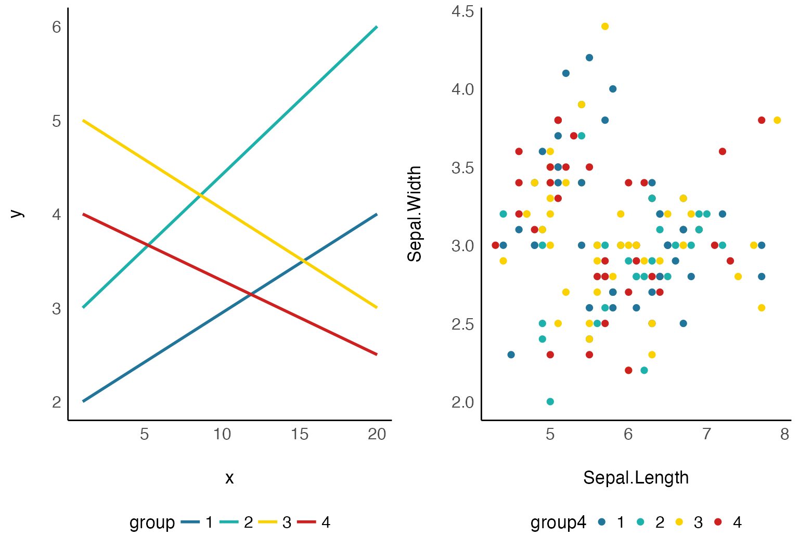

### Social Colors - Four Groups

\
`p1`` ``<-`` `[`ggplot`](https://ggplot2.tidyverse.org/reference/ggplot.html)`(``d2``, `[`aes`](https://ggplot2.tidyverse.org/reference/aes.html)`(``x``, ``y``, colour ``=`` ``group``)``)`` ``+`\
`  `[`geom_line`](https://ggplot2.tidyverse.org/reference/geom_path.html)`(``linewidth ``=`` ``1``)`` ``+`\
`  `[`scale_color_social`](https://easystats.github.io/see/reference/scale_color_social.md)`(``)`\
\
`p2`` ``<-`` `[`ggplot`](https://ggplot2.tidyverse.org/reference/ggplot.html)`(``iris``, `[`aes`](https://ggplot2.tidyverse.org/reference/aes.html)`(``Sepal.Length``, ``Sepal.Width``, colour ``=`` ``group4``)``)`` ``+`\
`  `[`geom_point2`](https://easystats.github.io/see/reference/geom_point2.md)`(``size ``=`` ``2.5``)`` ``+`\
`  `[`scale_color_social`](https://easystats.github.io/see/reference/scale_color_social.md)`(``)`\
\
[`plots`](https://easystats.github.io/see/reference/plots.md)`(``p1``, ``p2``, n_rows ``=`` ``1``)`

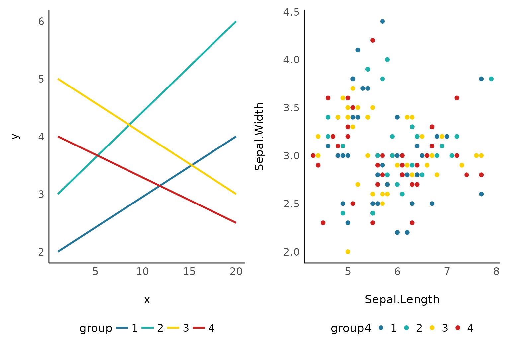

### Social Colors - Five Groups

\
`p1`` ``<-`` `[`ggplot`](https://ggplot2.tidyverse.org/reference/ggplot.html)`(``d3``, `[`aes`](https://ggplot2.tidyverse.org/reference/aes.html)`(``x``, ``y``, colour ``=`` ``group``)``)`` ``+`\
`  `[`geom_line`](https://ggplot2.tidyverse.org/reference/geom_path.html)`(``linewidth ``=`` ``1``)`` ``+`\
`  `[`scale_color_social`](https://easystats.github.io/see/reference/scale_color_social.md)`(``)`\
\
`p2`` ``<-`` `[`ggplot`](https://ggplot2.tidyverse.org/reference/ggplot.html)`(``iris``, `[`aes`](https://ggplot2.tidyverse.org/reference/aes.html)`(``Sepal.Length``, ``Sepal.Width``, colour ``=`` ``group5``)``)`` ``+`\
`  `[`geom_point2`](https://easystats.github.io/see/reference/geom_point2.md)`(``size ``=`` ``2.5``)`` ``+`\
`  `[`scale_color_social`](https://easystats.github.io/see/reference/scale_color_social.md)`(``)`\
\
[`plots`](https://easystats.github.io/see/reference/plots.md)`(``p1``, ``p2``, n_rows ``=`` ``1``)`

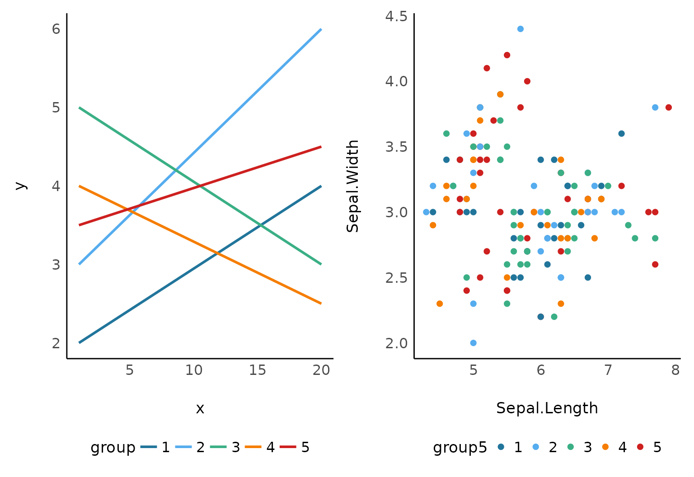

## Material Colors

### Material Colors - Three Groups

\
`p1`` ``<-`` `[`ggplot`](https://ggplot2.tidyverse.org/reference/ggplot.html)`(``d1``, `[`aes`](https://ggplot2.tidyverse.org/reference/aes.html)`(``x``, ``y``, colour ``=`` ``group``)``)`` ``+`\
`  `[`geom_line`](https://ggplot2.tidyverse.org/reference/geom_path.html)`(``linewidth ``=`` ``1``)`` ``+`\
`  `[`scale_color_material`](https://easystats.github.io/see/reference/scale_color_material.md)`(``)`\
\
`p2`` ``<-`` `[`ggplot`](https://ggplot2.tidyverse.org/reference/ggplot.html)`(``iris``, `[`aes`](https://ggplot2.tidyverse.org/reference/aes.html)`(``Sepal.Length``, ``Sepal.Width``, colour ``=`` ``Species``)``)`` ``+`\
`  `[`geom_point2`](https://easystats.github.io/see/reference/geom_point2.md)`(``size ``=`` ``2.5``)`` ``+`\
`  `[`scale_color_material`](https://easystats.github.io/see/reference/scale_color_material.md)`(``)`\
\
[`plots`](https://easystats.github.io/see/reference/plots.md)`(``p1``, ``p2``, n_rows ``=`` ``1``)`

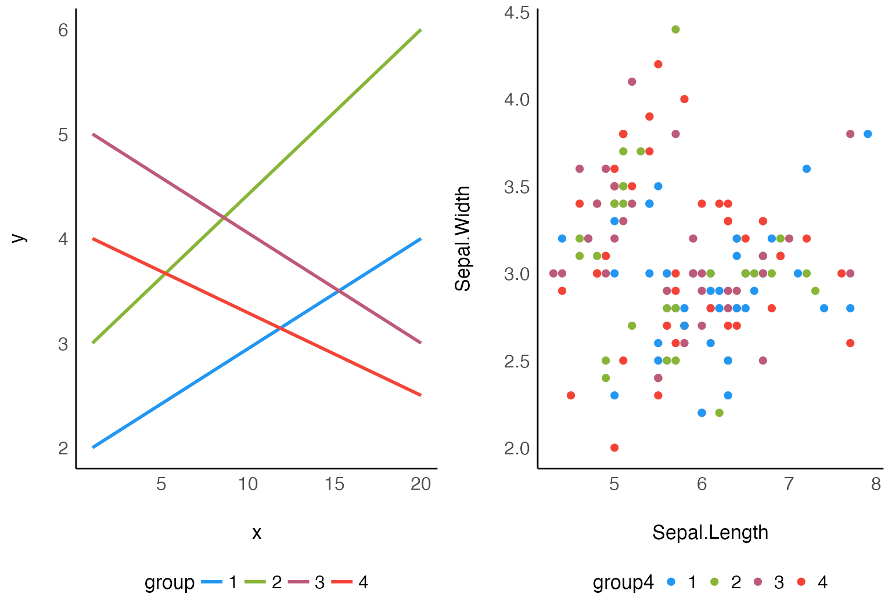

### Material Colors - Four Groups

\
`p1`` ``<-`` `[`ggplot`](https://ggplot2.tidyverse.org/reference/ggplot.html)`(``d2``, `[`aes`](https://ggplot2.tidyverse.org/reference/aes.html)`(``x``, ``y``, colour ``=`` ``group``)``)`` ``+`\
`  `[`geom_line`](https://ggplot2.tidyverse.org/reference/geom_path.html)`(``linewidth ``=`` ``1``)`` ``+`\
`  `[`scale_color_material`](https://easystats.github.io/see/reference/scale_color_material.md)`(``)`\
\
`p2`` ``<-`` `[`ggplot`](https://ggplot2.tidyverse.org/reference/ggplot.html)`(``iris``, `[`aes`](https://ggplot2.tidyverse.org/reference/aes.html)`(``Sepal.Length``, ``Sepal.Width``, colour ``=`` ``group4``)``)`` ``+`\
`  `[`geom_point2`](https://easystats.github.io/see/reference/geom_point2.md)`(``size ``=`` ``2.5``)`` ``+`\
`  `[`scale_color_material`](https://easystats.github.io/see/reference/scale_color_material.md)`(``)`\
\
[`plots`](https://easystats.github.io/see/reference/plots.md)`(``p1``, ``p2``, n_rows ``=`` ``1``)`

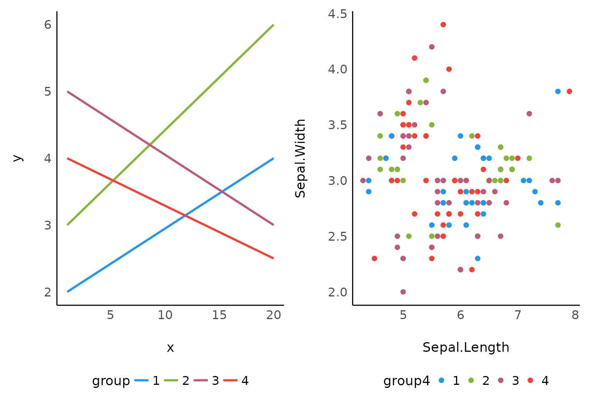

### Material Colors - Five Groups

\
`p1`` ``<-`` `[`ggplot`](https://ggplot2.tidyverse.org/reference/ggplot.html)`(``d3``, `[`aes`](https://ggplot2.tidyverse.org/reference/aes.html)`(``x``, ``y``, colour ``=`` ``group``)``)`` ``+`\
`  `[`geom_line`](https://ggplot2.tidyverse.org/reference/geom_path.html)`(``linewidth ``=`` ``1``)`` ``+`\
`  `[`scale_color_material`](https://easystats.github.io/see/reference/scale_color_material.md)`(``)`\
\
`p2`` ``<-`` `[`ggplot`](https://ggplot2.tidyverse.org/reference/ggplot.html)`(``iris``, `[`aes`](https://ggplot2.tidyverse.org/reference/aes.html)`(``Sepal.Length``, ``Sepal.Width``, colour ``=`` ``group5``)``)`` ``+`\
`  `[`geom_point2`](https://easystats.github.io/see/reference/geom_point2.md)`(``size ``=`` ``2.5``)`` ``+`\
`  `[`scale_color_material`](https://easystats.github.io/see/reference/scale_color_material.md)`(``)`\
\
[`plots`](https://easystats.github.io/see/reference/plots.md)`(``p1``, ``p2``, n_rows ``=`` ``1``)`

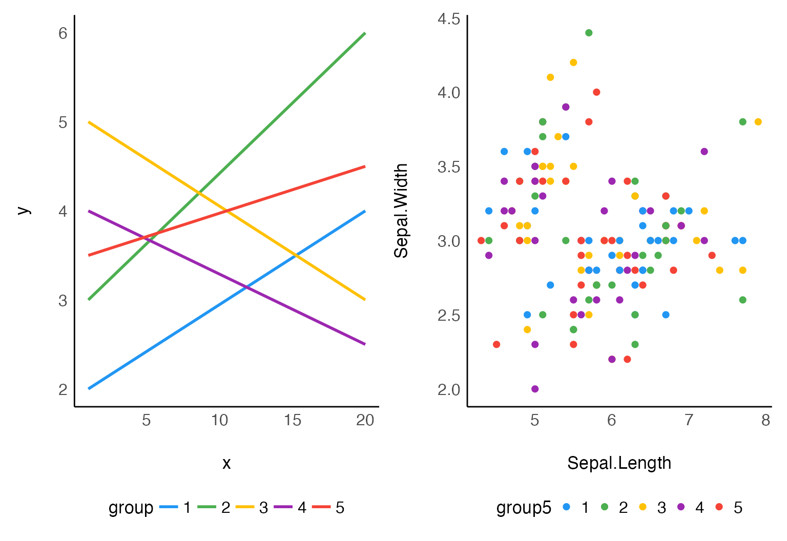

## Flat Colors

### Flat Colors - Three Groups

\
`p1`` ``<-`` `[`ggplot`](https://ggplot2.tidyverse.org/reference/ggplot.html)`(``d1``, `[`aes`](https://ggplot2.tidyverse.org/reference/aes.html)`(``x``, ``y``, colour ``=`` ``group``)``)`` ``+`\
`  `[`geom_line`](https://ggplot2.tidyverse.org/reference/geom_path.html)`(``linewidth ``=`` ``1``)`` ``+`\
`  `[`scale_color_flat`](https://easystats.github.io/see/reference/scale_color_flat.md)`(``)`\
\
`p2`` ``<-`` `[`ggplot`](https://ggplot2.tidyverse.org/reference/ggplot.html)`(``iris``, `[`aes`](https://ggplot2.tidyverse.org/reference/aes.html)`(``Sepal.Length``, ``Sepal.Width``, colour ``=`` ``Species``)``)`` ``+`\
`  `[`geom_point2`](https://easystats.github.io/see/reference/geom_point2.md)`(``size ``=`` ``2.5``)`` ``+`\
`  `[`scale_color_flat`](https://easystats.github.io/see/reference/scale_color_flat.md)`(``)`\
\
[`plots`](https://easystats.github.io/see/reference/plots.md)`(``p1``, ``p2``, n_rows ``=`` ``1``)`

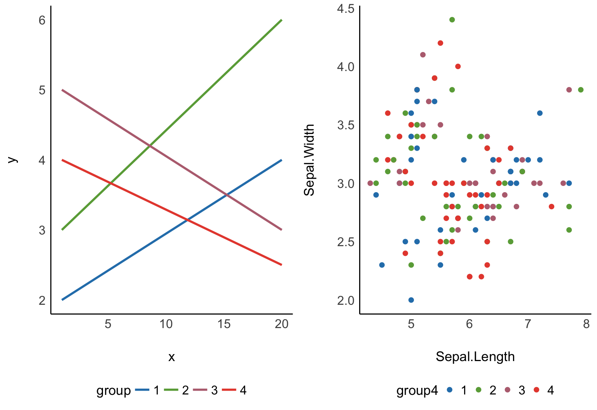

### Flat Colors - Four Groups

\
`p1`` ``<-`` `[`ggplot`](https://ggplot2.tidyverse.org/reference/ggplot.html)`(``d2``, `[`aes`](https://ggplot2.tidyverse.org/reference/aes.html)`(``x``, ``y``, colour ``=`` ``group``)``)`` ``+`\
`  `[`geom_line`](https://ggplot2.tidyverse.org/reference/geom_path.html)`(``linewidth ``=`` ``1``)`` ``+`\
`  `[`scale_color_flat`](https://easystats.github.io/see/reference/scale_color_flat.md)`(``)`\
\
`p2`` ``<-`` `[`ggplot`](https://ggplot2.tidyverse.org/reference/ggplot.html)`(``iris``, `[`aes`](https://ggplot2.tidyverse.org/reference/aes.html)`(``Sepal.Length``, ``Sepal.Width``, colour ``=`` ``group4``)``)`` ``+`\
`  `[`geom_point2`](https://easystats.github.io/see/reference/geom_point2.md)`(``size ``=`` ``2.5``)`` ``+`\
`  `[`scale_color_flat`](https://easystats.github.io/see/reference/scale_color_flat.md)`(``)`\
\
[`plots`](https://easystats.github.io/see/reference/plots.md)`(``p1``, ``p2``, n_rows ``=`` ``1``)`

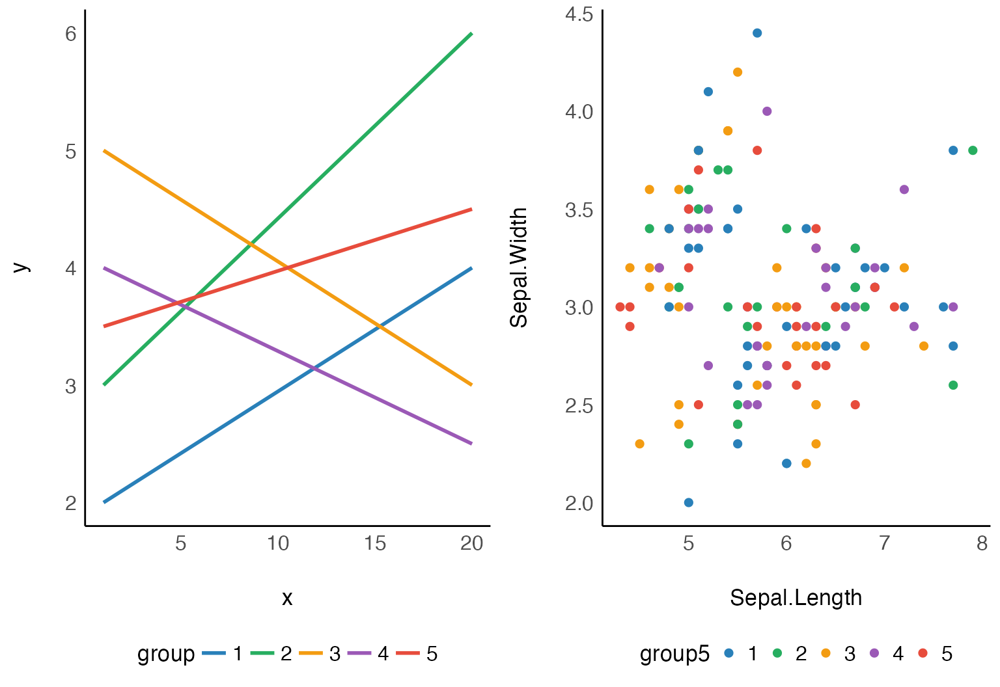

### Flat Colors - Five Groups

\
`p1`` ``<-`` `[`ggplot`](https://ggplot2.tidyverse.org/reference/ggplot.html)`(``d3``, `[`aes`](https://ggplot2.tidyverse.org/reference/aes.html)`(``x``, ``y``, colour ``=`` ``group``)``)`` ``+`\
`  `[`geom_line`](https://ggplot2.tidyverse.org/reference/geom_path.html)`(``linewidth ``=`` ``1``)`` ``+`\
`  `[`scale_color_flat`](https://easystats.github.io/see/reference/scale_color_flat.md)`(``)`\
\
`p2`` ``<-`` `[`ggplot`](https://ggplot2.tidyverse.org/reference/ggplot.html)`(``iris``, `[`aes`](https://ggplot2.tidyverse.org/reference/aes.html)`(``Sepal.Length``, ``Sepal.Width``, colour ``=`` ``group5``)``)`` ``+`\
`  `[`geom_point2`](https://easystats.github.io/see/reference/geom_point2.md)`(``size ``=`` ``2.5``)`` ``+`\
`  `[`scale_color_flat`](https://easystats.github.io/see/reference/scale_color_flat.md)`(``)`\
\
[`plots`](https://easystats.github.io/see/reference/plots.md)`(``p1``, ``p2``, n_rows ``=`` ``1``)`

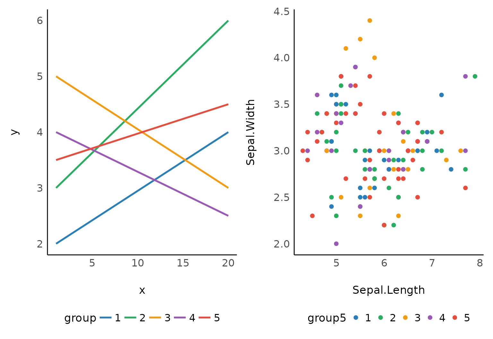

## Metro Colors

### Metro Colors - Three Groups

\
`p1`` ``<-`` `[`ggplot`](https://ggplot2.tidyverse.org/reference/ggplot.html)`(``d1``, `[`aes`](https://ggplot2.tidyverse.org/reference/aes.html)`(``x``, ``y``, colour ``=`` ``group``)``)`` ``+`\
`  `[`geom_line`](https://ggplot2.tidyverse.org/reference/geom_path.html)`(``linewidth ``=`` ``1``)`` ``+`\
`  `[`scale_color_metro`](https://easystats.github.io/see/reference/scale_color_metro.md)`(``)`\
\
`p2`` ``<-`` `[`ggplot`](https://ggplot2.tidyverse.org/reference/ggplot.html)`(``iris``, `[`aes`](https://ggplot2.tidyverse.org/reference/aes.html)`(``Sepal.Length``, ``Sepal.Width``, colour ``=`` ``Species``)``)`` ``+`\
`  `[`geom_point2`](https://easystats.github.io/see/reference/geom_point2.md)`(``size ``=`` ``2.5``)`` ``+`\
`  `[`scale_color_metro`](https://easystats.github.io/see/reference/scale_color_metro.md)`(``)`\
\
[`plots`](https://easystats.github.io/see/reference/plots.md)`(``p1``, ``p2``, n_rows ``=`` ``1``)`

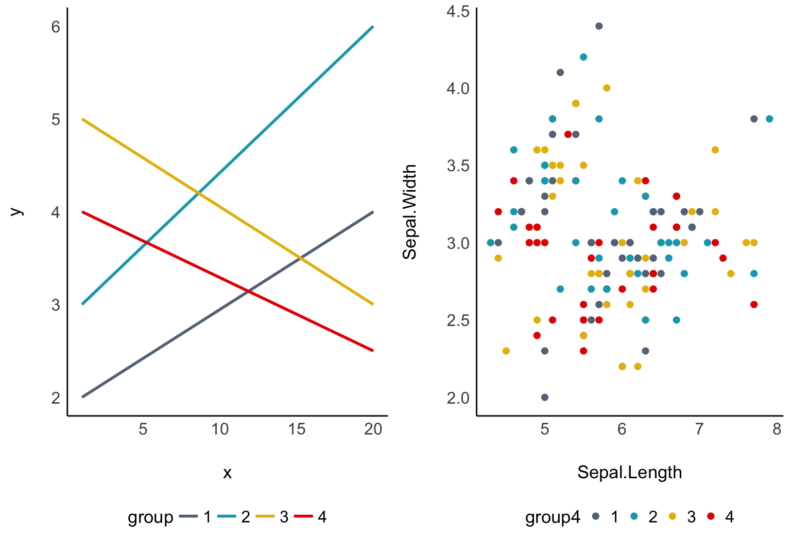

### Metro Colors - Four Groups

\
`p1`` ``<-`` `[`ggplot`](https://ggplot2.tidyverse.org/reference/ggplot.html)`(``d2``, `[`aes`](https://ggplot2.tidyverse.org/reference/aes.html)`(``x``, ``y``, colour ``=`` ``group``)``)`` ``+`\
`  `[`geom_line`](https://ggplot2.tidyverse.org/reference/geom_path.html)`(``linewidth ``=`` ``1``)`` ``+`\
`  `[`scale_color_metro`](https://easystats.github.io/see/reference/scale_color_metro.md)`(``)`\
\
`p2`` ``<-`` `[`ggplot`](https://ggplot2.tidyverse.org/reference/ggplot.html)`(``iris``, `[`aes`](https://ggplot2.tidyverse.org/reference/aes.html)`(``Sepal.Length``, ``Sepal.Width``, colour ``=`` ``group4``)``)`` ``+`\
`  `[`geom_point2`](https://easystats.github.io/see/reference/geom_point2.md)`(``size ``=`` ``2.5``)`` ``+`\
`  `[`scale_color_metro`](https://easystats.github.io/see/reference/scale_color_metro.md)`(``)`\
\
[`plots`](https://easystats.github.io/see/reference/plots.md)`(``p1``, ``p2``, n_rows ``=`` ``1``)`

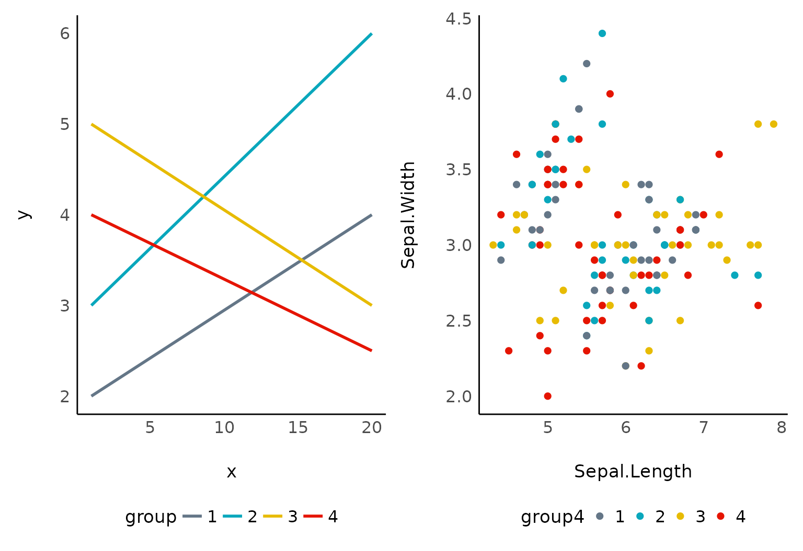

### Metro Colors - Five Groups

\
`p1`` ``<-`` `[`ggplot`](https://ggplot2.tidyverse.org/reference/ggplot.html)`(``d3``, `[`aes`](https://ggplot2.tidyverse.org/reference/aes.html)`(``x``, ``y``, colour ``=`` ``group``)``)`` ``+`\
`  `[`geom_line`](https://ggplot2.tidyverse.org/reference/geom_path.html)`(``linewidth ``=`` ``1``)`` ``+`\
`  `[`scale_color_metro`](https://easystats.github.io/see/reference/scale_color_metro.md)`(``)`\
\
`p2`` ``<-`` `[`ggplot`](https://ggplot2.tidyverse.org/reference/ggplot.html)`(``iris``, `[`aes`](https://ggplot2.tidyverse.org/reference/aes.html)`(``Sepal.Length``, ``Sepal.Width``, colour ``=`` ``group5``)``)`` ``+`\
`  `[`geom_point2`](https://easystats.github.io/see/reference/geom_point2.md)`(``size ``=`` ``2.5``)`` ``+`\
`  `[`scale_color_metro`](https://easystats.github.io/see/reference/scale_color_metro.md)`(``)`\
\
[`plots`](https://easystats.github.io/see/reference/plots.md)`(``p1``, ``p2``, n_rows ``=`` ``1``)`

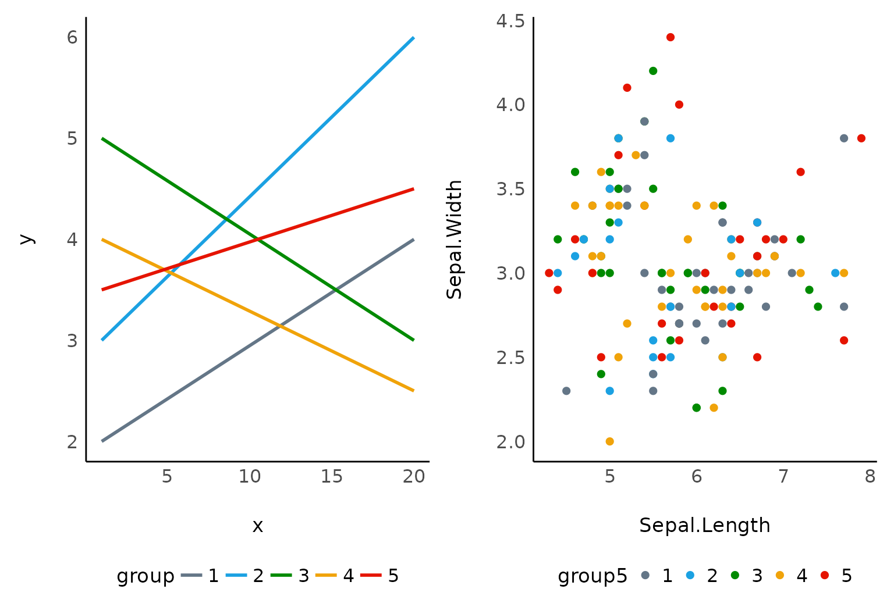

## See Colors

### See Colors - Three Groups

\
`p1`` ``<-`` `[`ggplot`](https://ggplot2.tidyverse.org/reference/ggplot.html)`(``d1``, `[`aes`](https://ggplot2.tidyverse.org/reference/aes.html)`(``x``, ``y``, colour ``=`` ``group``)``)`` ``+`\
`  `[`geom_line`](https://ggplot2.tidyverse.org/reference/geom_path.html)`(``linewidth ``=`` ``1``)`` ``+`\
`  `[`scale_color_see`](https://easystats.github.io/see/reference/scale_color_see.md)`(``)`\
\
`p2`` ``<-`` `[`ggplot`](https://ggplot2.tidyverse.org/reference/ggplot.html)`(``iris``, `[`aes`](https://ggplot2.tidyverse.org/reference/aes.html)`(``Sepal.Length``, ``Sepal.Width``, colour ``=`` ``Species``)``)`` ``+`\
`  `[`geom_point2`](https://easystats.github.io/see/reference/geom_point2.md)`(``size ``=`` ``2.5``)`` ``+`\
`  `[`scale_color_see`](https://easystats.github.io/see/reference/scale_color_see.md)`(``)`\
\
[`plots`](https://easystats.github.io/see/reference/plots.md)`(``p1``, ``p2``, n_rows ``=`` ``1``)`

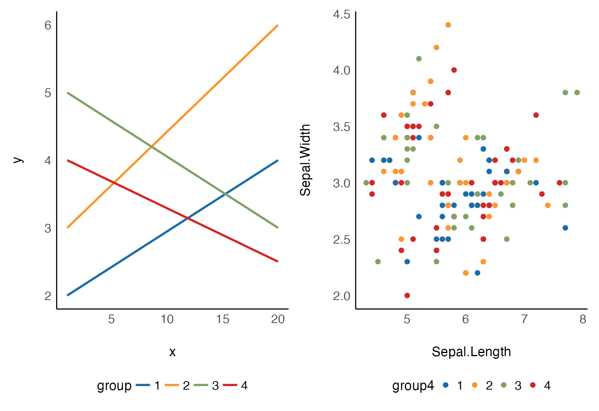

### See Colors - Four Groups

\
`p1`` ``<-`` `[`ggplot`](https://ggplot2.tidyverse.org/reference/ggplot.html)`(``d2``, `[`aes`](https://ggplot2.tidyverse.org/reference/aes.html)`(``x``, ``y``, colour ``=`` ``group``)``)`` ``+`\
`  `[`geom_line`](https://ggplot2.tidyverse.org/reference/geom_path.html)`(``linewidth ``=`` ``1``)`` ``+`\
`  `[`scale_color_see`](https://easystats.github.io/see/reference/scale_color_see.md)`(``)`\
\
`p2`` ``<-`` `[`ggplot`](https://ggplot2.tidyverse.org/reference/ggplot.html)`(``iris``, `[`aes`](https://ggplot2.tidyverse.org/reference/aes.html)`(``Sepal.Length``, ``Sepal.Width``, colour ``=`` ``group4``)``)`` ``+`\
`  `[`geom_point2`](https://easystats.github.io/see/reference/geom_point2.md)`(``size ``=`` ``2.5``)`` ``+`\
`  `[`scale_color_see`](https://easystats.github.io/see/reference/scale_color_see.md)`(``)`\
\
[`plots`](https://easystats.github.io/see/reference/plots.md)`(``p1``, ``p2``, n_rows ``=`` ``1``)`

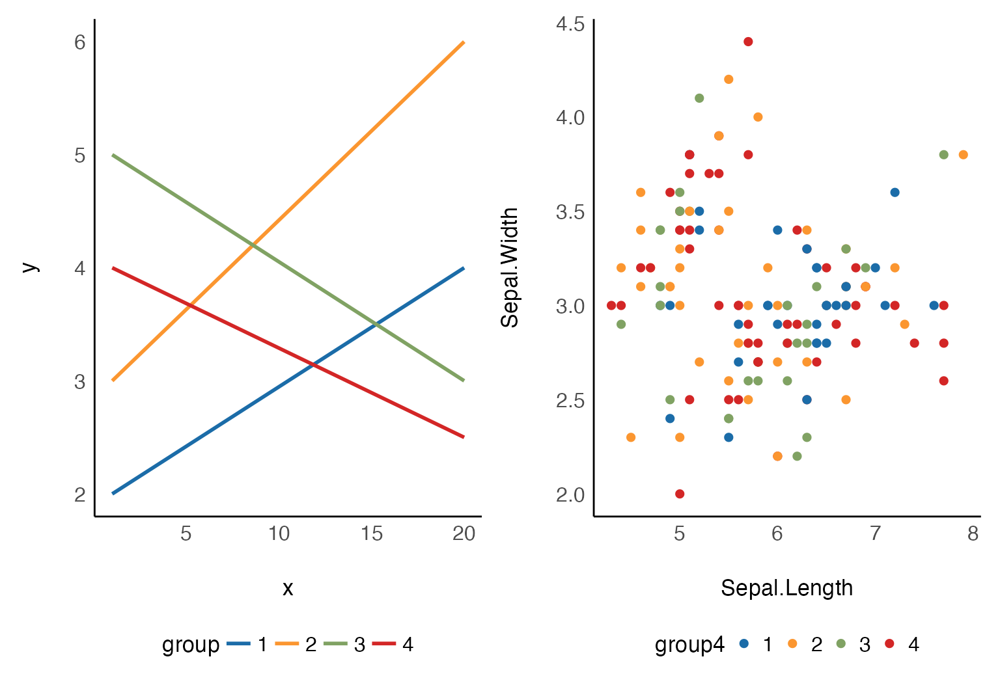

### See Colors - Five Groups

\
`p1`` ``<-`` `[`ggplot`](https://ggplot2.tidyverse.org/reference/ggplot.html)`(``d3``, `[`aes`](https://ggplot2.tidyverse.org/reference/aes.html)`(``x``, ``y``, colour ``=`` ``group``)``)`` ``+`\
`  `[`geom_line`](https://ggplot2.tidyverse.org/reference/geom_path.html)`(``linewidth ``=`` ``1``)`` ``+`\
`  `[`scale_color_see`](https://easystats.github.io/see/reference/scale_color_see.md)`(``)`\
\
`p2`` ``<-`` `[`ggplot`](https://ggplot2.tidyverse.org/reference/ggplot.html)`(``iris``, `[`aes`](https://ggplot2.tidyverse.org/reference/aes.html)`(``Sepal.Length``, ``Sepal.Width``, colour ``=`` ``group5``)``)`` ``+`\
`  `[`geom_point2`](https://easystats.github.io/see/reference/geom_point2.md)`(``size ``=`` ``2.5``)`` ``+`\
`  `[`scale_color_see`](https://easystats.github.io/see/reference/scale_color_see.md)`(``)`\
\
[`plots`](https://easystats.github.io/see/reference/plots.md)`(``p1``, ``p2``, n_rows ``=`` ``1``)`

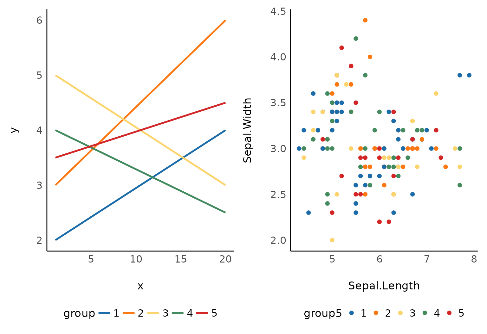

## Pizza Colors

### Pizza Colors - Three Groups

\
`p1`` ``<-`` `[`ggplot`](https://ggplot2.tidyverse.org/reference/ggplot.html)`(``d1``, `[`aes`](https://ggplot2.tidyverse.org/reference/aes.html)`(``x``, ``y``, colour ``=`` ``group``)``)`` ``+`\
`  `[`geom_line`](https://ggplot2.tidyverse.org/reference/geom_path.html)`(``linewidth ``=`` ``1``)`` ``+`\
`  `[`scale_color_pizza`](https://easystats.github.io/see/reference/scale_color_pizza.md)`(``)`\
\
`p2`` ``<-`` `[`ggplot`](https://ggplot2.tidyverse.org/reference/ggplot.html)`(``iris``, `[`aes`](https://ggplot2.tidyverse.org/reference/aes.html)`(``Sepal.Length``, ``Sepal.Width``, colour ``=`` ``Species``)``)`` ``+`\
`  `[`geom_point2`](https://easystats.github.io/see/reference/geom_point2.md)`(``size ``=`` ``2.5``)`` ``+`\
`  `[`scale_color_pizza`](https://easystats.github.io/see/reference/scale_color_pizza.md)`(``)`\
\
[`plots`](https://easystats.github.io/see/reference/plots.md)`(``p1``, ``p2``, n_rows ``=`` ``1``)`

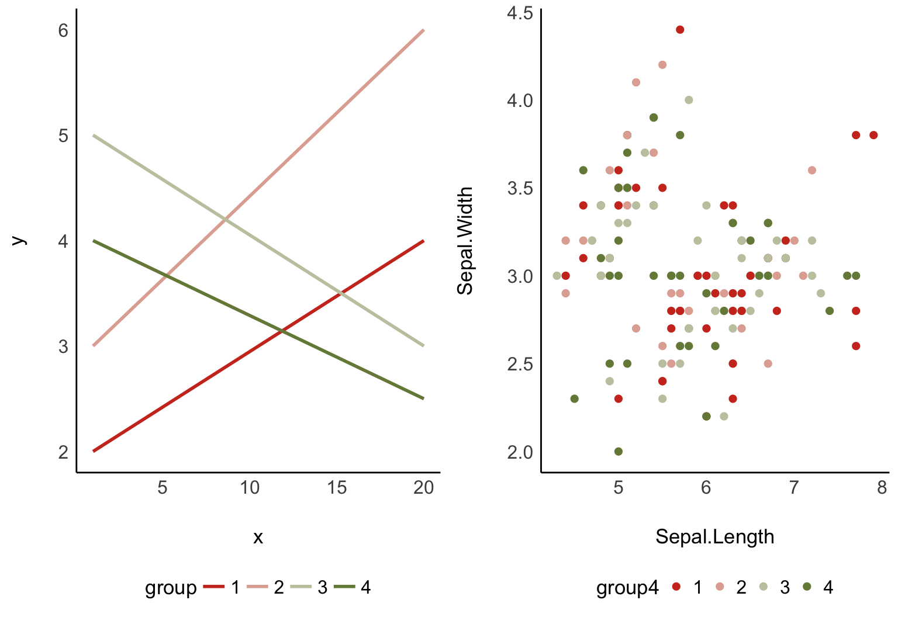

### Pizza Colors - Four Groups

\
`p1`` ``<-`` `[`ggplot`](https://ggplot2.tidyverse.org/reference/ggplot.html)`(``d2``, `[`aes`](https://ggplot2.tidyverse.org/reference/aes.html)`(``x``, ``y``, colour ``=`` ``group``)``)`` ``+`\
`  `[`geom_line`](https://ggplot2.tidyverse.org/reference/geom_path.html)`(``linewidth ``=`` ``1``)`` ``+`\
`  `[`scale_color_pizza`](https://easystats.github.io/see/reference/scale_color_pizza.md)`(``)`\
\
`p2`` ``<-`` `[`ggplot`](https://ggplot2.tidyverse.org/reference/ggplot.html)`(``iris``, `[`aes`](https://ggplot2.tidyverse.org/reference/aes.html)`(``Sepal.Length``, ``Sepal.Width``, colour ``=`` ``group4``)``)`` ``+`\
`  `[`geom_point2`](https://easystats.github.io/see/reference/geom_point2.md)`(``size ``=`` ``2.5``)`` ``+`\
`  `[`scale_color_pizza`](https://easystats.github.io/see/reference/scale_color_pizza.md)`(``)`\
\
[`plots`](https://easystats.github.io/see/reference/plots.md)`(``p1``, ``p2``, n_rows ``=`` ``1``)`

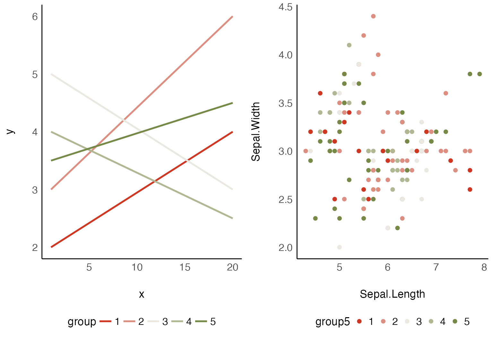

### Pizza Colors - Five Groups

\
`p1`` ``<-`` `[`ggplot`](https://ggplot2.tidyverse.org/reference/ggplot.html)`(``d3``, `[`aes`](https://ggplot2.tidyverse.org/reference/aes.html)`(``x``, ``y``, colour ``=`` ``group``)``)`` ``+`\
`  `[`geom_line`](https://ggplot2.tidyverse.org/reference/geom_path.html)`(``linewidth ``=`` ``1``)`` ``+`\
`  `[`scale_color_pizza`](https://easystats.github.io/see/reference/scale_color_pizza.md)`(``)`\
\
`p2`` ``<-`` `[`ggplot`](https://ggplot2.tidyverse.org/reference/ggplot.html)`(``iris``, `[`aes`](https://ggplot2.tidyverse.org/reference/aes.html)`(``Sepal.Length``, ``Sepal.Width``, colour ``=`` ``group5``)``)`` ``+`\
`  `[`geom_point2`](https://easystats.github.io/see/reference/geom_point2.md)`(``size ``=`` ``2.5``)`` ``+`\
`  `[`scale_color_pizza`](https://easystats.github.io/see/reference/scale_color_pizza.md)`(``)`\
\
[`plots`](https://easystats.github.io/see/reference/plots.md)`(``p1``, ``p2``, n_rows ``=`` ``1``)`

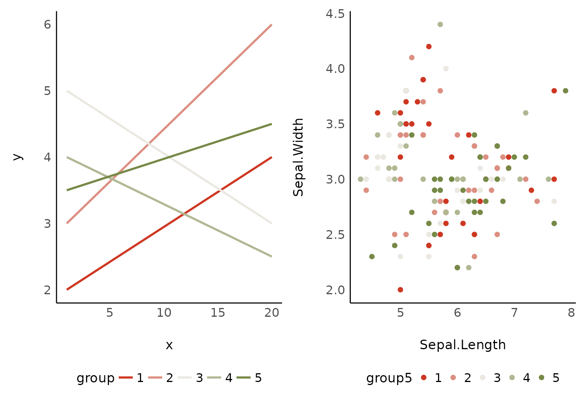

## Bluebrown Colors

### Bluebrown Colors - Three Groups

\
`p1`` ``<-`` `[`ggplot`](https://ggplot2.tidyverse.org/reference/ggplot.html)`(``d1``, `[`aes`](https://ggplot2.tidyverse.org/reference/aes.html)`(``x``, ``y``, colour ``=`` ``group``)``)`` ``+`\
`  `[`geom_line`](https://ggplot2.tidyverse.org/reference/geom_path.html)`(``linewidth ``=`` ``1``)`` ``+`\
`  `[`scale_color_bluebrown`](https://easystats.github.io/see/reference/scale_color_bluebrown.md)`(``)`\
\
`p2`` ``<-`` `[`ggplot`](https://ggplot2.tidyverse.org/reference/ggplot.html)`(``iris``, `[`aes`](https://ggplot2.tidyverse.org/reference/aes.html)`(``Sepal.Length``, ``Sepal.Width``, colour ``=`` ``Species``)``)`` ``+`\
`  `[`geom_point2`](https://easystats.github.io/see/reference/geom_point2.md)`(``size ``=`` ``2.5``)`` ``+`\
`  `[`scale_color_bluebrown`](https://easystats.github.io/see/reference/scale_color_bluebrown.md)`(``)`\
\
[`plots`](https://easystats.github.io/see/reference/plots.md)`(``p1``, ``p2``, n_rows ``=`` ``1``)`

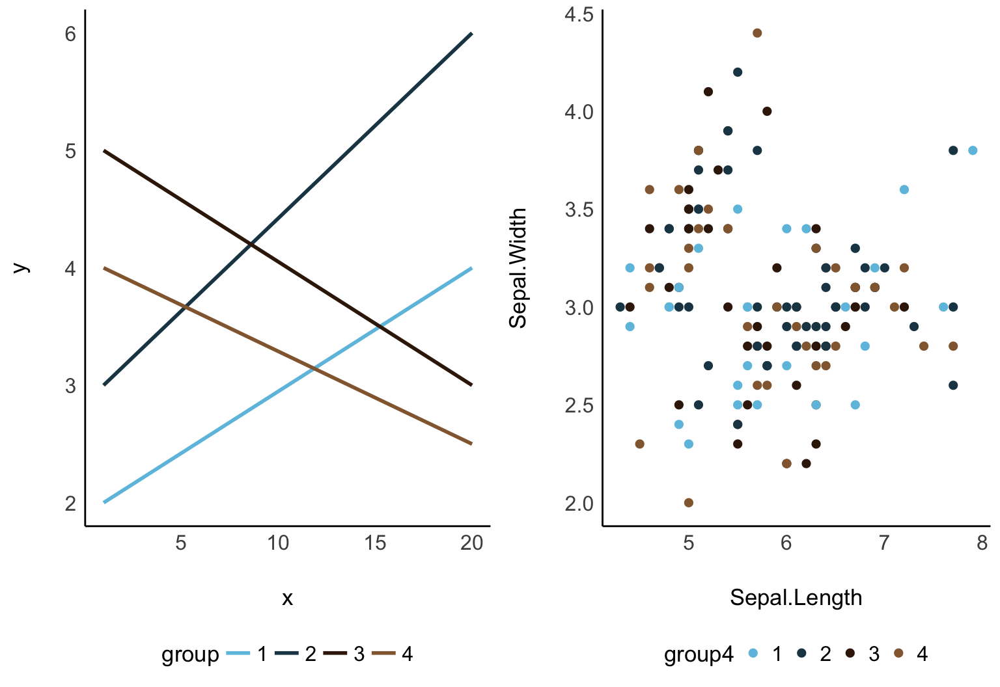

### Bluebrown Colors - Four Groups

\
`p1`` ``<-`` `[`ggplot`](https://ggplot2.tidyverse.org/reference/ggplot.html)`(``d2``, `[`aes`](https://ggplot2.tidyverse.org/reference/aes.html)`(``x``, ``y``, colour ``=`` ``group``)``)`` ``+`\
`  `[`geom_line`](https://ggplot2.tidyverse.org/reference/geom_path.html)`(``linewidth ``=`` ``1``)`` ``+`\
`  `[`scale_color_bluebrown`](https://easystats.github.io/see/reference/scale_color_bluebrown.md)`(``)`\
\
`p2`` ``<-`` `[`ggplot`](https://ggplot2.tidyverse.org/reference/ggplot.html)`(``iris``, `[`aes`](https://ggplot2.tidyverse.org/reference/aes.html)`(``Sepal.Length``, ``Sepal.Width``, colour ``=`` ``group4``)``)`` ``+`\
`  `[`geom_point2`](https://easystats.github.io/see/reference/geom_point2.md)`(``size ``=`` ``2.5``)`` ``+`\
`  `[`scale_color_bluebrown`](https://easystats.github.io/see/reference/scale_color_bluebrown.md)`(``)`\
\
[`plots`](https://easystats.github.io/see/reference/plots.md)`(``p1``, ``p2``, n_rows ``=`` ``1``)`

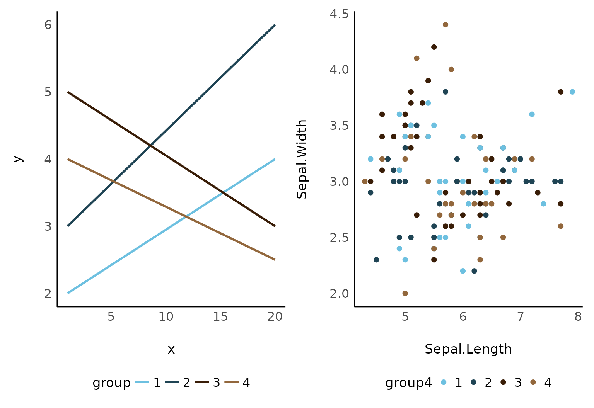

### Bluebrown Colors - Five Groups

\
`p1`` ``<-`` `[`ggplot`](https://ggplot2.tidyverse.org/reference/ggplot.html)`(``d3``, `[`aes`](https://ggplot2.tidyverse.org/reference/aes.html)`(``x``, ``y``, colour ``=`` ``group``)``)`` ``+`\
`  `[`geom_line`](https://ggplot2.tidyverse.org/reference/geom_path.html)`(``linewidth ``=`` ``1``)`` ``+`\
`  `[`scale_color_bluebrown`](https://easystats.github.io/see/reference/scale_color_bluebrown.md)`(``)`\
\
`p2`` ``<-`` `[`ggplot`](https://ggplot2.tidyverse.org/reference/ggplot.html)`(``iris``, `[`aes`](https://ggplot2.tidyverse.org/reference/aes.html)`(``Sepal.Length``, ``Sepal.Width``, colour ``=`` ``group5``)``)`` ``+`\
`  `[`geom_point2`](https://easystats.github.io/see/reference/geom_point2.md)`(``size ``=`` ``2.5``)`` ``+`\
`  `[`scale_color_bluebrown`](https://easystats.github.io/see/reference/scale_color_bluebrown.md)`(``)`\
\
[`plots`](https://easystats.github.io/see/reference/plots.md)`(``p1``, ``p2``, n_rows ``=`` ``1``)`

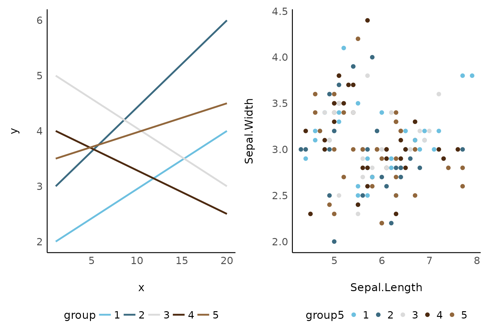

## Okabe-Ito Colors

### Okabe-Ito Colors - Three Groups

\
`p1`` ``<-`` `[`ggplot`](https://ggplot2.tidyverse.org/reference/ggplot.html)`(``d1``, `[`aes`](https://ggplot2.tidyverse.org/reference/aes.html)`(``x``, ``y``, colour ``=`` ``group``)``)`` ``+`\
`  `[`geom_line`](https://ggplot2.tidyverse.org/reference/geom_path.html)`(``linewidth ``=`` ``1``)`` ``+`\
`  `[`scale_color_okabeito`](https://easystats.github.io/see/reference/scale_color_okabeito.md)`(``)`\
\
`p2`` ``<-`` `[`ggplot`](https://ggplot2.tidyverse.org/reference/ggplot.html)`(``iris``, `[`aes`](https://ggplot2.tidyverse.org/reference/aes.html)`(``Sepal.Length``, ``Sepal.Width``, colour ``=`` ``Species``)``)`` ``+`\
`  `[`geom_point2`](https://easystats.github.io/see/reference/geom_point2.md)`(``size ``=`` ``2.5``)`` ``+`\
`  `[`scale_color_okabeito`](https://easystats.github.io/see/reference/scale_color_okabeito.md)`(``)`\
\
[`plots`](https://easystats.github.io/see/reference/plots.md)`(``p1``, ``p2``, n_rows ``=`` ``1``)`

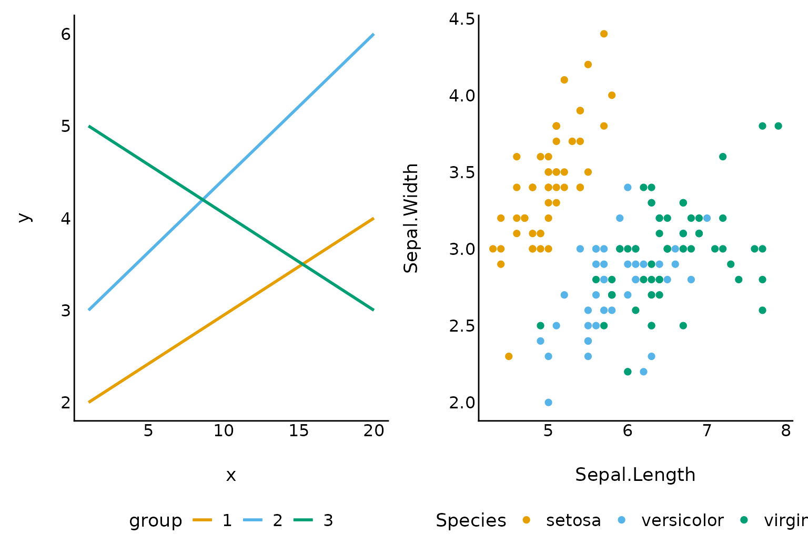

### Okabe-Ito Colors - Four Groups

\
`p1`` ``<-`` `[`ggplot`](https://ggplot2.tidyverse.org/reference/ggplot.html)`(``d2``, `[`aes`](https://ggplot2.tidyverse.org/reference/aes.html)`(``x``, ``y``, colour ``=`` ``group``)``)`` ``+`\
`  `[`geom_line`](https://ggplot2.tidyverse.org/reference/geom_path.html)`(``linewidth ``=`` ``1``)`` ``+`\
`  `[`scale_color_okabeito`](https://easystats.github.io/see/reference/scale_color_okabeito.md)`(``)`\
\
`p2`` ``<-`` `[`ggplot`](https://ggplot2.tidyverse.org/reference/ggplot.html)`(``iris``, `[`aes`](https://ggplot2.tidyverse.org/reference/aes.html)`(``Sepal.Length``, ``Sepal.Width``, colour ``=`` ``group4``)``)`` ``+`\
`  `[`geom_point2`](https://easystats.github.io/see/reference/geom_point2.md)`(``size ``=`` ``2.5``)`` ``+`\
`  `[`scale_color_okabeito`](https://easystats.github.io/see/reference/scale_color_okabeito.md)`(``)`\
\
[`plots`](https://easystats.github.io/see/reference/plots.md)`(``p1``, ``p2``, n_rows ``=`` ``1``)`

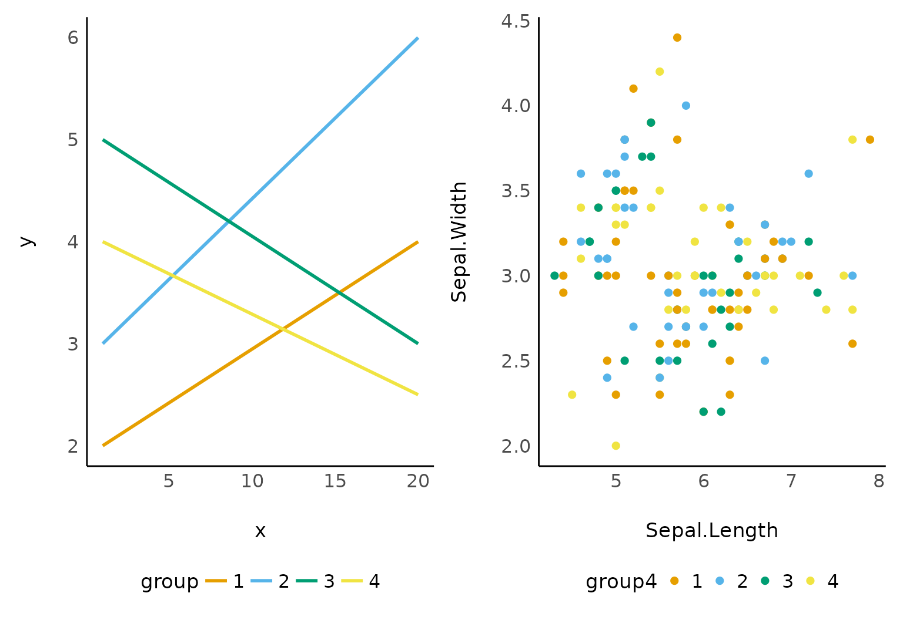

### Okabe-Ito Colors - Five Groups

\
`p1`` ``<-`` `[`ggplot`](https://ggplot2.tidyverse.org/reference/ggplot.html)`(``d3``, `[`aes`](https://ggplot2.tidyverse.org/reference/aes.html)`(``x``, ``y``, colour ``=`` ``group``)``)`` ``+`\
`  `[`geom_line`](https://ggplot2.tidyverse.org/reference/geom_path.html)`(``linewidth ``=`` ``1``)`` ``+`\
`  `[`scale_color_okabeito`](https://easystats.github.io/see/reference/scale_color_okabeito.md)`(``)`\
\
`p2`` ``<-`` `[`ggplot`](https://ggplot2.tidyverse.org/reference/ggplot.html)`(``iris``, `[`aes`](https://ggplot2.tidyverse.org/reference/aes.html)`(``Sepal.Length``, ``Sepal.Width``, colour ``=`` ``group5``)``)`` ``+`\
`  `[`geom_point2`](https://easystats.github.io/see/reference/geom_point2.md)`(``size ``=`` ``2.5``)`` ``+`\
`  `[`scale_color_okabeito`](https://easystats.github.io/see/reference/scale_color_okabeito.md)`(``)`\
\
[`plots`](https://easystats.github.io/see/reference/plots.md)`(``p1``, ``p2``, n_rows ``=`` ``1``)`

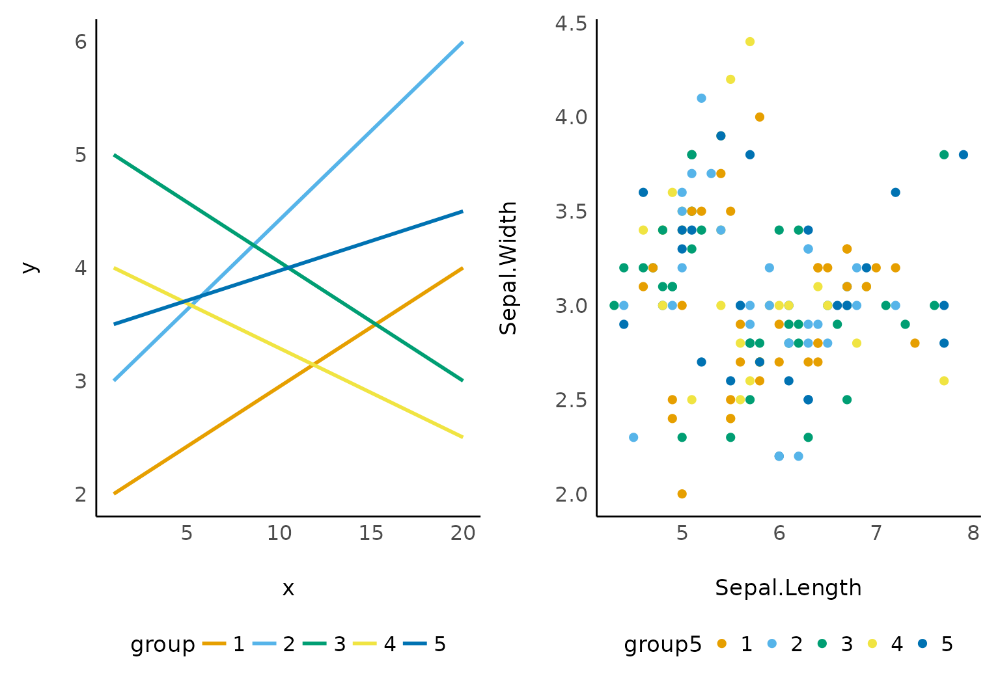

## Overview of Palette Colors

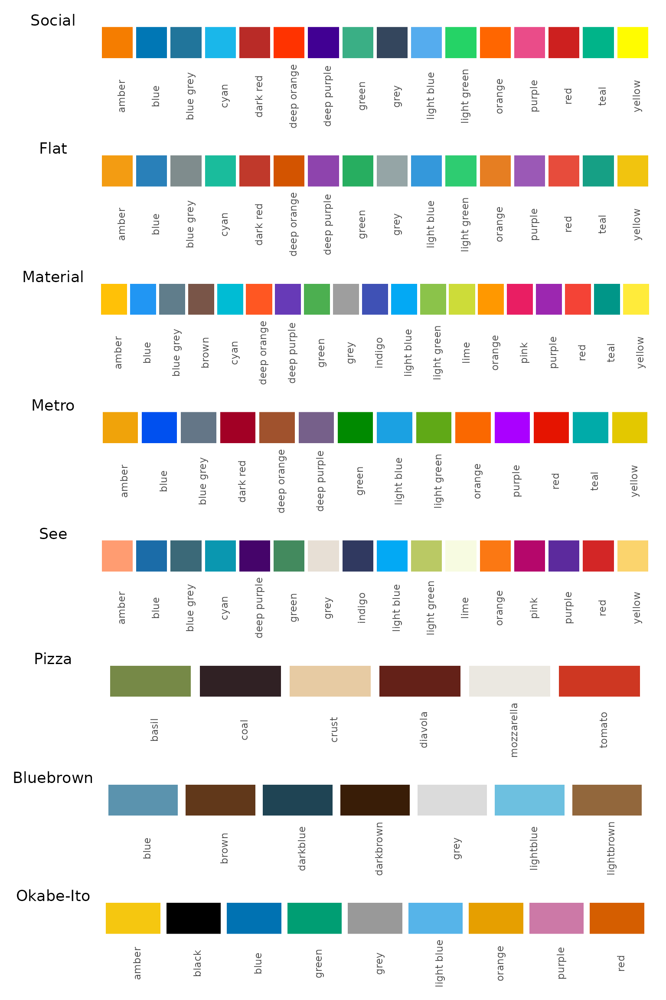
