# Color Scales for Dark Themes

This vignette can be referred to by citing the package:

``` r

citation("see")
#> To cite package 'see' in publications use:
#> 
#>   Lüdecke et al., (2021). see: An R Package for Visualizing Statistical
#>   Models. Journal of Open Source Software, 6(64), 3393.
#>   https://doi.org/10.21105/joss.03393
#> 
#> A BibTeX entry for LaTeX users is
#> 
#>   @Article{,
#>     title = {{see}: An {R} Package for Visualizing Statistical Models},
#>     author = {Daniel Lüdecke and Indrajeet Patil and Mattan S. Ben-Shachar and Brenton M. Wiernik and Philip Waggoner and Dominique Makowski},
#>     journal = {Journal of Open Source Software},
#>     year = {2021},
#>     volume = {6},
#>     number = {64},
#>     pages = {3393},
#>     doi = {10.21105/joss.03393},
#>   }
```

Before we start, we create some data sets with three, four and five
groups; one is useful to demonstrate line-geoms, the iris-dataset is
used for point-geoms.

``` r

library(ggplot2)
library(see)

data(iris)
iris$group4 <- as.factor(sample(1:4, size = nrow(iris), replace = TRUE))
iris$group5 <- as.factor(sample(1:5, size = nrow(iris), replace = TRUE))

d1 <- data.frame(
  x = rep(1:20, 3),
  y = c(
    seq(2, 4, length.out = 20),
    seq(3, 6, length.out = 20),
    seq(5, 3, length.out = 20)
  ),
  group = rep(factor(1:3), each = 20)
)

d2 <- data.frame(
  x = rep(1:20, 4),
  y = c(
    seq(2, 4, length.out = 20),
    seq(3, 6, length.out = 20),
    seq(5, 3, length.out = 20),
    seq(4, 2.5, length.out = 20)
  ),
  group = rep(factor(1:4), each = 20)
)

d3 <- data.frame(
  x = rep(1:20, 5),
  y = c(
    seq(2, 4, length.out = 20),
    seq(3, 6, length.out = 20),
    seq(5, 3, length.out = 20),
    seq(4, 2.5, length.out = 20),
    seq(3.5, 4.5, length.out = 20)
  ),
  group = rep(factor(1:5), each = 20)
)

theme_set(theme_abyss(legend.position = "bottom"))
```

## The *see* Color Scales

There are several different [color scales
available](https://easystats.github.io/see/reference/index.html#section-scales)
in the *see* package, most of them having some pre-defined palettes like
`"full"`, `"ice"`, `"rainbow"`, `"complement"`, `"contrast"`, or
`"light"` - exceptions are the [pizza color
scale](https://easystats.github.io/see/reference/scale_color_pizza.html)
and [bluebrown color
scale](https://easystats.github.io/see/reference/scale_color_blubrown.html).

In this vignettes, we show the `"light"` palettes for the different
color scales to give an impression how these scales work with different
type of data, especially for *dark themes*.

### Social Colors - Three Groups

``` r

p1 <- ggplot(d1, aes(x, y, colour = group)) +
  geom_line(linewidth = 1) +
  scale_color_social(palette = "light")

p2 <- ggplot(iris, aes(Sepal.Length, Sepal.Width, colour = Species)) +
  geom_point2(size = 2.5) +
  scale_color_social(palette = "light")

plots(p1, p2, n_rows = 1)
```

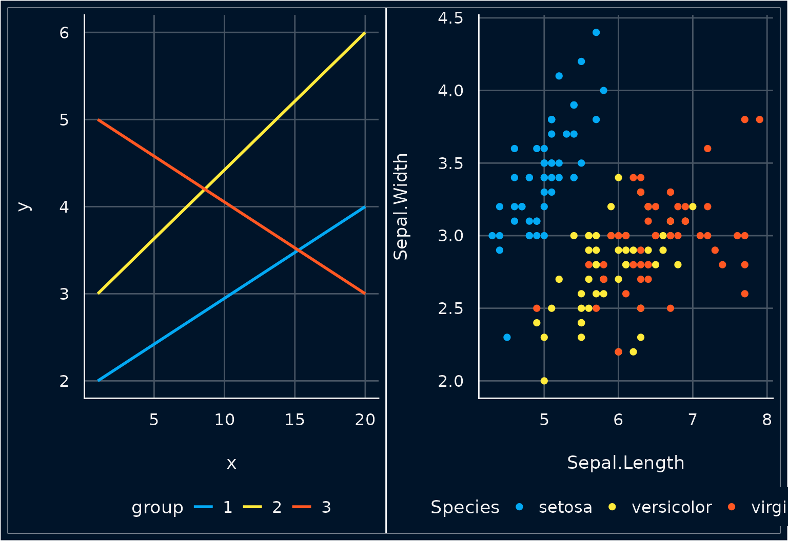

### Social Colors - Four Groups

``` r

p1 <- ggplot(d2, aes(x, y, colour = group)) +
  geom_line(linewidth = 1) +
  scale_color_social(palette = "light")

p2 <- ggplot(iris, aes(Sepal.Length, Sepal.Width, colour = group4)) +
  geom_point2(size = 2.5) +
  scale_color_social(palette = "light")

plots(p1, p2, n_rows = 1)
```

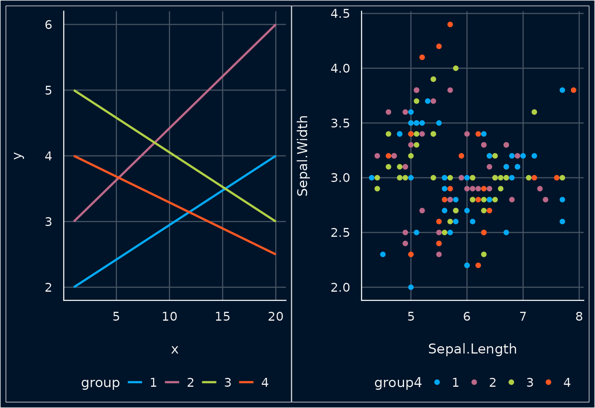

### Social Colors - Five Groups

``` r

p1 <- ggplot(d3, aes(x, y, colour = group)) +
  geom_line(linewidth = 1) +
  scale_color_social(palette = "light")

p2 <- ggplot(iris, aes(Sepal.Length, Sepal.Width, colour = group5)) +
  geom_point2(size = 2.5) +
  scale_color_social(palette = "light")

plots(p1, p2, n_rows = 1)
```

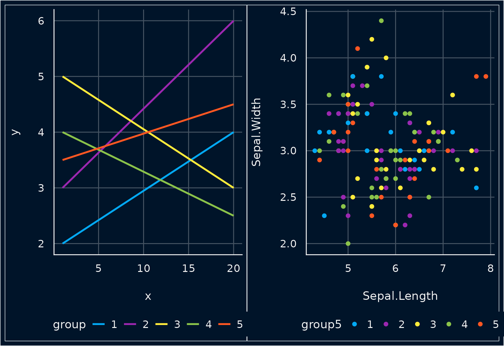

## Material Colors

### Material Colors - Three Groups

``` r

p1 <- ggplot(d1, aes(x, y, colour = group)) +
  geom_line(linewidth = 1) +
  scale_color_material(palette = "light")

p2 <- ggplot(iris, aes(Sepal.Length, Sepal.Width, colour = Species)) +
  geom_point2(size = 2.5) +
  scale_color_material(palette = "light")

plots(p1, p2, n_rows = 1)
```


### Material Colors - Four Groups

``` r

p1 <- ggplot(d2, aes(x, y, colour = group)) +
  geom_line(linewidth = 1) +
  scale_color_material(palette = "light")

p2 <- ggplot(iris, aes(Sepal.Length, Sepal.Width, colour = group4)) +
  geom_point2(size = 2.5) +
  scale_color_material(palette = "light")

plots(p1, p2, n_rows = 1)
```


### Material Colors - Five Groups

``` r

p1 <- ggplot(d3, aes(x, y, colour = group)) +
  geom_line(linewidth = 1) +
  scale_color_material(palette = "light")

p2 <- ggplot(iris, aes(Sepal.Length, Sepal.Width, colour = group5)) +
  geom_point2(size = 2.5) +
  scale_color_material(palette = "light")

plots(p1, p2, n_rows = 1)
```

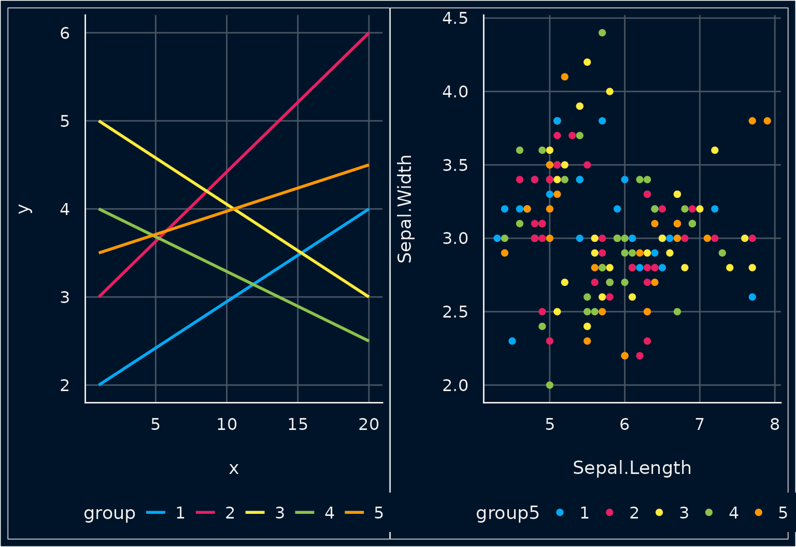

## Flat Colors

### Flat Colors - Three Groups

``` r

p1 <- ggplot(d1, aes(x, y, colour = group)) +
  geom_line(linewidth = 1) +
  scale_color_flat(palette = "light")

p2 <- ggplot(iris, aes(Sepal.Length, Sepal.Width, colour = Species)) +
  geom_point2(size = 2.5) +
  scale_color_flat(palette = "light")

plots(p1, p2, n_rows = 1)
```

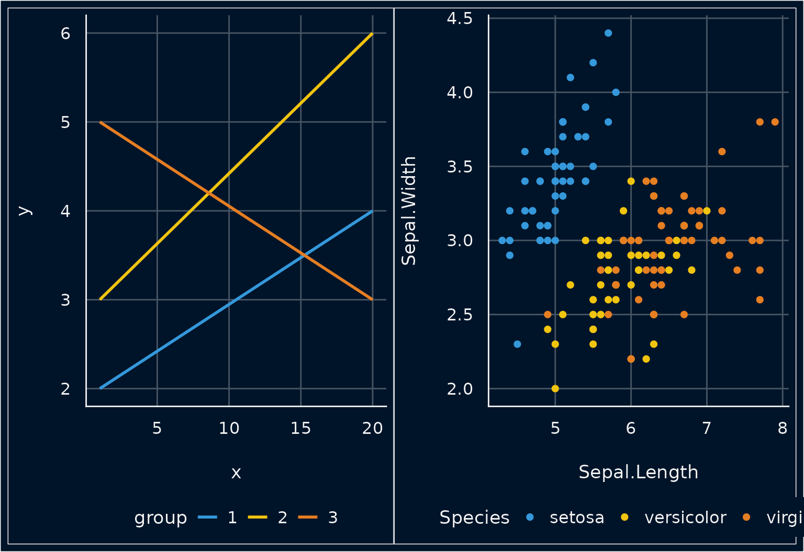

### Flat Colors - Four Groups

``` r

p1 <- ggplot(d2, aes(x, y, colour = group)) +
  geom_line(linewidth = 1) +
  scale_color_flat(palette = "light")

p2 <- ggplot(iris, aes(Sepal.Length, Sepal.Width, colour = group4)) +
  geom_point2(size = 2.5) +
  scale_color_flat(palette = "light")

plots(p1, p2, n_rows = 1)
```

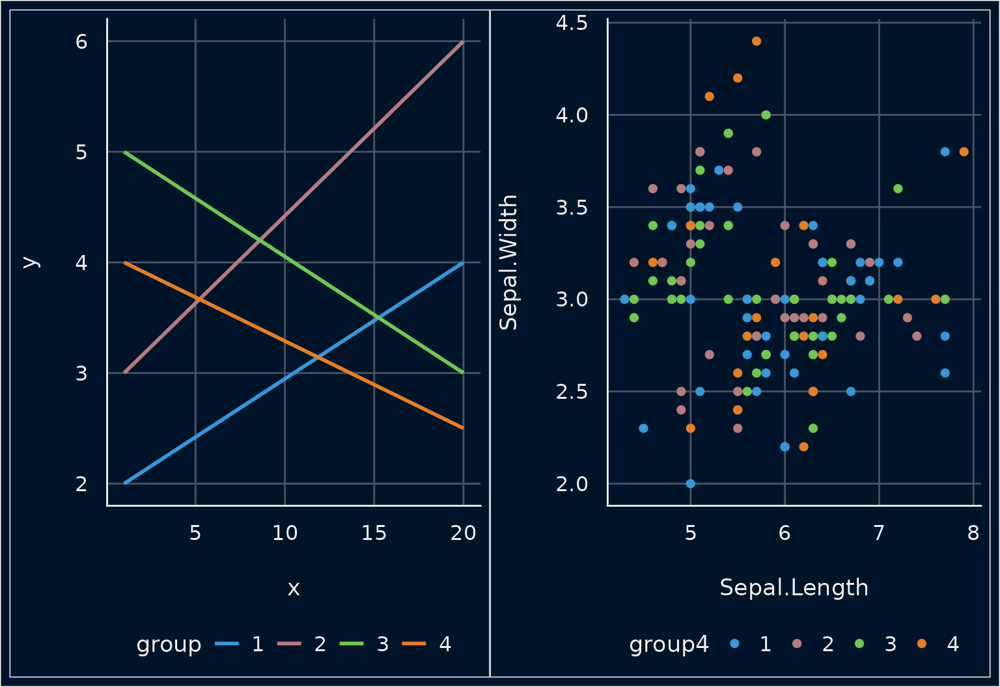

### Flat Colors - Five Groups

``` r

p1 <- ggplot(d3, aes(x, y, colour = group)) +
  geom_line(linewidth = 1) +
  scale_color_flat(palette = "light")

p2 <- ggplot(iris, aes(Sepal.Length, Sepal.Width, colour = group5)) +
  geom_point2(size = 2.5) +
  scale_color_flat(palette = "light")

plots(p1, p2, n_rows = 1)
```

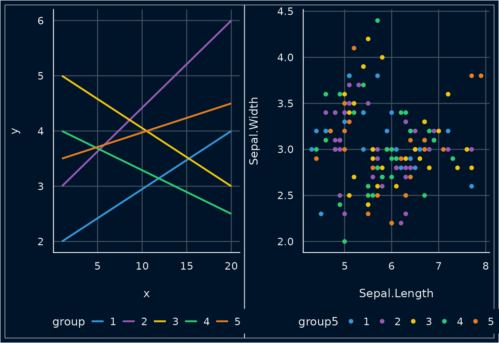

## Metro Colors

### Metro Colors - Three Groups

``` r

p1 <- ggplot(d1, aes(x, y, colour = group)) +
  geom_line(linewidth = 1) +
  scale_color_metro(palette = "light")

p2 <- ggplot(iris, aes(Sepal.Length, Sepal.Width, colour = Species)) +
  geom_point2(size = 2.5) +
  scale_color_metro(palette = "light")

plots(p1, p2, n_rows = 1)
```

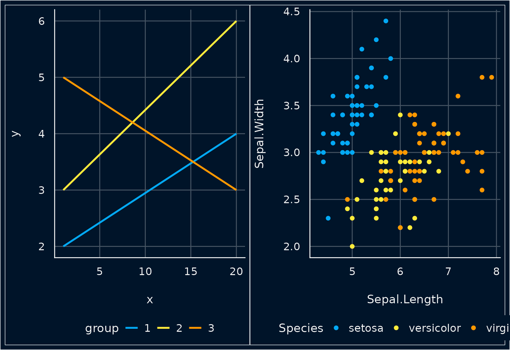

### Metro Colors - Four Groups

``` r

p1 <- ggplot(d2, aes(x, y, colour = group)) +
  geom_line(linewidth = 1) +
  scale_color_metro(palette = "light")

p2 <- ggplot(iris, aes(Sepal.Length, Sepal.Width, colour = group4)) +
  geom_point2(size = 2.5) +
  scale_color_metro(palette = "light")

plots(p1, p2, n_rows = 1)
```

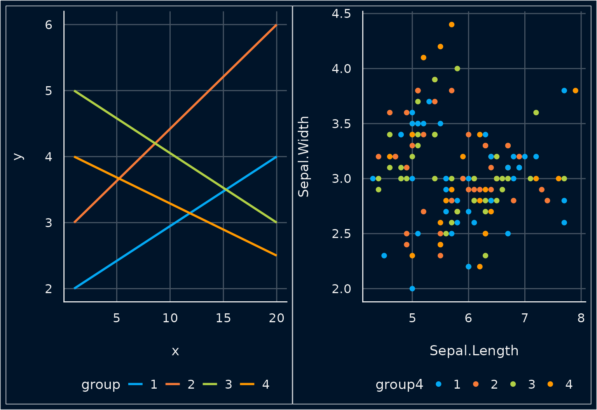

### Metro Colors - Five Groups

``` r

p1 <- ggplot(d3, aes(x, y, colour = group)) +
  geom_line(linewidth = 1) +
  scale_color_metro(palette = "light")

p2 <- ggplot(iris, aes(Sepal.Length, Sepal.Width, colour = group5)) +
  geom_point2(size = 2.5) +
  scale_color_metro(palette = "light")

plots(p1, p2, n_rows = 1)
```

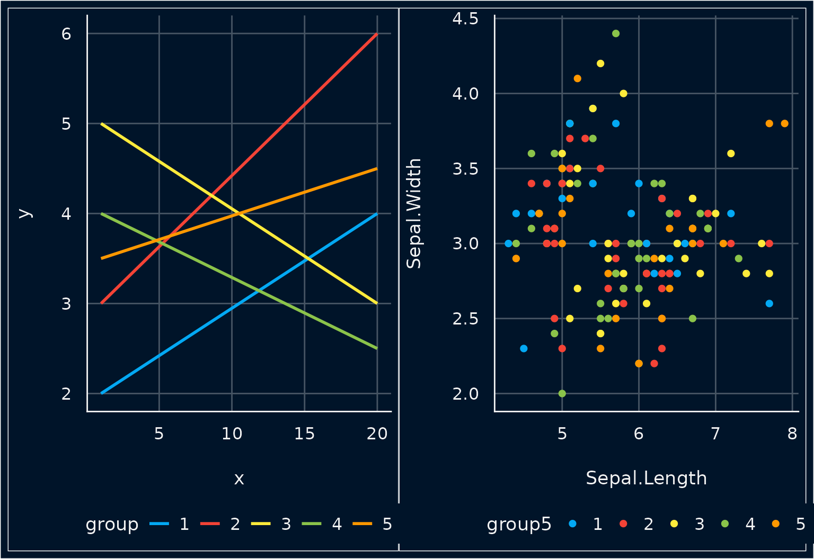

## See Colors

### See Colors - Three Groups

``` r

p1 <- ggplot(d1, aes(x, y, colour = group)) +
  geom_line(linewidth = 1) +
  scale_color_see(palette = "light")

p2 <- ggplot(iris, aes(Sepal.Length, Sepal.Width, colour = Species)) +
  geom_point2(size = 2.5) +
  scale_color_see(palette = "light")

plots(p1, p2, n_rows = 1)
```

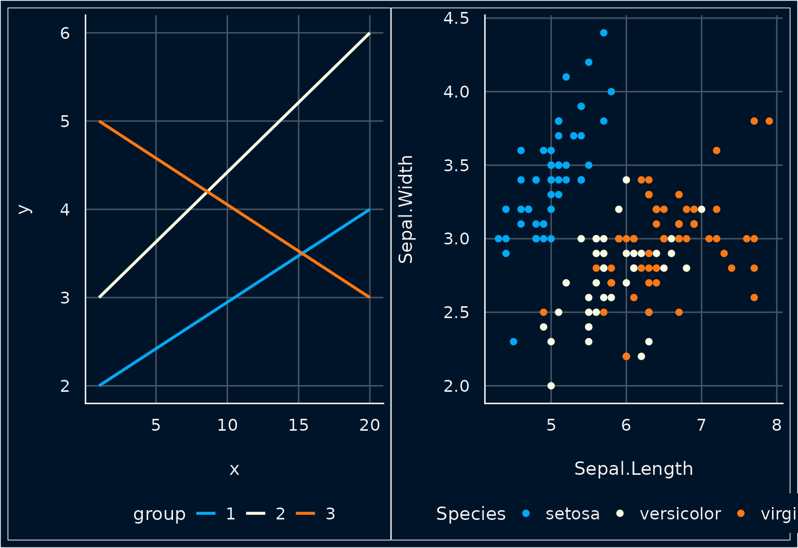

### See Colors - Four Groups

``` r

p1 <- ggplot(d2, aes(x, y, colour = group)) +
  geom_line(linewidth = 1) +
  scale_color_see(palette = "light")

p2 <- ggplot(iris, aes(Sepal.Length, Sepal.Width, colour = group4)) +
  geom_point2(size = 2.5) +
  scale_color_see(palette = "light")

plots(p1, p2, n_rows = 1)
```


### See Colors - Five Groups

``` r

p1 <- ggplot(d3, aes(x, y, colour = group)) +
  geom_line(linewidth = 1) +
  scale_color_see(palette = "light")

p2 <- ggplot(iris, aes(Sepal.Length, Sepal.Width, colour = group5)) +
  geom_point2(size = 2.5) +
  scale_color_see(palette = "light")

plots(p1, p2, n_rows = 1)
```


## Pizza Colors

### Pizza Colors - Three Groups

``` r

p1 <- ggplot(d1, aes(x, y, colour = group)) +
  geom_line(linewidth = 1) +
  scale_color_pizza()

p2 <- ggplot(iris, aes(Sepal.Length, Sepal.Width, colour = Species)) +
  geom_point2(size = 2.5) +
  scale_color_pizza()

plots(p1, p2, n_rows = 1)
```

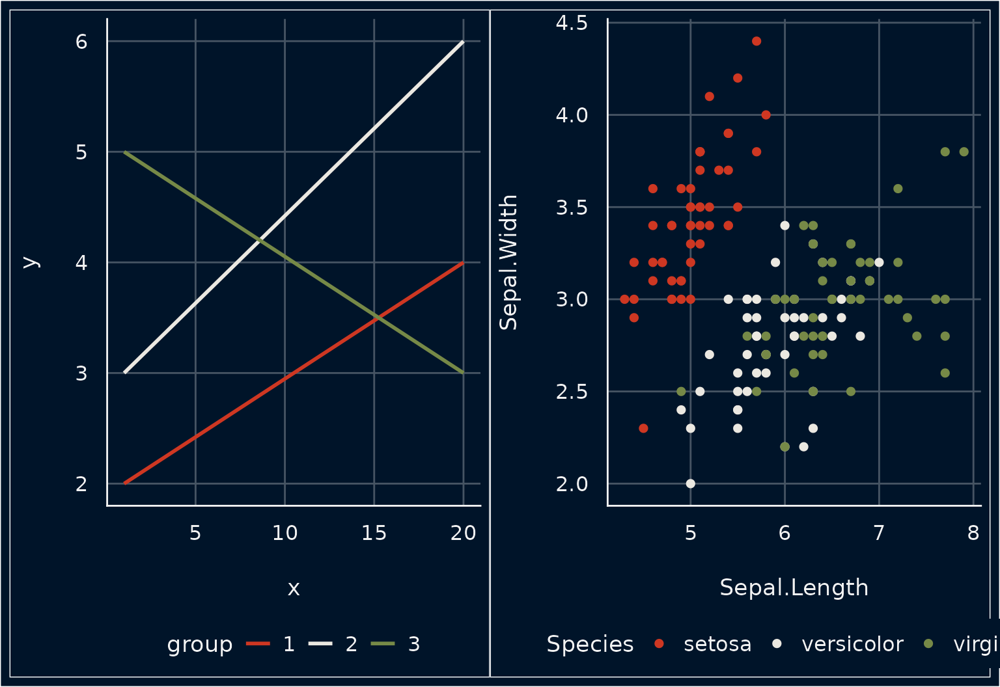

### Pizza Colors - Four Groups

``` r

p1 <- ggplot(d2, aes(x, y, colour = group)) +
  geom_line(linewidth = 1) +
  scale_color_pizza()

p2 <- ggplot(iris, aes(Sepal.Length, Sepal.Width, colour = group4)) +
  geom_point2(size = 2.5) +
  scale_color_pizza()

plots(p1, p2, n_rows = 1)
```

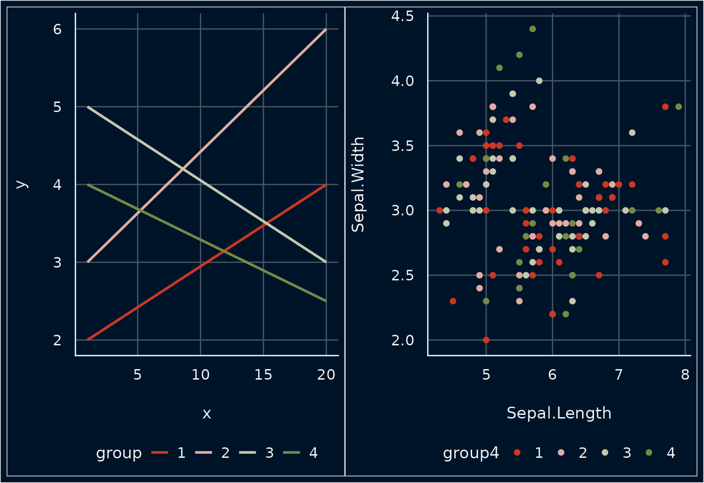

### Pizza Colors - Five Groups

``` r

p1 <- ggplot(d3, aes(x, y, colour = group)) +
  geom_line(linewidth = 1) +
  scale_color_pizza()

p2 <- ggplot(iris, aes(Sepal.Length, Sepal.Width, colour = group5)) +
  geom_point2(size = 2.5) +
  scale_color_pizza()

plots(p1, p2, n_rows = 1)
```

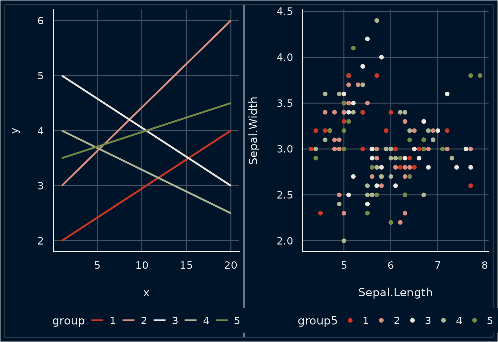

## Overview of Palette Colors


