# see: Model Visualisation Toolbox for ‘easystats’ and ‘ggplot2’

***“Damned are those who believe without seeing”***

*easystats* is a collection of packages that operate in synergy to
provide a consistent and intuitive syntax when working with statistical
models in the R programming language (R Core Team, 2021). Most
*easystats* packages return comprehensive numeric summaries of model
parameters and performance. The *see* package complements these numeric
summaries with a host of functions and tools to produce a range of
publication-ready visualizations for model parameters, predictions, and
performance diagnostics. As a core pillar of *easystats*, the *see*
package helps users to utilize visualization for more informative,
communicable, and well-rounded scientific reporting.

# Installation

The *see* package is available on CRAN, while its latest development
version is available on R-universe (from *rOpenSci*).

| Type | Source | Command |
|----|----|----|
| Release | CRAN | `install.packages("see")` |
| Development | r-universe | `install.packages("see", repos = "https://easystats.r-universe.dev")` |
| Development | GitHub | `remotes::install_github("easystats/see")` |

Once you have downloaded the package, you can then load it using:

[`library`](https://rdrr.io/r/base/library.html)`(`[`"see"`](https://easystats.github.io/see/)`)`

> **Tip**
>
> Instead of [`library(see)`](https://easystats.github.io/see/), use
> [`library(easystats)`](https://easystats.github.io/easystats/). This
> will make all features of the easystats-ecosystem available.
>
> To stay updated, use `easystats::install_latest()`.

# Plotting functions for ‘easystats’ packages

Below we present one or two plotting methods for each *easystats*
package, but many other methods are available. Interested readers are
encouraged to explore the range of examples on the package
[website](https://easystats.github.io/see/articles/).

## [parameters](https://github.com/easystats/parameters)

The *parameters* package converts summaries of regression model objects
into data frames (Lüdecke et al., 2020). The *see* package can take this
transformed object and, for example, create a dot-and-whisker plot for
the extracted regression estimates simply by passing the `parameters`
class object to
[`plot()`](https://rdrr.io/r/graphics/plot.default.html).

[`library`](https://rdrr.io/r/base/library.html)`(`[`parameters`](https://easystats.github.io/parameters/)`)`` `[`library`](https://rdrr.io/r/base/library.html)`(`[`see`](https://easystats.github.io/see/)`)`` `` ``model`` ``<-`` `[`lm`](https://rdrr.io/r/stats/lm.html)`(``wt`` ``~`` ``am`` ``*`` ``cyl``, data ``=`` ``mtcars``)`` `` `[`plot`](https://rdrr.io/r/graphics/plot.default.html)`(`[`parameters`](https://easystats.github.io/parameters/reference/model_parameters.html)`(``model``)``)`

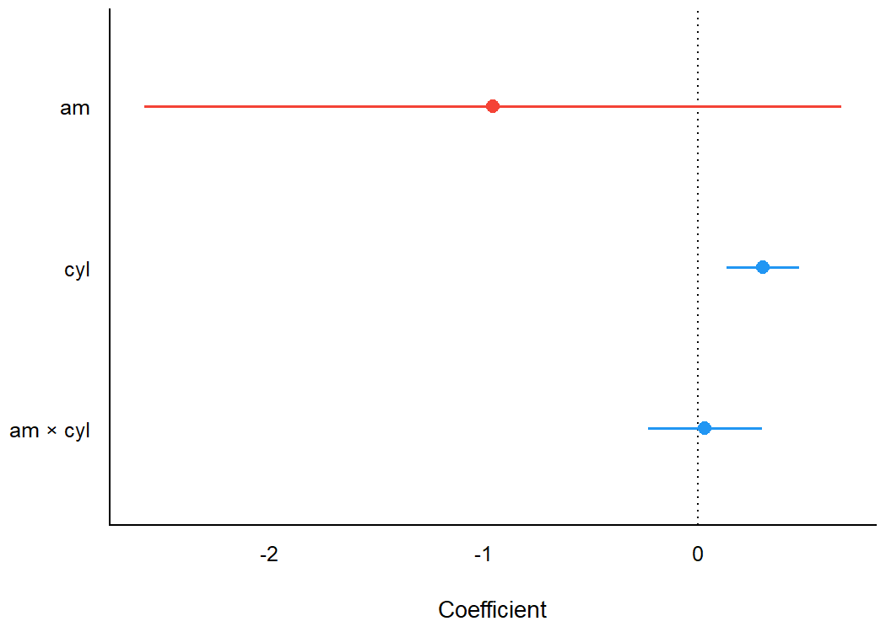

As *see* outputs objects of class `ggplot`, *ggplot2* functions can be
added as layers to the plot the same as with all other *ggplot2*
visualizations. For example, we might add a title using
[`labs()`](https://ggplot2.tidyverse.org/reference/labs.html) from
*ggplot2*.

[`library`](https://rdrr.io/r/base/library.html)`(`[`parameters`](https://easystats.github.io/parameters/)`)`` `[`library`](https://rdrr.io/r/base/library.html)`(`[`see`](https://easystats.github.io/see/)`)`` `` ``model`` ``<-`` `[`lm`](https://rdrr.io/r/stats/lm.html)`(``wt`` ``~`` ``am`` ``*`` ``cyl``, data ``=`` ``mtcars``)`` `` `[`plot`](https://rdrr.io/r/graphics/plot.default.html)`(`[`parameters`](https://easystats.github.io/parameters/reference/model_parameters.html)`(``model``)``)`` ``+`` `` ``ggplot2``::`[`labs`](https://ggplot2.tidyverse.org/reference/labs.html)`(``title ``=`` ``"A Dot-and-Whisker Plot"``)`

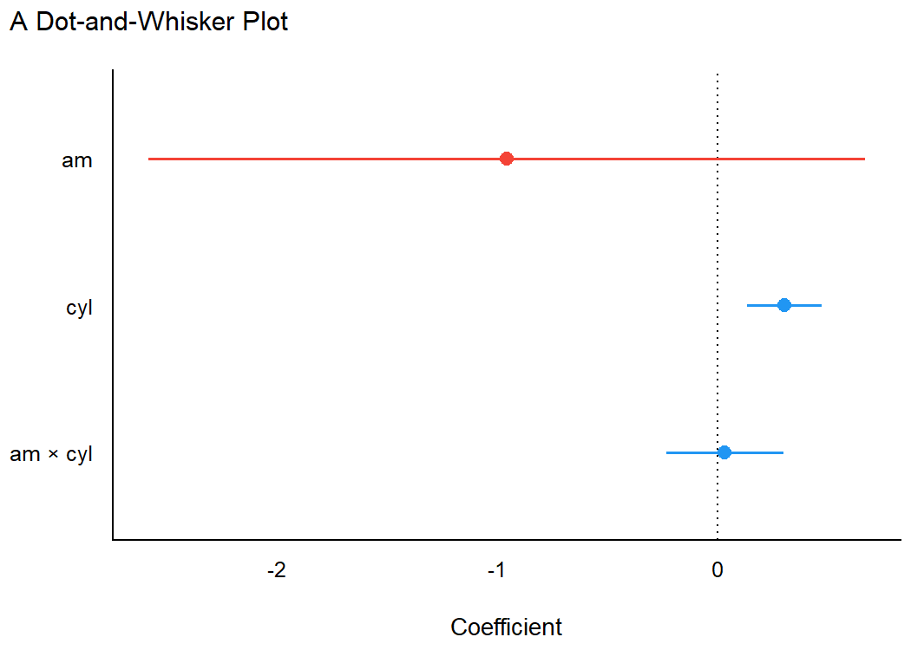

Plotting functions for the **parameters** package are demonstrated [in
this
vignette](https://easystats.github.io/see/articles/parameters.html).

## [bayestestR](https://github.com/easystats/bayestestR)

Similarly, for Bayesian regression model objects, which are handled by
the *bayestestR* package (Makowski et al., 2019), the *see* package
provides special plotting methods relevant for Bayesian models (e.g.,
Highest Density Interval, or *HDI*). Users can fit the model and pass
the model results, extracted via *bayestestR*, to
[`plot()`](https://rdrr.io/r/graphics/plot.default.html).

[`library`](https://rdrr.io/r/base/library.html)`(`[`bayestestR`](https://easystats.github.io/bayestestR/)`)`` `[`library`](https://rdrr.io/r/base/library.html)`(`[`rstanarm`](https://mc-stan.org/rstanarm/)`)`` `[`library`](https://rdrr.io/r/base/library.html)`(`[`see`](https://easystats.github.io/see/)`)`` `` `[`set.seed`](https://rdrr.io/r/base/Random.html)`(``123``)`` ``model`` ``<-`` `[`stan_glm`](https://mc-stan.org/rstanarm/reference/stan_glm.html)`(``wt`` ``~`` ``mpg``, data ``=`` ``mtcars``, refresh ``=`` ``0``)`` ``result`` ``<-`` `[`hdi`](https://easystats.github.io/bayestestR/reference/hdi.html)`(``model``, ci ``=`` `[`c`](https://rdrr.io/r/base/c.html)`(``0.5``, ``0.75``, ``0.89``, ``0.95``)``)`` `` `[`plot`](https://rdrr.io/r/graphics/plot.default.html)`(``result``)`

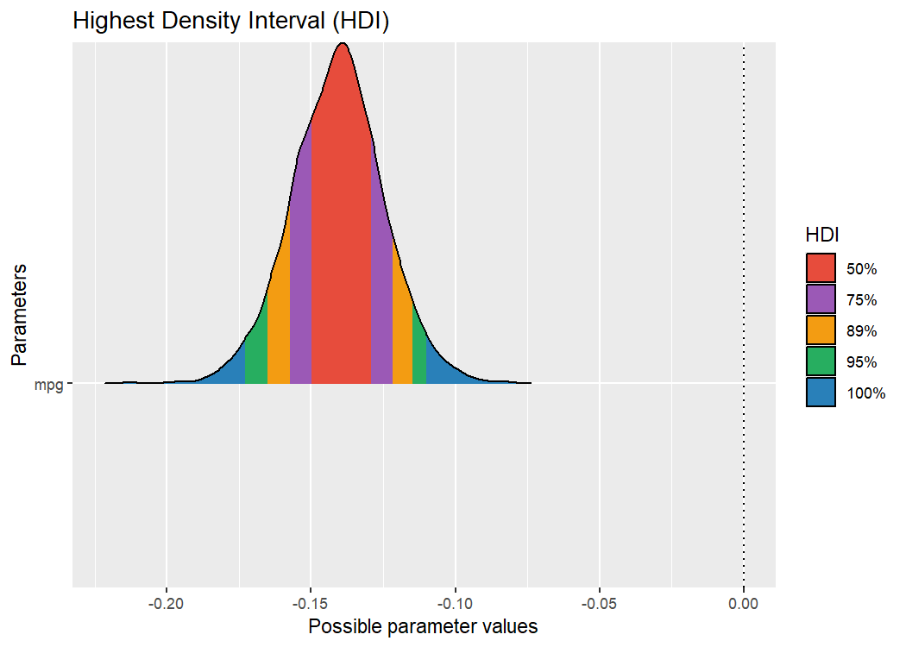

Plotting functions for the **bayestestR** package are demonstrated [in
this
vignette](https://easystats.github.io/see/articles/bayestestR.html).

## [performance](https://github.com/easystats/performance)

The *performance* package is primarily concerned with checking
regression model assumptions (Lüdecke et al., 2021). The *see* package
offers tools to visualize these assumption checks, such as the normality
of residuals. Users simply pass the fit model object to the relevant
*performance* function
([`check_normality()`](https://easystats.github.io/performance/reference/check_normality.html)
in the example below). Then, this result can be passed to
[`plot()`](https://rdrr.io/r/graphics/plot.default.html) to produce a
*ggplot2* visualization of the check on normality of the residuals.

[`library`](https://rdrr.io/r/base/library.html)`(`[`performance`](https://easystats.github.io/performance/)`)`` `[`library`](https://rdrr.io/r/base/library.html)`(`[`see`](https://easystats.github.io/see/)`)`` `` ``model`` ``<-`` `[`lm`](https://rdrr.io/r/stats/lm.html)`(``wt`` ``~`` ``mpg``, data ``=`` ``mtcars``)`` ``check`` ``<-`` `[`check_normality`](https://easystats.github.io/performance/reference/check_normality.html)`(``model``)`` `` `[`plot`](https://rdrr.io/r/graphics/plot.default.html)`(``check``, type ``=`` ``"qq"``)`

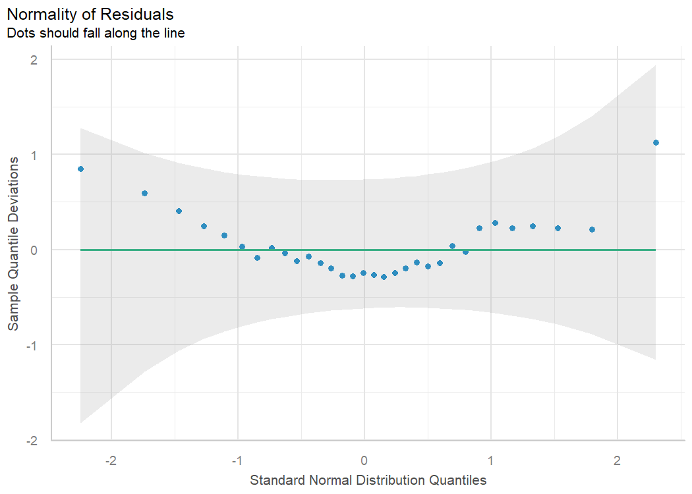

Plotting functions for the **performance** package are demonstrated [in
this
vignette](https://easystats.github.io/see/articles/performance.html).

## [effectsize](https://github.com/easystats/effectsize)

The *effectsize* package computes a variety of effect size metrics for
fitted models to assesses the practical importance of observed effects
(Ben-Shachar et al., 2020). In conjunction with *see*, users are able to
visualize the magnitude and uncertainty of effect sizes by passing the
model object to the relevant *effectsize* function
([`omega_squared()`](https://easystats.github.io/effectsize/reference/eta_squared.html)
in the following example), and then to
[`plot()`](https://rdrr.io/r/graphics/plot.default.html).

[`library`](https://rdrr.io/r/base/library.html)`(`[`effectsize`](https://easystats.github.io/effectsize/)`)`` `[`library`](https://rdrr.io/r/base/library.html)`(`[`see`](https://easystats.github.io/see/)`)`` `` ``model`` ``<-`` `[`aov`](https://rdrr.io/r/stats/aov.html)`(``wt`` ``~`` ``am`` ``*`` ``cyl``, data ``=`` ``mtcars``)`` `` `[`plot`](https://rdrr.io/r/graphics/plot.default.html)`(`[`omega_squared`](https://easystats.github.io/effectsize/reference/eta_squared.html)`(``model``)``)`

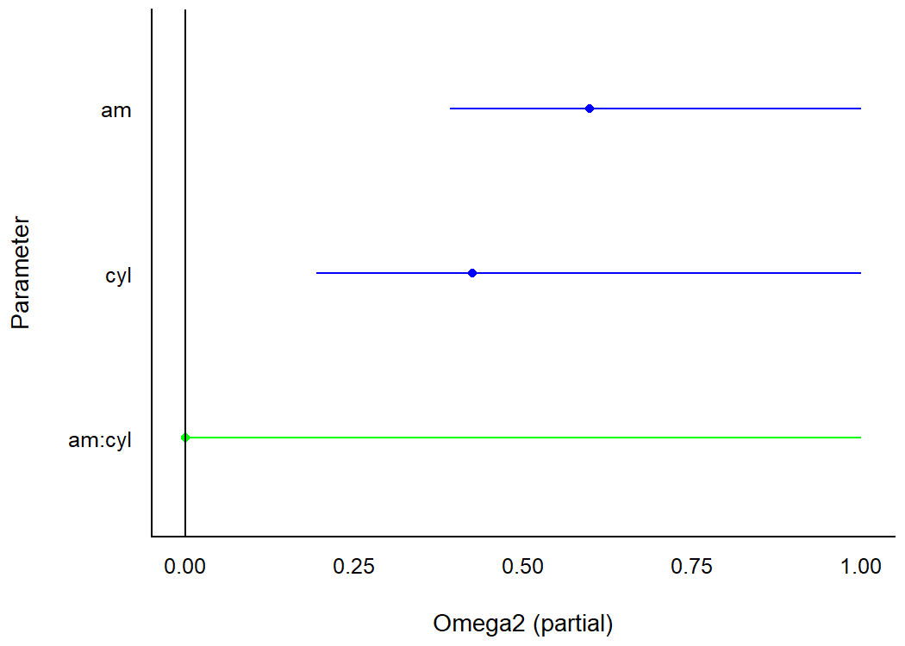

Plotting functions for the **effectsize** package are demonstrated [in
this
vignette](https://easystats.github.io/see/articles/effectsize.html).

## [modelbased](https://github.com/easystats/modelbased)

The *modelbased* package computes model-based estimates and predictions
from fitted models (Makowski et al., 2020a). *see* provides methods to
quickly visualize these model predictions. For the following example to
work, you need to have installed the *emmeans* package first.

[`library`](https://rdrr.io/r/base/library.html)`(`[`modelbased`](https://easystats.github.io/modelbased/)`)`` `[`library`](https://rdrr.io/r/base/library.html)`(`[`see`](https://easystats.github.io/see/)`)`` `` `[`data`](https://rdrr.io/r/utils/data.html)`(``mtcars``)`` ``mtcars``$``gear`` ``<-`` `[`as.factor`](https://rdrr.io/r/base/factor.html)`(``mtcars``$``gear``)`` ``model`` ``<-`` `[`lm`](https://rdrr.io/r/stats/lm.html)`(``mpg`` ``~`` ``wt`` ``*`` ``gear``, data ``=`` ``mtcars``)`` `` ``predicted`` ``<-`` `[`estimate_expectation`](https://easystats.github.io/modelbased/reference/estimate_expectation.html)`(``model``, data ``=`` ``"grid"``)`` `[`plot`](https://rdrr.io/r/graphics/plot.default.html)`(``predicted``, show_data ``=`` ``TRUE``)`

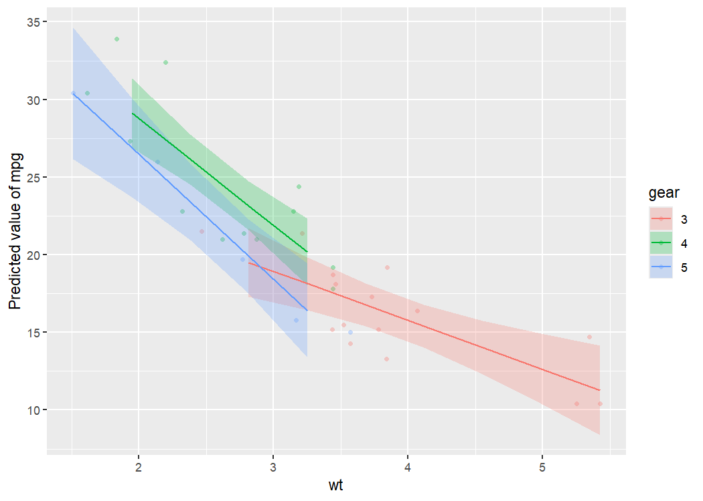

One can also visualize *marginal means* (i.e., the mean at each factor
level averaged over other predictors) using
[`estimate_means()`](https://easystats.github.io/modelbased/reference/estimate_means.html),
that is then passed to
[`plot()`](https://rdrr.io/r/graphics/plot.default.html).

`means`` ``<-`` `[`estimate_means`](https://easystats.github.io/modelbased/reference/estimate_means.html)`(``model``)`` `` `[`plot`](https://rdrr.io/r/graphics/plot.default.html)`(``means``)`

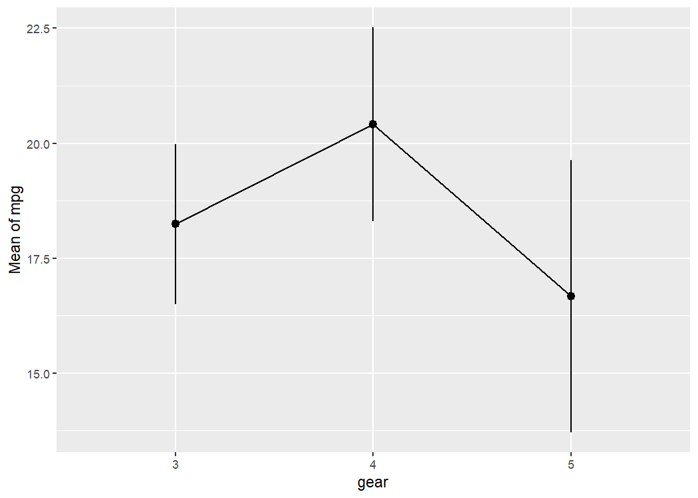

Plotting functions for the **modelbased** package are demonstrated [in
this
vignette](https://easystats.github.io/see/articles/modelbased.html).

## [correlation](https://github.com/easystats/correlation)

The *correlation* package provides a unified syntax and human-readable
code to carry out many types of correlation analysis (Makowski et al.,
2020b). A user can run `summary(correlation(data))` to create a
construct a correlation matrix for the variables in a dataframe. With
*see*, this matrix can be passed to
[`plot()`](https://rdrr.io/r/graphics/plot.default.html) to visualize
these correlations in a correlation matrix.

[`library`](https://rdrr.io/r/base/library.html)`(`[`correlation`](https://easystats.github.io/correlation/)`)`` `[`library`](https://rdrr.io/r/base/library.html)`(`[`see`](https://easystats.github.io/see/)`)`` `` ``results`` ``<-`` `[`summary`](https://rdrr.io/r/base/summary.html)`(`[`correlation`](https://easystats.github.io/correlation/reference/correlation.html)`(``iris``)``)`` `` `[`plot`](https://rdrr.io/r/graphics/plot.default.html)`(``results``, show_data ``=`` ``"points"``)`

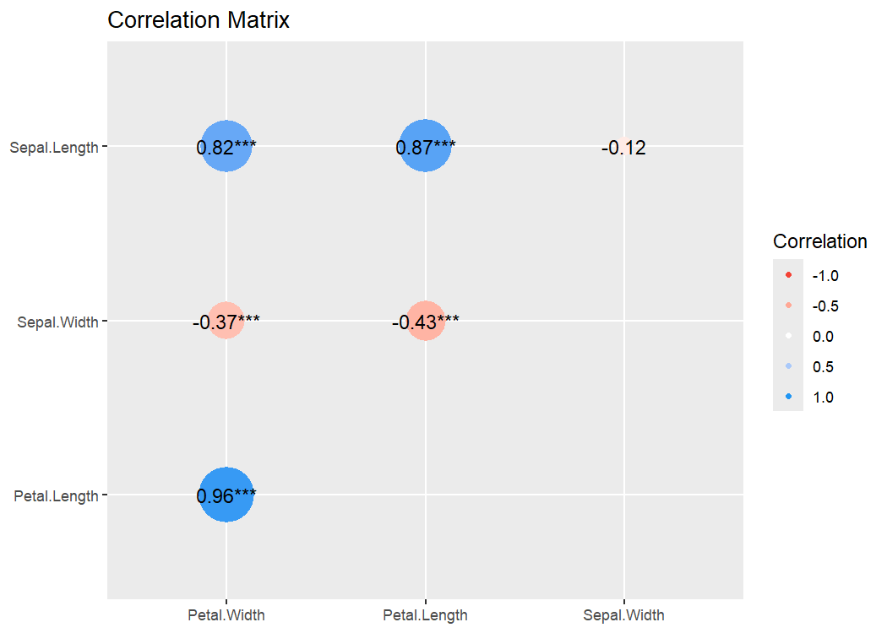

Plotting functions for the **correlation** package are demonstrated [in
this
vignette](https://easystats.github.io/see/articles/correlation.html).

# Themes

### Modern

[`library`](https://rdrr.io/r/base/library.html)`(`[`ggplot2`](https://ggplot2.tidyverse.org)`)`` `` `[`ggplot`](https://ggplot2.tidyverse.org/reference/ggplot.html)`(``iris``, `[`aes`](https://ggplot2.tidyverse.org/reference/aes.html)`(``x ``=`` ``Sepal.Width``, y ``=`` ``Sepal.Length``, color ``=`` ``Species``)``)`` ``+`` `` `[`geom_point2`](https://easystats.github.io/see/reference/geom_point2.md)`(``)`` ``+`` `` `[`theme_modern`](https://easystats.github.io/see/reference/theme_modern.md)`(``)`

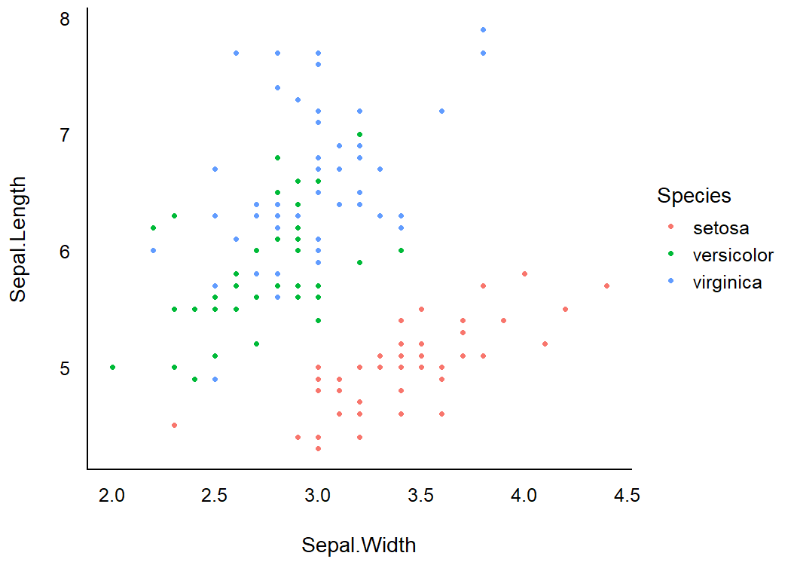

### Lucid

[`library`](https://rdrr.io/r/base/library.html)`(`[`ggplot2`](https://ggplot2.tidyverse.org)`)`` `` ``p`` ``<-`` `[`ggplot`](https://ggplot2.tidyverse.org/reference/ggplot.html)`(``iris``, `[`aes`](https://ggplot2.tidyverse.org/reference/aes.html)`(``x ``=`` ``Sepal.Width``, y ``=`` ``Sepal.Length``, color ``=`` ``Species``)``)`` ``+`` `` `[`geom_point2`](https://easystats.github.io/see/reference/geom_point2.md)`(``)`` `` ``p`` ``+`` `[`theme_lucid`](https://easystats.github.io/see/reference/theme_lucid.md)`(``)`

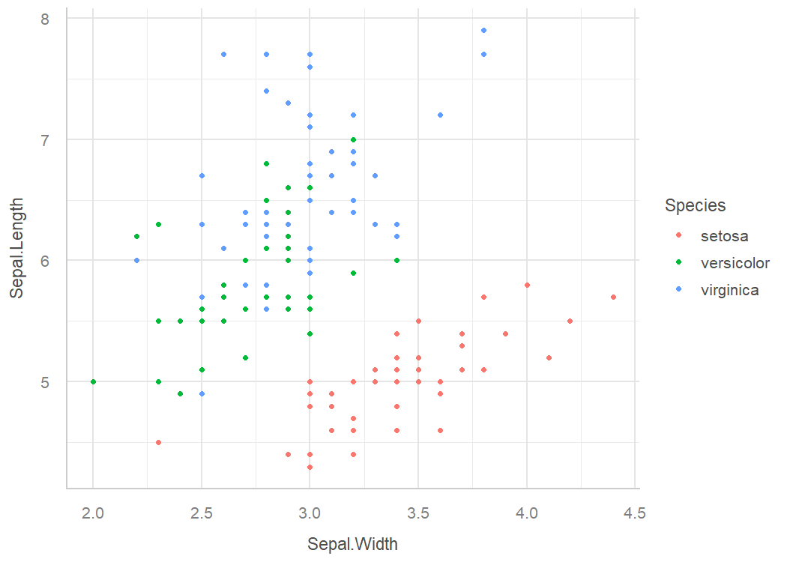

### Blackboard

`p`` ``+`` `[`theme_blackboard`](https://easystats.github.io/see/reference/theme_blackboard.md)`(``)`

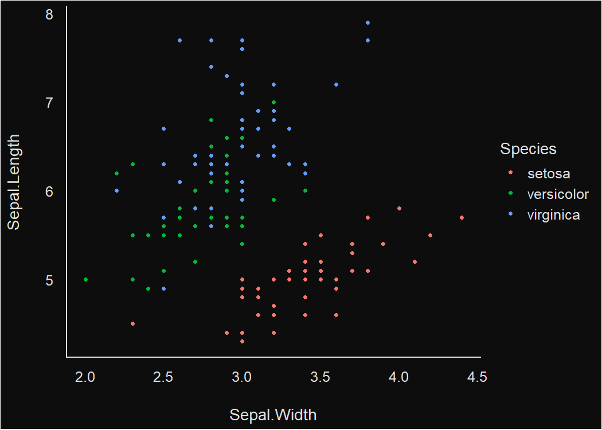

### Abyss

`p`` ``+`` `[`theme_abyss`](https://easystats.github.io/see/reference/theme_abyss.md)`(``)`

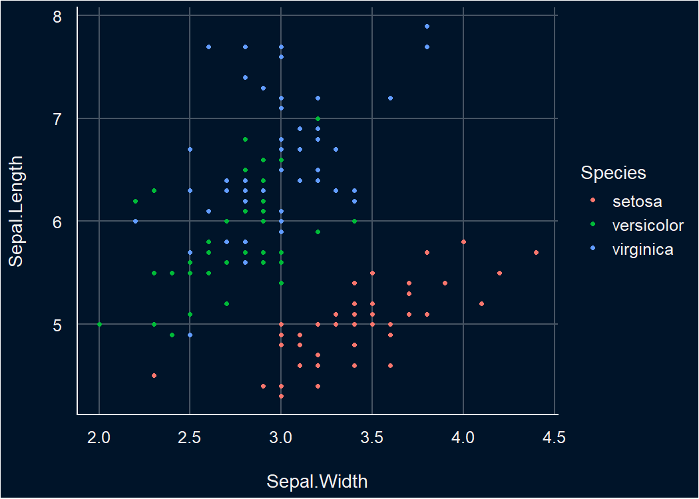

# Palettes

This is just one example of the available palettes. See [this
vignette](https://easystats.github.io/see/articles/seecolorscales.html)
for a detailed overview of palettes and color scales.

### Material design

`p1`` ``<-`` `[`ggplot`](https://ggplot2.tidyverse.org/reference/ggplot.html)`(``iris``, `[`aes`](https://ggplot2.tidyverse.org/reference/aes.html)`(``x ``=`` ``Species``, y ``=`` ``Sepal.Length``, fill ``=`` ``Species``)``)`` ``+`` `` `[`geom_boxplot`](https://ggplot2.tidyverse.org/reference/geom_boxplot.html)`(``)`` ``+`` `` `[`theme_modern`](https://easystats.github.io/see/reference/theme_modern.md)`(``axis.text.angle ``=`` ``45``)`` ``+`` `` `[`scale_fill_material_d`](https://easystats.github.io/see/reference/scale_color_material.md)`(``)`` `` ``p2`` ``<-`` `[`ggplot`](https://ggplot2.tidyverse.org/reference/ggplot.html)`(``iris``, `[`aes`](https://ggplot2.tidyverse.org/reference/aes.html)`(``x ``=`` ``Species``, y ``=`` ``Sepal.Length``, fill ``=`` ``Species``)``)`` ``+`` `` `[`geom_violin`](https://ggplot2.tidyverse.org/reference/geom_violin.html)`(``)`` ``+`` `` `[`theme_modern`](https://easystats.github.io/see/reference/theme_modern.md)`(``axis.text.angle ``=`` ``45``)`` ``+`` `` `[`scale_fill_material_d`](https://easystats.github.io/see/reference/scale_color_material.md)`(``palette ``=`` ``"ice"``)`` `` ``p3`` ``<-`` `[`ggplot`](https://ggplot2.tidyverse.org/reference/ggplot.html)`(``iris``, `[`aes`](https://ggplot2.tidyverse.org/reference/aes.html)`(``x ``=`` ``Petal.Length``, y ``=`` ``Petal.Width``, color ``=`` ``Sepal.Length``)``)`` ``+`` `` `[`geom_point2`](https://easystats.github.io/see/reference/geom_point2.md)`(``)`` ``+`` `` `[`theme_modern`](https://easystats.github.io/see/reference/theme_modern.md)`(``)`` ``+`` `` `[`scale_color_material`](https://easystats.github.io/see/reference/scale_color_material.md)`(``discrete ``=`` ``FALSE``)`

## Multiple plots

The [`plots()`](https://easystats.github.io/see/reference/plots.md)
function allows us to plot the figures side by side.

[`plots`](https://easystats.github.io/see/reference/plots.md)`(``p1``, ``p2``, ``p3``, n_columns ``=`` ``2``)`

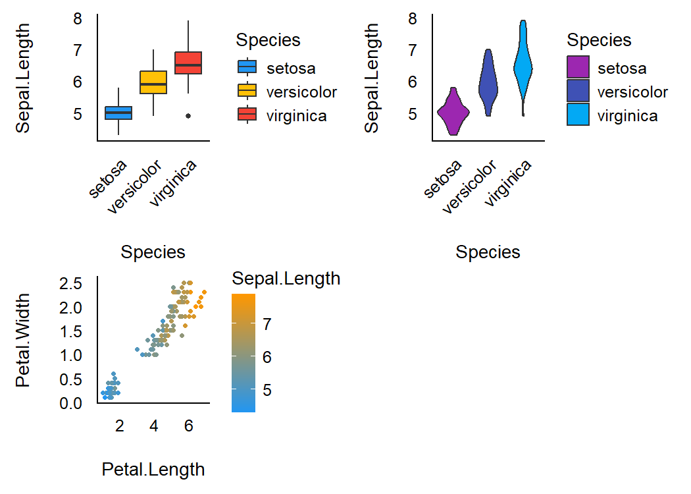

The [`plots()`](https://easystats.github.io/see/reference/plots.md)
function can also be used to add **tags** (*i.e.*, labels for
subfigures).

[`plots`](https://easystats.github.io/see/reference/plots.md)`(``p1``, ``p2``, ``p3``,`` `` n_columns ``=`` ``2``,`` `` tags ``=`` `[`paste`](https://rdrr.io/r/base/paste.html)`(``"Fig. "``, ``1``:``3``)`` ``)`

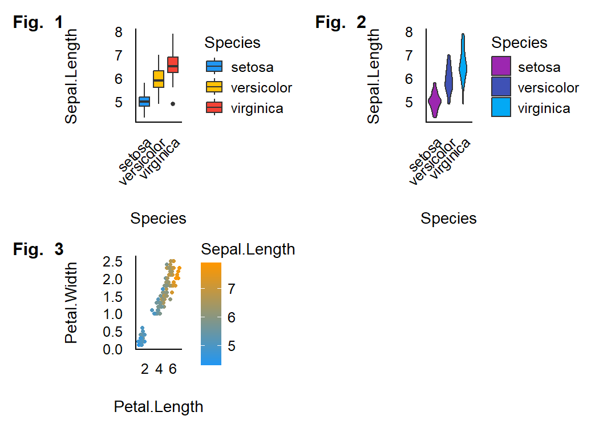

# Geoms

## Better looking points

`geom_points2()` and
[`geom_jitter2()`](https://easystats.github.io/see/reference/geom_point2.md)
allow points without borders and contour.

`normal`` ``<-`` `[`ggplot`](https://ggplot2.tidyverse.org/reference/ggplot.html)`(``iris``, `[`aes`](https://ggplot2.tidyverse.org/reference/aes.html)`(``x ``=`` ``Petal.Width``, y ``=`` ``Sepal.Length``)``)`` ``+`` `` `[`geom_point`](https://ggplot2.tidyverse.org/reference/geom_point.html)`(``size ``=`` ``8``, alpha ``=`` ``0.3``)`` ``+`` `` `[`theme_modern`](https://easystats.github.io/see/reference/theme_modern.md)`(``)`` `` ``new`` ``<-`` `[`ggplot`](https://ggplot2.tidyverse.org/reference/ggplot.html)`(``iris``, `[`aes`](https://ggplot2.tidyverse.org/reference/aes.html)`(``x ``=`` ``Petal.Width``, y ``=`` ``Sepal.Length``)``)`` ``+`` `` `[`geom_point2`](https://easystats.github.io/see/reference/geom_point2.md)`(``size ``=`` ``8``, alpha ``=`` ``0.3``)`` ``+`` `` `[`theme_modern`](https://easystats.github.io/see/reference/theme_modern.md)`(``)`` `` `[`plots`](https://easystats.github.io/see/reference/plots.md)`(``normal``, ``new``, n_columns ``=`` ``2``)`

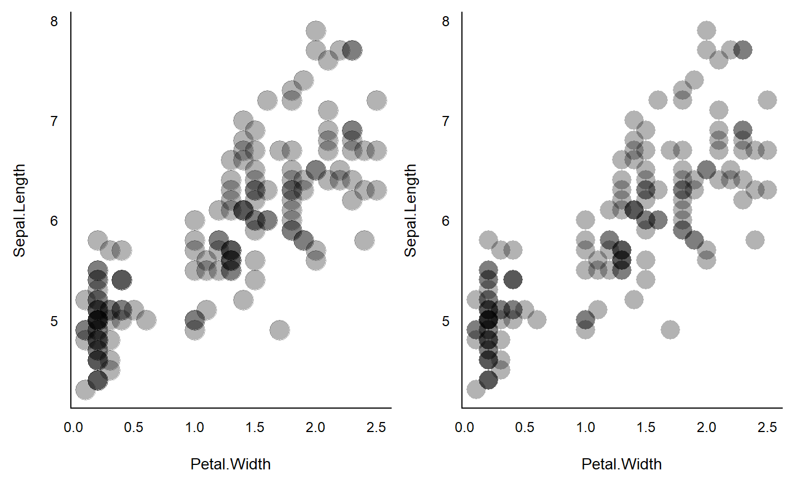

## Half-violin Half-dot plot

Create a half-violin half-dot plot, useful for visualising the
distribution and the sample size at the same time.

[`ggplot`](https://ggplot2.tidyverse.org/reference/ggplot.html)`(``iris``, `[`aes`](https://ggplot2.tidyverse.org/reference/aes.html)`(``x ``=`` ``Species``, y ``=`` ``Sepal.Length``, fill ``=`` ``Species``)``)`` ``+`` `` `[`geom_violindot`](https://easystats.github.io/see/reference/geom_violindot.md)`(``fill_dots ``=`` ``"black"``)`` ``+`` `` `[`theme_modern`](https://easystats.github.io/see/reference/theme_modern.md)`(``)`` ``+`` `` `[`scale_fill_material_d`](https://easystats.github.io/see/reference/scale_color_material.md)`(``)`

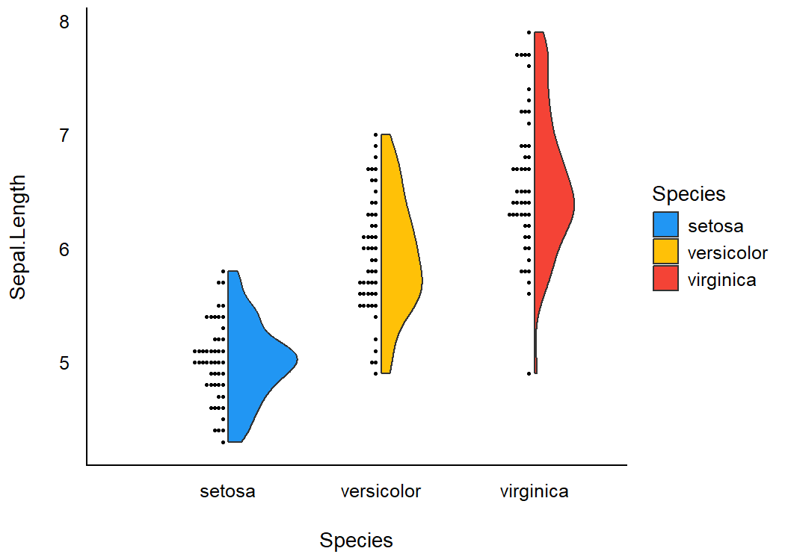

## Radar chart (Spider plot)

[`library`](https://rdrr.io/r/base/library.html)`(`[`datawizard`](https://easystats.github.io/datawizard/)`)`` `` ``# prepare the data in tidy format`` ``data`` ``<-`` ``iris`` ``|>`` `` ``datawizard``::`[`data_group`](https://easystats.github.io/datawizard/reference/data_group.html)`(``"Species"``)`` ``|>`` `` ``datawizard``::`[`data_summary`](https://easystats.github.io/datawizard/reference/data_summary.html)`(`` `` Sepal.Length ``=`` `[`mean`](https://rdrr.io/r/base/mean.html)`(``Sepal.Length``)``,`` `` Sepal.Width ``=`` `[`mean`](https://rdrr.io/r/base/mean.html)`(``Sepal.Width``)``,`` `` Petal.Length ``=`` `[`mean`](https://rdrr.io/r/base/mean.html)`(``Petal.Length``)``,`` `` Petal.Width ``=`` `[`mean`](https://rdrr.io/r/base/mean.html)`(``Petal.Width``)`` `` ``)`` ``|>`` `` ``datawizard``::`[`reshape_longer`](https://easystats.github.io/datawizard/reference/data_to_long.html)`(`[`c`](https://rdrr.io/r/base/c.html)`(`` `` ``"Sepal.Length"``,`` `` ``"Sepal.Width"``,`` `` ``"Petal.Length"``,`` `` ``"Petal.Width"`` `` ``)``)`` `` ``data`` ``|>`` `` `[`ggplot`](https://ggplot2.tidyverse.org/reference/ggplot.html)`(`[`aes`](https://ggplot2.tidyverse.org/reference/aes.html)`(`` `` x ``=`` ``name``,`` `` y ``=`` ``value``,`` `` color ``=`` ``Species``,`` `` group ``=`` ``Species``,`` `` fill ``=`` ``Species`` `` ``)``)`` ``+`` `` `[`geom_polygon`](https://ggplot2.tidyverse.org/reference/geom_polygon.html)`(``linewidth ``=`` ``1``, alpha ``=`` ``0.1``)`` ``+`` `` `[`coord_radar`](https://easystats.github.io/see/reference/coord_radar.md)`(``)`` ``+`` `` `[`theme_radar`](https://easystats.github.io/see/reference/theme_radar.md)`(``)`

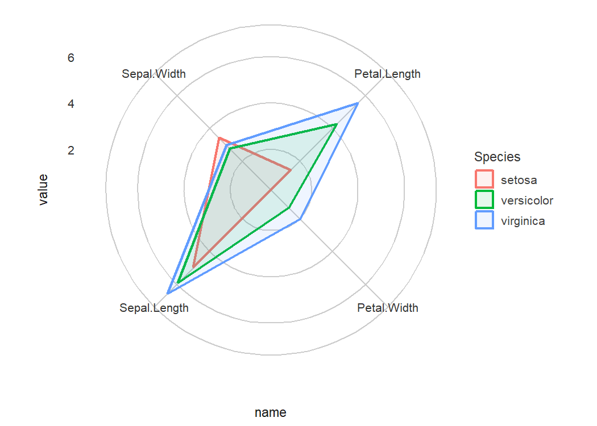

# Contributing and Support

In case you want to file an issue or contribute in another way to the
package, please follow [this
guide](https://github.com/easystats/see/blob/master/.github/CONTRIBUTING.md).
For questions about the functionality, you may either contact us via
email or also file an issue.

# Code of Conduct

Please note that this project is released with a [Contributor Code of
Conduct](https://easystats.github.io/see/CODE_OF_CONDUCT.html). By
participating in this project you agree to abide by its terms.

# References

Ben-Shachar, M. S., Lüdecke, D., & Makowski, D. (2020). effectsize:
Estimation of effect size indices and standardized parameters. *Journal
of Open Source Software*, *5*(56), 2815.
<https://doi.org/10.21105/joss.02815>

Lüdecke, D., Ben-Shachar, M. S., Patil, I., & Makowski, D. (2020).
Extracting, computing and exploring the parameters of statistical models
using R. *Journal of Open Source Software*, *5*(53), 2445.
<https://doi.org/10.21105/joss.02445>

Lüdecke, D., Ben-Shachar, M. S., Patil, I., Waggoner, P., & Makowski, D.
(2021). performance: An R package for assessment, comparison and testing
of statistical models. *Journal of Open Source Software*, *6*(60), 3139.
<https://doi.org/10.21105/joss.03139>

Makowski, D., Ben-Shachar, M. S., & Lüdecke, D. (2019). bayestestR:
Describing effects and their uncertainty, existence and significance
within the Bayesian framework. *Journal of Open Source Software*,
*4*(40), 1541. <https://doi.org/10.21105/joss.01541>

Makowski, D., Ben-Shachar, M. S., Patil, I., & Lüdecke, D. (2020a).
Estimation of model-based predictions, contrasts and means. *CRAN*.
<https://github.com/easystats/modelbased>

Makowski, D., Ben-Shachar, M. S., Patil, I., & Lüdecke, D. (2020b).
Methods and algorithms for correlation analysis in R. *Journal of Open
Source Software*, *5*(51), 2306. <https://doi.org/10.21105/joss.02306>

R Core Team. (2021). *R: A language and environment for statistical
computing*. R Foundation for Statistical Computing.
<https://www.R-project.org/>
